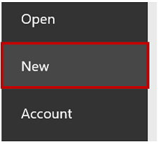
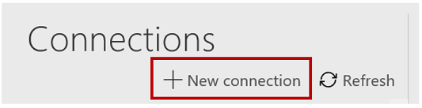
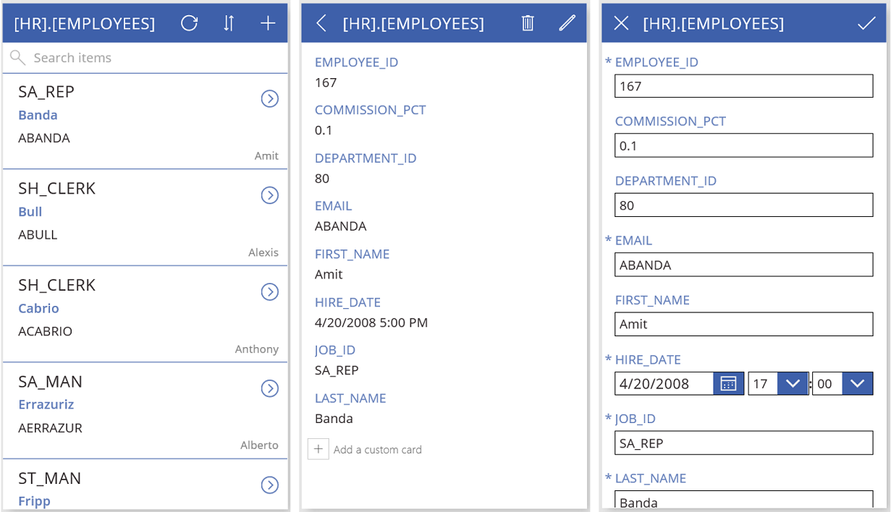

# Подключение к базе данных Oracle из PowerApps
Создание списка таблиц, а также создание, чтение, обновление и удаление строк таблицы в базе данных Oracle после подключения и создания приложения в PowerApps. Подключение к базе данных Oracle поддерживает полное делегирование фильтрации, сортировки и других функций, но не триггеров или хранимых процедур.

## Технические условия
* Oracle 9 и более поздней версии
* Клиентское программное обеспечение Oracle 8.1.7 и более поздней версии
* Установка локального шлюза данных
* Установка клиентского пакета SDK для Oracle

### Установка локального шлюза данных
Чтобы установить шлюз, выполните действия, описанные в [этом руководстве](../gateway-management.md).

Локальный шлюз данных выполняет функцию моста, обеспечивая быструю и безопасную передачу данных (которые не находятся в облаке) между локальной средой и службами Power BI, Microsoft Flow, Logic Apps и PowerApps. Вы можете использовать один шлюз с несколькими службами и несколькими источниками данных. Дополнительные сведения см. в статье [Общие сведения о локальных шлюзах данных в Microsoft PowerApps](../gateway-reference.md).

### Установка клиента Oracle
На компьютере с локальным шлюзом данных установите [64-разрядную версию ODAC 12c, выпуск 4 (12.1.0.2.4) для Windows x64](http://www.oracle.com/technetwork/database/windows/downloads/index-090165.html). В противном случае при попытке создания или использования подключения появится сообщение об ошибке, как описано в списке известных проблем.

## Создание приложения из таблицы в базе данных Oracle
1. В PowerApps Studio в меню **Файл** (у левого края экрана) выберите **Создать**.
   
   
2. В разделе **Начать с данных** щелкните стрелку.
   
      Появится список имеющихся подключений.
3. Щелкните **New connection** (Создать подключение).
   
   
4. В списке подключений выберите **База данных Oracle**.
   
   
5. Укажите имя сервера Oracle, имя пользователя и пароль.
   
    Если необходим идентификатор безопасности, укажите сервер в следующем формате: 
    *имя_сервера*/*ИД_безопасности*
   
   
6. Выберите шлюз, который вы хотите использовать, или установите новый.
   
    Если шлюз не появляется после установки, нажмите кнопку **Обновить список шлюзов**.
   
   
7. Нажмите кнопку **Создать**, чтобы создать подключение.
   
   
8. Выберите набор данных **по умолчанию**.
   
   
9. В списке таблиц щелкните таблицу, которую вы хотите использовать.
   
   
10. Щелкните **Подключить** для создания приложения.
    
    

PowerApps создает приложение с тремя экранами и отображает данные из выбранной таблицы.

* На экране **BrowseScreen1** перечислены все записи в таблице.
* На экране **DetailScreen1** отображаются все сведения об отдельном элементе.
* На экране **EditScreen1** можно создать или обновить элемент.

## Дальнейшие действия
* Чтобы сохранить только что созданное приложение, нажмите клавиши CTRL+S.
* Чтобы настроить экран **BrowseScreen1** (отображаемый по умолчанию), см. статью о [настройке макета](../customize-layout-sharepoint.md).
* Чтобы настроить экраны **DetailsScreen1** или **EditScreen1**, см. статью о [настройке формы](../customize-forms-sharepoint.md).

## Руководства, известные проблемы и советы по устранению неполадок
1. Невозможно связаться со шлюзом.
   
    Эта ошибка возникает, если локальному шлюзу не удается подключиться к облаку. Чтобы проверить состояние шлюза, войдите в powerapps.microsoft.com, щелкните **Шлюзы** и выберите шлюз, который вы хотите использовать.
   
    Убедитесь, что шлюз запущен и может подключаться к Интернету. Не следует устанавливать шлюз на выключенном компьютере или на компьютере в спящем режиме. Кроме того, попробуйте перезапустить службу локального шлюза данных (PBIEgwService).
2. Пространству имен System.Data.OracleClient требуется клиентское программное обеспечение Oracle 8.1.7 и более поздней версии.
   
    Эта ошибка возникает, если клиентский пакет SDK для Oracle установлен не на одном компьютере с локальным шлюзом данных. Чтобы устранить эту проблему, [установите клиент официального поставщика](https://go.microsoft.com/fwlink/p/?LinkID=272376).
3. В таблице [имя_таблицы] не определяются ключевые столбцы.
   
    Эта ошибка возникает при подключении к таблице без первичного ключа, который требуется для подключения к базе данных Oracle.
4. На данный момент хранимые процедуры, таблицы с составными ключами и типы вложенных объектов в таблицах не поддерживаются.

