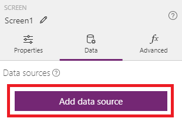
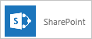
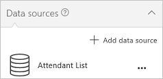

# Подключение к SharePoint из PowerApps

Подключитесь к сайту SharePoint, чтобы автоматически создавать приложение из списка, создавать приложение с нуля и обновлять имеющееся приложение.

## Известные проблемы
Вы можете добавить данные из пользовательского списка, но не из библиотеки. Кроме того, поддерживаются не все типы столбцов, и не все типы столбцов поддерживают все типы карточек.

| Тип столбца | Поддержка | Карточки по умолчанию |
| --- | --- | --- |
| Однострочный текст |Да |Просмотреть текст |
| Многострочный текст |Да |Просмотр текста |
| Выбор |Да |Просмотреть подстановку Изменить подстановку Просмотр полей с множественным выбором Редактирование полей с множественным выбором |
| Номер |Да |Просмотреть процентное значение Просмотреть оценку Просмотр текста |
| Валюта |Да |Просмотреть процентное значение Просмотреть оценку Просмотр текста |
| Дата и время |Да |Просмотр текста |
| "Поиск"; |Да |Просмотреть подстановку Изменить подстановку Просмотр полей с множественным выбором Редактирование полей с множественным выбором |
| Логическое значение (да или нет) |Да |Просмотр текста Просмотреть переключатель |
| "Пользователь" или "Группа"; |Да |Просмотреть подстановку Изменить подстановку Просмотр полей с множественным выбором Редактирование полей с множественным выбором |
| Гиперссылка |Да |Просмотреть URL-адрес Просмотр текста |
| Изображение |Да (только для чтения) |Просмотреть изображение Просмотр текста |
| Вложение |Да (только для чтения) |Просмотр вложений|
| Вычисляемое |Да (только для чтения) | |
| Результат задачи |Нет | |
| Внешние данные |Нет | |
| "Управляемые метаданные". |Да (только для чтения) | |
| Оценка |Нет | |

Столбцы, содержащие пробелы, могут считываться PowerApps, но при этом пробелы заменяются шестнадцатеричным escape-кодом **"\_x0020\_"**. Например, столбец **Имя столбца** из SharePoint будет отображаться как **Имя_x0020_столбца** в PowerApps при отображении в структуре данных или использовании в формуле.

## Технические условия
1. [Регистрация](../../signup-for-powerapps.md) в PowerApps.

1. Войдите в [PowerApps](http://web.powerapps.com), указав те же учетные данные, что и при регистрации.

1. В левой части выберите **Приложения**, а затем на баннере щелкните **Создать приложение**.

## Создание приложения
* [Автоматически создайте приложение](../app-from-sharepoint.md) на основе данных из списка SharePoint.

    По умолчанию приложение будет включать три экрана: для просмотра записей, для отображения сведений о записи, а также для создания или обновления записи. После создания приложения вам, скорее всего, потребуется настроить [экран обзора](../customize-layout-sharepoint.md) и [экраны сведений и редактирования](../customize-forms-sharepoint.md) в соответствии с собственными потребностями.

    **Примечание.** Если список SharePoint содержит столбцы **Выбор**, **Подстановка** или **Пользователь или группа**, см. сведения в разделе [Отображение данных в коллекции](connection-sharepoint-online.md#show-data-in-a-gallery) далее в этой статье.

* Чтобы создать приложение с нуля, [подключитесь к SharePoint](../connect-to-sharepoint.md), просмотрите концепции в статье [Создание приложения с нуля](../get-started-create-from-blank.md) и примените их к SharePoint, а не к Excel.

## Добавление списка SharePoint в существующее приложение
1. В PowerApps Studio откройте приложение, которое нужно обновить.

2. Откройте на ленте вкладку **Представление** и выберите пункт **Источники данных**.

3. На панели справа щелкните или нажмите **Добавить источник данных**.

    

4. Выберите последовательно **Новое подключение**, **SharePoint** и щелкните **Подключиться**.

    

5. Укажите тип сайта SharePoint, к которому необходимо подключиться:

    

   * Чтобы подключиться к SharePoint Online, щелкните **Прямое подключение (облачные службы)**.

   * Выберите **Подключиться с помощью локального шлюза данных**, чтобы подключиться к локальному сайту SharePoint.

       Выберите параметр **Windows** в качестве типа проверки подлинности, а затем введите учетные данные. (Если учетные данные содержат имя домена, укажите его в формате *домен\псевдоним*.)

       

       **Примечание.** Если у вас нет локального шлюза данных, [установите его](../gateway-reference.md), а затем щелкните значок, чтобы обновить список шлюзов.

       В поле **Выберите шлюз** выберите шлюз, который вы хотите использовать.

       

6. Нажмите кнопку **Подключиться**.

7. В разделе **Подключиться к сайту SharePoint** щелкните запись списка **Последние сайты** (или введите URL-адрес сайта, который вы хотите использовать), а затем нажмите кнопку **Перейти**.

    

8. В разделе **Выберите список** установите флажок для одного или нескольких списков, которые вы хотите использовать, и нажмите (коснитесь) кнопку **Подключиться**.  

    

    По умолчанию отображаются не все типы списков. Если имя списка, который вы хотите использовать, отсутствует, прокрутите окно вниз, а затем введите имя списка в поле, содержащее текст **Введите название пользовательского списка**.

    

    Источники данных добавлены в приложение.

    

## Отображение данных в коллекции
Чтобы отобразить данные из любого типа столбца в коллекции, используйте строку формул, чтобы задать свойство **Text** одного или нескольких элементов управления **Метка** этой коллекции:

* Чтобы отобразить данные в столбце **Выбор** и **Подстановка**, укажите значение **ThisItem.[Имя_столбца].Value**.

    Например, если вы используете столбец **Выбор** с именем **Location**, укажите значение **ThisItem.Location.Value**. Если же вы используете столбец **Подстановка** с именем **PostalCode**, укажите значение **ThisItem.PostalCode.Value**.

* Чтобы отобразить имя пользователя или группы, укажите значение **ThisItem.[Имя_столбца].DisplayName** для столбца **Пользователь или группа**.

    Например, укажите значение **ThisItem.Manager.DisplayName**, чтобы отобразить имя из столбца **Пользователь или группа** с именем **Manager**.

    Вы также можете отобразить другие сведения о пользователях, например адрес электронной почты или должность. Чтобы отобразить полный список вариантов, укажите **ThisItem.[Имя_столбца].** (включая точку в конце).

    **Примечание.** Для столбца **CreatedBy** укажите значение **ThisItem.Author.DisplayName**, чтобы отобразить имена пользователей, создавших элементы в списке. Для столбца **ModifiedBy** укажите значение **ThisItem.Editor.DisplayName**, чтобы отобразить имена пользователей, изменивших элементы в списке.

* Чтобы отобразить данные в столбце **Управляемые метаданные**, укажите значение **ThisItem.[Имя_столбца].Label**.

    Например, при наличии столбца **Управляемые метаданные** с именем **Languages** укажите значение **ThisItem.Languages.Label**.

## Дальнейшие действия
* Узнайте, как [отобразить данные из источника данных](../add-gallery.md).
* Узнайте, как [создать, обновить записи и просмотреть сведения о них](../add-form.md).
* См. другие типы [источников данных](../connections-list.md), к которым можно подключаться.
