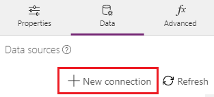
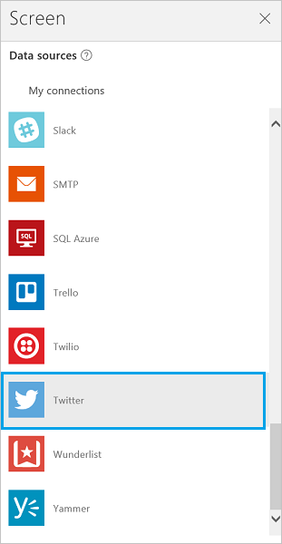
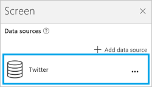

# Подключение к Twitter из PowerApps

Twitter позволяет публиковать и получать твиты, временную шкалу, друзей и подписчиков из учетной записи Twitter.

Эти сведения можно отобразить в метке приложения. Например, можно добавить текстовое поле ввода, попросить пользователя ввести текст твита, а затем добавить кнопку, с помощью которой можно опубликовать твит. Используйте аналогичные методы для получения или поиска твитов, а затем отобразите текст в метке или в коллекции вашего приложения.

В этой статье показано, как создать и использовать подключение Twitter в приложении, а также перечислены доступные функции.

[!INCLUDE [connection-requirements](../../../includes/connection-requirements.md)]

## Подключение к Twitter
1. Откройте PowerApps, выберите **Создать** и создайте **пустое приложение**. Выберите макет для телефона или планшета. Макет для планшета обеспечивает больше рабочего пространства:  
   
   
2. На панели справа откройте вкладку **Данные**, а затем нажмите кнопку **Добавить источник данных**.
3. Нажмите кнопку **Добавить подключение**, а затем выберите **Twitter**:  
   
    
   
    
4. Выберите **Подключиться**, введите учетные данные для входа в Twitter, а затем выберите **Authorize app** (Авторизовать приложение).
5. Щелкните **Добавить источник данных**. В разделе **Источники данных** появится подключение:  
    

Подключение Twitter создано и добавлено в приложение. Теперь оно готово к использованию.

## Использование подключения Twitter в приложении
### Отображение временной шкалы
1. В меню **Вставка** выберите **Коллекция** и добавьте любую из коллекций текстов в поле **С текстом**.
2. Рассмотрим некоторые временные шкалы.  
   
   * Чтобы отобразить временную шкалу текущего пользователя, задайте для свойства **[Items](../controls/properties-core.md)** коллекции следующие формулы:
     
       `Twitter.HomeTimeline().TweetText`  
       `Twitter.HomeTimeline({maxResults:3}).TweetText`  
   * Чтобы отобразить временную шкалу другого пользователя, задайте для свойства **[Items](../controls/properties-core.md)** коллекции следующую формулу:  
     
       `Twitter.UserTimeline( *TwitterHandle* ).TweetText`
     
       Введите имя пользователя Twitter, заключенное в двойные кавычки, или другое эквивалентное значение. Например, введите `"satyanadella"` или `"powerapps"` непосредственно в выражении формулы.
   * Добавьте элемент управления для ввода текста с именем **Tweep**, а для свойства по умолчанию задайте значение `Tweep.Text`. В текстовом поле Tweep введите имя пользователя Twitter, например `satyanadella` (без кавычек и символа @).
     
       В коллекции задайте для свойства Items следующую формулу:  
     
       `Twitter.UserTimeline(Tweep.Text, {maxResults:5}).TweetText`
     
       В коллекции автоматически отображаются твиты указанного пользователя Twitter.
     
     > [!TIP]
> Чтобы отобразить последние *х* твитов на временной шкале, некоторые из этих формул используют аргумент **maxResults**.
3. Присвойте свойству **Items** коллекции значение `Twitter.HomeTimeline()`.
   
    Если выбрать коллекцию, в правой области отобразятся ее параметры.
4. В первом списке выберите **TweetText**, во втором — **TweetedBy**, а в третьем — **CreatedAt**.
   
    Теперь в коллекции отображаются значения выбранных свойств.

### Отображение подписчиков
1. Отобразим некоторых подписчиков с помощью коллекции **С текстом**:  
   
   * Чтобы отобразить подписчиков текущего пользователя, задайте для свойства **[Items](../controls/properties-core.md)** коллекции следующую формулу:  
     
       `Twitter.MyFollowers()`  
       `Twitter.MyFollowers({maxResults:3})`
   * Чтобы отобразить подписчиков другого пользователя, задайте для свойства **[Items](../controls/properties-core.md)** коллекции следующую формулу:  
     
       `Twitter.Followers( *TwitterHandle* )`
     
       Введите имя пользователя Twitter, заключенное в двойные кавычки, или другое эквивалентное значение. Например, введите `"satyanadella"` или `"powerapps"` непосредственно в выражении формулы.
   * Добавьте элемент управления для ввода текста с именем **Tweep**, а для свойства по умолчанию задайте значение `Tweep.Text`. В текстовом поле Tweep введите имя пользователя Twitter, например `satyanadella` (без кавычек и символа @).
     
       В коллекции задайте для свойства Items следующую формулу:  
     
       `Twitter.Followers(Tweep.Text, {maxResults:5})`
     
       В коллекции автоматически отображаются подписчики указанного пользователя Twitter.
     
     > [!TIP]
> Чтобы отобразить последние *х* твитов на временной шкале, некоторые из этих формул используют аргумент **maxResults**.
2. Присвойте свойству **Items** коллекции значение `Twitter.MyFollowers()`.
   
    Если выбрать коллекцию, в правой области отобразятся ее параметры.
3. Во втором списке выберите **UserName**, а в третьем — **FullName**.
   
    Теперь в коллекции отображаются значения выбранных свойств.

### Отображение пользователей, на которых подписаны
1. Рассмотрим некоторых пользователей, на которых подписаны, с помощью коллекции **С текстом**:  
   
   * Чтобы отобразить пользователей, на которых подписан текущий пользователь, задайте для свойства **[Items](../controls/properties-core.md)** коллекции следующую формулу:  
     
       `Twitter.MyFollowing()`  
       `Twitter.MyFollowing({maxResults:3})`
   * Чтобы отобразить пользователей, на которых подписан другой пользователь, задайте для свойства **[Items](../controls/properties-core.md)** коллекции следующую формулу:
     
       `Twitter.Following( *TwitterHandle* )`
     
       Введите имя пользователя Twitter, заключенное в двойные кавычки, или другое эквивалентное значение. Например, введите `"satyanadella"` или `"powerapps"` непосредственно в выражении формулы.
   * Добавьте элемент управления для ввода текста с именем **Tweep**, а для свойства по умолчанию задайте значение `Tweep.Text`. В текстовом поле Tweep введите имя пользователя Twitter, например `satyanadella` (без кавычек и символа @).
     
       В коллекции задайте для свойства Items следующую формулу:  
     
       `Twitter.Following(Tweep.Text, {maxResults:5})`
     
       В коллекции автоматически отображаются имена других пользователей, на которых вы подписаны.
     
     Если выбрать коллекцию, в правой области отобразятся ее параметры.
2. В списке **Body1** выберите **Description**, в списке **Heading1** — **UserName**, а в списке **Subtitle1** — **FullName**.
   
    Теперь в коллекции отображаются значения выбранных свойств.

### Отображение сведений о пользователе
Добавьте метку и задайте для ее свойства **[Text](../controls/properties-core.md)** одну из этих формул:  

* `twitter.User( *TwitterHandle* ).Description`
* `twitter.User( *TwitterHandle* ).FullName`
* `twitter.User( *TwitterHandle* ).Location`
* `twitter.User( *TwitterHandle* ).UserName`
* `twitter.User( *TwitterHandle* ).FollowersCount`
* `twitter.User( *TwitterHandle* ).FriendsCount`
* `twitter.User( *TwitterHandle* ).Id`
* `twitter.User( *TwitterHandle* ).StatusesCount`

Введите имя пользователя Twitter, заключенное в двойные кавычки, или другое эквивалентное значение. Например, введите `"satyanadella"` или `"powerapps"` непосредственно в выражении формулы.

Вы также можете использовать элемент управления для ввода текста, чтобы ввести имя пользователя Twitter так же, как мы делали это ранее в этой статье.

### Поиск твитов
1. Используйте коллекцию **С текстом** и задайте для свойства **[Items](../controls/properties-core.md)** следующую формулу:  
   
    `Twitter.SearchTweet( *SearchTerm* ).TweetText`
   
    Введите *условие поиска*, заключенное в двойные кавычки, или используйте другое эквивалентное значение. Например, непосредственно в формуле введите `"PowerApps"` или `"microsoft"`.
   
    Чтобы указать условие поиска, можно использовать элемент управления **Вводимый текст** так же, как мы делали это ранее в этой статье.
   
    > [!TIP]
> Отобразите первые пять результатов с помощью аргумента maxResults:  
   
    `Twitter.SearchTweet(SearchTerm.Text, {maxResults:5}).TweetText`
2. Присвойте свойству **Items** коллекции значение `Twitter.SearchTweet(SearchTerm.Text, {maxResults:5})`.
   
    Если выбрать коллекцию, в правой области отобразятся ее параметры.
3. В первом списке выберите **TweetText**, во втором — **TweetedBy**, а в третьем — **CreatedAt**.
   
    Теперь в коллекции отображаются значения выбранных свойств.

### Отправка твита
1. Добавьте элемент управления для ввода текста и переименуйте его на **MyTweet**.
2. Добавьте кнопку и задайте в качестве значения свойства **[OnSelect](../controls/properties-core.md)** следующую формулу:  
    `Twitter.Tweet({tweetText: MyTweet.Text})`
3. Нажмите клавишу F5 или кнопку предварительного просмотра (). Введите текст в **MyTweet**, а затем нажмите кнопку, чтобы опубликовать введенный текст.
4. Нажмите клавишу ESC, чтобы вернуться в рабочую область по умолчанию.

## Просмотр доступных функций
Это подключение включает следующие функции:

| Имя функции | Описание |
| --- | --- |
| [UserTimeline](connection-twitter.md#usertimeline) |Извлекает коллекцию последних твитов, опубликованную указанным пользователем |
| [HomeTimeline](connection-twitter.md#hometimeline) |Извлекает последние твиты и ретвиты пользователя и его подписчиков |
| [SearchTweet](connection-twitter.md#searchtweet) |Извлекает коллекцию актуальных твитов, соответствующих указанному запросу |
| [Followers](connection-twitter.md#followers) |Извлекает данные о пользователях, подписавшихся на указанного пользователя |
| [MyFollowers](connection-twitter.md#myfollowers) |Извлекает данные о подписчиках пользователя |
| [Following](connection-twitter.md#following) |Извлекает данные о пользователях, на которых подписан указанный пользователь |
| [MyFollowing](connection-twitter.md#myfollowing) |Извлекает данные о пользователях, на которых подписан пользователь |
| [User](connection-twitter.md#user) |Извлекает подробные сведения об указанном пользователе (например, имя пользователя, описание, число подписчиков и т. д.) |
| [Tweet](connection-twitter.md#tweet) |Твит |
| [OnNewTweet](connection-twitter.md#onnewtweet) |Запускает рабочий процесс при публикации нового твита, который соответствует условиям поиска |

### UserTimeline
"Получить временную шкалу пользователя" — извлекает коллекцию последних твитов, опубликованных указанным пользователем.

#### Входные свойства
| Имя | Тип данных | Требуется | Описание |
| --- | --- | --- | --- |
| userName |строка |да |Имя пользователя Twitter |
| maxResults |целое число |нет |Максимальное число возвращаемых твитов, например {maxResults: 5} |

#### Выходные свойства
| Имя свойства | Тип данных | Требуется | Описание |
| --- | --- | --- | --- |
| TweetText |строка |Да | |
| TweetId |строка |Нет | |
| CreatedAt |строка |Нет | |
| RetweetCount |целое число |Да | |
| TweetedBy |строка |Да | |
| MediaUrls |массив |Нет | |

### HomeTimeline
"Получить домашнюю временную шкалу" — извлекает последние твиты и ретвиты пользователя и его подписчиков.

#### Входные свойства
| Имя | Тип данных | Требуется | Описание |
| --- | --- | --- | --- |
| maxResults |целое число |нет |Максимальное число возвращаемых твитов, например {maxResults: 5} |

#### Выходные свойства
| Имя свойства | Тип данных | Требуется | Описание |
| --- | --- | --- | --- |
| TweetText |строка |Да | |
| TweetId |строка |Нет | |
| CreatedAt |строка |Нет | |
| RetweetCount |целое число |Да | |
| TweetedBy |строка |Да | |
| MediaUrls |массив |Нет | |

### SearchTweet
Search tweet (Поиск твитов) — извлекает коллекцию актуальных твитов, соответствующих указанному запросу.

#### Входные свойства
| Имя | Тип данных | Требуется | Описание |
| --- | --- | --- | --- |
| searchQuery |строка |да |Текст запроса (вы можете использовать любые операторы запросов, поддерживаемые в Twitter: http://www.twitter.com/search) |
| maxResults |целое число |нет |Максимальное число возвращаемых твитов, например {maxResults: 5} |

#### Выходные свойства
| Имя свойства | Тип данных | Требуется | Описание |
| --- | --- | --- | --- |
| TweetText |строка |Да | |
| TweetId |строка |Нет | |
| CreatedAt |строка |Нет | |
| RetweetCount |целое число |Да | |
| TweetedBy |строка |Да | |
| MediaUrls |массив |Нет | |

### Followers
"Получить читателей" — извлекает данные о пользователях, подписавшихся на указанного пользователя.

#### Входные свойства
| Имя | Тип данных | Требуется | Описание |
| --- | --- | --- | --- |
| userName |строка |да |Имя пользователя Twitter |
| maxResults |целое число |нет |Максимальное число пользователей, сведения о которых необходимо получить, например {maxResults: 5} |

#### Выходные свойства
| Имя свойства | Тип данных | Требуется | Описание |
| --- | --- | --- | --- |
| Полное имя |строка |Да | |
| Расположение |строка |Да | |
| Id (Идентификатор) |целое число |Нет | |
| UserName |строка |Да | |
| FollowersCount |целое число |Нет | |
| Описание |строка |Да | |
| StatusesCount |целое число |Нет | |
| FriendsCount |целое число |Нет | |

### MyFollowers
"Получить моих читателей" — извлекает данные о подписчиках пользователя.

#### Входные свойства
| Имя | Тип данных | Требуется | Описание |
| --- | --- | --- | --- |
| maxResults |целое число |нет |Максимальное число пользователей, сведения о которых необходимо получить, например {maxResults: 5} |

#### Выходные свойства
| Имя свойства | Тип данных | Требуется | Описание |
| --- | --- | --- | --- |
| Полное имя |строка |Да | |
| Расположение |строка |Да | |
| Id (Идентификатор) |целое число |Нет | |
| UserName |строка |Да | |
| FollowersCount |целое число |Нет | |
| Описание |строка |Да | |
| StatusesCount |целое число |Нет | |
| FriendsCount |целое число |Нет | |

### Following
"Получить читаемых пользователей" — извлекает данные о пользователях, на которых подписан указанный пользователь.

#### Входные свойства
| Имя | Тип данных | Требуется | Описание |
| --- | --- | --- | --- |
| userName |строка |да |Имя пользователя Twitter |
| maxResults |целое число |нет |Максимальное число пользователей, сведения о которых необходимо получить, например {maxResults: 5} |

#### Выходные свойства
| Имя свойства | Тип данных | Требуется | Описание |
| --- | --- | --- | --- |
| Полное имя |строка |Да | |
| Расположение |строка |Да | |
| Id (Идентификатор) |целое число |Нет | |
| UserName |строка |Да | |
| FollowersCount |целое число |Нет | |
| Описание |строка |Да | |
| StatusesCount |целое число |Нет | |
| FriendsCount |целое число |Нет | |

### MyFollowing
"Получить читаемых мною пользователей" — извлекает данные о пользователях, на которых подписан пользователь.

#### Входные свойства
| Имя | Тип данных | Требуется | Описание |
| --- | --- | --- | --- |
| maxResults |целое число |нет |Максимальное число пользователей, сведения о которых необходимо получить, например {maxResults: 5} |

#### Выходные свойства
| Имя свойства | Тип данных | Требуется | Описание |
| --- | --- | --- | --- |
| Полное имя |строка |Да | |
| Расположение |строка |Да | |
| Id (Идентификатор) |целое число |Нет | |
| UserName |строка |Да | |
| FollowersCount |целое число |Нет | |
| Описание |строка |Да | |
| StatusesCount |целое число |Нет | |
| FriendsCount |целое число |Нет | |

### Пользователь
"Получить пользователя" — извлекает подробные сведения об указанном пользователе (например, имя пользователя, описание, число подписчиков и т. д.).

#### Входные свойства
| Имя | Тип данных | Требуется | Описание |
| --- | --- | --- | --- |
| userName |строка |да |Имя пользователя Twitter |

#### Выходные свойства
| Имя свойства | Тип данных | Требуется | Описание |
| --- | --- | --- | --- |
| Полное имя |строка |Да | |
| Расположение |строка |Да | |
| Id (Идентификатор) |целое число |Нет | |
| UserName |строка |Да | |
| FollowersCount |целое число |Нет | |
| Описание |строка |Да | |
| StatusesCount |целое число |Нет | |
| FriendsCount |целое число |Нет | |

### Tweet
Post a new tweet (Опубликовать новый твит) — новый твит.

#### Входные свойства
| Имя | Тип данных | Требуется | Описание |
| --- | --- | --- | --- |
| tweetText |строка |нет |Публикуемый текст, например {tweetText:"hello"} |
| body |строка |нет |Публикуемый файл мультимедиа |

#### Выходные свойства
| Имя свойства | Тип данных | Требуется | Описание |
| --- | --- | --- | --- |
| TweetId |строка |Да | |

### OnNewTweet
When a new tweet appears (При появлении нового твита) — запускает рабочий процесс при публикации нового твита, который соответствует условиям поиска.

#### Входные свойства
| Имя | Тип данных | Требуется | Описание |
| --- | --- | --- | --- |
| searchQuery |строка |да |Текст запроса (вы можете использовать любые операторы запросов, поддерживаемые в Twitter: http://www.twitter.com/search) |

#### Выходные свойства
| Имя свойства | Тип данных | Требуется | Описание |
| --- | --- | --- | --- |
| value |массив |Нет | |

## Полезные ссылки
Сведения о всех доступных подключениях см. [здесь](../connections-list.md).  
Узнайте, как [добавлять подключения](../add-manage-connections.md) в приложения.

