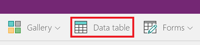
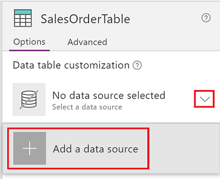
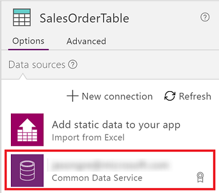
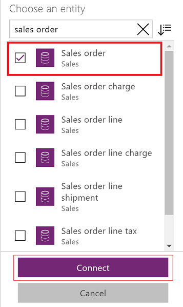
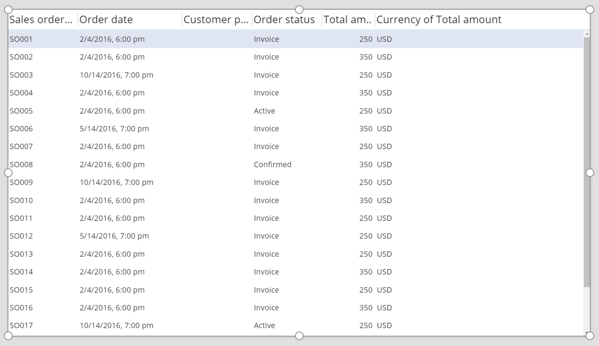
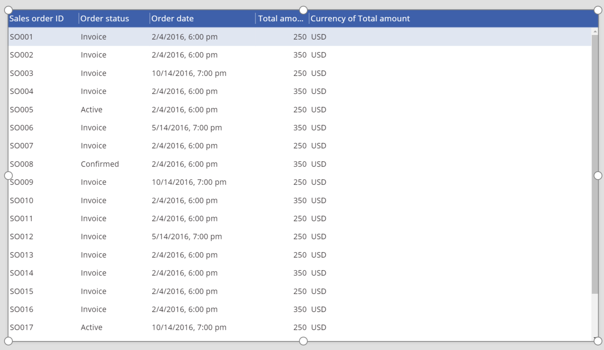
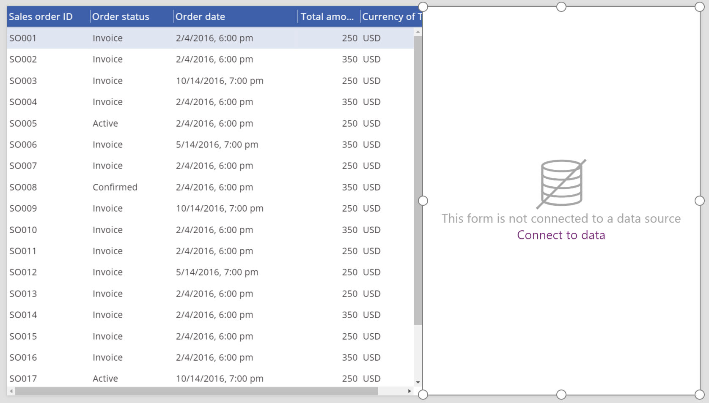
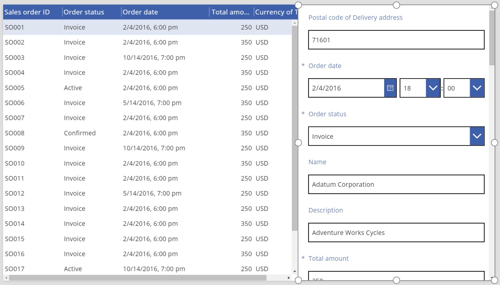

# Элемент управления "Таблица данных" в PowerApps
Отображает набор данных в табличном формате.

## Описание
Элемент управления **Таблица данных** отображает набор данных в формате, который включает в себя заголовки столбцов для каждого отображаемого поля. Создатель приложения имеет полный контроль над отображением полей и их порядком. Как и элемент управления **Коллекция**, элемент управления **Таблица данных** поддерживает свойство **Selected**, которое указывает на выбранную строку. Таким образом, вы можете связать элемент управления **Таблица данных** с другими элементам управления.

## Возможности
Элемент управления **Таблица данных** был представлен в PowerApps 5 мая 2017 года. В этом разделе содержатся сведения о поддерживаемых и неподдерживаемых возможностях.

### Доступно сейчас
* Данные в элементе управления **Таблица данных** доступны только для чтения.
* Одна строка в элементе управления **Таблица данных** всегда выбрана.
* Элемент управления **Таблица данных** можно связать с подключенным или локальным источником данных.
* Настройка ширины столбцов в элементе управления **Таблица данных** во время выполнения приложения (хотя эти изменения и не сохраняются).
* В элементе управления **Таблица данных** отображается набор полей по умолчанию, если этот элемент управления связан с соединителем, реализующим такую возможность, например Common Data Service. При необходимости можно будет отобразить или скрыть эти поля, как и другие поля в элементе управления.
* Настройка ширины столбца и текста заголовка.
* Отображение гиперссылок в элементе управления **Таблица данных**.
* Копирование и вставка элемента управления **Таблица данных**.

### Пока недоступно
* Настройка стилей отдельных столбцов.
* Добавление элемента управления **Таблица данных** в элемент управления "Форма".
* Изменение высоты всех строк.
* Отображение изображений в элементе управления **Таблица данных**.
* Отображение полей из связанных сущностей.
* Использование встроенных функций для фильтрации и сортировки данных по заголовку столбца.
* Добавление элемента управления **Таблица данных** в элемент управления **Коллекция**.
* Изменение данных в элементе управления **Таблица данных**.
* Выбор нескольких строк.

### Известные проблемы
* Данные не отображаются, если в свойстве **Items** используется функция **FirstN**.

## Основные свойства
* [**Items**](properties-core.md) — источник данных, который отображается в элементе управления **Таблица данных**.
* **Selected** — выбранная строка в элементе управления **Таблица данных**.

## Другие свойства
* [**BorderColor**](properties-color-border.md) — цвет границы элемента управления **Таблица данных**.
* [**BorderStyle**](properties-color-border.md) — стиль границы элемента управления **Таблица данных**. Возможные значения: **Сплошная**, **Штриховая**, **Пунктирная** и **Отсутствует**.
* [**BorderThickness**](properties-color-border.md) — толщина границы элемента управления **Таблица данных**.
* [**Color**](properties-color-border.md) — цвет по умолчанию для всех строк данных.
* [**Fill**](properties-color-border.md) — цвет фона для всех строк данных.
* [**Font**](properties-text.md) — шрифт по умолчанию для всех строк данных.
* [**FontWeight**](properties-text.md) — толщина шрифта по умолчанию для всех строк данных.
* **HeadingColor** — цвет текста заголовков столбцов.
* **HeadingFill** — цвет фона заголовков столбцов.
* **HeadingFont** — шрифт заголовков столбцов.
* **HeadingFontWeight** — толщина шрифта заголовков столбцов.
* **HeadingSize** — размер шрифта заголовков столбцов.
* [**Height**](properties-size-location.md) — расстояние между верхним и нижним краем элемента управления **Таблица данных**.
* [**HoverColor**](properties-color-border.md) — цвет текста в строке, на которую наведен указатель мыши.
* [**HoverFill**](properties-color-border.md) — цвет фона в строке, на которую наведен указатель мыши.
* **NoDataText** — сообщение, которое получает пользователь, когда отсутствуют записи для отображения в элементе управления **Таблица данных**.
* **SelectedColor** — цвет текста в выбранной строке.
* **SelectedFill** — цвет фона в выбранной строке.
* [**Size**](properties-text.md) — размер шрифта по умолчанию для всех строк данных.
* [**Visible**](properties-core.md) — значение, которое определяет, отображается ли элемент управления **Таблица данных**.
* [**Width**](properties-size-location.md) — расстояние между левым и правым краем элемента управления **Таблица данных**.
* [**X**](properties-size-location.md) — расстояние между левым краем элемента управления **Таблица данных** и левым краем его родительского контейнера (или левым краем экрана, если родительского контейнера нет).
* [**Y**](properties-size-location.md) — расстояние между верхним краем элемента управления **Таблица данных** и верхним краем его родительского контейнера (или верхним краем экрана, если родительского контейнера нет).

## Связанные функции
* [**Filter(источник_данных, формула)**](../functions/function-filter-lookup.md)(*источник_данных*, *формула*)
* [**Search(источник_данных, искомая_строка, столбец)**](../functions/function-filter-lookup.md)(*источник_данных*, *искомая_строка*, *столбец*)

## Примеры
### Базовое использование
1. Создайте пустое планшетное приложение.
2. На вкладке **Вставка** выберите **Таблица данных**.
   
    
   
    Элемент управления **Таблица данных** будет добавлен на экран.
3. Переименуйте элемент управления **Таблица данных** в **SalesOrderTable** и измените его размер, чтобы он заполнил весь экран.
4. В правой области щелкните (коснитесь) стрелку вниз справа от надписи **Источник данных не выбран** и щелкните (коснитесь) **Добавить источник данных**.
   
    
5. В списке подключений выберите подключение для базы данных Common Data Service.
   
    
6. Из списка сущностей выберите **Sales order** и щелкните или коснитесь **Подключить**.
   
    
   
    Элемент управления **Таблица данных** теперь подключен к источнику данных **Sales order**. В элементе управления **Таблица данных** отображается несколько исходных полей, так как мы используем соединитель, который поддерживает эту возможность.
   
    
7. В правой области установите один или несколько флажков, чтобы отобразить или скрыть отдельные поля.
   
    Например, установите флажок рядом с полем **CustomerPurchaseOrderReference**, чтобы скрыть его.
8. В правой области измените порядок полей, перетаскивая их вверх или вниз.
   
    
   
    В элементе управления **SalesOrderTable** поля отобразятся в указанном вами порядке.
   
    

### Изменение стиля заголовка элемента управления "Таблица данных"
1. Выбрав элемент управления **Таблица данных**, щелкните (коснитесь) вкладку **Дополнительно** в правой области.
2. Щелкните поле для свойства **HeadingFill**, а затем измените значение на **RGBA(62,96,170,1)**.
3. Щелкните (коснитесь) поле для свойства **HeadingColor**, а затем измените значение на **White**.
4. Щелкните поле для свойства **HeadingSize**, а затем измените значение на **14**.
   
    

### Подключение элемента управления "Таблица данных" к другому элементу
1. Добавьте элемент управления **Форма изменения** на экран.
2. Измените размер элементов управления **Таблица данных** и **Форма изменения** так, чтобы элемент управления **Таблица данных** отображался в левой части экрана, а элемент управления **Форма изменения** — в правой.
   
    
3. Выбрав **Form1**, в правой области измените число столбцов на **1**.
4. Подключите **Form1** к источнику данных **Sales order**.
   
    В **Form1** отображается несколько исходных полей.
   
    
5. В правой области выберите вкладку **Дополнительно**.
6. Задайте для свойства **Item** элемента управления **Form1** значение **SalesOrderTable.Selected**.
   
    В **Form1** отобразится информация из строки, выбранной в элементе управления **Таблица данных**.
   
    

## Руководство по настройке специальных возможностей
### Контрастность
Необходимо настроить достаточный контраст для следующих элементов:
* [**Color**](properties-color-border.md) и [**Fill**](properties-color-border.md);
* **HeadingColor** и **HeadingFill**;
* **SelectedColor** и **SelectedFill**;
* [**HoverColor**](properties-color-border.md) и [**HoverFill**](properties-color-border.md).

Это дополнение к [стандартным требованиям по цветовому контрасту](../accessible-apps-color.md).

### Поддержка средства чтения с экрана
* Должен присутствовать элемент **NoDataText**.
