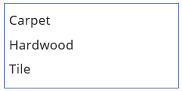
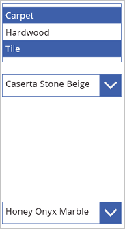

# Элемент управления "Поле со списком" в PowerApps
Список, в котором пользователь может выбрать один или несколько элементов.

## Описание
Элемент управления **Поле со списком** всегда отображает все доступные варианты выбора (в отличие от элемента управления **[Раскрывающийся список](control-drop-down.md)**), и в нем пользователь может выбрать несколько элементов одновременно (в отличие от элемента управления **[Переключатель](control-radio.md)**).

## Основные свойства
**[Default](properties-core.md)**. Начальное значение элемента управления до его изменения пользователем.

**[Items](properties-core.md)**  — источник данных, отображаемых в элементе управления, такой как коллекция, список или диаграмма.

[!INCLUDE [long-items](../../../includes/long-items.md)]

## Дополнительные свойства
**[AccessibleLabel](properties-accessibility.md)** — метка для средств чтения с экрана.

**[BorderColor](properties-color-border.md)**  — цвет границы элемента управления.

**[BorderStyle](properties-color-border.md)**  — стиль границы элемента управления: **Сплошная**, **Штриховая**, **Пунктирная** или **Отсутствует**.

**[BorderThickness](properties-color-border.md)**  — толщина границы элемента управления.

**[Color](properties-color-border.md)**  — цвет текста в элементе управления.

**[DisplayMode](properties-core.md)** — в зависимости от значения этого режима элемент управления разрешает пользователю вводить данные (**Изменение**), только отображает данные (**Просмотр**) или элемент вообще отключен (**Отключено**).

**[DisabledBorderColor](properties-color-border.md)** — цвет границы элемента управления, если для его свойства **[DisplayMode](properties-core.md)** установлено значение **Отключено**.

**[DisabledColor](properties-color-border.md)** — цвет текста в элементе управления, если для его свойства **[DisplayMode](properties-core.md)** установлено значение **Отключено**.

**[DisabledFill](properties-color-border.md)** — цвет фона элемента управления, если для его свойства **[DisplayMode](properties-core.md)** установлено значение **Отключено**.

**[Fill](properties-color-border.md)**  — цвет фона элемента управления.

**[FocusedBorderColor](properties-color-border.md)** — цвет границы элемента управления при наведении фокуса.

**[FocusedBorderThickness](properties-color-border.md)** — толщина границы элемента управления при наведении фокуса.

**[Font](properties-text.md)**  — имя семейства шрифтов, используемых для отображения текста.

**[FontWeight](properties-text.md)**  — толщина текста в элементе управления: **Жирный**, **Полужирный**, **Обычный** или **Очень тонкий**.

**[Height](properties-size-location.md)**  — расстояние между верхним и нижним краем элемента управления.

**[HoverBorderColor](properties-color-border.md)**  — цвет границы элемента управления при удерживании указателя мыши на нем.

**[HoverColor](properties-color-border.md)**  — цвет текста в элементе управления при удерживании указателя мыши на нем.

**[HoverFill](properties-color-border.md)**  — цвет фона элемента управления при удерживании указателя мыши на нем.

**[Italic](properties-text.md)** определяет, когда текст в элементе управления отображается курсивом.

**ItemPaddingLeft** — расстояние между текстом в поле со списком и его левым краем.

**[LineHeight](properties-text.md)**  — расстояние, например, между строками текста или элементами списка.

**[OnChange](properties-core.md)**  — поведение приложения, когда пользователь изменяет значение элемента управления (например, перемещая ползунок).

**[OnSelect](properties-core.md)**  — поведение приложения, когда пользователь щелкает элемент управления или касается его.

**[PaddingBottom](properties-size-location.md)**  — расстояние между текстом в элементе управления и нижним краем элемента управления.

**[PaddingLeft](properties-size-location.md)**  — расстояние между текстом в элементе управления и левым краем элемента управления.

**[PaddingRight](properties-size-location.md)**  — расстояние между текстом в элементе управления и правым краем элемента управления.

**[PaddingTop](properties-size-location.md)**  — расстояние между текстом в элементе управления и верхним краем элемента управления.

**[PressedBorderColor](properties-color-border.md)**  — цвет границы элемента управления при щелчке или касании.

**[PressedColor](properties-color-border.md)**  — цвет текста в элементе управления при щелчке или касании.

**[PressedFill](properties-color-border.md)**  — цвет фона элемента управления при щелчке или касании.

**[Reset](properties-core.md)**  — определяет, возвращается ли элемент управления к значению по умолчанию.

**[SelectionColor](properties-color-border.md)**  — цвет текста выбранного элемента или элементов списка или цвет инструмента выделения в элементе управления рукописным вводом.

**[SelectionFill](properties-color-border.md)**  — цвет фона выбранного элемента или элементов списка или цвет выделенной области элемента управления "Ввод с помощью пера".

**SelectMultiple** — определяет, может ли пользователь выбрать несколько элементов в списке.

**[Size](properties-text.md)**  — размер шрифта текста, отображаемого в элементе управления.

**[Strikethrough](properties-text.md)** определяет, когда через текст, отображаемый в элементе управления, проходит линия.

**[TabIndex](properties-accessibility.md)** — порядок навигации с помощью клавиатуры относительно других элементов управления.

**[Tooltip](properties-core.md)** — пояснительный текст, отображаемый при наведении указателя мыши на элемент управления.

**[Underline](properties-text.md)** определяет, когда под текстом, отображаемым в элементе управления, проходит линия.

**[Visible](properties-core.md)** определяет, отображается ли элемент управления или он скрыт.

**[Width](properties-size-location.md)**  — расстояние между левым и правым краем элемента управления.

**[X](properties-size-location.md)**  — расстояние между левым краем элемента управления и левым краем его родительского контейнера (или экрана, если родительского контейнера нет).

**[Y](properties-size-location.md)**  — расстояние между верхним краем элемента управления и верхним краем его родительского контейнера (или экрана, если родительского контейнера нет).

## Связанные функции
[**Distinct**(*источник*, *столбец*)](../functions/function-distinct.md)

## Пример
1. Добавьте элемент управления **Поле со списком**, назовите его **CategoryList** и укажите для свойства **[Items](properties-core.md)** следующую формулу: 
   **["Carpet","Hardwood","Tile"]**
   
    Не знаете, как [добавить, назвать и настроить элемент управления](../add-configure-controls.md)?
   
    
2. Добавьте три элемента управления **[Раскрывающийся список](control-drop-down.md)**, переместите их под элемент **CategoryList** и назовите **CarpetList**, **HardwoodList** и **TileList**.
3. Укажите для свойства **[Items](properties-core.md)** каждого из элементов управления **[Раскрывающийся список](control-drop-down.md)** одно из следующих значений:
   
   * CarpetList: **["Caserta Stone Beige","Ageless Beauty Clay", "Lush II Tundra"]**
   * HardwoodList: **["Golden Teak","Natural Hickory", "Victoria Mahogany"]**
   * TileList: **["Honey Onyx Marble","Indian Autumn Slate", "Panaria Vitality Ceramic"]**
     
     
4. Укажите для свойства **[Visible](properties-core.md)** каждого из элементов управления **[Раскрывающийся список](control-drop-down.md)** одно из следующих значений:
   
   * CarpetList: **If("Ковер" in CategoryList.SelectedItems.Value, true)**
   * HardwoodList: **If("Паркет" in CategoryList.SelectedItems.Value, true)**
   * TileList: **If("Плитка" in CategoryList.SelectedItems.Value, true)**
     
     Нуждаетесь в дополнительных сведениях о функции **[If](../functions/function-if.md)** или [других функциях](../formula-reference.md)?
5. Нажмите клавишу F5 и выберите один или несколько элементов в элементе управления **CategoryList**.
   
    В зависимости от вашего выбора отображаются один или несколько элементов управления **[Раскрывающийся список](control-drop-down.md)**.
   
    
6. (Необязательно) Нажмите клавишу ESC, чтобы вернуться в рабочую область по умолчанию.

## Руководство по настройке специальных возможностей
### Контрастность
Необходимо настроить достаточный контраст для следующих элементов:
* **SelectionColor** и **SelectionFill**;
* **SelectionFill** и **[Fill](properties-color-border.md)**;
* **[HoverFill](properties-color-border.md)** и **[Fill](properties-color-border.md)**;
* **[PressedFill](properties-color-border.md)** и **[Fill](properties-color-border.md)**.

Это дополнение к [стандартным требованиям по цветовому контрасту](../accessible-apps-color.md).

### Поддержка средства чтения с экрана
* Должен присутствовать элемент **[AccessibleLabel](properties-accessibility.md)**.

### Поддержка клавиатуры
* Значение элемента **[TabIndex](properties-accessibility.md)** должно быть равно нулю или больше нуля, чтобы пользователи могли использовать навигацию с помощью клавиатуры.
* Индикаторы фокуса должны быть хорошо видны. Для этого используются элементы **[FocusedBorderColor](properties-color-border.md)** и **[FocusedBorderThickness](properties-color-border.md)**.

    > [!NOTE]
  > Клавиша табуляции позволяет переходить к **списку**. Для перехода по содержимому **списка** используются клавиши со стрелками.
