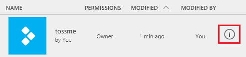

# Удаление приложения из PowerApps
Из этой статьи вы узнаете, как удалить приложение из своей учетной записи PowerApps, а также из учетных записей всех пользователей, которым к нему был предоставлен доступ.

## Удаление приложения из учетной записи
1. На сайте [powerapps.com](https://web.powerapps.com?utm_source=padocs&utm_medium=linkinadoc&utm_campaign=referralsfromdoc) на панели навигации слева щелкните или нажмите **Apps** (Приложения).
   
    
2. (Необязательно.) В левом верхнем углу отфильтруйте список приложений, чтобы отобразить только те из них, которые вам принадлежат или в создании которых вы участвуете.
   
    
   
    > [!NOTE]
   > Если приложение, которое нужно удалить, не отображается, убедитесь, что находитесь в правильном окружении.
3. У правого края экрана щелкните или нажмите на значок информации для приложения, которое хотите удалить.
   
    
4. В правом верхнем углу щелкните или нажмите на значок корзины, чтобы удалить приложение.
   
    
   
    > [!NOTE]
   > Для удаления приложения необходимы разрешения **участника** на доступ к нему.
5. В появившемся диалоговом окне щелкните или нажмите **Delete from cloud** (Удалить из облака).  
   
    > [!IMPORTANT]
   > В результате этого действия приложение будет удалено без возможности восстановления не только из вашей учетной записи, но и из учетных записей всех пользователей, которым к нему был предоставлен доступ.
   
    

## Дополнительные ресурсы
[Общий доступ к приложению](share-app.md)  
[Изменение названия и плитки приложения](set-name-tile.md)  
[Восстановление предыдущей версии приложения](restore-an-app.md)  

