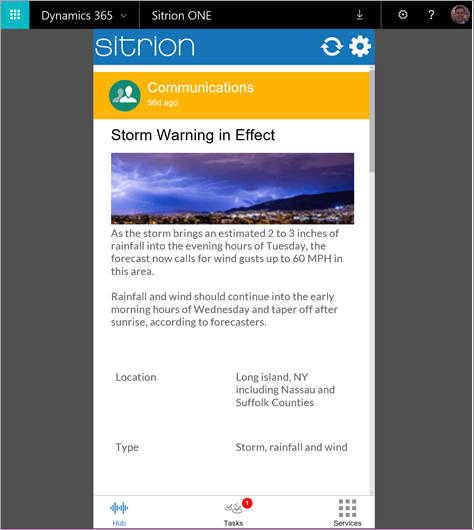

# <a name="let-customers-test-drive-your-apps-on-appsource"></a>Предоставление клиентам возможности тестировать ваши приложения в AppSource
Вы намерены создавать приложения в PowerApps? У вас есть приложение, которым вы хотите поделиться с клиентами? Чтобы поделиться приложением с клиентами и привлечь потенциальных клиентов для вашего бизнеса, мы поддерживаем решения для тестового выпуска PowerApps на сайте [AppSource.com](https://appsource.microsoft.com).

## <a name="what-is-a-test-drive-solution"></a>Что такое решение для тестирования?
Решение для тестирования (тестовый выпуск) позволяет клиентам опробовать реальное приложение без регистрации в плане PowerApps и установки каких-либо приложений. Клиентам необходимо лишь войти на сайт AppSource.com, используя учетную запись Azure Active Directory (AAD), и запустить приложение в веб-браузере. Если приложение не имеет тестового выпуска, клиенты могут только просматривать сведения и видео о нем. С помощью тестового выпуска клиенты могут лучше понять, что представляет собой ваше решение и какие возможности предоставляет ваше приложение, а также оценить его работу на практике. Пользователи не смогут узнать принцип сборки вашего приложения, поэтому ваша интеллектуальная собственность в безопасности. Мы собираем для вас информацию о потенциальных клиентах, которые используют тестовый выпуск приложения, чтобы помочь развитию вашей компании.

Далее приведен пример [описания приложения](https://go.microsoft.com/fwlink/?linkid=848867) на AppSource.com:


Запустить связанный тестовый выпуск приложения PowerApps непосредственно в браузере пользователя можно с помощью ссылки **Бесплатная пробная версия** в описании (как на снимке экрана выше).



## <a name="how-do-i-build-a-test-drive-solution"></a>Как создать решение для тестирования?
Создание приложения для тестирования аналогично созданию приложения в PowerApps. Однако вместо подключения к внешним данным используются внедренные данные. Использование внедренных данных устраняет какие-либо риски и сложность развертывания для клиентов, поэтому они могут без проблем опробовать это приложение. Полное решение, которое вы в итоге распространяете среди пользователей, обычно имеет подключения к данным, однако для тестового выпуска лучше всего использовать внедренные данные.

PowerApps изначально поддерживает создание приложений с внедренными данными, поэтому вам просто понадобится пример данных. Данные должны содержаться в одной или нескольких таблицах в файле Excel. В PowerApps эти данные перемещаются из таблиц Excel в приложение, где с ними можно работать. В этом случае вам не придется устанавливать внешнее подключение. Ознакомьтесь с трехэтапной процедурой ниже, чтобы переместить данные и использовать их в приложении.

### <a name="step-1-import-data-into-the-app"></a>Шаг 1. Импорт данных в приложение
Предположим, что у вас есть две таблицы в файле Excel: **SiteInspector** и **SitePhotos**.


Импортируйте эти две таблицы в PowerApps с помощью параметра **Добавить статические данные для приложения**.


Теперь таблицы добавлены в приложение в качестве источников данных.


### <a name="step-2-handling-read-only-and-read-write-scenarios"></a>Шаг 2. Обработка сценариев только для чтения и сценариев для чтения и записи
Импортированные данные являются *статическими* и доступны только для чтения. Если приложение доступно только для чтения (т. е. оно только отображает данные для пользователя), запрашивайте таблицы непосредственно в приложении. Например, если требуется получить доступ к полю **Заголовок** в таблице **SiteInspector**, используйте **SiteInspector.Title** в формуле.

Если приложение доступно для чтения и записи, сначала переместите данные из каждой таблицы в *коллекцию* (табличная структура данных в PowerApps). Затем вместо таблицы используйте коллекцию. Чтобы переместить данные из таблиц **SiteInspector** и **SitePhotos** в коллекции **SiteInspectorCollect** и **SitePhotosCollect**, используйте следующую формулу:

```
ClearCollect(SiteInspectorCollect,SiteInspector); ClearCollect(SitePhotosCollect,SitePhotos)
```

С помощью этой формулы можно очистить обе коллекции, а затем переместить данные из каждой таблицы в соответствующую коллекцию.

* Вызовите эту формулу где-нибудь в приложении, чтобы загрузить данные.
* Просмотрите все коллекции в приложении, выбрав **Файл** > **Коллекции**.
* Дополнительные сведения см. в статье [Создание и обновление коллекции в приложении](../canvas-apps/create-update-collection.md).

Теперь, чтобы получить доступ к полю **Заголовок**, используйте в формуле **SiteInspectorCollect.Title**.

### <a name="step-3-add-update-and-delete-data-in-your-app"></a>Шаг 3. Добавление, обновление и удаление данных в приложении
Вы научились считывать данные напрямую и из коллекции. Теперь мы покажем, как добавить, обновить и удалить данные в коллекции.

**Чтобы добавить строку в коллекцию**, используйте [Collect( DataSource, Item, ... )](../canvas-apps/functions/function-clear-collect-clearcollect.md):

```
Collect(SiteInspectorCollect,{ID:Value(Max(SiteInspectorCollect, ID)+1),
    Title:TitleText.Text,SubTitle:SubTitleText.Text,Description:DescriptionText.Text)
```

**Чтобы обновить строку в коллекции**, используйте [UpdateIf( DataSource, Condition1, ChangeRecord1 [, Condition2, ChangeRecord2, ...] )](../canvas-apps/functions/function-update-updateif.md):

```
UpdateIf(SiteInspectorCollect,ID=record.ID,
    {Title:TitleEditText.Text,SubTitle:SubTitleEditText.Text,Description:DescriptionEditText.Text)
```

**Чтобы удалить строку из коллекции**, используйте [RemoveIf( DataSource, Condition [, ...] )](../canvas-apps/functions/function-remove-removeif.md):

```
RemoveIf(SiteInspectorCollect,ID=record.ID)
```

> [!NOTE]
> Коллекции хранят данные только во время выполнения приложения. При закрытии приложения все изменения будут утеряны.

Таким образом, вы можете создать версию приложения с внедренными данными, что имитирует работу приложения при подключении к внешним данным. После внедрения данных вы сможете опубликовать это приложение как решение для тестирования на сайте AppSource.com.

## <a name="how-do-i-list-my-test-drive-solution-on-appsourcecom"></a>Как добавить решение для тестирования на сайте AppSource.com?
Теперь, когда приложение готово, его можно опубликовать на сайте AppSource.com. Чтобы начать, заполните [форму заявки](https://powerapps.microsoft.com/partners/get-listed/) на сайте PowerApps.com.

После подачи заявки вы получите электронное письмо с инструкциями о том, как отправить приложение для публикации на сайте AppSource.com. Документацию по подключению, в которой полностью описывается этот процесс, можно скачать [отсюда](https://go.microsoft.com/fwlink/?linkid=851031).

