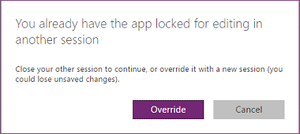

# Изменение приложения в PowerApps
Вы можете изменить любое приложение, которое вы создали, которым вы владеете или для которого у вас есть разрешения **Может изменять**. Вы можете изменить приложение в PowerApps Studio. При попытке изменить приложение, которое уже открыто для редактирования в другом месте, появится сообщение о том, что приложение уже открыто вами или другим пользователем.

## Проверка разрешений
1. Войдите в [PowerApps](https://web.powerapps.com?utm_source=padocs&utm_medium=linkinadoc&utm_campaign=referralsfromdoc), затем щелкните (коснитесь) **Приложения** в меню **Файл** (с левой стороны).
   
    

2. В селекторе категории приложений щелкните **Приложения, которые я могу изменять**.

    Можно изменить любое приложение в отображенном списке. Можно также найти приложение, введя один или несколько знаков в поле поиска, размещенном рядом с верхним правым углом.

    > [!NOTE]
    > Если приложение, которое нужно изменить, все равно не отображается, убедитесь, что вы выбрали соответствующее окружение в правом верхнем углу.
   
    

1. Нажмите кнопку с многоточием (...) возле приложения, которое нужно изменить, а затем щелкните **Изменить**.

## Совместная работа над приложением
Все, у кого есть разрешение **Может изменять** для приложения, могут его изменить, но одновременно только один пользователь может вносить изменения. При попытке изменить приложение, которое уже редактируется другим пользователем, появится следующее сообщение. Вы не сможете перейти к изменению, пока другой пользователь не закроет приложение (или не истечет срок сеанса этого пользователя).

Кроме того, это сообщение появится, если вы откроете приложение для редактирования и затем попытаетесь открыть его на другом устройстве или в другом окне браузера. Можно переопределить предыдущий сеанс, но это может привести к потере всех изменений, которые не были сохранены.

## Следующие шаги
Узнайте больше о добавлении [экрана](add-screen-context-variables.md), [элемента управления](add-configure-controls.md) или [подключения к данным](add-data-connection.md).

