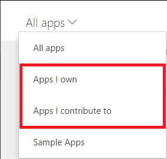
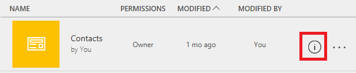
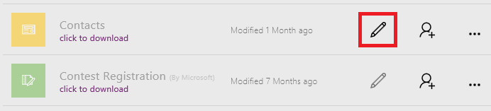

# Изменение приложения в PowerApps
Вы можете изменить любое приложение, которое вы создали, которым вы владеете или для которого у вас есть разрешения **Может изменять**. Изменить приложение можно в PowerApps Studio в Интернете или PowerApps Studio для Windows. При попытке изменить приложение, которое уже открыто для редактирования в другом месте, появится сообщение о том, что приложение уже открыто вами или другим пользователем.

## Проверка разрешений
1. Войдите в [PowerApps](https://web.powerapps.com), затем щелкните (коснитесь) **Приложения** в меню **Файл** (с левой стороны).
   
    
2. Откройте селектор категории приложений, затем щелкните (коснитесь) **Мои приложения** или **Приложения, в которых я участвую**.
   
    
   
    Можно изменить любое приложение в отображенном списке. Можно также найти приложение, введя один или несколько знаков в поле поиска, размещенном рядом с верхним правым углом.
   
    > [!NOTE]
> Если приложение, которое нужно изменить, все равно не отображается, убедитесь, что вы выбрали соответствующее окружение в правом верхнем углу.
   
    

## Изменение приложения в PowerApps Studio в Интернете
1. Выполните действия, описанные в предыдущей процедуре, чтобы найти приложение, которое требуется изменить.
2. Щелкните (коснитесь) значок сведений рядом с правым краем окна.
   
    
3. Щелкните (коснитесь) значок **Изменить** в правом верхнем углу, затем выберите **Открыть в Интернете**.
   
    

## Изменение приложения в PowerApps Studio для Windows
1. Откройте PowerApps Studio для Windows.
2. На странице, отобразившейся по умолчанию, найдите приложение, которое требуется изменить.
   
    Чтобы упростить поиск приложения, щелкните (коснитесь) значок поиска в правом верхнем углу и введите один или несколько знаков из имени приложения. Можно также отсортировать список по имени, дате внесения последних изменений или дате последнего открывания. Если нужное приложение по-прежнему не отображается, убедитесь, что вы находитесь в соответствующей среде PowerApps, как описано в первой процедуре.
   
    
3. У правого края экрана щелкните (коснитесь) значок карандаша для приложения, которое хотите изменить.
   
    Можно изменить любое приложение, для которого значок карандаша отображен черным цветом, а не серым.
   
    

## Совместная работа над приложением
Все, у кого есть разрешение **Может изменять** для приложения, могут его изменить, но одновременно только один пользователь может вносить изменения. При попытке изменить приложение, которое уже редактируется другим пользователем, появится следующее сообщение. Вы не сможете перейти к изменению, пока другой пользователь не закроет приложение (или не истечет срок сеанса этого пользователя).

Кроме того, это сообщение появится, если вы откроете приложение для редактирования и затем попытаетесь открыть его на другом устройстве или в другом окне браузера. Можно переопределить предыдущий сеанс, но это может привести к потере всех изменений, которые не были сохранены.

## Следующие шаги
Узнайте больше о добавлении [экрана](add-screen-context-variables.md), [элемента управления](add-configure-controls.md) или [подключения к данным](add-data-connection.md).

