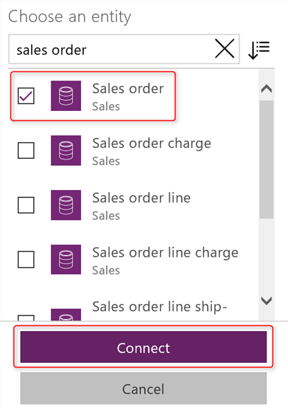
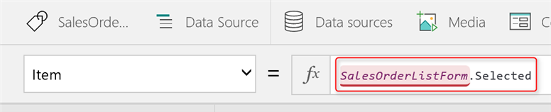
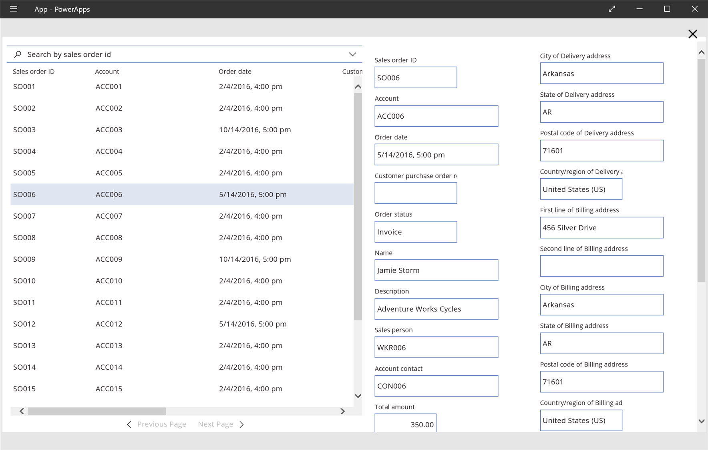
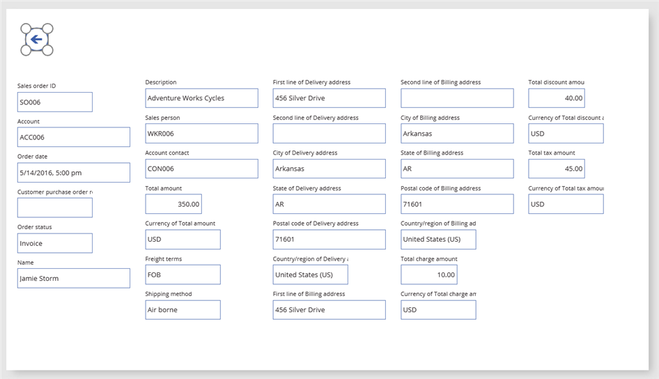
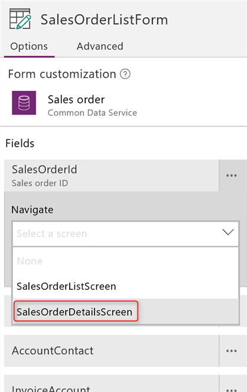
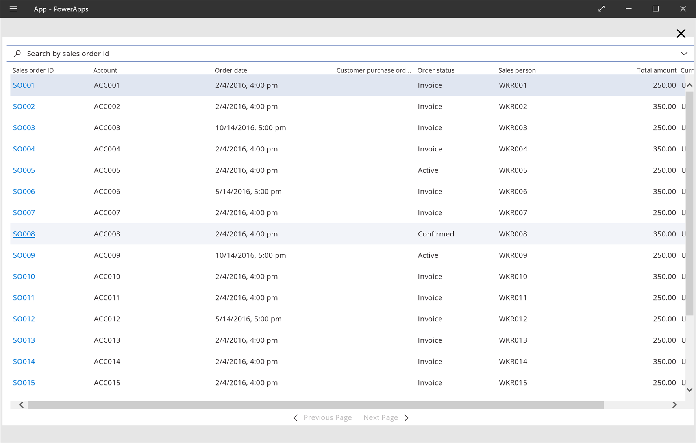
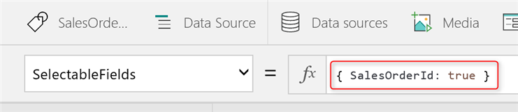
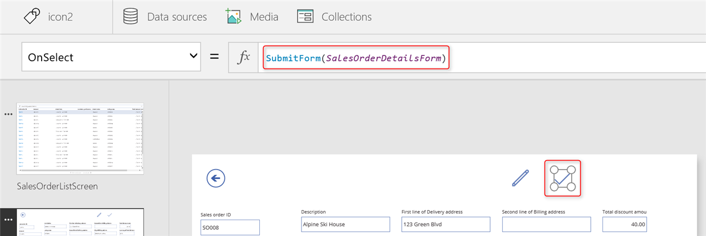

# Использование элемента управления "Форма сущности"
Создавайте приложения быстрее, используя элемент управления **Форма сущности** для добавления полнофункциональных форм для сущности Common Data Service.

Чтобы получить общие сведения об элементе управления **Форма сущности**, прочитайте запись блога: [New entity form control (experimental feature) for Common Data Service](https://powerapps.microsoft.com/blog/new-entity-form-control-experimental-feature-for-common-data-service/) (Новый элемент управления Форма сущности (экспериментальный) для Common Data Service).

> [!IMPORTANT]
> Имейте в виду, что элемент управления **Форма сущности**, описываемый в записи блога, является экспериментальным. Следует осторожно использовать элемент управления **Форма сущности** в рабочих приложениях, по крайней мере сейчас.

## Основные свойства
Ниже приведены основные свойства элемента управления **Форма сущности**.

**DataSource** — указывает источник данных, содержащий записи, которые требуется показать.   
> [!NOTE]
> Сейчас в качестве источников данных для элемента управления **Форма сущности** поддерживаются только сущности в Common Data Service.  

**Pattern** — задает стиль формы, которая будет отображаться в элементе управления **Форма сущности**. Значение этого свойства задается с помощью перечисления **FormPattern**.

* **FormPattern.List** — отображает табличный список записей.
* **FormPattern.CardList** — отображает записи в виде списка карт.
* **FormPattern.Details** — отображает форму для просмотра или изменения данных отдельной записи.
* **FormPattern.None** — стиль не задан явным образом. Используется по умолчанию в свойстве **List** для планшетных приложений и в свойстве **CardList** для приложения для телефона.

**Item** — указывает запись в источнике данных, которую должен отображать элемент управления **Форма сущности**. Это свойство используется, только если **Pattern** имеет значение **FormPattern.Details**.

**Selected** — возвращает запись, которая выбрана в данный момент.  
Пример. Если элемент управления **Форма сущности** отображает список записей заказов на продажу, то свойство **Selected** вернет запись, выбранную в данный момент. Можно также обращаться к полям в записи. (Например, укажите значение поля **Account** выбранной записи как **Selected.Account**.)

**SelectableFields** — указывает, какие поля должны отображаться как ссылки. Для задания значения этого свойства используется приведенный ниже синтаксис.  
**{Имя_поля_1 : true, Имя_поля_2 : true}**  
Пример. Если вы хотите, чтобы поля **SalesOrderId** и **Account** отображались в форме в виде ссылок, задайте для свойства **SelectableFields** этой формы следующее значение.  
**{SalesOrderId : true, Account : true}**

**SelectedField** — определяет поле, которое щелкнул пользователь или которого он коснулся. Это относится только к полям, указанным как **SelectableFields**.  
Пример. Если свойству **SelectableFields** задано значение **{SalesOrderId : true, Account : true}** и пользователь щелкает поле **Account** или касается его, то **SelectedField.Account** присваивается значение true.

**OnFieldSelect** — определяет, как приложение реагирует, когда пользователь щелкает поле или касается его. Это относится только к полям, указанным как **SelectableFields**.

**Mode** — определяет режим формы. Чтобы изменить режим, используйте функцию **ViewForm**, **EditForm** или **NewForm**. Эти функции работают, только если свойство **Pattern** имеет значение **FormPattern.Details**. Задайте для свойства **Mode** значение перечисления **FormMode**.

* **FormMode.View** — позволяет пользователям просмотреть, но не изменить или добавить запись.
* **FormMode.Edit** — позволяет пользователям изменить запись.
* **FormMode.New** — позволяет пользователям добавить запись.

**OnSuccess** — поведение приложения при успешной операции с данными.

**OnFailure** — поведение приложения при неудачной операции с данными.

**Unsaved** — определяет, содержит ли запись, которую пользователь редактирует, несохраненные изменения.

## Связанные функции
Эти общие функции можно использовать с элементами управления **Форма сущности** и [Форма редактирования](functions/function-form.md). Эти функции работают с элементом управления **Форма сущности**, только если свойство **Pattern** имеет значение **FormPattern.Details**.

**ViewForm** — задает для свойства **Mode** элемента управления **Форма сущности** значение **FormMode.View**.

**EditForm** — задает для свойства **Mode** элемента управления **Форма сущности** значение **FormMode.Edit**.

**NewForm** — задает для свойства **Mode** элемента управления **Форма сущности** значение **FormMode.New**.

**SubmitForm** — сохраняет изменения, когда пользователь редактирует запись в элементе управления **Форма сущности**.

**ResetForm** — отклоняет несохраненные изменения, когда пользователь редактирует запись в элементе управления **Форма сущности**.

Теперь, когда вы получили представление о различных свойствах и функциях, давайте посмотрим на них в действии.

> [!NOTE]
> Если у вас нет доступа к базе данных Common Data Service, создайте ее, прежде чем перейти к дальнейшим действиям.

## Отображение списка записей
Следующие пять процедур представляют собой отдельный комплексный пример использования элементов управления **Форма сущности**. В этой процедуре следует добавить форму, в которой отображается список заказов на продажу.  

1. Создайте пустое планшетное приложение.
   
    
2. Переименуйте первый экран в **SalesOrderListScreen**.
   
    
3. На вкладке **Вставка** щелкните или нажмите **Формы**, а затем — **Форма сущности (экспериментальная)**.  
   
    Элемент управления **Форма сущности** будет добавлен на экран.  
   
    
4. Переименуйте элемент управления **Форма сущности** в **SalesOrderListForm** и измените его размер, развернув на весь экран.
5. В области справа выберите значок базы данных рядом с текстом **Источник данных не выбран** и щелкните или коснитесь **Добавить источник данных**.  
   
    
6. Из списка подключений выберите подключение для базы данных.  
   
    
7. Из списка сущностей выберите **Sales order** и щелкните или коснитесь **Подключить**.  
   
    Источник данных для сущности **Sales order** создан и задан для свойства **DataSource** формы **SalesOrderListForm**.
   
      
   
    Элемент управления **Форма сущности** показывает список заказов на продажу. С помощью элемента управления **Форма сущности** можно быстро отобразить список без необходимости создавать его вручную.
   
      
   
    Вы не задали свойство **Pattern** для элемента управления **Форма сущности**, поэтому по умолчанию используется шаблон **List**. Кроме того, группа полей **DefaultList** сущности **Sales order** используется для отображения формы со списком. Форма также является динамической, и она будет автоматически отражать изменения в группе полей.

## Отображение сведений о записи
Давайте добавим еще один элемент управления **Форма сущности** для отображения подробных сведений о заказе на продажу, выбранном из списка, который был создан ранее.  

1. Измените размер **SalesOrderListForm**, чтобы форма занимала половину экрана, и добавьте второй элемент управления **Форма сущности**, занимающий освободившуюся половину экрана.  
    
2. Переименуйте второй элемент управления **Форма сущности** в **SalesOrderDetailsForm** и подключите его к источнику данных **Sales order**, который был создан ранее.  
    
3. Задайте для свойства **Pattern** формы **SalesOrderDetailsForm** значение **FormPattern.Details**.  
   
    **SalesOrderDetailsForm** использует группу полей **DefaultDetails** сущности **Sales order** для отображения формы. Как и для **SalesOrderListForm**, вы можете быстро отобразить подробные сведения о записи без необходимости вручную создавать отдельную форму.  
   
    
4. Задайте для свойства **Item** формы **SalesOrderDetailsForm** значение **SalesOrderListForm.Selected**.
   
    **SalesOrderDetailsForm** будет отображать сведения о записи, которую пользователь выберет в **SalesOrderListForm**.
   
    
5. Включите предварительный просмотр приложения, нажав клавишу F5, и выберите заказ на продажу из списка слева.  
   
    В правой части экрана отобразятся сведения о выбранном заказе.  
   
      

## Настройка поля для перехода на другой экран
Далее давайте добавим в приложение экраны, а затем настроим поля в элементе управления **Форма сущности** для перехода на другой экран в приложении, когда пользователь щелкает поле или касается его.  

1. Добавьте в приложение второй экран и переименуйте его в **SalesOrderDetailsScreen**.
2. Вырежьте форму **SalesOrderDetailsForm**, вставьте ее в экран **SalesOrderDetailsScreen**, а затем измените размер формы таким образом, чтобы она занимала большую часть экрана, оставив достаточно места для значка вверху.
3. Добавьте значок со стрелкой назад в левый верхний угол **SalesOrderDetailsScreen**.
4. Задайте для свойства **OnSelect** значка со стрелкой назад функцию [**Back**](functions/function-navigate.md).  
   
    
5. На экране **SalesOrderListScreen** измените размер формы **SalesOrderListForm**, развернув ее на весь экран.
6. Щелкните или коснитесь **SalesOrderListForm**, чтобы выбрать эту форму.
7. В области справа в разделе **Поля** настройте **SalesOrderId** для перехода на экран **SalesOrderDetailsScreen**.  
   
    
   
    Элемент управления **Форма сущности** отображает значения поля **SalesOrderId** (первый столбец в списке) в виде ссылок.
   
      
8. Включите предварительный просмотр приложения, нажав клавишу F5, и выберите ссылку из списка заказов на продажу.
   
      
   
    Откроется второй экран, отображающий сведения об указанном заказе на продажу.
   
      
   
    Чтобы отобразить сведения о другом заказе на продажу, выберите значок стрелки назад, чтобы вернуться к списку, после чего выберите ссылку заказа, сведения о котором требуется отобразить.

## Переход с использованием переменной контекста
Для свойства **Item** формы **SalesOrderDetailsForm** задано значение **SalesOrderListForm.Selected**, чтобы форма **SalesOrderDetailsForm** отображала сведения о записи, выбранной пользователем в форме **SalesOrderListForm**. Можно также получить контекст выбранной записи, воспользовавшись переменной контекста **NavigationContext**, которая автоматически создается во время настройки поля для перехода в области настройки формы.  

1. Задайте для свойства **Item** формы **SalesOrderDetailsForm** значение **NavigationContext**.
   
    
2. Включите предварительный просмотр приложения, нажав клавишу F5, и выберите ссылку из списка заказов на продажу.
   
    Приложение откроет экран **SalesOrderDetailsScreen**, отображающий сведения об указанном заказе на продажу.

Давайте подробнее рассмотрим, как область настройки формы настраивает навигацию и контекст.  

Свойство **SelectableFields** формы **SalesOrderListForm** задает **SalesOrderId** в качестве выбираемого поля.

  

Это было настроено автоматически, когда мы использовали область настройки формы, чтобы настроить поле **SalesOrderId** для перехода на экран **SalesOrderDetailsScreen**. Поэтому значения в поле **SalesOrderId** отображаются в виде ссылок.

В свойстве **OnFieldSelect** формы **SalesOrderListForm** задана функция [**If**](functions/function-if.md), которая определяет, когда пользователь выбирает поле **SalesOrderID**: **SalesOrderListForm.SelectedField.SalesOrderId = true**.  

Если функция возвращает значение true, то открывается экран **SalesOrderDetailsScreen** с переменной контекста **NavigationContext**, которую мы использовали ранее.  

Все это также было настроено автоматически, когда мы использовали область настройки формы, чтобы настроить поле **SalesOrderId** для перехода на экран **SalesOrderDetailsScreen**.  

Таким образом, когда пользователь выбирает поле "Sales order ID", функция [**If**](functions/function-if.md) возвращает значение true и вызывается функция [**Navigate**](functions/function-navigate.md) с соответствующим контекстом, открывающая экран сведений.  

  

> [!NOTE]
> При использовании области настройки формы **NavigationContext** определяется автоматически с помощью интеллектуальных механизмов. Когда пользователь щелкает или касается **SalesOrderId**, для **NavigationContext** задается значение **SalesOrderListForm.Selected**, как показано в формуле выше. Если бы вместо этого мы указали для навигации поле **Account**, то переменой **NavigationContext** присваивалось бы значение **SalesOrderListForm.Selected.Account**, что обеспечило бы передачу правильного контекста. Однако для использования этого контекста потребовалось бы подключить элемент управления **Форма сущности** к сущности **Account** в Common Data Service.

## Изменение и сохранение записи
Наконец, давайте узнаем, как можно изменить и сохранить запись в элементе управления **Форма сущности**.  

1. Добавьте значок изменения на экран **SalesOrderDetailsScreen**, затем для его свойства **OnSelect** укажите следующую формулу.  
   **EditForm(SalesOrderDetailsForm)**
   
    
2. Добавьте значок галочки рядом со значком изменения, а затем для его свойства **OnSelect** укажите следующую формулу.  
   **SubmitForm(SalesOrderDetailsForm)**  
   
    
3. Включите предварительный просмотр приложения, нажав клавишу F5, выберите ссылку **Sales order ID**, чтобы просмотреть сведения о заказе на продажу, затем щелкните значок изменения или коснитесь его.  
   
    Свойству **Mode** элемента управления **Форма сущности** присвоено значение **FormMode.Edit**, чтобы можно было изменить запись.
4. Обновите значение **Order status**, указав значение **Invoice**.  
   
    
5. Обновите значение **Sales person**, указав значение **WRK014**.
   
    Чтобы облегчить выбор значения поля **Sales person**, элемент управления **Форма сущности** автоматически отображает отформатированные результаты поиска. Чтобы создать и отобразить эти результаты, элемент управления использует группу полей **DefaultLookup** сущности **Worker** в Common Data Service. Используется сущность **Worker**, так как типом поля **Sales person** является **Worker**.
   
    
6. Щелкните или коснитесь значка галочки, чтобы сохранить изменения.

Это завершающий шаг данной статьи об использовании элемента управления **Форма сущности** в приложениях. Мы надеемся, что представленная здесь информация оказалась полезной для начала работы элементом управления **Форма сущности**. Мы будем рады получить ваши отзывы об элементе управления **Форма сущности** и наших усилиях, направленных на то, чтобы помочь вам быстро добавлять многофункциональные формы в свои приложения.

