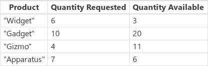

# Функция ForAll в PowerApps
Вычисляет значения и выполняет действия для всех [записей](../working-with-tables.md#records) в [таблице](../working-with-tables.md).

## Описание
Функция **ForAll** вычисляет формулы для всех записей таблицы.  Формула может рассчитать значение и (или) выполнить действия, например изменить данные или работу с подключением.

[!INCLUDE [record-scope](../../../includes/record-scope.md)]

### Возвращаемое значение
Результат каждого вычисления формулы возвращается в таблице в том же порядке, что и во входной таблице.

Если результат формулы — одиночное значение, результирующая таблица будет состоять из одного столбца.  Если результат формулы — запись, результирующая таблица будет содержать записи с теми же столбцами, что и результирующая запись.  

Если результат формулы — *пустое* значение, в результирующей таблице не будет записи для такой входной записи.  В этом случае в результирующей таблице будет меньше записей, чем в исходной.

### Выполнение действия
Формула может содержать функции, выполняющие действия, например изменяющие записи из источника данных с помощью функций **[Patch](function-patch.md)** и **[Collect](function-clear-collect-clearcollect.md)**.  Формула также может вызывать методы при подключении.  Воспользовавшись оператором [**;**, для каждой записи можно выполнить несколько действий](operators.md). Таблицу, к которой применяется функция **ForAll**, изменить невозможно.

При создании формулы следует учитывать, что записи могут обрабатываться в любом порядке и (по возможности) параллельно.  Первая запись таблицы может быть обработана после последней.  Поэтому следует избегать зависимостей от порядка расположения.  По этой причине функции **[UpdateContext](function-updatecontext.md)**, **[Clear](function-clear-collect-clearcollect.md)** и **[ClearCollect](function-clear-collect-clearcollect.md)** нельзя использовать с функцией **ForAll**, поскольку вполне может оказаться, что они применяются для хранения переменных, восприимчивых к такому эффекту.  Вы можете использовать функцию **[Collect](function-clear-collect-clearcollect.md)**, но порядок добавления записей должен быть неопределенным.

Некоторые функции, которые изменяют источники данных, в том числе **Collect**, **Remove** и **Update**, возвращают измененный источник данных в качестве значения.  Такие возвращаемые значения могут оказаться большими, так что, если они используются для каждой записи таблицы **ForAll**, при их обработке могут потребляться значительные ресурсы.  Также может оказаться, что эти возвращенные значения не такие, какими должны быть, поскольку **ForAll** может выполняться параллельно и отделять побочные эффекты этих функций от процесса получения их результатов.  К счастью, если возвращаемое значение **ForAll** фактически не используется, что бывает довольно часто в случае функций изменения данных, то возвращаемое значение не создается, а проблемы, связанные с ресурсами или упорядочением, не возникают.  Но если вы используете результат **ForAll** и одну из функций, возвращающих источник данных, тщательно продумайте структуру результата и сначала испытайте их на небольшом наборе данных.  

### Альтернативные варианты
Многие функции в PowerApps могут обрабатывать несколько значений одновременно, используя таблицу с одним столбцом.  Например, функция **Len**, как и **ForAll**, может обработать таблицу текстовых значений и возвратить таблицу значений длины.  Во многих случаях это избавляет от необходимости использовать функцию **ForAll** и может оказаться эффективнее и удобнее для чтения, чем при ее применении.

Важно также учитывать, что, в отличие от некоторых других функций, например **Filter**, **ForAll** не поддерживает делегирование.  

### Делегирование
[!INCLUDE [delegation-no-one](../../../includes/delegation-no-one.md)]

## Синтаксис
**ForAll**( *Table*, *Formula* )

* *Table* — обязательный аргумент. Это таблица, с которой нужно выполнить действия.
* *Formula* — обязательный аргумент.  Это формула, используемая для вычисления всех записей *Table*.

## Примеры
### Вычисления
В приведенных ниже примерах используется [источник данных](../working-with-data-sources.md) **Squares**.

Для создания этого источника данных как коллекции установите в качестве значения свойства **OnSelect** элемента управления **Кнопка** следующую формулу, перейдите в режим предварительного просмотра и нажмите кнопку.

* **ClearCollect( Squares, [ "1", "4", "9" ] )**

| Формула | Описание | Возвращаемый результат |
| --- | --- | --- |
| **ForAll(&nbsp;Squares, Sqrt(&nbsp;Value&nbsp;)&nbsp;)**  **Sqrt(&nbsp;Squares&nbsp;)** |Для всех записей входной таблицы вычисляется квадратный корень из столбца **Value**.  Функцию **Sqrt** можно также использовать с таблицей, состоящей из одного столбца, благодаря чему в этом примере можно избежать использования **ForAll**. |  |
| **ForAll(&nbsp;Squares, Power(&nbsp;Value,&nbsp;3&nbsp;)&nbsp;)** |Для всех записей входной таблицы значения столбца **Value** возводятся в куб.  Функция **Power** не поддерживает таблицы из одного столбца. Таким образом, в данном случае следует использовать функцию **ForAll**. |  |

### Использование подключения
В приведенных ниже примерах используется [источник данных](../working-with-data-sources.md) **Expressions**.

Для создания этого источника данных как коллекции установите в качестве значения свойства **OnSelect** элемента управления **Кнопка** следующую формулу, перейдите в режим предварительного просмотра и нажмите кнопку.

* **ClearCollect( Expressions, [ "Hello", "Good morning", "Thank you", "Goodbye" ] )**

В этом примере используется также подключение к [Microsoft Translator](../connections/connection-microsoft-translator.md).  Сведения о том, как добавить это подключение в приложение, см. в разделе об [управлении подключениями](../add-manage-connections.md).

| Формула | Описание | Возвращаемый результат |
| --- | --- | --- |
| **ForAll( Expressions, MicrosoftTranslator.Translate( Value, "es" ) )** |Для всех записей в таблице Expressions содержимое столбца **Value** переводится на испанский язык (сокращение «es»). |  |
| **ForAll( Expressions, MicrosoftTranslator.Translate( Value, "fr" ) )** |Для всех записей в таблице Expressions содержимое столбца **Value** переводится на французский язык (сокращение «fr»). |  |

### Копирование таблицы
Иногда требуется фильтровать и сортировать данные, а также формировать их и обрабатывать.  В PowerApps для этого предусмотрен ряд функций, в том числе **Filter**, **AddColumns** и **Sort**.  PowerApps интерпретирует каждую таблицу как значение, что обеспечивает быстрое прохождение формул и удобство использования.      

При этом иногда требуется создать копию такого результата для дальнейшего использования  или переместить сведения из одного источника данных в другой.  В PowerApps предусмотрена функция **Collect** для копирования данных.

Но прежде чем создавать эту копию, хорошо подумайте, действительно ли она необходима.  Многие задачи можно решить путем фильтрации и формирования базового источника данных по запросу с помощью формулы. У копий есть ряд недостатков, в том числе:

* при наличии двух копий одних и тех же сведений одна из них может не синхронизироваться;  
* для создания копии может потребоваться много памяти компьютера, значительная часть полосы пропускания и/или немало времени.  
* Для большинства источников данных копирование нельзя делегировать, поэтому при его использовании количество перемещаемых данных ограничено.      

В приведенных ниже примерах используется [источник данных](../working-with-data-sources.md) **Products**.

Для создания этого источника данных как коллекции установите в качестве значения свойства **OnSelect** элемента управления **Кнопка** следующую формулу, перейдите в режим предварительного просмотра и нажмите кнопку.

* **ClearCollect( Products, Table( { Product: "Widget", 'Quantity Requested': 6, 'Quantity Available': 3 }, { Product: "Gadget", 'Quantity Requested': 10, 'Quantity Available': 20 }, { Product: "Gizmo", 'Quantity Requested': 4, 'Quantity Available': 11 }, { Product: "Apparatus", 'Quantity Requested': 7, 'Quantity Available': 6 } ) )**

Наша задача — обработать производную таблицу, содержащую только товары, для которых запрашиваемое количество превышает доступное и, как следствие, необходимо оформить заказ.

  

Выполнить ее можно двумя различными способами. Оба они дают одинаковый результат, однако у каждого из них есть свои преимущества и недостатки.

#### Формирование таблицы по запросу
Не создавайте копию!  В любом случае можно использовать следующую формулу:

* **ShowColumns( AddColumns( Filter( Products, 'Quantity Requested' > 'Quantity Available' ), "Quantity To Order", 'Quantity Requested' - 'Quantity Available' ), "Product", "Quantity To Order" )**

[Область записи](../working-with-tables.md#record-scope) создается с помощью функций **Filter** и **AddColumns**, которые выполняют сравнение и вычитание, соответственно, для полей **'Quantity Requested'** и **'Quantity Available'** каждой записи.

В этом примере функцию **Filter** можно делегировать.  Это важно, поскольку она может найти все соответствующие условиям товары, даже если это всего несколько записей таблицы, в которой их миллионы.  В настоящее время функции **ShowColumns** и **AddColumns** делегировать нельзя, поэтому фактическое число товаров, которые необходимо заказать, будет ограничено.  Если известно, что размер данного результата всегда будет относительно небольшим, этот способ прекрасно подходит.

Кроме того, поскольку мы не создавали копию, у нас не будет лишних и устаревших копий данных, которыми необходимо управлять.  

#### ForAll по запросу
Другой способ — использовать функцию **ForAll** вместо функций формирования таблицы:

* **ForAll( Products, If( 'Quantity Requested' > 'Quantity Available', { Product: Product, 'Quantity To Order': 'Quantity Requested' - 'Quantity Available' } ) )**

Некоторым людям будет проще прочесть и записать такую формулу.

Ни одна из частей **ForAll** не поддерживает делегирование.  Вычисления выполняются только для первой части таблицы **Products**, что может привести к определенным проблемам, если она очень большая.  Поскольку функцию **Filter** в предыдущем примере можно делегировать, возможно, она лучше подойдет для больших наборов данных.

#### Создание результата в виде коллекции
В некоторых ситуациях может потребоваться копия данных.  Возможно, вам понадобится переместить сведения из одного источника данных в другой.  В этом примере заказы оформляются с помощью таблицы **NewOrder** в системе поставщика.  Для высокоскоростного взаимодействия с пользователем можно предусмотреть кэширование локальной копии таблицы, чтобы избежать задержек не сервере.

Мы используем такой же способ формирования таблицы, как и в предыдущих двух примерах, но сохраним результат в виде коллекции:

* **ClearCollect( NewOrder, ShowColumns( AddColumns( Filter( Products, 'Quantity Requested' > 'Quantity Available' ), "Quantity To Order", 'Quantity Requested' - 'Quantity Available' ), "Product", "Quantity To Order" ) )**
* **ClearCollect( NewOrder, ForAll( Products, If( 'Quantity Requested' > 'Quantity Available', { Product: Product, 'Quantity To Order': 'Quantity Requested' - 'Quantity Available' } ) ) )**

**ClearCollect** и **Collect** делегировать нельзя.  В результате количество данных, которые можно переместить таким образом, ограничено.

#### Выполнение функции Collect в ForAll
Наконец, мы можем выполнить операцию **Collect** непосредственно в функции **ForAll**:

* **Clear( ProductsToOrder ); ForAll( Products, If( 'Quantity Requested' > 'Quantity Available', Collect( NewOrder, { Product: Product, 'Quantity To Order': 'Quantity Requested' - 'Quantity Available' } ) ) )**

Опять же, на данный момент функцию **ForAll** делегировать нельзя.  Если таблица **Products** большая, функция **ForAll** обработает только первый набор записей, и мы можем пропустить некоторые товары, которые необходимо заказать.  Однако если известно, что таблицы будут оставаться небольшими, этот метод прекрасно подходит.

Обратите внимание, что мы не записываем результат функции **ForAll**.  Выполненные из нее вызовы функции **Collect** возвращают источник данных **NewOrder** для всех записей, поэтому если записывать результат, данных может оказаться слишком много.  

