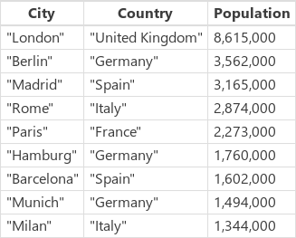
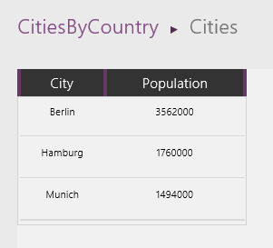
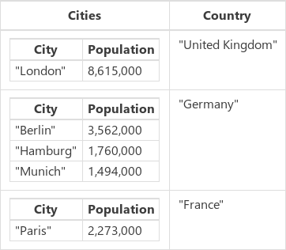
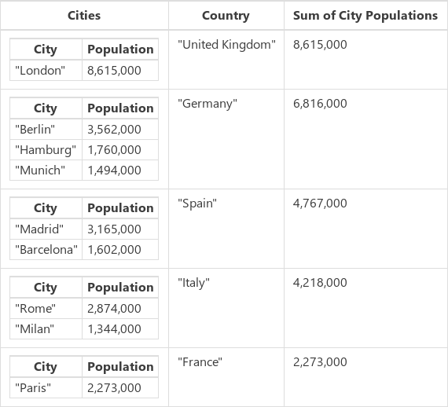

# Функции GroupBy и Ungroup в PowerApps
Эти функции группируют [записи](../working-with-tables.md#records) [таблицы](../working-with-tables.md) и отменяют их группировку.

## Описание
Функция **GroupBy** возвращает таблицу, записи в которой сгруппированы по значениям в одном или нескольких [столбцах](../working-with-tables.md#columns). Записи каждой группы помещаются в одну запись, к которой в новом столбце добавляется вложенная таблица со значениями остальных столбцов.   

Функция **Ungroup** выполняет действие, обратное функции **GroupBy**. Эта функция возвращает таблицу, в которой разделены на отдельные записи все данные, которые могли быть сгруппированы.

Вы можете сгруппировать записи с помощью **GroupBy**, затем изменить полученную таблицу, и разгруппировать записи измененной таблицы с помощью **Ungroup**. Например, так можно удалить некоторую группу записей.

* Выполните функцию **GroupBy**.
* Выполните функцию **[Filter](function-filter-lookup.md)**, чтобы удалить сразу целую группу записей.
* Выполните функцию **Ungroup**.  

Также можно получить статистические данные на основе группирования.

* Выполните функцию **GroupBy**.
* Выполните функцию **[AddColumns](function-table-shaping.md)** вместе с **[Sum](function-aggregates.md)**,  **[Average](function-aggregates.md)** или другими статистическими функциями, чтобы добавить новый столбец со статистическими данными по таблицам групп.
* Выполните функцию **[DropColumns](function-table-shaping.md)**, чтобы удалить таблицы группы.

**Ungroup** старается восстановить исходный порядок записей, в котором они передавались в функцию **GroupBy**.  Иногда это невозможно (например, если исходная таблица содержит *пустые* записи).

Таблица в PowerApps считается значением, как любая строка или число. Вы можете указать таблицу в качестве аргумента для функции, и функция может возвращать таблицу. **GroupBy** и **Ungroup** не изменяют исходную таблицу. Они принимают таблицу в качестве аргумента и возвращают новую таблицу. Подробнее это описано [здесь](../working-with-tables.md).

## Синтаксис
**GroupBy**( *Table*, *ColumnName1* [, *ColumnName2*, ... ], *GroupColumnName* )

* *Table* — обязательный аргумент. Таблица, которую нужно сгруппировать.
* *ColumnName* — обязательный аргумент.  Имена столбцов из таблицы *Table*, по которой следует сгруппировать записи.  Эти столбцы становятся столбцами в итоговой таблице.
* *GroupColumnName* — обязательный аргумент.  Имя столбца для хранения данных, не включенных в столбцы *ColumnName*.
  
    > [!NOTE]
> Для источников данных SharePoint и Excel, содержащих имена столбцов с пробелами, вместо каждого пробела укажите **"\_x0020\_"**. Например, **Имя столбца** укажите как **Имя_x0020_столбца**.

**Ungroup**( *Table*, *GroupColumnName* )

* *Table* — обязательный аргумент. Таблица, которую нужно разгруппировать.
* *GroupColumnName* — обязательный аргумент. Столбец, содержащий данные о записях, созданные функцией **GroupBy**.
  
    > [!NOTE]
> Для источников данных SharePoint и Excel, содержащих имена столбцов с пробелами, вместо каждого пробела укажите **"\_x0020\_"**. Например, **Имя столбца** укажите как **Имя_x0020_столбца**.

## Примеры
### Создание коллекции
1. Добавьте кнопку и задайте для нее свойство **[Text](../controls/properties-core.md)**, чтобы она отображала текст **Исходные данные**.
2. Задайте для свойства **[OnSelect](../controls/properties-core.md)** кнопки **Исходные данные** такую формулу:
   
    **ClearCollect(CityPopulations, {City:"London", Country:"United Kingdom", Population:8615000}, {City:"Berlin", Country:"Germany", Population:3562000}, {City:"Madrid", Country:"Spain", Population:3165000}, {City:"Rome", Country:"Italy", Population:2874000}, {City:"Paris", Country:"France", Population:2273000}, {City:"Hamburg", Country:"Germany", Population:1760000}, {City:"Barcelona", Country:"Spain", Population:1602000}, {City:"Munich", Country:"Germany", Population:1494000}, {City:"Milan", Country:"Italy", Population:1344000})**
3. Нажмите клавишу F5, нажмите кнопку **Исходные данные**, затем нажмите клавишу ESC.
   
    Вы только что создали [коллекцию](../working-with-data-sources.md#collections) с именем **CityPopulations**, которая содержит такие данные:
   
    
4. Чтобы отобразить эту коллекцию, выберите пункт **Коллекции** в меню **Файл**, затем выберите коллекцию **CityPopulations**.  Отображаются первые пять записей из этой коллекции:
   
    

### Записи группы
1. Добавьте еще одну кнопку и задайте для ее свойства **[Text](../controls/properties-core.md)** значение **Группировка**.
2. Задайте для свойства **[OnSelect](../controls/properties-core.md)** этой кнопки такую формулу:
   
    **ClearCollect( CitiesByCountry, GroupBy( CityPopulations, "Country", "Cities" ) )**
3. Нажмите клавишу F5, нажмите кнопку **Группировка**, затем нажмите клавишу ESC.
   
    Вы только что создали коллекцию с именем **CitiesByCountry**, в которой записи из предыдущей коллекции сгруппированы по столбцу **Country**.
   
    
4. Чтобы отобразить первые пять записей из этой коллекции, выберите пункт **Коллекции** в меню **Файл**.
   
    
5. Чтобы отобразить население городов одной страны, выберите значок таблицы в столбце **Cities** для строки с этой страной, например, Germany (Германия):
   
    

### Фильтрация и разгруппировка записей
1. Добавьте еще одну кнопку и задайте для нее свойство **[Text](../controls/properties-core.md)**, чтобы она отображала текст **Фильтрация**.
2. Задайте для свойства **[OnSelect](../controls/properties-core.md)** этой кнопки такую формулу:
   
    **ClearCollect( CitiesByCountryFiltered, Filter( CitiesByCountry, "e" in Country ) )**
3. Нажмите клавишу F5, нажмите новую кнопку, затем нажмите клавишу ESC.
   
    Вы только что создали третью коллекцию с именем **CitiesByCountryFiltered**, которая включает те страны, в имени которых есть буква "e" (мы исключили, например, Испанию (Spain) и Италию (Italy)).
   
    
4. Добавьте еще одну кнопку и задайте для нее свойство **[Text](../controls/properties-core.md)**, чтобы она отображала текст **Разгруппировка**.
5. Задайте для свойства **[OnSelect](../controls/properties-core.md)** этой кнопки такую формулу:
   
    **ClearCollect( CityPopulationsUngrouped, Ungroup( CitiesByCountryFiltered, "Cities" ) )**
   
    Вы получите такой результат:
   
    

### Статистическая обработка результатов
Мы можем применить сгруппированную таблицу еще и для статистической обработки результатов.  В этом примере мы просуммируем население крупнейших городов в каждой стране.

1. Добавьте еще одну кнопку и задайте для нее свойство **[Text](../controls/properties-core.md)**, чтобы она отображала текст **Сумма**.
2. Задайте для свойства **[OnSelect](../controls/properties-core.md)** кнопки **Сумма** эту формулу:
   
    **ClearCollect( CityPopulationsSum, AddColumns( CitiesByCountry, "Sum of City Populations", Sum( Cities, Population ) ) )**
   
    Вы получите такой результат:
   
    
   
    Функция **[AddColumns](function-table-shaping.md)** принимает базовую коллекцию **CitiesByCountry** и добавляет к ней новый столбец **Sum of City Populations**.  Значения для этого столбца вычисляются отдельно для каждой строки по формуле **Sum( Cities, Population )**.  **AddColumns** предоставляет значение (таблицу) для столбца **Cities** в каждой строке, а затем функция **[Sum](function-aggregates.md)** суммирует значения **Population** из каждой строки этой вложенной таблицы.
3. Теперь мы получили нужную сумму и можем удалить вложенные таблицы с помощью функции **[DropColumns](function-table-shaping.md)**.  Измените значение свойства **[OnSelect](../controls/properties-core.md)** на следующую формулу:
   
    **ClearCollect( CityPopulationsSumOnly, DropColumns( CityPopulationsSum, "Cities" ) )**
   
    Вы получите такой результат:
   
    
   
    Обратите внимание, что мы обошлись без разгруппировки этой таблицы.

