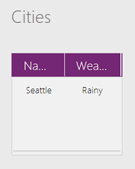

# Функции Blank, Coalesce, IsBlank и IsEmpty в PowerApps
Эти функции позволяют проверить, является ли значение пустым и отсутствуют ли в [таблице](../working-with-tables.md) [записи](../working-with-tables.md#records), а также позволяют создавать *пустые* значения.

## Обзор
*Пустое значение* — это заполнитель, который применяется, если значение отсутствует или неизвестно. Элемент управления **[Текстовое поле](../controls/control-text-input.md)** считается *пустым*, если пользователь не ввел в него никакие символы. Этот элемент управления перестает быть *пустым*, как только пользователь вводит в него символы.  Некоторые источники данных могут хранить и возвращать значения NULL, которые в PowerApps рассматриваются как *пустые*.

> [!NOTE]
> Сейчас *пустые* значения можно хранить только в локальных коллекциях. Мы знаем, что многие источники данных поддерживают *пустые* значения (NULL), и мы работаем над устранением этого ограничения.

Любое свойство или вычисленное значение может быть *пустым*.  Например, логическое значение обычно принимает одно из двух значений: **true** или **false**.  Оно также может быть *пустым*.  Это аналогично Microsoft Excel, где в начале работы ячейки листа пустые, но помимо других могут также содержать значения **true** или **false**. Содержимое ячейки в любое время может быть удалено, после чего она снова станет *пустой*.

Состояние *пусто* имеют те таблицы, которые не содержат ни одной записи. Структура таблицы может быть неповрежденной, таблица может содержать имена [столбцов](../working-with-tables.md#columns), но при этом не содержать каких-либо данных. Таблица может быть изначально пустой, перестать быть пустой по мере заполнения данными, а затем снова стать пустой, после того как данные будут удалены.

## Описание
Функция **Blank** возвращает *пустое* значение. Используйте эту функцию, чтобы сохранить значение NULL в источнике данных, который поддерживает эти значения, и удалить все значения из этого поля.

Функция **IsBlank** проверяет на наличие *пустого* значения. *Пустые* значения могут быть обнаружены в следующих ситуациях:

* Значение, возвращенное после выполнения функции **Blank**.
* Не настроена формула для свойства элемента управления.
* Значение не ввели в элемент управления "Текстовое поле" или не выбрали из списка. Функцию **IsBlank** можно использовать для уведомления о том, что поле является обязательным.
* Строка, которая не содержит символы, имеет для функции **[Len](function-len.md)** значение 0.
* В функции произошла ошибка. Часто один из аргументов функции недопустимый. Многие функции возвращают *пустое* значение при *пустом* значении аргумента.
* Подключенные [источники данных](../working-with-data-sources.md), такие как SQL Server, могут использовать нулевые значения. В PowerApps такие значения отображаются как *пустые*.
* Если часть *еlse* функции **[If](function-if.md)** не указана, а все условия вернули значение **false**.
* Вы использовали функцию **[Update](function-update-updateif.md)**, но не указали значение для всех столбцов. В результате в столбцах, которые не были указаны, не добавлены значения.

Функция **Coalesce** поочередно оценивает аргументы и возвращает первое значение, не являющееся *пустым*.  Используйте эту функцию, чтобы заменить *пустое* значение другим, оставив значения, не являющиеся *пустыми*, без изменений.  Если все аргументы являются *пустыми*, функция возвращает *пустое значение*.  Все аргументы для **Coalesce** должны относиться к одному типу. Например, нельзя комбинировать числа с текстовыми строками.  **Coalesce( value1, value2 )** является сокращенным эквивалентом **If( Not( IsBlank( value1 ) ), value1, value2 )** и не требует повторной оценки **value1**.  

Функция **IsEmpty** проверяет, содержит ли таблица какие-либо записи. Это аналогично использованию функции **[CountRows](function-table-counts.md)** и проверке на наличие нулевых значений. Чтобы проверить на наличие ошибок источника данных, можно использовать функцию **IsEmpty** вместе с функцией **[Errors](function-errors.md)**.

Для функций **IsBlank** и **IsEmpty** возвращается логическое значение: **true** или **false**.

## Синтаксис
**Blank**()

**Coalesce**( *Value1* [, *Value2*, ... ] )

* Значения *Value* — обязательные аргументы. Проверяемые значения.  Все значения оцениваются поочередно, пока не будет найдено значение, не являющееся *пустым*.  Значения после первого значения, не являющегося *пустым*, не оцениваются.  

**IsBlank**( *Value* )

* *Value* — обязательный аргумент. Значение для проверки.

**IsEmpty**( *Table* )

* *Table* — обязательный аргумент. Таблица для проверки записей.

## Примеры
### Функция Blank
> [!NOTE]
> Сейчас следующий пример работает только для локальных коллекций.  Мы знаем, что многие источники данных поддерживают *пустые* значения (NULL), и мы работаем над устранением этого ограничения.

1. Создайте приложение с нуля и добавьте элемент управления **Кнопка**.
2. Задайте для свойства кнопки **[OnSelect](../controls/properties-core.md)** эту формулу:

    **ClearCollect( Cities, { Name: "Seattle", Weather: "Rainy" } )**
3. Просмотрите приложение, нажмите добавленную кнопку, а затем закройте режим предварительного просмотра.  
4. В меню **Файл** щелкните или коснитесь **Коллекции**.

     После этого отобразится коллекция **Cities** с записями Seattle и Rainy:

    
5. Нажмите кнопку со стрелкой "Назад", чтобы вернуться в рабочую область по умолчанию.
6. Добавьте элемент управления **Метка** и задайте в качестве значения свойства **Text** следующую формулу:

    **IsBlank( First( Cities ).Weather )**

    Метка отображает значение **false**, так как поле **Weather** содержит значение (Rainy).
7. Добавьте вторую кнопку и задайте в качестве значения свойства **OnSelect** следующую формулу:

    **Patch( Cities, First( Cities ), { Weather: Blank() } )**
8. Просмотрите приложение, нажмите добавленную кнопку, а затем закройте режим предварительного просмотра.  

    Из поля **Weather** первой записи в коллекции **Cities** удалили Rainy, в результате чего оно стало *пустым*.

    

    Метка отображает значение **true**, так как в поле **Weather** отсутствует значение.

### Coalesce

| Формула | Описание | Возвращаемый результат |
| --- | --- | --- |
| **Coalesce( Blank(), 1 )** |Проверяет возвращаемое функцией **Blank** значение (всегда *пустое*). Так как первый аргумент является *пустым*, оценка продолжается для следующего аргумента, пока не будет найдено значение, не являющееся *пустым*. |**1** |
| **Coalesce( Blank(), Blank(), Blank(), Blank(), 2, 3 )** |Функция **Coalesce** запускается с начала списка аргументов и поочередно оценивает каждый аргумент, пока не будет найдено значение, не являющееся *пустым*.  В этом случае все первые четыре аргумента возвращаются *пустыми*, поэтому оценка продолжается до пятого аргумента. Пятый аргумент не является *пустым*, поэтому оценка прекращается. Возвращается значение пятого аргумента, а шестой аргумент не оценивается. |**2** |

### IsBlank
1. Создайте приложение с нуля, добавьте элемент управления "Текстовое поле" и назовите его **FirstName**.
2. Добавьте метку и установите в ее свойстве **[Text](../controls/properties-core.md)** формулу:

    **If( IsBlank( FirstName.Text ), "Это обязательное поле." )**

    По умолчанию свойство элемента управления "Текстовое поле" **[Text](../controls/properties-core.md)** имеет значение **Text input**. Так как свойство содержит значение, оно не пустое и метка не отображает никакие сообщения.
3. Удалите все символы из элемента управления "Текстовое поле", в том числе пробелы.

    Так как свойство **[Text](../controls/properties-core.md)** больше не содержит символы, оно *пустое* и **IsBlank( FirstName.Text )** будет иметь значение **true**. Отобразится сообщение "Обязательное поле".

Сведения о выполнении проверки с помощью других средств см. в статьях **[Функция Validate в Microsoft PowerApps](function-validate.md)** и [Общие сведения об источниках данных в PowerApps](../working-with-data-sources.md).  

Другие примеры:

| Формула | Описание | Возвращаемый результат |
| --- | --- | --- |
| **IsBlank( Blank() )** |Проверяет возвращаемое функцией **Blank** значение (всегда *пустое*). |**true** |
| **IsBlank( "" )** |Строка, которая не содержит символы. |**true** |
| **IsBlank( "Hello" )** |Строка, содержащая один или несколько символов. |**false** |
| **IsBlank( *AnyCollection* )** |Так как [коллекция](../working-with-data-sources.md#collections) существует, она не считается пустой, даже если не содержит ни одной записи. Чтобы проверить наличие пустой коллекции, используйте функцию **IsEmpty**. |**false** |
| **IsBlank( Mid( "Hello", 17, 2 ) )** |Начальный символ для **[Mid](function-left-mid-right.md)** выходит за пределы строки.  Результатом является пустая строка. |**true** |
| **IsBlank( If( false, false ) )** |Функция **[If](function-if.md)** без *ElseResult*.  Так как условие всегда имеет значение **false**, **[If](function-if.md)** всегда возвращает *пустое значение*. |**true** |

### IsEmpty
1. Создайте приложение с нуля и добавьте элемент управления **Кнопка**.
2. Задайте для свойства кнопки **[OnSelect](../controls/properties-core.md)** эту формулу:

    **Collect( IceCream, { Flavor: "Strawberry", Quantity: 300 }, { Flavor: "Chocolate", Quantity: 100 } )**
3. Просмотрите приложение, нажмите добавленную кнопку, а затем закройте режим предварительного просмотра.  

    Создается коллекция с именем **IceCream**, в которой содержатся такие данные:

    

    Эта коллекция имеет две записи и не является пустой. **IsEmpty (IceCream)** возвращает значение **false**, а **CountRows (IceCream)** возвращает **2**.
4. Добавьте вторую кнопку и задайте в качестве значения свойства **[OnSelect](../controls/properties-core.md)** следующую формулу:

    **Clear( IceCream )**
5. Просмотрите приложение, нажмите вторую кнопку, а затем закройте режим предварительного просмотра.  

    Теперь коллекция пуста:

    

    Функция **[Clear](function-clear-collect-clearcollect.md)** удаляет все записи из коллекции, в результате чего коллекция становится пустой. **IsEmpty (IceCream)** возвращает значение **true**, а **CountRows (IceCream)** возвращает **0**.

**IsEmpty** можно также использовать, чтобы проверить, является ли вычисляемая таблица пустой, как показано в примерах ниже.

| Формула | Описание | Возвращаемый результат |
| --- | --- | --- |
| **IsEmpty( [&nbsp;1,&nbsp;2,&nbsp;3 ] )** |Таблица с одним столбцом содержит три записи, а значит, не является пустой. |**false** |
| **IsEmpty( [&nbsp;] )** |Таблица с одним столбцом не содержит записей, а значит, является пустой. |**true** |
| **IsEmpty( Filter( [&nbsp;1,&nbsp;2,&nbsp;3&nbsp;], Value > 5 ) )** |Таблица с одним столбцом не содержит значений, превышающих 5.  В результате фильтр не обнаруживает подходящие записи и остается пустым. |**true** |

