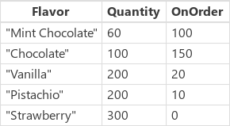
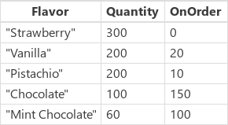

# Функции Sort и SortByColumns в PowerApps
Сортировка [таблицы](../working-with-tables.md).

## Описание
Функция **Sort** сортирует таблицу по заданной формуле.  

Формула вычисляется для каждой [записи](../working-with-tables.md#records) этой таблицы, и полученные результаты используются для сортировки таблицы.  Формула должна возвращать число, строку или логическое значение, но не таблицу и не запись.

[!INCLUDE [record-scope](../../../includes/record-scope.md)]

Чтобы сортировать таблицу сначала по одному столбцу, а затем по другому, используйте вложенные формулы **Sort**. Например, следующая формула отсортирует таблицу **Contacts** сначала по столбцу **LastName**, а затем по столбцу **FirstName**: **Sort( Sort( Contacts, LastName ), FirstName )**

Функцию **SortByColumns** также можно использовать для сортировки таблицы по одному или нескольким столбцам.

В списке параметров функции **SortByColumns** передаются имена столбцов для сортировки и порядок сортировки по каждому из них.  Сортировка выполняется в порядке указания параметров (сначала по первому столбцу, затем по второму и т. д).  Имена столбцов, определяемые в строковом формате, должны быть заключены в двойные кавычки, будучи напрямую внесенными в список параметров.  Например: **SortByColumns (CustomerTable, "LastName")**.

Вы можете объединить функцию **SortByColumns** с **[раскрывающимся списком](../controls/control-drop-down.md)** или **[списком](../controls/control-list-box.md)**, чтобы пользователи могли сами выбрать столбцы для сортировки.

Кроме сортировки по возрастанию или убыванию, функция **SortByColumns** позволяет сортировать по списку значений, внесенному в таблицу с одним столбцом.  Например, можно отсортировать записи по названиям дня недели, указав порядок сортировки **[ "Monday", "Tuesday", "Wednesday", "Thursday", "Friday", "Saturday", "Sunday" ]**.  Тогда первыми будут расположены все записи за **понедельник**, за ними все записи за **вторник**, и т. д.  Все записи, значения столбца в которых не будут найдены в таблице сортировки, помещаются в конец отсортированного списка.

[Таблицы](../working-with-tables.md) в PowerApps представлены значением, как любая строка или число.  Их можно передавать в функции и получать в качестве результата выполнения функций.  **Sort** и **SortByColumn** не изменяют исходную таблицу, а принимают ее в качестве аргумента и возвращают новую отсортированную таблицу.  Подробнее это описано [здесь](../working-with-tables.md).

[!INCLUDE [delegation](../../../includes/delegation.md)]

## Синтаксис
**Sort**( *Table*, *Formula* [, *SortOrder* ] )

* *Table* — обязательный аргумент. Таблица для сортировки.
* *Formula* — обязательный аргумент. Эта формула вычисляется для каждой записи таблицы, и полученные результаты используются для сортировки таблицы.  Можно ссылаться на любые столбцы в таблице.
* *SortOrder* — необязательный аргумент. Если задать **SortOrder.Descending**, таблица будет отсортирована в порядке убывания. По умолчанию используется значение **SortOrder.Ascending**.

**SortByColumns**( *Table*, *ColumnName1* [, *SortOrder1*, *ColumnName2*, *SortOrder2*, ... ] )

* *Table* — обязательный аргумент. Таблица для сортировки.
* *ColumnName* — обязательный аргумент. Имена столбцов для сортировки в строковом формате.
* *SortOrder* — необязательный аргумент.  Допускаются значения **SortOrder.Ascending** или **SortOrder.Descending**.  По умолчанию используется **SortOrder.Ascending**.  Если передаются несколько значений *ColumnName*, то для всех столбцов, кроме последнего, необходимо указать *SortOrder*.
  
    > [!NOTE]
  > Для источников данных SharePoint и Excel, содержащих имена столбцов с пробелами, вместо каждого пробела укажите **"\_x0020\_"**. Например, **Имя столбца** укажите как **Имя_x0020_столбца**.

**SortByColumns**( *Table*, *ColumnName*, *SortOrderTable* )

* *Table* — обязательный аргумент. Таблица для сортировки.
* *ColumnName* — обязательный аргумент. Имя столбца для сортировки в строковом формате.
* *SortOrderTable* — обязательный аргумент.  Таблица c одним столбцом, содержащая значения для сортировки.
  
    > [!NOTE]
  > Для источников данных SharePoint и Excel, содержащих имена столбцов с пробелами, вместо каждого пробела укажите **"\_x0020\_"**. Например, **Имя столбца** укажите как **Имя_x0020_столбца**.

## Примеры
В следующих примерах мы будем использовать [источник данных](../working-with-data-sources.md) **IceCream**, который содержит данные в виде такой таблицы:

| Формула | Описание | Возвращаемый результат |
| --- | --- | --- |
| **Sort( IceCream, Flavor )**  **SortByColumns( IceCream, "Flavor" )** |Сортирует **IceCream** по столбцу **Flavor**. Столбец **Flavor** содержит строковые данные, поэтому таблица сортируется в алфавитном порядке. По умолчанию используется порядок сортировки по возрастанию. |  |
| **Sort( IceCream, Quantity )**  **SortByColumns( IceCream, "Quantity" )** |Сортирует **IceCream** по столбцу **Quantity**.  Столбец **Quantity** содержит числовые данные, поэтому таблица сортируется по числовым значениям.  По умолчанию используется порядок сортировки по возрастанию. | |
| **Sort( IceCream, Quantity, SortOrder.Descending )**  **SortByColumns( IceCream, "Quantity", SortOrder.Descending )** |Сортирует **IceCream** по столбцу **Quantity**.  Столбец **Quantity** содержит числовые данные, поэтому сортировка выполняется по числовым значениям.  Указан порядок сортировки по убыванию. | |
| **Sort( IceCream, Quantity + OnOrder )** |Сортирует **IceCream** по сумме столбцов **Quantity** и **OnOrder**, которая вычисляется отдельно для каждой записи. При суммировании мы получаем числовые данные, поэтому таблица сортируется по числовым значениям.  По умолчанию используется порядок сортировки по возрастанию.  Так как записи сортируются по формуле, а не по прямым значениям столбцов, для этого примера нет аналога с использованием функции **SortByColumns**. | |
| **Sort( Sort( IceCream, OnOrder ), Quantity )**  **SortByColumns( IceCream, "OnOrder", Ascending, "Quantity", Ascending )** |Сортирует **IceCream** сначала по столбцу **OnOrder**, а затем по столбцу **Quantity**.  Обратите внимание, что строка "Pistachio" оказалась выше строки "Vanilla" при сортировке по столбцу **OnOrder**, а затем они заняли места рядом в соответствии со значениями в столбце **Quantity**. | |
| **SortByColumns( IceCream, "Flavor", [&nbsp;"Pistachio",&nbsp;"Strawberry"&nbsp;] )** |Сортирует **IceCream** по столбцу **Flavor** на основе таблицы с одним столбцом, содержащей значения "Pistachio" и "Strawberry".  Записи, в которых столбец **Flavor** имеет значения "Pistachio", будут отображаться в результате первыми, а за ними — записи со значением "Strawberry".  Все записи со значениями столбца **Flavor**, не входящими в этот список, например "Vanilla", будут отображаться после записей, для которых найдены совпадения. | |

### Шаг за шагом
Чтобы самостоятельно выполнить эти примеры, создайте источник данных **IceCream** в виде [коллекции](../working-with-data-sources.md#collections) следующим образом.

1. Добавьте кнопку и задайте следующую формулу в качестве значения свойства **[OnSelect](../controls/properties-core.md)**: **ClearCollect( IceCream, { Flavor: "Chocolate", Quantity: 100, OnOrder: 150 }, { Flavor: "Vanilla", Quantity: 200, OnOrder: 20 }, { Flavor: "Strawberry", Quantity: 300, OnOrder: 0 }, { Flavor: "Mint Chocolate", Quantity: 60, OnOrder: 100 }, { Flavor: "Pistachio", Quantity: 200, OnOrder: 10 } )**
2. Откройте предварительный просмотр приложения, нажмите эту кнопку, затем нажмите клавишу Esc, чтобы вернуться в рабочую область по умолчанию.
3. Выберите пункт **Коллекции** в меню **Файл**, чтобы отобразить только что созданную коллекцию, затем нажмите клавишу Esc, чтобы вернуться в рабочую область по умолчанию.

#### Сортировать
1. Добавьте еще одну кнопку и задайте следующую формулу в качестве значения свойства **[OnSelect](../controls/properties-core.md)**: 
   **ClearCollect( SortByFlavor, Sort( IceCream, Flavor ) )**
   
     Указанная выше формула создает вторую коллекцию с именем **SortByFlavor**, все данные в которой будут совпадать с данными из коллекции **Ice Cream**. Но в этой новой коллекции данные отсортированы по возрастанию в алфавитном порядке по значениям столбца **Flavor**.
2. Нажмите клавишу F5, нажмите новую кнопку, затем нажмите клавишу ESC.
3. Выберите пункт **Коллекции** в меню **Файл**, чтобы отобразить обе коллекции, затем нажмите клавишу ESC, чтобы вернуться в рабочую область по умолчанию.
4. Повторите последние три шага, указывая новые имена для создаваемых коллекций и формулы для функции **Sort**, используя примеры из приведенной выше таблицы.

#### SortByColumns
1. Добавьте еще одну кнопку и задайте следующую формулу в качестве значения свойства **[OnSelect](../controls/properties-core.md)**: 
   **ClearCollect( SortByQuantity, SortByColumns( IceCream, "Quantity", Ascending, "Flavor", Descending ) )**
   
     Указанная выше формула создает третью коллекцию с именем **SortByQuantity**, все данные в которой будут совпадать с данными из коллекции **Ice Cream**. Но в этой новой коллекции данные будут отсортированы по числовым значениям столбца **Quanity** в порядке возрастания, а затем по значениям столбца **Flavor** в порядке убывания.
2. Нажмите клавишу F5, нажмите новую кнопку, затем нажмите клавишу ESC.
3. Выберите пункт **Коллекции** в меню **Файл**, чтобы отобразить все три коллекции, затем нажмите клавишу ESC, чтобы вернуться в рабочую область по умолчанию.
4. Повторите последние три шага, указывая новые имена для создаваемых коллекций и формулы для функции **SortByColumns**, используя примеры из приведенной выше таблицы.

