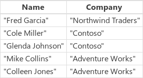
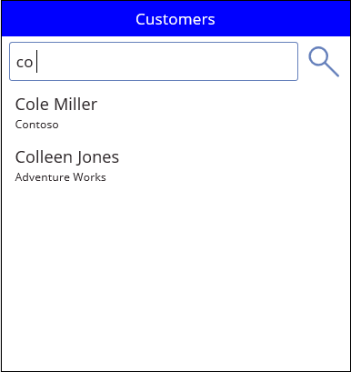

# Функции EndsWith и StartsWith в PowerApps
Эти функции проверяют, есть ли в начале или в конце одной текстовой строки другая текстовая строка.

## Описание
Функция **EndsWith** проверяет, заканчивается ли одна текстовая строка другой.

Функция **StartsWith** проверяет, начинается ли одна текстовая строка с другой.    

При проверке для обеих функций регистр не учитывается.  Обе функции возвращают логическое значение **true** или **false**.  

С помощью функций **EndsWith** и **StartsWith** в сочетании с функцией **[Filter](function-filter-lookup.md)** можно искать данные в приложении. Кроме того, для поиска значений в любом месте текстовых строк (а не только в начале или конце) можно использовать оператор **[in](operators.md#in-and-exactin-operators)** или функцию **[Search](function-filter-lookup.md)**.  Выбор функции зависит от потребностей приложения и от того, какую функцию можно [делегировать](../delegation-overview.md) для конкретного источника данных.  Если какую-либо из этих функций нельзя делегировать, на этапе создания рядом с ней появится синяя точка.

## Синтаксис
**EndsWith**( *Text*, *EndText* )

* *текст* — обязательный аргумент.  Проверяемый текст.
* *EndText* — обязательный аргумент.  Текст, который нужно найти в конце аргумента *Text*.  Если *EndText* является пустой строкой, функция **EndsWith** возвращает значение *true*.

**StartsWith**(*текст*, *начальный_текст*)

* *текст* — обязательный аргумент.  Проверяемый текст.
* *начальный_текст* — обязательный аргумент.  Текст, который нужно найти в начале аргумента *текст*.  Если *начальный_текст* — пустая строка, функция **StartsWith** возвращает значение *true*.

## Примеры
| Формула | Описание | Возвращаемый результат |
| --- | --- | --- |
| **EndsWith( "Hello World", "world" )** |Проверяет, заканчивается ли строка **Hello World** словом **world**.  При проверке регистр не учитывается. |**true** |
| **EndsWith( "Good bye", "good" )** |Проверяет, заканчивается ли строка **Good bye** словом **good**.  Аргумент *EndText* (**good**) есть в тексте, но не в конце строки. |**false** |
| **EndsWith( "Always say hello", "hello" )** |Проверяет, заканчивается ли строка **Always say hello** словом **hello**. |**true** |
| **Endswith( "Bye bye", "" )** |Проверяет, заканчивается ли текст **Bye bye** пустой текстовой строкой (**Len** возвращает значение 0).  В этом случае для функции **EndsWith** определен возврат значения **true**, что упрощает ее использование в выражениях **Filter**. |**true** |

| Формула | Описание | Возвращаемый результат |
| --- | --- | --- |
| **StartsWith("Hello World", "hello")** |Проверяет, начинается ли строка **"Hello World"** со строки **"hello"**.  При проверке регистр не учитывается. |**true** |
| **StartsWith("Good bye", "hello")** |Проверяет, начинается ли строка **"Good bye"** с **"hello"**. |**false** |
| **StartsWith("Always say hello", "hello")** |Проверяет, начинается ли строка **"Always say hello"** с **"hello"**.  Хотя текст **"hello"** есть в исходной строке, он расположен не в начале. |**false** |
| **StartsWith( "Bye bye", "" )** |Проверяет, начинается ли текст **Bye bye** с пустой текстовой строки (**Len** возвращает значение 0).  В этом случае для функции **StartsWith** определен возврат значения **true**, что упрощает ее использование в выражениях **Filter**. |**true** |

### Оптимизация поиска
В большинстве приложений вы можете ввести один или несколько символов в текстовом поле, чтобы отфильтровать список в большом наборе данных. При вводе в списке отображаются только те записи, которые соответствуют заданным условиям поиска.

Примеры, приведенные в остальной части статьи, — это результаты поиска в списке **Customers**, содержащем указанные ниже данные.

Чтобы создать этот источник данных в виде коллекции, создайте элемент управления **[Button](../controls/control-button.md)** (Кнопка) и задайте в качестве значения свойства **OnSelect** следующую формулу:

**ClearCollect(Customers, Table({Name: "Fred Garcia", Company: "Northwind Traders"}, {Name: "Cole Miller", Company: "Contoso"}, {Name: "Glenda Johnson", Company: "Contoso"}, {Name: "Mike Collins", Company: "Adventure Works"}, {Name: "Colleen Jones", Company: "Adventure Works"}))**

Как показано в этом примере, вы можете вывести список записей в элемент управления [**Gallery**](../controls/control-gallery.md) (Коллекция) в нижней части экрана. В верхней части экрана можно добавить элемент управления для [**Text input**](../controls/control-text-input.md) (Текстовое поле ввода) под названием **SearchInput**, что позволит пользователям указывать интересующие их записи.

При вводе символов в текстовом поле **SearchInput** результаты в коллекции автоматически фильтруются. В этом случае в коллекции будут отображаться записи, где имена клиентов (не названия компаний) начинаются с последовательности символов, указанных в текстовом поле **SearchInput**. Если пользователь введет в поле поиска **co**, в коллекции отобразятся следующие результаты:

Чтобы выполнить фильтрацию результатов по столбцу **Name**, задайте в качестве значения свойства **Items** элемента управления "Коллекция" одну из этих формул:

| Формула | Описание | Возвращаемый результат |
| --- | --- | --- |
| **Filter(Customers, StartsWith(Name, SearchInput.Text))** |Фильтрует источник данных **Customers** по записям, в которых искомая строка находится в начале столбца **Name**. При проверке регистр не учитывается. Если пользователь введет в поле поиска **co**, в коллекции отобразятся следующие результаты: **Colleen Jones** и **Cole Miller**. В этом случае значение **Mike Collins** не отобразится, так как в столбце **Name** запись не начинается с искомой строки. |  |
| **Filter(Customers, SearchInput.Text in Name)** |Фильтрует источник данных **Customers** по записям, в которых искомая строка находится в любом положении в столбце **Name**. При проверке регистр не учитывается. Если пользователь введет в поле поиска **co**, в коллекции отобразятся следующие результаты: **Colleen Jones**, **Cole Miller** и **Mike Collins**. Это связано с тем, что записи столбца **Name** содержат искомую строку (в любом положении). |  |
| **Search(Customers, SearchInput.Text, "Name")** |Как и при использовании оператора **in**, функция **Search** выполняет поиск соответствий во всех положениях записей в столбце **Name**. Обратите внимание, что имя столбца необходимо заключить в двойные кавычки. |  |

Вы можете расширить область поиска, добавив столбец **Company** и **Name**.

| Формула | Описание | Возвращаемый результат |
| --- | --- | --- |
| **Filter(Customers, StartsWith(Name, SearchInput.Text) &#124;&#124; StartsWith(Company, SearchInput.Text))** |Фильтрует источник данных **Customers** по записям, в которых записи в столбце **Name** или **Company** начинаются со строки поиска (например, **co**).  Если функция **StartsWith** возвращает значение *true*, [оператор **&#124;&#124;**](operators.md) также возвращает значение *true*. |  |
| **Filter(Customers, SearchInput.Text in Name &#124;&#124; SearchInput.Text in Company)** |Фильтрует источник данных **Customers** по записям, в которых искомая строка (например, **co**) находится в любом положении в столбце **Name** или **Company**. |  |
| **Search(Customers, SearchInput.Text, "Name", "Company")** |Как и при использовании оператора **in**, функция **Search** ищет в источнике данных **Customers** записи, в которых искомая строка (например, **co**) находится в любом положении в столбце **Name** или **Company**. В отличие от функции **Filter**, функцию **Search** проще записывать и читать. Это следует учитывать, если вы хотите указать несколько столбцов и операторов **in**. Обратите внимание, что имена столбцов необходимо заключать в двойные кавычки. |  |

