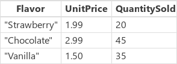
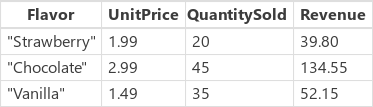
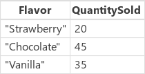

# Функции AddColumns, DropColumns, RenameColumns и ShowColumns в Microsoft PowerApps
Изменение формата [таблицы](../working-with-tables.md) путем добавления, удаления, переименования и выбора ее [столбцов](../working-with-tables.md#columns).

## Обзор
С помощью этих функций вы можете изменить таблицу и настройки ее столбцов.

* Сократите до одного столбца таблицу, состоящую из нескольких столбцов, чтобы использовать ее в функции, принимающей один столбец, например **[Lower](function-lower-upper-proper.md)** или **[Abs](function-numericals.md)**.  
* Добавьте в таблицу вычисляемый столбец (например, столбец **Общая цена** с результатами умножения значений из столбцов **Количество** и **Цена за единицу**).
* Переименуйте столбец, чтобы его имя было более понятным в представлениях для пользователей или в формулах.

Таблица в PowerApps считается значением, как любая строка или число.  Таблицы можно использовать в качестве аргумента формулы, и функции могут возвращать таблицу. Функции, которые описаны в этом разделе, не изменяют входную таблицу. Они принимают таблицу в качестве аргумента и возвращают новую таблицу, применив к ней запрошенное преобразование.  Подробнее это описано [здесь](../working-with-tables.md).  

Вы не можете с помощью этих функций изменять столбцы [источника данных](../working-with-data-sources.md). Такие данные следует изменять прямо в источнике данных. Вы можете добавить столбцы к [коллекции](../working-with-data-sources.md#collections) с помощью функции **[Collect](function-clear-collect-clearcollect.md)**.  Подробнее это описано [здесь](../working-with-data-sources.md).  

## Описание
Функция **AddColumns** добавляет столбец к таблице и с помощью формулы определяет значения для этого столбца. Существующие столбцы сохраняются без изменений.

Формула вычисляется отдельно для каждой записи этой таблицы.
[!INCLUDE [record-scope](../../../includes/record-scope.md)]

Функция **DropColumns** исключает столбцы из таблицы.  Все остальные столбцы сохраняются без изменений. **DropColumns** исключает столбцы, а **ShowColumns** включает новые столбцы.

Функция **RenameColumns** изменяет имя столбца в таблице. Все остальные столбцы сохраняют первоначальные имена.

Функция **ShowColumns** включает в результат указанные столбцы таблицы и удаляет все остальные. Функцию **ShowColumns** можно использовать для выделения одного столбца из таблицы с несколькими столбцами.  **ShowColumns** включает столбцы, а **DropColumns** исключает столбцы.  

Все эти функции возвращают новую таблицу, к которой применено соответствующее преобразование.  Исходная таблица сохраняется без изменений.

[!INCLUDE [delegation-no](../../../includes/delegation-no.md)]

## Синтаксис
**AddColumns**( *Table*, *ColumnName1*, *Formula1* [, *ColumnName2*, *Formula2*, ... ] )

* *Table* — обязательный аргумент.  Таблица, для которой выполняется операция.
* *ColumnName* — обязательный аргумент. Имена столбцов для добавления.  Этот аргумент принимает строку (например, **"Name"** в двойных кавычках).
* *Formula(s)* — обязательный параметр.  Формула или формулы, вычисляемые для каждой записи таблицы. Результат добавляется в итоговую таблицу как значение соответствующего нового столбца. Вы можете использовать в этой формуле ссылки на другие столбцы таблицы.

**DropColumns**( *Table*, *ColumnName1* [, *ColumnName2*, ... ] )

* *Table* — обязательный аргумент.  Таблица, для которой выполняется операция.
* *ColumnName* — обязательный аргумент. Имена столбцов для исключения. Этот аргумент принимает строку (например, **"Name"** в двойных кавычках).

**RenameColumns**( *Table*, *OldColumneName*, *NewColumnName* )

* *Table* — обязательный аргумент.  Таблица, для которой выполняется операция.
* *OldColumnName* — обязательный аргумент. Имя столбца, который следует переименовать. Этот аргумент принимает строку (например, **"Name"** в двойных кавычках).
* *NewColumnName* — обязательный аргумент. Имя, которое нужно использовать вместо старого. Этот аргумент принимает строку (например, **"Customer Name"** в двойных кавычках).

**ShowColumns**( *Table*, *ColumnName1* [, *ColumnName2*, ... ] )

* *Table* — обязательный аргумент.  Таблица, для которой выполняется операция.
* *ColumnName* — обязательный аргумент. Имена столбцов для включения. Этот аргумент принимает строку (например, **"Name"** в двойных кавычках).

## Примеры
В следующих примерах мы будем использовать источник данных **IceCreamSales**, который содержит данные в такой таблице:

Ни один из этих примеров не изменяет исходную таблицу источника данных **IceCreamSales**. Каждая функция преобразует ее в новую таблицу и возвращает полученную таблицу в результате.

| Формула | Описание | Возвращаемый результат |
| --- | --- | --- |
| **AddColumns( IceCreamSales, "Revenue", UnitPrice * QuantitySold )** |Добавляет к результату столбец **Revenue**.  Для каждой записи вычисляется выражение **UnitPrice × QuantitySold**. Результат вычисления помещается в новый столбец. |  |
| **DropColumns( IceCreamSales, "UnitPrice" )** |Исключает из результата столбец **UnitPrice**. Эта функция позволяет исключить столбцы, а **ShowColumns** включает их. | |
| **ShowColumns( IceCreamSales, "Flavor" )** |Включает в результат только столбец **Flavor**. Эта функция позволяет включить столбцы, а **DropColumns** исключает их. | |
| **RenameColumns( IceCreamSales, "UnitPrice", "Price")** |Переименовывает столбец **UnitPrice** в итоговой таблице. | |
| **DropColumns( RenameColumns( AddColumns( IceCreamSales, "Revenue", UnitPrice * QuantitySold ), "UnitPrice", "Price" ), "Quantity" )** |Поочередно выполняет следующие преобразования, начиная с "внутренней стороны" формулы. <ol><li>Добавляет столбец **Revenue** заполняемый данными по формуле **UnitPrice × Quantity**.<li>Переименовывает столбец **UnitPrice** в **Price**.<li>Исключает столбец **Quantity**.</ol>  Обратите внимание, что порядок выполнения имеет значение. Например, мы не сможем вычислить **UnitPrice** после того, как переименуем его. | |

### Шаг за шагом
1. Импортируйте или создайте коллекцию с именем **Inventory**, как описано в первом шаге [демонстрации текста и изображений в коллекции](../show-images-text-gallery-sort-filter.md).
2. Добавьте кнопку и задайте следующую формулу в качестве значения свойства **[OnSelect](../controls/properties-core.md)**:
   
    **ClearCollect(Inventory2, RenameColumns(Inventory, "ProductName", "JacketID"))**
3. Нажмите клавишу F5, нажмите только что созданную кнопку, затем нажмите клавишу Esc, чтобы вернуться в рабочую область конструирования.
4. В меню **Файл** выберите **Коллекции**.
5. Убедитесь, что создана коллекция с именем **Inventory2**. Новая коллекция содержит те же сведения, что и **Inventory**, но столбец с именем **ProductName** из коллекции **Inventory** теперь называется **JacketID** в новой коллекции **Inventory2**.

