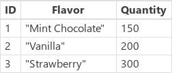

# Функции Update и UpdateIf в PowerApps
Обновление [записей](../working-with-tables.md#records) в [источнике данных](../working-with-data-sources.md).

## Описание
### Функция Update
Используйте функцию **Update** для замены всей записи в источнике данных. Функции **UpdateIf** и  **[Patch](function-patch.md)**, наоборот, изменяют одно или несколько значений в записи, оставляя другие значения без изменений.

При использовании [коллекции](../working-with-data-sources.md#collections) вся запись должна совпадать. В коллекциях допускаются повторяющиеся записи, так что возможны совпадения нескольких записей. Для обновления всех экземпляров записи можно использовать аргумент **All**, иначе обновляется только один экземпляр записи.

Если в источнике данных значение [столбца](../working-with-tables.md#columns) создается автоматически, такое значение требует повторного подтверждения.

### Функция UpdateIf
Используйте функцию **UpdateIf** для изменения одного или нескольких значений в одной или нескольких записях, которые соответствуют одному или нескольким условиям. Условием может быть любая формула, которая возвращает результат **true** или **false** и может содержать ссылки на столбцы в источнике данных (по имени). Функция оценивает условие для каждой записи и изменяет все записи, для которых возвращен результат **true**.  

Чтобы указать изменение, используйте запись изменения, содержащую новые значения свойств. Если указать эту запись изменения в фигурных скобках, формулы свойств смогут ссылаться на свойства изменяемой записи. Такое поведение можно использовать для изменения записей на основе формул.

Так же как и функцию **UpdateIf**, функцию **[Patch](function-patch.md)** можно использовать для изменения определенных столбцов записи без изменения других столбцов.

Функции **Update** и **UpdateIf** возвращают измененный источник данных в виде [таблицы](../working-with-tables.md). Необходимо использовать любую из этих функций в [формуле поведения](../working-with-formulas-in-depth.md).

### Делегирование
[!INCLUDE [delegation-no](../../../includes/delegation-no.md)]

## Синтаксис
**Update**( *DataSource*, *OldRecord*, *NewRecord* [, **All** ] )

* *источник_данных* — обязательный аргумент. Это источник данных, содержащий записи, которые требуется заменить.
* *OldRecord* — обязательный аргумент. Это запись для замены.
* *NewRecord* — обязательный аргумент. Запись, которой нужно заменить исходную запись. Она не является записью изменения. Выполняется замена всей записи, а для отсутствующих свойств будет указано значение *blank*.
* **All** — необязательный аргумент. В коллекции допускается существование нескольких копий одной записи. Укажите аргумент **All**, чтобы удалить все копии записи.

**UpdateIf**( *DataSource*, *Condition1*, *ChangeRecord1* [, *Condition2*, *ChangeRecord2*, ... ] )

* *источник_данных* — обязательный аргумент. Это источник данных, содержащий запись или записи, которые требуется изменить.
* *Condition(s)* — обязательный аргумент. Формула, возвращающая значение **true** для одной или нескольких записей, которые необходимо изменить.  В формуле можно использовать названия столбцов из аргумента *DataSource*.  
* *ChangeRecord(s)* — обязательный аргумент.  Для каждого соответствующего условия запись изменений нового значения свойства должна применяться к записям аргумента *DataSource*, которые удовлетворяют этому условию. Если запись указывается в фигурных скобках, значения свойств существующей записи можно использовать в формулах свойств.

## Примеры
В этих примерах выполняется замена или изменение записей в источнике данных под названием **IceCream**, в начале которого указаны данные из этой таблицы:

| Формула | Описание | Возвращаемый результат |
| --- | --- | --- |
| **Update(&nbsp;IceCream, First(&nbsp;Filter(&nbsp;IceCream,&nbsp;Flavor="Chocolate"&nbsp;)&nbsp;), {&nbsp;ID:&nbsp;1,&nbsp;Flavor:&nbsp;"Mint&nbsp;Chocolate",&nbsp;Quantity:150&nbsp;} )** |Выполняется замена записи из источника данных. |   Источник данных **IceCream** изменен. |
| **UpdateIf(&nbsp;IceCream, Quantity > 175, {&nbsp;Quantity:&nbsp;Quantity&nbsp;+&nbsp;10&nbsp;} )** |Выполняется изменение записей, в которых значение **Quantity** больше **150**.  Значение в поле **Quantity** увеличивается на 10, а остальные поля остаются без изменений. |  Источник данных **IceCream** изменен. |
| **Update(&nbsp;IceCream, First(&nbsp;Filter(&nbsp;IceCream, Flavor="Strawberry"&nbsp;)&nbsp;), {&nbsp;ID:&nbsp;3, Flavor:&nbsp;"Strawberry Swirl"} )** |Выполняется замена записи из источника данных. Свойство **Quantity** не указано в записи замены, так что для него будет возвращено значение *blank*. |  Источник данных **IceCream** изменен. |
| **UpdateIf(&nbsp;IceCream, true, {&nbsp;Quantity:&nbsp;0&nbsp;} )** |Эта формула устанавливает значение 0 для свойства **Quantity** во всех записях в источнике данных. |   Источник данных **IceCream** изменен. |

### Шаг за шагом
1. Импортируйте или создайте коллекцию с именем **Inventory** и отобразите ее в коллекции, как описано в [этой статье](../show-images-text-gallery-sort-filter.md).
2. Присвойте коллекции имя **ProductGallery**.
3. Добавьте ползунок с именем **UnitsSold** и для его свойства **Max** задайте значение в виде следующего выражения: **ProductGallery.Selected.UnitsInStock**
4. Добавьте кнопку и задайте следующую формулу в качестве значения свойства **[OnSelect](../controls/properties-core.md)**: **UpdateIf(Inventory, ProductName = ProductGallery.Selected.ProductName, {UnitsInStock:UnitsInStock-UnitsSold.Value})**
5. Нажмите клавишу F5, выберите продукт в коллекции, укажите значение с помощью ползунка и затем нажмите кнопку.
   
    Указанное вами число единиц продукта в наличии уменьшится соответствующим образом.

