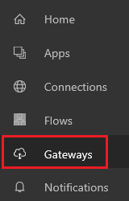

# Управление локальным шлюзом данных в PowerApps
Установите локальный шлюз данных для быстрой и безопасной передачи данных между PowerApps и источником данных, который находится не в облаке (например, локальной базой данных SQL Server или локальным сайтом SharePoint). Просматривайте все шлюзы, для которых у вас есть административные разрешения, и управляйте связанными разрешениями и подключениями.

Через шлюз можно подключиться к локальным данным с помощью следующих соединений:

* SharePoint
* SQL Server
* Oracle
* Informix;
* Filesystem;
* DB2

## Технические условия
* Имя пользователя и пароль, которые использовались для [регистрации](../signup-for-powerapps.md) в PowerApps.
* Административные разрешения для шлюза. У вас по умолчанию есть эти разрешения для всех устанавливаемых шлюзов. Администратор другого шлюза может предоставить вам соответствующие разрешения.
* Лицензия, которая поддерживает доступ к локальным данным через локальный шлюз. Дополнительные сведения см. в разделе "Подключение" на [странице цен](https://powerapps.microsoft.com/pricing/);
* Пользователь может создавать и использовать шлюзы и локальные подключения только в своей [среде по умолчанию](working-with-environments.md).

## Установка шлюза
1. На сайте [powerapps.com](https://web.powerapps.com) на панели навигации щелкните **Gateways** (Шлюзы).

    

2. Если у вас нет административных разрешений для шлюза, нажмите кнопку [Install a gateway now](http://go.microsoft.com/fwlink/?LinkID=820931) (Установить шлюз сейчас). Или нажмите кнопку **New Gateway** (Создать шлюз) в правом верхнем углу и следуйте указаниям мастера.

    

    Дополнительные инструкции по установке шлюза см. в разделе [Общие сведения о локальных шлюзах данных в Microsoft Flow](gateway-reference.md).

## Просмотр разрешений шлюза и управление ими
1. На сайте [powerapps.com](https://web.powerapps.com) на панели навигации слева щелкните **Gateways** (Шлюзы), а затем выберите нужный шлюз.

2. Добавьте пользователя в шлюз. Для этого щелкните **Users** (Пользователи), укажите пользователя или группу и уровень разрешений.

   * **Может использовать**: пользователи, которые могут создавать подключения к шлюзу для приложений и потоков, но не могут совместно использовать шлюз. Применяйте это разрешение для пользователей, которые будут запускать приложения, но не будут предоставлять к ним общий доступ.
   * **Может использовать и делиться**: пользователи, которые могут создать подключение к шлюзу для приложений и потоков, а также автоматически предоставлять общий доступ к шлюзу при предоставления такого доступа к приложению. Применяйте это разрешение к пользователям, которым требуется предоставлять общий доступ к приложениям другим пользователям или организации.
   * **Администратор**: администраторы, которые имеют полный контроль над шлюзом, включая добавление пользователей, настройку разрешений, создание подключений ко всем доступным источникам данных и удаление шлюза.

Для уровней разрешений **Может использовать** и **Может использовать и делиться** выберите источники данных, к которым пользователь может подключиться через шлюз.

## Просмотр подключений к шлюзу и управление ими
1. На сайте [powerapps.com](https://web.powerapps.com) на панели навигации слева щелкните **Gateways** (Шлюзы), а затем выберите нужный шлюз.

2. Щелкните **Подключения**, затем щелкните (коснитесь) подключение, чтобы просмотреть сведения о нем, изменить его параметры или удалить его.

3. Чтобы предоставить доступ к подключению, щелкните **Share** (Доступ), а затем добавьте или удалите пользователей.

    > [!NOTE]
   > Вы можете предоставлять доступ только к некоторым типам подключений, например SQL Server. Дополнительные сведения см. в статье о [предоставлении доступа к ресурсам приложения](share-app-resources.md).

Дополнительные сведения об управлении подключением см. в статье [Управление подключениями в PowerApps](add-manage-connections.md).

## Устранение неполадок и расширенная настройка
Дополнительные сведения об устранении проблем, связанных со шлюзами, и настройке службы шлюза для сети см. в разделе [Общие сведения о локальных шлюзах данных в Microsoft Flow](gateway-reference.md).

## Дальнейшие действия
* Создайте приложение, которое подключается к локальному источнику данных, например [SQL Server](connections/connection-azure-sqldatabase.md) или [SharePoint](connections/connection-sharepoint-online.md).
* [Предоставьте доступ к приложению](share-app.md), которое подключается к локальному источнику данных.
