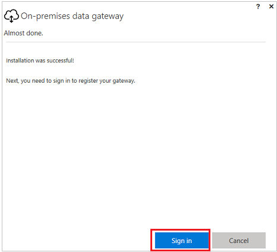

# Сведения о локальных шлюзах данных для приложений на основе холста
## Установка и настройка
**Предварительные требования**

Минимально:

* .NET 4.5 Framework
* 64-разрядная версия Windows 7 или Windows Server 2008 R2 (или более поздней версии)

Рекомендуется:
* 8-ядерный ЦП
* 8 ГБ памяти
* 64-разрядная версия Windows 2012 R2 (или более поздней версии)

Связанные вопросы:

* Шлюз невозможно установить на контроллере домена.
* Не следует устанавливать шлюз на компьютере (например, на переносном компьютере), который может быть выключен, может перейти в спящий режим или не подключен к Интернету, так как при любом из этих условий шлюз работать не сможет. Кроме того, может наблюдаться снижение производительности шлюза при работе по беспроводной сети.

**Установка шлюза**

1. [Скачайте программу установки](http://go.microsoft.com/fwlink/?LinkID=820931) и запустите ее.

    

2. На первом экране мастера установки нажмите кнопку **Далее** для подтверждения прочтения напоминания об установке шлюза на переносном компьютере.

    

3. Укажите расположение, куда вы хотите установить шлюз, установите флажок, чтобы принять условия использования и заявление о конфиденциальности, а затем нажмите кнопку **Установить**.

4. В диалоговых окнах **Управление учетными записями пользователей** нажимайте кнопку **Да** для продолжения.

5. На следующем экране мастера щелкните или коснитесь **Вход**, а затем укажите те же учетные данные, которые вы используете для входа в PowerApps.

    

6. Выберите один из вариантов (регистрация нового шлюза, перенос, восстановление или перехват существующего шлюза) и нажмите кнопку **Далее**.

    

   * Чтобы настроить шлюз, введите его **имя** и **ключ восстановления**, нажмите кнопку **Настройка**, а затем — кнопку **Закрыть**.

       

       Введите ключ восстановления длиной не менее 8 символов и сохраните его в надежном месте. Этот ключ понадобится, если вы захотите перенести, восстановить или перехватить этот шлюз.

   * Для переноса, восстановления или перехвата существующего шлюза укажите имя шлюза и ключ восстановления, нажмите кнопку **Настройка** и следуйте указаниям.

       

**Перезапуск шлюза**

Шлюз работает как служба Windows, поэтому его можно запускать и останавливать различными способами. Например, можно открыть командную строку с повышенными привилегиями на компьютере, где запущен шлюз, и выполнить одну из следующих команд.

* Для остановки службы: 
  **net stop PBIEgwService**

* Для запуска службы: 
  **net start PBIEgwService**

**Настройка брандмауэра или прокси-сервера**

Сведения о том, как указать сведения о прокси-сервере для шлюза, см. в разделе [Настройка параметров прокси-сервера](https://docs.microsoft.com/power-bi/service-gateway-proxy).

С помощью указанной ниже команды в командной строке PowerShell можно проверить, не блокирует ли брандмауэр или прокси-сервер соединения. Эта команда проверяет наличие связи со служебной шиной Azure. Она только проверяет подключение к сети и не имеет ничего общего с облачной службой сервера или шлюзом. Команда помогает определить, имеет ли компьютер выход в Интернет.

**Test-NetConnection -ComputerName watchdog.servicebus.windows.net -Port 9350**

Результаты должны выглядеть аналогично этому примеру. Если значение **TcpTestSucceeded** отлично от **True**, то подключение, возможно, блокируется брандмауэром.

    ComputerName           : watchdog.servicebus.windows.net
    RemoteAddress          : 70.37.104.240
    RemotePort             : 5672
    InterfaceAlias         : vEthernet (Broadcom NetXtreme Gigabit Ethernet - Virtual Switch)
    SourceAddress          : 10.120.60.105
    PingSucceeded          : False
    PingReplyDetails (RTT) : 0 ms
    TcpTestSucceeded       : True

Если вы хотите проверить все варианты, замените **имя_компьютера** и **порт** на значения, указанные в подразделе **Настройка портов** далее в этом разделе.

Брандмауэр может также блокировать подключения служебной шины Azure к центрам данных Azure. Если это так, нужно создать (разблокировать) список разрешенных IP-адресов центров данных вашего региона. Список IP-адресов Azure можно получить [здесь](https://www.microsoft.com/download/details.aspx?id=41653).

**Настройка портов**

Шлюз создает исходящее подключение к служебной шине Azure. Он осуществляет связь через исходящие TCP-порты: 443 (по умолчанию), 5671, 5672, и от 9350 до 9354. Шлюз не нуждается во входящих портах.

Дополнительные сведения о [гибридных решениях](https://azure.microsoft.com/documentation/articles/service-bus-fundamentals-hybrid-solutions/).

Рекомендуется добавить IP-адреса для вашего региона данных в список разрешенных на брандмауэре. Можно скачать еженедельно обновляемый [список IP-адресов центров данных Microsoft Azure](https://www.microsoft.com/download/details.aspx?id=41653).

> [!NOTE]
> В списке центров данных Azure IP-адреса указаны в [нотации CIDR](http://whatismyipaddress.com/cidr). Например, 10.0.0.0/24 не означает "от 10.0.0.0 до 10.0.0.24".

Ниже приведен список полных доменных имен, используемых шлюзом.

| Имена доменов | Исходящие порты | Описание |
| --- | --- | --- |
| *.analysis.windows.net |443 |HTTPS |
| *.login.windows.net |443 |HTTPS |
| *.servicebus.windows.net |5671-5672 |Расширенный протокол управления очередью сообщений (AMQP) |
| *.servicebus.windows.net |443, 9350-9354 |Прослушиватели на ретрансляторе служебной шины по протоколу TCP (требуется порт 443 для получения токена управления доступом) |
| *.frontend.clouddatahub.net |443 |HTTPS |
| *.core.windows.net |443 |HTTPS |
| login.microsoftonline.com |443 |HTTPS |
| *.msftncsi.com |443 |Используется для проверки подключения к Интернету, если служба Power BI не может получить доступ к шлюзу. |

**Учетная запись для входа**

Пользователи будут выполнять вход по рабочей или учебной учетной записи. Это учетная запись вашей организации. Если вы зарегистрировались в Office 365 и не указали действительный адрес рабочей электронной почты, результат может выглядеть как nancy@contoso.onmicrosoft.com. Ваша учетная запись в облачной службе хранится в клиенте в Azure Active Directory (AAD). В большинстве случаев имя субъекта-пользователя для учетной записи AAD будет совпадать с адресом электронной почты.

**Учетная запись службы Windows**

На локальном шлюзе данных настроено использование учетной записи *NT SERVICE\PBIEgwService* для входа службы в систему Windows. По умолчанию она имеет право входа в систему в качестве службы. Это относится к компьютеру, на котором выполняется установка шлюза.

Это не учетная запись, используемая для подключения к локальным источникам данных, и не рабочая или учебная учетная запись, с помощью которой выполняется вход в облачные службы.

Если возникают проблемы с прокси-сервером из-за проверки подлинности, можно изменить учетную запись службы Windows на учетную запись пользователя домена или на управляемую учетную запись службы, как описано в разделе [Настройка прокси-сервера](https://docs.microsoft.com/power-bi/service-gateway-proxy#changing-the-gateway-service-account-to-a-domain-user).

## Администрирование на уровне клиента 

Сейчас нет единого места, где администраторы клиентов могли бы управлять всеми шлюзами, установленными и настроенными другими пользователями.  Если вы являетесь администратором клиента, рекомендуется попросить пользователей в организации добавлять вас в качестве администратора в каждый устанавливаемый ими шлюз. В этом случае вы сможете управлять всеми шлюзами в вашей организации на странице параметров шлюза или с помощью [команд PowerShell](https://docs.microsoft.com/power-bi/service-gateway-high-availability-clusters#powershell-support-for-gateway-clusters).

## Часто задаваемые вопросы
#### Общие
**Вопрос**: какие источники данных поддерживает шлюз?  
**Ответ.** На момент написания этой статьи поддерживаются такие источники данных:

* SQL Server
* SharePoint
* Oracle
* Informix;
* Filesystem;
* DB2

**Вопрос**: нужен ли шлюз для источников данных в облаке, таких как SQL Azure?  
**Ответ**: нет. Шлюз подключается только к локальным источникам данных.

**Вопрос**: как называется служба Windows для шлюза?  
**Ответ**: в перечне служб шлюз называется **Служба Power BI Enterprise Gateway**.

**Вопрос**: используются ли какие-либо входящие подключения к шлюзу из облака?  
**Ответ**: нет. Шлюз использует исходящие подключения к служебной шине Azure.

**Вопрос**: что делать, если исходящие подключения заблокированы? Что нужно открыть?  
**Ответ.** Ознакомьтесь со списком портов и узлов, которые шлюз использует выше.

**Вопрос**: должен ли шлюз быть установлен на том же компьютере, что и источник данных?  
**Ответ**: нет. Шлюз будет подключаться к источнику данных, используя указанные сведения для подключения. В этом смысле шлюз можно рассматривать как клиентское приложение. Он просто должен иметь возможность подключаться к указанному имени сервера.

**Вопрос**: какова задержка при выполнении запросов к источнику данных от шлюза? Какую архитектуру лучше использовать?  
**Ответ**: для уменьшения задержки сети следует устанавливать шлюз как можно ближе к источнику данных. Если есть возможность установить шлюз на компьютере-источнике данных, это минимизирует задержки. Также можно рассмотреть вариант использования центра данных. Например если служба использует центр данных "Западная часть США" и есть SQL Server, размещенный на виртуальной машине Azure, следует поместить эту виртуальную машину Azure также в центр данных "Западная часть США". Это позволит свести к минимуму задержки и избежать расходов на исходящие данные на виртуальной машине Azure.

**Вопрос**: есть ли требования к пропускной способности сети?  
**Ответ**: рекомендуется иметь широкополосное подключение к сети. Каждое окружение имеет свои особенности, на результат также влияет объем отправляемых данных. С помощью ExpressRoute можно обеспечить гарантированную пропускную способность от локальной системы до центров данных Azure.

Для оценки имеющейся пропускной способности можно использовать [приложение Azure Speed Test](http://azurespeedtest.azurewebsites.net/) от стороннего производителя.

**Вопрос**: может ли служба Windows использовать для работы учетную запись Azure Active Directory?  
**Ответ**: нет. Служба Windows должна использовать допустимую учетную запись Windows. По умолчанию это *NT SERVICE\PBIEgwService*.

**Вопрос**: как результаты отправляются обратно в облако?  
**Ответ**: для этого используется служебная шина Azure. Дополнительные сведения см. в разделе [Принцип работы](gateway-reference.md#how-the-gateway-works).

**Вопрос**: где хранятся учетные данные?  
**Ответ**: учетные данные для доступа к источнику данных хранятся в облачной службе шлюза в зашифрованном виде. Учетные данные расшифровываются на локальном шлюзе.

**Вопрос**: можно ли поместить шлюз в сети периметра (также называемой DMZ, демилитаризованной зоной и промежуточной подсетью)?  
**Ответ**: шлюзу требуется подключение к источнику данных. Если источник данных не находится в сети периметра, шлюз может не иметь возможности подключиться к нему. Например, компьютер, на котором работает SQL Server, может не находиться в сети периметра. В этом случае подключиться к нему из сети периметра невозможно. Если шлюз находится в сети периметра, он не сможет обращаться к компьютеру, на котором выполняется SQL Server.

#### Высокая доступность и аварийное восстановление
**Вопрос**: есть ли планы обеспечения высокой доступности с помощью шлюза?  
**Ответ:** высокий уровень доступности включается путем объединения двух или более шлюзов в один кластер.  Высокий уровень доступности для кластеров требует обновления от ноября 2017 г. или более поздней версии для локального шлюза данных.  Дополнительные сведения см. в [объявлении в записи блога](https://powerapps.microsoft.com/en-us/blog/gateway-high-availability-for-powerapps-and-flow).

**Вопрос**: какие есть возможности для аварийного восстановления?  
**Ответ**: для восстановления или переноса шлюза можно использовать ключ восстановления. При установке шлюза укажите ключ восстановления.

**Вопрос**: зачем нужен ключ восстановления?  
**Ответ**: он позволяет перенести или восстановить параметры шлюза после аварии.

#### Устранение неполадок
**Вопрос**: где находятся журналы шлюза?  
**Ответ**: см. подраздел [Средства](gateway-reference.md#tools) далее в этом разделе.

**Вопрос**: как узнать, какие запросы отправляются в локальный источник данных?  
**Ответ**: можно включить трассировку запросов, включающую отправляемые запросы. Не забудьте выключить трассировку после устранения неполадок. Включенная трассировка запросов приводит к росту размера журналов.

Также можно изучить средства трассировки запросов в источнике данных. Например, для SQL Server и служб Analysis Services можно использовать расширенные события или SQL Profiler.

## Как работает шлюз

Когда пользователь взаимодействует с элементом, подключенным к локальному источнику данных:  

1. облачная служба создает запрос, а также зашифрованные учетные данные для источника данных, и отправляет запрос в очередь для обработки шлюзом;

2. облачная служба шлюза анализирует запрос и передает запрос в [служебную шину Azure](https://azure.microsoft.com/documentation/services/service-bus/);

3. локальный шлюз данных опрашивает служебную шину Azure на наличие ожидающих запросов;

4. шлюз получает запрос, расшифровывает учетные данные и подключается к источникам данных с этими учетными данными;

5. шлюз отправляет запрос в источник данных для выполнения;

6. результаты отправляются из источника данных обратно в шлюз, а затем в облачную службу; служба использует результаты.

## Устранение неполадок
#### Обновление до последней версии
Многие проблемы могут возникать при использовании устаревшей версии шлюза.  Рекомендуется проверять, что используется последняя версия.  Если шлюз не обновлялся месяц или больше, попробуйте установить последнюю версию шлюза и посмотреть, повторяется ли проблема.

#### Ошибка. Не удалось добавить пользователя в группу.  (-2147463168   PBIEgwService   Performance Log Users   )
Эта ошибка появляется, если вы пытаетесь установить шлюз на контроллере домена, что не поддерживается. Шлюз нужно устанавливать на компьютере, который не является контроллером домена.

## Средства
#### Сбор журналов из конфигуратора шлюза
Для шлюза можно собрать несколько журналов. Всегда начинайте с журналов!

**Журналы установки**

%localappdata%\Temp\On-premises_data_gateway_*.log

**Журналы конфигурации**

%localappdata%\Microsoft\on-premises data gateway\GatewayConfigurator*.log

**Журналы службы корпоративного шлюза**

C:\Users\PBIEgwService\AppData\Local\Microsoft\on-premises data gateway\Gateway*.log

**Журналы событий**

Журналы событий **службы локального шлюза данных** находятся в **журналах приложений и служб**.

#### Трассировка Fiddler
[Fiddler](http://www.telerik.com/fiddler) — бесплатное средство от компании Telerik, отслеживающее трафик HTTP.  Можно наблюдать трафик службы Power BI на клиентском компьютере в обоих направлениях. Это позволяет видеть ошибки и другие связанные сведения.
