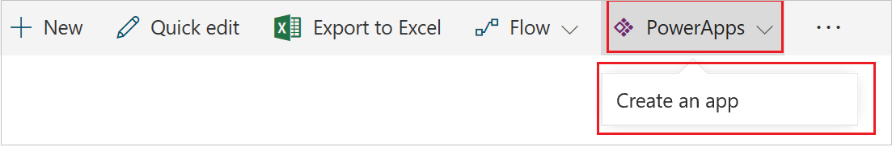

# Создание приложения из списка SharePoint с использованием PowerApps

В PowerApps вы можете автоматически создать приложение, в котором пользователи смогут управлять элементами в настраиваемом списке SharePoint Online. Это приложение будет состоять из трех экранов, позволяющих пользователям:

* просматривать все записи в списке (**BrowseScreen1**);
* просматривать все поля для определенной записи (**DetailsScreen1**);
* создавать или изменять записи (**EditScreen1**).

Если создать приложение настраиваемого списка с помощью панели команд SharePoint Online, такое приложение будет доступно как представление этого списка. Помимо веб-браузера, это приложение можно запускать на устройствах iOS и Android.

> [!IMPORTANT]
> PowerApps не поддерживает все типы данных SharePoint. Дополнительные сведения см. в разделе с описанием [известных проблем](connections/connection-sharepoint-online.md#known-issues).

## Создание приложения
1. Откройте настраиваемый список в SharePoint Online, щелкните или нажмите **PowerApps** на панели команд, а затем выберите **Create an app** (Создать приложение).

    

2. На появившейся панели введите название приложения, а затем щелкните или нажмите **Create** (Создать).

    

    В веб-браузере откроется новая вкладка с приложением, созданным автоматически на основе вашего списка SharePoint. Приложение откроется в PowerApps Studio, где его можно настроить.

      
3. Щелкните или нажмите на вкладку со списком SharePoint и выберите **Open** (Открыть).

> [!NOTE]
> Прежде чем приложение откроется, вам, возможно, потребуется обновить содержимое окна браузера (например, нажав клавишу F5).

Приложение откроется на отдельной вкладке браузера.

## Управление приложением

* Если выбрать **Edit in PowerApps** (Изменить в PowerApps), приложение откроется на отдельной вкладке браузера, где вы сможете изменить его в PowerApps Studio.

* Если выбрать **Make this view public** (Сделать это представление общедоступным), ваши сотрудники смогут просматривать приложение. По умолчанию создаваемые вами представления доступны только вам. Если вы хотите, чтобы другие пользователи могли вносить изменения в приложение, вам потребуется [предоставить им общий доступ](share-app.md) и разрешения **Можно изменять**.

* Если выбрать **Remove this view** (Удалить это представление), представление будет удалено из SharePoint, но приложение останется доступным в PowerApps, пока вы не [удалите его](delete-app.md).

## Дальнейшие действия
* Настройте [коллекцию](customize-layout-sharepoint.md), [формы](customize-forms-sharepoint.md) и [карточки](customize-card.md) по умолчанию.
