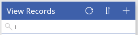

# Создание с нуля приложения на основе холста из данных Excel

Создайте с нуля собственное приложение на основе холста, используя данные Excel в табличном формате, и при необходимости добавьте в него данные из других источников. Следуя указаниям в этом руководстве, вы создадите приложение с двумя экранами. На одном экране пользователи смогут просматривать набор записей. На другом экране пользователи могут создать запись, обновить одно или несколько полей в записи или удалить всю запись. Этот подход требует больше времени, чем [автоматическое создание приложения](get-started-create-from-data.md), но позволяет опытному пользователю создать приложение в соответствии с потребностями.

## Технические условия

Чтобы точно выполнить действия из этого руководства, создайте файл Excel на основе следующего примера данных.

1. Скопируйте эти данные и вставьте их в файл Excel.

    | StartDay | StartTime | Доброволец | Резервное копирование |
    | --- | --- | --- | --- |
    | Суббота |10:00–12:00 |Васкес (Vasquez) |Кумаширо (Kumashiro) |
    | Суббота |12:00–14:00 |Айс (Ice) |Сингхал (Singhal) |
    | Суббота |14:00–16:00 |Мик (Myk) |Мюллер (Mueller) |
    | Воскресенье |10:00–12:00 |Ли (Li) |Адамс (Adams) |
    | Воскресенье |10:00–12:00 |Сингх (Singh) |Морган (Morgan) |
    | Воскресенье |10:00–12:00 |Батье (Batye) |Нгуен (Nguyen) |

2. Отформатируйте данные в виде таблицы под названием **Schedule**, чтобы приложение PowerApps могло проанализировать их.

    Дополнительные сведения см. в разделе [Форматирование таблицы в Excel](how-to-excel-tips.md).

3. Сохраните файл под именем **eventsignup.xls**, затем закройте его и отправьте в [облачное хранилище](connections/cloud-storage-blob-connections.md), например OneDrive.

> [!IMPORTANT]
> Вы можете использовать собственный файл Excel и ознакомиться только с общими понятиями в этом учебнике. Тем не менее данные в файле Excel должны быть отформатированы в виде таблицы. Дополнительные сведения см. в разделе [Форматирование таблицы в Excel](how-to-excel-tips.md).

## Пустое приложение
1. Войдите в [PowerApps](http://web.powerapps.com?utm_source=padocs&utm_medium=linkinadoc&utm_campaign=referralsfromdoc).

    

    Вы можете разработать с нуля приложение для телефонов или других устройств (например, планшетов). Этот раздел посвящен разработке приложения для телефонов.

1. В разделе **разработки приложений** наведите указатель на плитку **Создать на основе шаблона**, нажмите значок телефона и выберите действие **Создать это приложение**.

    

    PowerApps Studio создаст пустое приложение для телефонов.

1. Если отобразится диалоговое окно **Вас приветствует PowerApps Studio**, выберите **Пропустить**.

## Подключение к данным
1. В центре экрана выберите **подключение к данным**.

1. На панели **Данные** выберите подключение к нужному облачному хранилищу, если оно отображается. В противном случае выполните следующие действия для добавления подключения:

    1. Щелкните **Новое подключение**, а затем — плитку облачной учетной записи и выберите **Создать**.
    2. Если появится запрос, предоставьте учетные данные для этой учетной записи.

1. В разделе **выбора файла Excel** вставьте строку **eventsignup** или введите ее первые буквы, чтобы отфильтровать список, а затем выберите загруженный файл.

1. В разделе **выбора таблицы** установите флажок **Расписание** и щелкните **Подключиться**.

## Создание экрана просмотра

1. На вкладке **Главная** щелкните направленную вниз стрелку рядом с элементом **Новый экран**, чтобы открыть список типов экрана, и выберите **Экран списка**.

    

    Экран добавляется с несколькими элементами управления по умолчанию, в том числе с полем поиска и элементом управления **[Коллекция](controls/control-gallery.md)**. Коллекция занимает размер всего экрана под полем поиска.

2. Выберите коллекцию, щелкнув или коснувшись ее примерно в центре.

    Вокруг коллекции появится рамка выделения с маркерами захвата.

    

3. На панели справа выберите **CustomGallerySample**, чтобы открыть область **Данные**.

    

4. В разделе **Источник данных** щелкните стрелку вниз, чтобы открыть список источников данных для приложения, и выберите **Schedule**.

    

5. В разделе **Макет** щелкните направленную стрелку вниз, чтобы открыть список макетов, и выберите **Заголовок, подзаголовок и текст**.

    

6. В разделе **Заголовок2** измените заголовок столбца **Backup** на **Volunteer**.

     

7. Закройте область **Данные**, нажав значок закрытия в правом верхнем углу.

    В коллекции отобразятся имена всех добровольцев с указанием дня и времени для их смен.

    

8. Выберите коллекцию и убедитесь, что в списке отображается свойство **[Items](controls/properties-core.md)**.

    В строке формул отобразится, что это свойство имеет значение **Schedule**.

    

9. Измените значение свойства **Items**, скопировав в строку формул следующую формулу:

    **SortByColumns(Search(Schedule, TextSearchBox1.Text, "Volunteer"), "Volunteer", If(SortDescending1, SortOrder.Descending, SortOrder.Ascending))**

    В коллекции отобразятся данные, отсортированные по именам добровольцев в алфавитном порядке.

    

    Пользователи могут сортировать и фильтровать коллекции по имени волонтера, используя функции формулы **SortByColumns** и **Search**.

   - Когда пользователь вводит в поле поиска хотя бы одну букву, в коллекции отображаются только те записи, для которых поле **Volunteer** содержится эта буква.
   - Когда пользователь выбирает кнопку сортировки, коллекция отображает записи в возрастающем или убывающем порядке (в зависимости от количества нажатий на кнопку) по значению поля **Volunteer**.

     Дополнительные сведения об этих и других функциях приведены в [справочнике формул](formula-reference.md).

10. Введите букву **i** в поле поиска, затем коснитесь или щелкните кнопку сортировки два раза (или любое четное число раз).

     В коллекции отобразятся показанные ниже результаты.

     

11. Очистите весь текст в поле поиска.

12. В верхней части экрана выберите элемент управления **[Метка](controls/control-text-box.md)**, а затем замените текст **[Title]** строкой **Просмотр записей**.

     

## Создание экрана изменений
1. На вкладке **Главная** щелкните направленную стрелку вниз рядом с элементом **Новый экран** и выберите **Экран формы**.

     

1. На экране, который вы только что добавили, выберите **Подключение к данным**, чтобы открыть панель **Данные**, и задайте в качестве источника данных таблицу **Schedule**.

1. В разделе **Поля** установите все флажки, чтобы отобразить в форме все поля таблицы.

     

1. Перетащите поле **Volunteer** вверх, чтобы оно оказалось верхним в списке полей.

     

1. Выберите форму и присвойте ее свойству **Item** значение следующего выражения, скопировав его в строку формул или набрав с помощью клавиатуры: **BrowseGallery1.Selected**

1. В верхней части экрана выберите элемент управления **[Метка](controls/control-text-box.md)**, а затем замените текст **[Title]** строкой **Изменение записей**.

    

## Добавление и переименование экранов
1. На панели навигации слева нажмите на кнопку с многоточием (...) для экрана **Screen1** и выберите действие **Удалить**.

    

1. Нажмите на кнопку с многоточием (...) для экрана **Screen2**, выберите действие **переименовать** и введите для него имя **ViewScreen**.

1. Нажмите на кнопку с многоточием (...) для экрана **Screen3**, выберите действие **переименовать** и введите для него имя **ChangeScreen**.

## Настройка значков на экране просмотра
1. В верхней части экрана **ViewScreen** щелкните значок с кольцевой стрелкой.

    

1. Для свойства **OnSelect** этой кнопки введите следующую формулу: **Refresh(Schedule)**

    Когда пользователь щелкнет этот значок, данные из таблицы **Schedule** будут заново извлечены из файла Excel.

    Дополнительные сведения об этих и других функциях приведены в [справочнике по формулам](formula-reference.md).

1. В правом верхнем углу экрана **ViewScreen** щелкните значок "плюс".

    

1. Для свойства **OnSelect** этой кнопки введите следующую формулу: **NewForm(EditForm1);Navigate(ChangeScreen,ScreenTransition.None)**

    Когда пользователь щелкнет этот значок, откроется экран **ChangeScreen** с пустыми полями для быстрого создания записи.

1. Щелкните стрелку вправо рядом с первой записью в коллекции.

    

1. Задайте для свойства **OnSelect** этой стрелки следующую формулу: **EditForm(EditForm1); Navigate(ChangeScreen, ScreenTransition.None)**

    Когда пользователь щелкнет этот значок, отобразится экран **ChangeScreen** с информацией из выбранной записи в каждом поле, что позволит легко изменить или удалить эту запись.

## Настройка значков на экране редактирования
1. На экране **ChangeScreen** щелкните значок "x" в верхнем левом углу.

    

1. Для свойства **OnSelect** этой кнопки введите следующую формулу: **ResetForm(EditForm1);Navigate(ViewScreen, ScreenTransition.None)**

    Когда пользователь щелкнет этот значок, отменятся все внесенные на этом экране изменения и отобразится экран просмотра.

1. В правом верхнем углу щелкнет значок галочки.

    

1. Задайте для свойства **OnSelect** этой галочки следующую формулу: **SubmitForm(EditForm1); Navigate(ViewScreen, ScreenTransition.None)**

    Когда пользователь щелкнет этот значок, сохранятся все внесенные на этом экране изменения и отобразится экран просмотра.

1. На вкладке **Вставка** выберите **Значки**, а затем — значок **мусорной корзины**.

1. Задайте для свойства **Цвет** этого значка значение **Белый** и переместите его так, чтобы он располагался рядом со значком галочки.

    

1. Для свойства **OnSelect** значка мусорной корзины введите следующую формулу: **Remove(Schedule, BrowseGallery1.Selected); Navigate(ViewScreen, ScreenTransition.None)**

    Когда пользователь щелкнет этот значок, выбранная запись будет удалена из источника данных и откроется экран просмотра.

## Тестирование приложения
1. Выберите экран **ViewScreen**, откройте режим предварительного просмотра, нажав клавишу F5 или щелкнув значок **предварительного просмотра** в правом верхнем углу.

    

1. Добавьте запись.

1. Измените значения полей в новой записи и сохраните эти изменения.

1. Измените значения полей в этой же записи и отмените эти изменения.

1. Удалите запись, которую вы добавили ранее.

1. Закройте режим предварительного просмотра, нажав клавишу Esc или выбрав значок закрытия в правом верхнем углу.

## Дальнейшие действия
* Нажмите клавиши CTRL+S, чтобы сохранить приложение в облаке. После этого его можно будет запускать с других устройств.
* [Поделитесь приложением](share-app.md), чтобы другие пользователи могли с ним работать.
* См. дополнительные сведения о таких [функциях](working-with-formulas.md), как **Исправление**, которые позволяют управлять данными без необходимости создавать стандартную форму.
