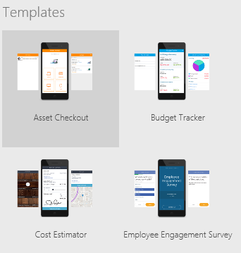

# Создание приложения на основе шаблона PowerApps
Вы можете создать приложение автоматически на основе шаблона для определенного сценария, например отслеживания бюджета или планирования отпусков, а затем запустить приложение, чтобы посмотреть, как оно работает по умолчанию.

Для создания приложения на основе шаблона требуется облачная учетная запись хранения (например, DropBox, OneDrive или Google Диск), в которой будет храниться образец данных шаблона.

Если у вас нет лицензии на PowerApps, вы можете [зарегистрироваться для получения бесплатной версии](../signup-for-powerapps.md).

## Создание приложения
1. Войдите в [PowerApps](http://web.powerapps.com).

    

1. В области **Разрабатывайте такие приложения** наведите указатель на плитку **Начать с данных** и выберите команду **Создать это приложение**.

    

1. На плитке **Шаблоны приложений** выберите **Макет телефона** или **Макет для планшета**.

    

4. В списке шаблонов выберите желаемый вариант и щелкните или коснитесь **Использовать** (в правом нижнем углу).

    

    В учетную запись облачного хранилища копируются образцы данных, затем создается приложение и отображается его домашняя страница.

## Запуск приложения
Приложение на основе шаблона открывается в рабочей области по умолчанию, где вы будете выполнять настройку. Прежде чем внести изменения в приложение, изучите работу приложения в режиме **Предварительный просмотр**.

1. Нажмите клавишу F5 (либо щелкните стрелку вправо в правом верхнем углу или коснитесь ее), чтобы открыть приложение в режиме **Предварительный просмотр**.

    

    Приложение заполняется образцами данных для демонстрации его функциональных возможностей. Например, приложение "Калькулятор стоимости" содержит данные для создания встреч и оценки затрат на укладку выбранного покрытия для пола в комнате с заданными параметрами.

4. Изучите работу приложения по умолчанию, создавая, изменяя и удаляя образцы данных, а затем проверьте, отражаются ли изменения в облачной учетной записи хранения.

    Например, запланируйте встречу и выполните оценку затрат в приложении "Калькулятор стоимости".

5. Вернитесь в рабочую область по умолчанию, нажав клавишу ESC (либо нажав значок **X** в правом верхнем углу).

## Дальнейшие действия
1. Нажмите клавиши CTRL+S, введите имя своего приложения, а затем нажмите кнопку **Сохранить**, чтобы сохранить свое приложение в облаке.

1. [Предоставьте общий доступ к своему приложению](share-app.md) другим пользователям в вашей организации.

> [!IMPORTANT]
> Прежде чем предоставить доступ к приложению другим пользователям, убедитесь, что у них есть доступ к данным. Например, для этого необходимо [предоставить доступ к файлу Excel или другому файлу](share-app-data.md) в учетной записи облачного хранилища.
