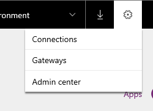
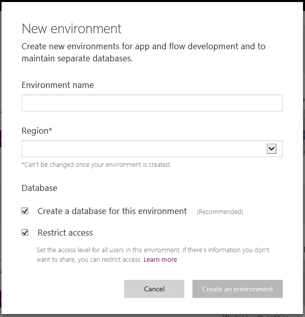
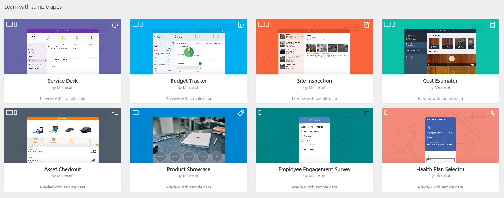
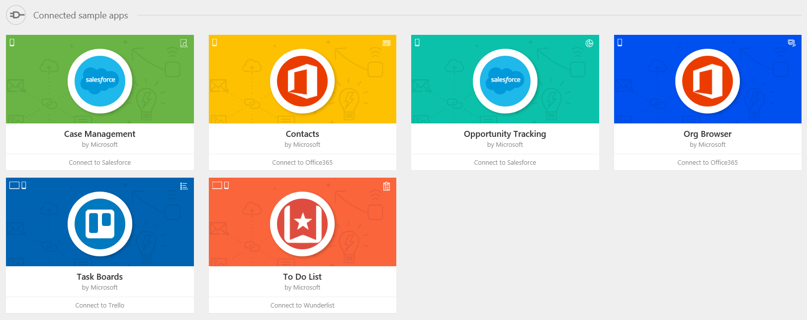
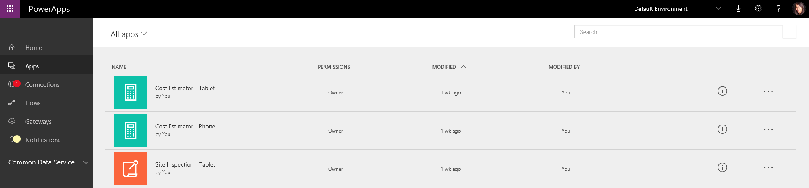
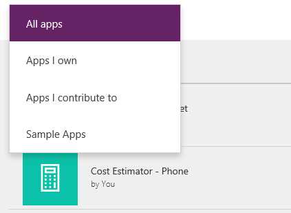
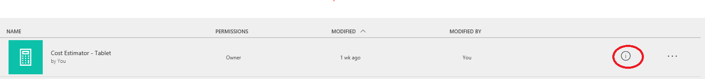

# Основные сведения о сайте powerapps.com
Команда PowerApps повторно представляет [powerapps.com](http://web.powerapps.com) в качестве нового дома для разработчиков приложений. Мы превратили страницу в основной сайт, чтобы разработчики могли легко создавать приложения, использовать Microsoft Common Data Service и централизованно управлять приложениями. В этой статье рассматриваются следующие вопросы:

* заголовок;
* домашняя страница;
* страница **приложений**.

## Заголовок
При регистрации и первом входе на сайт powerapps.com вы увидите новый заголовок сайта. Рядом с левой частью заголовка находится значок Office. С его помощью можно быстро получить доступ к остальным продуктам Office, например PowerPoint, OneNote и Word, а также Microsoft Flow и Dynamics 365.

Рядом с правым краем заголовка можно увидеть раскрывающийся список, который позволяет быстро переключаться между средами. Скорее всего, изначально выбрана **среда по умолчанию**. См. [дополнительные сведения об использовании сред в PowerApps](../../administrator/environments-overview.md).

Рядом с раскрывающимся списком сред находится значок скачивания. Выберите этот значок, чтобы отобразить диалоговое окно со ссылками на скачивание PowerApps Mobile (для iOS или Android) или PowerApps Studio для Windows.

Рядом со значком скачивания расположен значок параметров в виде шестеренки. Выберите этот значок, чтобы отобразились ссылки на подключения, шлюзы и центр администрирования.

Рядом с параметрами находится значок в виде вопросительного знака для вызова справки. Выберите этот значок, чтобы отобразились ссылки на пошаговое изучение, документацию, поддержку, сообщество, блоги, правовую информацию и политику конфиденциальности.

## Домашняя страница
После входа в [powerapps.com](http://web.powerapps.com) вы будете перенаправлены на домашнюю страницу по умолчанию. Мы изменили макет домашней страницы, чтобы можно было быстро приступить к работе независимо от того, что вам нужно: создать приложения или ознакомиться с Common Data Service.

Если вы ранее уже входили в PowerApps и запускали или создавали приложения, первым, что вы увидите на главной странице, будет список **последних приложений**. Они сортируются по дате последнего запуска.

Рядом с правым верхним углом находится стрелка с названием **Приложения**, которая позволяет перейти прямо на страницу **приложений**, где можно просмотреть все приложения.

Если вы ни разу не выполняли вход, не создавали и не запускали приложения, вы не увидите раздел **Последние приложения**. Вместо этого вы увидите баннер **Создать приложение**.

Выберите **Начало работы** на этом баннере, чтобы отобразить параметры для создания приложения с помощью **PowerApps Studio для Windows** или **PowerApps Studio для Интернета**.

Рядом с кнопкой **Начало работы** находятся ссылки на обучающие видео о том, как быстро создавать приложения на основе данных (в SharePoint или PowerApps), а затем предоставлять к ним общий доступ. Ссылка со стрелкой **Сведения** перенаправит в раздел о том, как создать приложение с использованием существующих данных.

Под баннером **Создать приложение** находится баннер **Использование Microsoft Common Data Service**.

В разделе **Common Data Service** будут отображаться различные кнопки, в зависимости от лицензии или разрешения.

* Если отображается кнопка **Запустить пробную версию**, это означает, что у вас нет лицензии PowerApps P2, которая необходима для использования Common Data Service. Нажмите эту кнопку, чтобы открыть страницу, где вы сможете подписаться на 90-дневную пробную бесплатную версию этой лицензии. [Самостоятельная регистрация в PowerApps](../signup-for-powerapps.md).
* Если отображается кнопка **Начало работы**, значит, вы находитесь в среде, в которой отсутствует база данных Common Data Service или у вас нет к ней доступа. Нажмите эту кнопку, чтобы одновременно создать среду и базу данных и начать использовать Common Data Services для приложений. [Дополнительные сведения о создании сред](../../administrator/environments-administration.md).
  
    
  
    Если вы не хотите создавать среду, всегда можно переключиться на среду, к которой имеется доступ.
* Если отображается кнопка **Создать базу данных**, значит, вы находитесь в среде, в которой отсутствует база данных Common Data Service, но у вас есть разрешение на ее создание.
  
    
  
    Нажмите эту кнопку, чтобы подготовить базу данных для этой среды.
  
    
* Если отображается кнопка **Обзор сущностей**, значит, вы находитесь в среде, содержащей подготовленную базу данных Common Data Service, к которой у вас есть доступ. Нажмите эту кнопку, чтобы открыть страницу **Сущности**.
  
    

Под баннером **Использование Microsoft Common Data Service** вы увидите набор примеров приложений и подключаемые примеры приложений, которые можно использовать.

* **Примеры приложений.** Примеры приложений созданы для различных бизнес-сценариев в макете для телефона или планшета. Можно щелкнуть приложение, чтобы быстро просмотреть его описание, узнать, для какого макета оно было создано и какие возможности оно предоставляет, например кнопки для камеры, GPS или радио. Для начинающих пользователей это самый быстрый способ узнать о возможностях PowerApps. Вы также можете использовать шаблон для создания идентичного приложения в PowerApps Studio для Windows.
  
    
* **Подключаемые примеры приложений.** Эти приложения подключаются к данным с помощью Office 365, Salesforce, Trello и Wunderlist. Этот набор приложений отличается от примеров приложений, указанных выше. При выборе примеров приложений фактически подготавливается новый экземпляр приложения (воспринимайте его как шаблон). Вам понадобится ввести учетные данные, чтобы подключиться к данным. Подключаемые примеры приложений удобны тем, что экземпляр подготавливается прямо здесь и его можно открыть в PowerApps Studio, чтобы узнать, как соответствующее приложение было создано. Недостатком является длительный процесс создания такого приложения (до минуты). Поэтому, выбрав пример приложения, подождите, пока откроется браузер с этим приложением.
  
    

## Новая страница "Приложения"
Вы можете получить доступ к странице **Приложения** с помощью левой навигационной панели [powerapps.com](http://web.powerapps.com).

Страница **Приложения** ранее давала возможность переключаться между представлением плиток и представлением списка. Начиная с 26 октября 2016 года поддерживается только представление списка.

Обратите внимание, что в представлении списка отображаются только приложения в выбранной среде. Чтобы просмотреть приложения в другой среде, перейдите в нее с помощью переключателя среды в заголовке. [Работа со средами и Microsoft PowerApps](working-with-environments.md).

## Что нового?

* Теперь приложение открывается в новой вкладке PowerApps Studio для Интернета.
* По умолчанию на странице **Приложения** отображаются все приложения, для которых вам назначены разрешения на изменение. Чтобы просмотреть **все приложения** (включая приложения, которые вы можете только использовать), выберите фильтр **Все приложения**.
  
   

Имеются следующие фильтры:

* **Apps I can use** (Приложения, которые можно использовать) — позволяет показать все приложения, к которым вы имеете доступ с разрешением пользователя (можете только запускать их). Обратите внимание, что вы также можете получить эти приложения в [Dynamics 365](http://home.dynamics.com).
* **Мои приложения** — позволяет показать все созданные вами приложения.
* **Приложения, в которых я участвую** — позволяет показать все приложения, к которым вы имеете доступ с разрешением участника.
* **Примеры приложений** — позволяет показать все примеры приложений (не подключаемые примеры приложений).

Если выбрать круг "Сведения", откроется страница со сведениями о приложении.

Если в приложении нажать кнопку с многоточием, отобразятся такие параметры, как "Воспроизвести", "Изменить", Share (Предоставить доступ) и "Сведения".

Это основные нововведения в powerapps.com, которые ориентированы на разработчиков приложений. Мы надеемся, что это будет для вас полезным. Оставьте комментарии и пожелания. Мы будем рады получить ваши отзывы!

