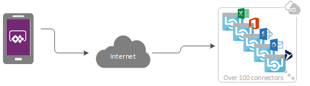
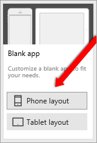
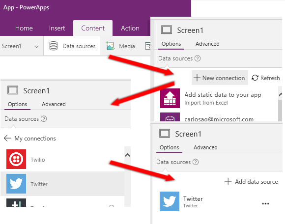
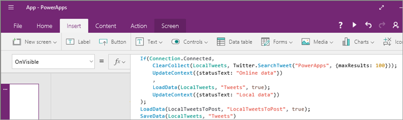

# <a name="develop-offline-capable-apps-with-powerapps"></a>Разработка приложений, поддерживающих автономный режим работы, с помощью PowerApps
Один из наиболее распространенных сценариев, с которым сталкивается разработчик мобильного приложения, — это обеспечение продуктивности пользователей в случае ограниченного подключения или его отсутствия. PowerApps включает набор функций и режимов, которые помогут вам в разработке приложений, поддерживающих автономный режим. Вы сможете:

* запускать мобильное приложение PowerApps в автономном режиме;
* запускать в автономном режиме приложение, которые вы разрабатываете;
* определять режим приложения (интерактивный, автономный или режим лимитного подключения) с помощью объекта сигнала [подключения](../canvas-apps/functions/signals.md#connection);
* использовать [коллекции](../canvas-apps/create-update-collection.md) и функции, например [LoadData и SaveData](../canvas-apps/functions/function-savedata-loaddata.md), для основного хранилища данных в автономном режиме.

## <a name="how-to-build-offline-capable-apps"></a>Как создать приложение, поддерживающее автономный режим работы
При создании сценариев с поддержкой автономного режима работы необходимо в первую очередь подумать о том, как ваше приложение будет работать с данными. Приложения в PowerApps преимущественно получают доступ к данным с помощью набора [соединителей](../canvas-apps/connections-list.md), обеспечиваемых платформой, например SharePoint, Office 365 и Common Data Service. Вы можете также создать настраиваемые соединители, которые позволят приложениям получить доступ к любой службе, предоставляющей конечную точку RESTful. Это может быть веб-API или такая служба, как Функции Azure. Все эти соединители используют протокол HTTPS через Интернет. Это означает, что пользователи должны быть в сети, чтобы получить доступ к данным и любым другим возможностям, предлагаемым службой.



### <a name="handling-offline-data"></a>Управление данными в автономном режиме
Одним из наиболее интересных аспектов PowerApps является ее набор функций и формул, позволяющих выполнять согласованные фильтрацию, поиск, сортировку, статистическое вычисление и обработку данных независимо от источника данных. Источники в приложении варьируются от коллекций в памяти до списков SharePoint, баз данных SQL и Common Data Service. Эта согласованность позволяет легко перенаправить приложение для использования другой серверной части. Что еще более важно, благодаря такой согласованности вы можете использовать локальные коллекции для управления данными, практически не изменяя логику приложения. Фактически локальные коллекции представляют собой основной механизм обработки данных в автономном режиме.

## <a name="building-an-offline-twitter-app"></a>Создание приложения Twitter, поддерживающего автономный режим работы
Сосредотачиваясь на аспектах автономного режима работы при разработке приложения, мы рассмотрим простой сценарий для Twitter. Мы создадим приложение, которое позволит читать записи Twitter, а также отправлять твиты в автономном режиме. При переходе в интерактивный режим приложение будет публиковать твиты и перезагружать локальные данные.

Приложение выполняет следующие основные действия:

1. При запуске приложения (на основе свойства **OnVisible** первого экрана):
   
   * Если устройство подключено к сети, мы напрямую получим доступ к соединителю Twitter, чтобы извлечь данные и заполнить ими коллекцию.
   * Если устройство находится в автономном режиме, мы загрузим данные из локального файла кэша с помощью функции [LoadData](../canvas-apps/functions/function-savedata-loaddata.md).
   * Мы позволим пользователям отправлять твиты: если они будут в сети — то напрямую в Twitter и с обновлением локального кэша.
2. Через каждые 5 минут (при сетевом подключении):
   
   * Мы опубликуем все твиты, которые находятся в локальном кэше.
   * Мы обновим локальный кэш и сохраним его с помощью функции [SaveData](../canvas-apps/functions/function-savedata-loaddata.md).

### <a name="step-1-create-a-new-phone-app"></a>Шаг 1. Создание нового мобильного приложения
1. Откройте PowerApps Studio.
2. Щелкните **Создать** > **Пустое приложение** > **Макет для телефона**.
   
    

### <a name="step-2-add-a-twitter-connection"></a>Шаг 2. Добавление подключения к Twitter

1. Щелкните **Содержимое** > **Источники данных**, а затем выберите **Добавление источника данных** на панели **Источники данных**.

2. Щелкните **Новое подключение**, выберите **Twitter** и щелкните **Создать**.

3. Введите свои учетные данные и создайте подключение.
   
    

### <a name="step-3-load-tweets-into-a-localtweets-collection-on-app-startup"></a>Шаг 3. Загрузка твитов в коллекцию LocalTweets при запуске приложения
Выберите свойство **OnVisible** для **экрана 1** в приложении, а затем скопируйте его в следующую формулу:

```
If(Connection.Connected,

    ClearCollect(LocalTweets, Twitter.SearchTweet("PowerApps", {maxResults: 100}));

    UpdateContext({statusText: "Online data"})

    ,

    LoadData(LocalTweets, "Tweets", true);

    UpdateContext({statusText: "Local data"})

);

LoadData(LocalTweetsToPost, "LocalTweets", true);

SaveData(LocalTweets, "Tweets")
```



Эта формула проверяет, подключено ли устройство к сети.

* Если устройство подключено к сети, формула загружает в коллекцию **LocalTweets** до 100 твитов, соответствующих поисковому запросу "PowerApps".
* Если устройство находится в автономном режиме, формула загружает локальный кэш из файла с именем Tweets, если он доступен.

### <a name="step-4-add-a-gallery-and-bind-it-to-the-localtweets-collection"></a>Шаг 4. Добавление коллекции и ее привязка к коллекции LocalTweets

1. Вставьте новую коллекцию с изменяющейся высотой — **Вставить** > **Коллекция** > **Пустая, горизонтальная, высота**.

2. Задайте свойству **Items** значение **LocalTweets**.

3. Добавьте четыре элемента управления **Метка**, чтобы отобразить данные каждого твита, а затем задайте для их свойства **Text** такие значения:
   * **ThisItem.TweetText**
   * **ThisItem.UserDetails.FullName & " @" & ThisItem.UserDetails.UserName**
   * **"RT: " & ThisItem.RetweetCount**
   * **Text(DateTimeValue(ThisItem.CreatedAtIso), DateTimeFormat.ShortDateTime)**
4. Добавьте элемент управления **Изображение**, а затем задайте для свойства **Image** значение **ThisItem.UserDetails.ProfileImageUrl**.

### <a name="step-5-add-a-connection-status-label"></a>Шаг 5. Добавление метки состояния подключения
Вставьте новый элемент управления **Метка**, а затем задайте для свойства **Text** следующую формулу:

```
If (Connection.Connected, "Connected", "Offline")
```

Эта формула проверяет, подключено ли устройство к сети. Если оно подключено, отобразится текст метки "Подключено". В противном случае — "В автономном режиме".

### <a name="step-6-add-a-text-input-to-compose-new-tweets"></a>Шаг 6. Добавление текстового поля для создания новых твитов

1. Вставьте новый элемент управления **Текстовое поле** с именем "NewTweetTextInput".

2. Задайте для его свойства **Reset** значение **resetNewTweet**.

### <a name="step-7-add-a-button-to-post-the-tweet"></a>Шаг 7. Добавление кнопки для отправки твита
1. Добавьте элемент управления **Кнопка** и задайте для свойства **Text** значение Tweet.
2. Задайте для свойства **OnSelect** следующую формулу:
   
    ```
    If (Connection.Connected,
   
        Twitter.Tweet("", {tweetText: NewTweetTextInput.Text}),
   
        Collect(LocalTweetsToPost, {tweetText: NewTweetTextInput.Text});
   
        SaveData(LocalTweetsToPost, "LocalTweetsToPost")
   
    );
   
    UpdateContext({resetNewTweet: true});
   
    UpdateContext({resetNewTweet: false})
    ```  

Эта формула проверяет, подключено ли устройство к сети.

* Если устройство подключено к сети, текст сразу же отобразится.
* Если устройство находится в автономном режиме, твит будет помещен в коллекцию **LocalTweetsToPost**, а также сохранен в приложении.

Затем формула сбрасывает текст в текстовом поле.

### <a name="step-8-add-a-timer-to-check-for-tweets-every-five-minutes"></a>Шаг 8. Добавление таймера для проверки на новые твиты каждые пять минут
Добавьте новый элемент управления **Таймер**:

* Задайте свойству **Duration** значение 300 000.

* Установите для свойства **AutoStart** значение true.

* Задайте для свойства **OnTimerEnd** следующую формулу:
  
    ```
    If(Connection.Connected,
  
        ForAll(LocalTweetsToPost, Twitter.Tweet("", {tweetText: tweetText}));
  
        Clear(LocalTweetsToPost);
  
        Collect(LocalTweetsToPost, {tweetText: NewTweetTextInput.Text});
  
        SaveData(LocalTweetsToPost, "LocalTweetsToPost");
  
        UpdateContext({statusText: "Online data"})
    )
    ```

Эта формула проверяет, подключено ли устройство к сети. Если оно подключено, приложение отправит все элементы, размещенные в коллекции **LocalTweetsToPost**. Затем коллекция будет очищена.

Теперь, когда работа приложения завершена, давайте посмотрим, как оно выглядит, а затем перейдем к проверке. На изображении слева приложение в интерактивном режиме, а справа в автономном. Приложение справа также содержит твит для отправки при переключении режима.


## <a name="testing-the-app"></a>Проверка приложения
Чтобы протестировать приложение, сделайте следующее:

1. Запустите PowerApps на мобильном устройстве, подключенном к сети. Приложение необходимо запустить по крайней мере один раз при активном подключении к сети, чтобы вы могли загрузить его на устройство.
2. Запустите приложение Twitter.
3. При этом начнут загружаться твиты, а состояние изменится на **Подключено**.
4. Полностью закройте PowerApps.
5. Установите для устройства режим "в самолете", чтобы оно находилось в автономном режиме.
6. Запустите PowerApps. Теперь можно запустить приложение Twitter автономно, и у вас также будет доступ к любым другим приложениям, ранее запущенным на этом устройстве при подключении к сети (PowerApps скрывает все приложения, которые еще не загружены на устройство).
7. Запустите приложение снова.
8. Обратите внимание, что теперь отображается состояние подключения **Не в сети**.
9. Напишите новый твит. Он сохранится локально в коллекции **LocalTweetsToPost**.
10. Выйдите из режима "самолета". После запуска таймера приложение отправит твит.

Мы надеемся, что из этой статьи вы получили представление о возможностях PowerApps для создания приложений, поддерживающих автономный режим работы. Как всегда, вы можете оставить свой отзыв на [форуме](https://powerusers.microsoft.com/t5/PowerApps-Forum/bd-p/PowerAppsForum1), а также поделиться своими примерами приложений, поддерживающих работу в автономном режиме. Для этого используйте [блог сообщества PowerApps](https://powerusers.microsoft.com/t5/PowerApps-Community-Blog/bg-p/PowerAppsBlog).

