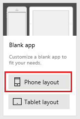
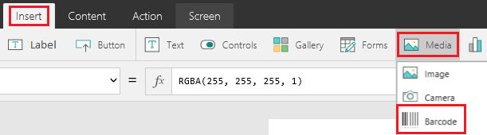
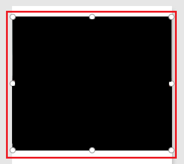
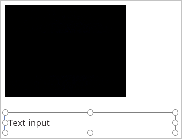
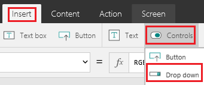
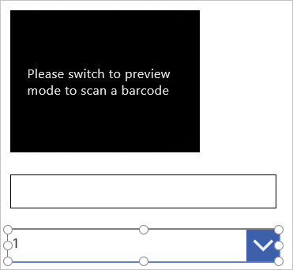
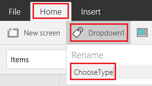

# Сканирование штрихкода в PowerApps
Вы можете сканировать штрихкоды разных типов, создав приложение и запустив его на устройстве с камерой, например на смартфоне. Числовое значение штрихкода отображается в элементе управления **Метка**, и эти данные вы можете отправить в разные [источники данных](connections-list.md).

Если вы еще не работали с PowerApps, см. статью [Введение в PowerApps](getting-started.md).

## Известные ограничения
* Штрихкод должен иметь высоту не менее 2,5 см и ширину не менее 4 см.
* Чтобы сканировать штрихкод с помощью смартфона, удерживайте его в книжной ориентации и медленно перемещайте в диапазоне расстояний от 18 до 25 см от штрихкода.
* Длинные штрихкоды (например, I2of5 с 15 или более символами) могут отображаться усеченными или иным образом искаженными, особенно если штрихкод напечатан не очень отчетливо.
* Для устройств iPhone и Android вы можете указать свойство **Высота** для элемента управления **Штрихкод**, но ширина определяется автоматически, поскольку он имеет фиксированные пропорции.
* Возможно, потребуется установить значение **35** или меньше для свойства **Scanrate** элемента управления **Штрихкод**.
* Чтобы как можно дольше не сталкиваться с проблемами нехватки памяти на устройствах под управлением iOS, для свойства **Высота** элемента **Штрихкод** задайте значение **700** или меньше, а для свойства **Scanrate** — значение **30**.
* Если приложение зависает из-за нехватки памяти на устройстве, перезапустите приложение.

## Создание пустого приложения
1. [Подпишитесь на PowerApps](../signup-for-powerapps.md), а затем выполните *одно* из следующих действий:

2. [Откройте PowerApps](https://create.powerapps.com) в браузере на любом устройстве с камерой.

3. В разделе **Start with a blank canvas or template** (Начать с пустого холста или шаблона) щелкните или коснитесь **Макет для телефона** на плитке **Пустое приложение**.

    

4. Если вы еще не знакомы с PowerApps, изучите краткий вводный обзор основных областей приложения (или используйте элемент **Пропустить**).

    

    > [!NOTE]
   > Просмотреть обзор можно в любой момент. Для этого щелкните значок вопросительного знака в правом верхнем углу экрана, а затем выберите **Take the intro tour** (Ознакомиться с кратким обзором).

## Добавление элемента управления "Штрихкод"
1. На вкладке **Вставка** выберите **Носители**, а затем — **Штрихкод**.

    

2. Убедитесь, что элемент управления **Штрихкод** выделен. Вокруг него должна быть заметна рамка выделения элемента (с маркерами для изменения размеров).

    

3. На вкладке **Главная** выберите **Barcode1**, затем введите или вставьте **MyScanner** в поле **Переименовать**.

    > [!TIP]
   > Первый добавляемый элемент управления **Штрихкод** всегда по умолчанию получает имя **Barcode1**. Если вы удалите этот элемент управления и добавите новый элемент управления **Штрихкод**, он получит имя **Barcode2**. Чтобы все ссылки в формулах содержали правильное имя, вручную переименуйте элемент управления.

    

## Добавление элемента управления "Текстовый ввод"
1. На вкладке **Вставка** щелкните или коснитесь **Текст**, а затем — **Текстовое поле**.

    Если вкладка **Вставка** не отображается, разверните окно PowerApps.

    

2. Перетащите рамку выделения (не за маркеры изменения размера!), которая отображается вокруг элемента управления **Текстовый ввод**, вниз, чтобы он оказался под элементом **MyScanner**.

    

3. Сохраняя выбранным элемент управления **Текстовый ввод**, проверьте наличие свойства **По умолчанию** в списке свойств, а затем введите или вставьте в строку формул **MyScanner.Text**.

    

## Изменение типа штрих-кода
1. На вкладке **Вставка** щелкните или коснитесь **Элементы управления**, а затем — **Раскрывающийся список**.

    

2. Переместите элемент управления **Раскрывающийся список** так, чтобы он отображался на экране под другими элементами управления.

    

3. Сохраняя выбранным элемент управления **Раскрывающийся список**, проверьте наличие свойства **По умолчанию** в списке свойств, а затем введите или вставьте следующую строку текста в строку формул: 
    **[Codabar, Code128, Code39, Ean, I2of5, Upc]**

    

4. На вкладке **Главная** переименуйте элемент управления **Раскрывающийся список**, присвоив ему имя **ChooseType**.

    

5. Щелкните элемент управления **MyScanner**, чтобы выбрать его, проверьте наличие свойства **BarcodeType** в списке свойств, а затем введите или вставьте следующую строку текста в строку формул: 
    **ChooseType.Selected.Value**

## Тестирование приложения
1. Откройте режим предварительного просмотра, нажав клавишу F5 (или нажав кнопку воспроизведения в правом верхнем углу).

    

2. Удерживайте штрихкод в поле видимости камеры устройства, пока в элементе управления **Метка** не отобразится числовой компонент штрихкода.

    Если числовой компонент не отображается, попробуйте другой вариант значения из списка **BarcodeType**. Если правильные данные по-прежнему не отображаются, введите правильный номер в элемент управления **Текстовый ввод**.

## Дальнейшие действия
* [Подключите приложение к источнику данных](add-data-connection.md) и настройте функцию **[Patch](functions/function-patch.md)**, чтобы пользователи могли сохранять результаты.
* Добавьте элемент управления **[Раскрывающийся список](controls/control-drop-down.md)** и настройте его так, чтобы пользователи могли выбрать тип штрихкода для сканирования.
* Добавьте элемент управления **[Ползунок](controls/control-slider.md)** и настройте его таким образом, чтобы пользователи могли изменить частоту опроса или высоту элемента управления **Штрихкод**.
