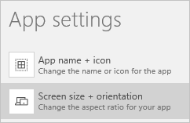

# Изменение размера и ориентации экрана в PowerApps
Настройте приложение, изменив размер и ориентацию его экрана.

## Технические условия
1. Создайте новое приложение или откройте существующее для редактирования.

2. В меню **Файл** щелкните **Параметры приложения**.

## Изменение размера и ориентации экрана
1. В разделе **Параметры приложения** щелкните или коснитесь **Размер и ориентация экрана**.

    

2. Из списка **Ориентация** выберите **Книжная** или **Альбомный режим**.

3. (Только для планшетных приложений.) В разделе **Соотношение сторон** выберите соотношение сторон для целевого устройства этого приложения.

    

4. Для параметра **Lock aspect ratio** (Заблокировать пропорции) укажите значение **On** (Вкл.) или **Off** (Выкл.).

    Если вы заблокируете пропорции, приложение сохранит соответствующие пропорции для телефона. Если приложение будет работать на устройстве другого типа, оно может отображаться неправильно и показывать нежелательные результаты. Если разблокировать пропорции, приложение адаптируется к пропорциям устройства, на котором оно работает.

5. Для параметра **Lock orientation** (Заблокировать ориентацию) укажите значение **On** (Вкл.) или **Off** (Выкл.).

    Если заблокировать ориентацию приложения, оно сохранит указанную вами ориентацию. Если приложение работает на устройстве с другой ориентацией экрана, оно может отображаться неправильно и показывать нежелательные результаты. Если разблокировать ориентацию, приложение будет адаптироваться под ориентацию экрана устройства, на котором работает.

6. Нажмите кнопку **Apply** (Применить), чтобы сохранить изменения.

## Дальнейшие действия
В меню **Файл** выберите пункт **Сохранить**, чтобы повторно опубликовать приложение с новыми параметрами.
