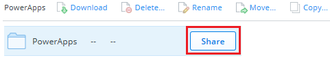
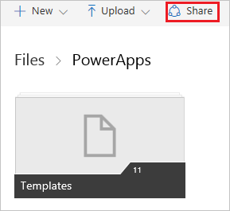
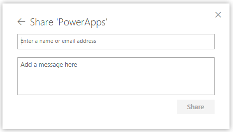
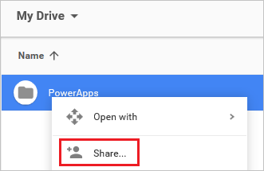

# Совместное использование данных Excel, используемых приложением
Пользователи приложения могут совместно использовать данные Excel в [облачной учетной записи](connections/cloud-storage-blob-connections.md), например OneDrive.

Например, можно создать приложение, которое показывает имена и номера телефонов группы технической поддержки вашей компании. Данные хранятся в электронной таблице Excel, которая помещена в папку в Dropbox. Можно предоставить общий доступ к этой папке пользователям приложения, чтобы они могли просматривать имена и номера телефонов.

Необходимо предоставить общий доступ к данным, чтобы пользователи могли запускать и даже изменять приложение. Пользователи, не получившие разрешения на общий доступ, не будут видеть данные в файле Excel.

В этом разделе показано, как совместно использовать данные в электронной таблице Excel, используя Dropbox, OneDrive и Google Диск. Чтобы создать приложение, которое отображает данные из файла Excel, изучите раздел [Создание приложения на основе данных Excel](get-started-create-from-data.md).

## Совместное использование данных в Dropbox
1. Войдите в Dropbox с помощью учетной записи, использованной для создания подключения PowerApps к Dropbox.
2. Выберите папку, содержащую файл Excel, а затем выберите **Поделиться**.  
   
    
3. В диалоговом окне введите электронные адреса, с помощью которых пользователи приложения входят в Dropbox.  
   
    
4. Если пользователи приложения будет добавлять, изменять или удалять данные в приложении, выберите **Может изменять**. В противном случае выберите **Может просматривать**.
5. Выберите **Поделиться**.

Дополнительные сведения см. в разделе [Общие папки: как предоставить доступ к файлам с возможностью редактирования](https://www.dropbox.com/en/help/19).

## Совместное использование данных в OneDrive
1. Войдите в OneDrive с помощью учетной записи, использованной для создания подключения PowerApps к OneDrive.
2. Выберите папку, содержащую файл, а затем выберите **Общий доступ**.  
   
    
   
    > [!NOTE]
> В OneDrive для бизнеса следует предоставлять общий доступ к самому файлу, а не папке, в которой он содержится.
3. В диалоговом окне выберите **Электронная почта**.
   
    
4. Укажите электронные адреса, с помощью которых пользователи приложения входят в OneDrive, и выберите **Общий доступ**.  
   
    

Дополнительные сведения см. в разделе [Общий доступ к файлам и папкам OneDrive](https://support.office.com/article/Share-OneDrive-files-and-folders-and-change-permissions-9fcc2f7d-de0c-4cec-93b0-a82024800c07).

## Совместное использование данных на Google Диске
1. Войдите в Google Диск с помощью учетной записи, использованной для создания подключения PowerApps к Google Диску.
2. Щелкните правой кнопкой мыши папку, содержащую файл Excel, а затем выберите **Совместный доступ**.  
   
    
3. В диалоговом окне введите электронные адреса, с помощью которых пользователи приложения входят в Google Диск.  
   
    
4. Если пользователи приложения будут добавлять, изменять или удалять данные в приложении, выберите **Перемещение и изменение** из списка разрешений. В противном случае выберите **Просмотр**.
5. Нажмите кнопку **Готово**.

Дополнительные сведения см. в разделе [Как предоставить доступ к файлам и папкам на Google Диске](https://support.google.com/drive/answer/2494822).

### Известные ограничения
[Просмотрите эти ограничения](connections/cloud-storage-blob-connections.md#known-limitations) для совместного использовании данных Excel в организации.

