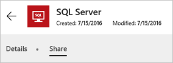

# Обмен ресурсами в приложении на основе холста в PowerApps

Прежде чем [предоставить общий доступ к приложению на основе холста](share-app.md), проанализируйте используемые им типы ресурсов, например, какие-то из следующих:

* подключение к источнику данных;
* локальный шлюз данных;
* настраиваемый соединитель;
* книга Excel или другая служба;
* поток.

Некоторые из этих ресурсов становятся общими автоматически после предоставления общего доступа к приложению. Для других ресурсов требуется, чтобы вы или пользователи, с которыми вы совместно используете приложение, выполнили дополнительные действия, что обеспечит его надлежащую работу.

Можно также предоставить общий доступ всей организации к подключениям, настраиваемым соединителям и локальному шлюзу данных.

## Соединения

Некоторые типы подключений, например SQL Server, становятся общими автоматически, но для других типов необходимо, чтобы пользователи создавали собственные подключения к источнику или источникам данных в приложении.

На сайте [powerapps.com](https://web.powerapps.com?utm_source=padocs&utm_medium=linkinadoc&utm_campaign=referralsfromdoc) можно определить, станет ли подключение общим автоматически. Кроме того, там можно обновить разрешения общего доступа. На панели навигации слева выберите или коснитесь **Управление**, **Подключения**, а затем выберите подключение или коснитесь его. Если появится вкладка **Общий доступ**, подключение станет общим автоматически.

  

## Локальные шлюзы данных
При создании и предоставлении общего доступа к приложению, содержащему данные из локального источника, [локальный шлюз данных](gateway-management.md) и определенные типы подключений к этому шлюзу станут общими автоматически. Ко всем подключениям, которые не становятся общими автоматически, можно предоставить общий доступ вручную (как показано в предыдущем разделе) или разрешить приложению предлагать пользователям создавать собственные подключения. Чтобы отобразить подключение или подключения, с помощью которых настроен шлюз, сделайте следующее:

1. Откройте сайт [powerapps.com](https://web.powerapps.com?utm_source=padocs&utm_medium=linkinadoc&utm_campaign=referralsfromdoc), на панели навигации слева выберите или коснитесь **Управление**, а затем — **Шлюзы**.
2. Щелкните шлюз или коснитесь его, а затем выберите вкладку **Подключения** или коснитесь ее.

> [!NOTE]
> Если вы предоставляете общий доступ к одному или нескольким подключениям вручную, может потребоваться повторно предоставить к ним доступ в таких случаях:

* к приложению, к которому уже предоставлен общий доступ, добавлен локальный шлюз данных;
* изменен набор пользователей или групп, которым предоставлен общий доступ к приложению с локальным шлюзом данных.

## Настраиваемые соединители
При совместном использовании приложения с настраиваемым соединителем он становится общим автоматически, но пользователи должны создавать собственные подключения к нему.

На сайте [powerapps.com](https://web.powerapps.com?utm_source=padocs&utm_medium=linkinadoc&utm_campaign=referralsfromdoc) можно просмотреть или обновить разрешения для настраиваемого соединителя. На панели навигации слева выберите или коснитесь **Управление**, **Подключения** и **Новое подключение** (в правом верхнем углу). Выберите **Настраиваемый**, а затем щелкните настраиваемый соединитель или коснитесь его, чтобы отобразить подробные сведения о нем.

## Книги Excel
Если в приложениях, к которым предоставлен общий доступ, используются данные, доступные не для всех пользователей (например, книга Excel в учетной записи хранения в облаке), [предоставьте общий доступ к этим данным](share-app-data.md).

## Потоки
При предоставлении общего доступа к приложению, содержащему поток, пользователям, запускающим приложение, будет предложено подтвердить или обновить все подключения, от которых зависит этот поток. Кроме того, настроить параметры потока может только пользователь, создавший его. Например, можно создать поток, отправляющий почту на указанный вами адрес, но другие пользователи не смогут изменить этот адрес.

