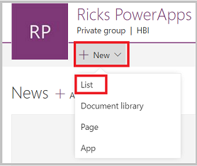
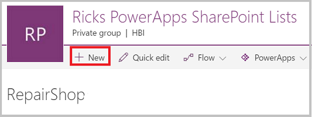
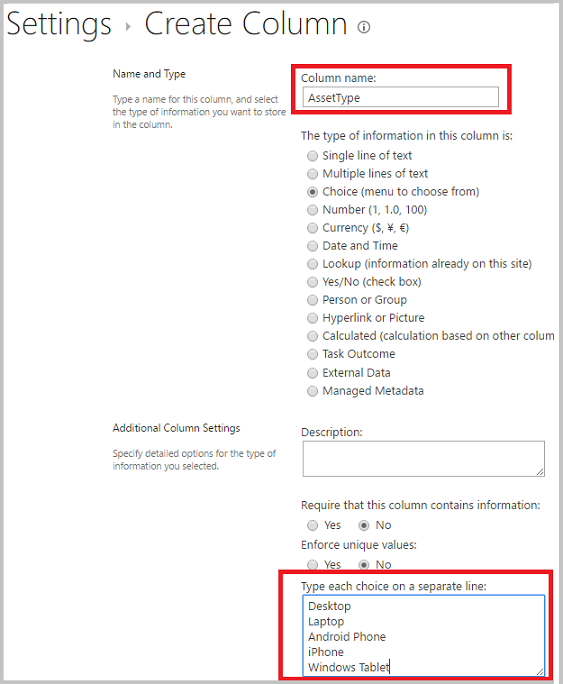

# Как связать списки SharePoint с помощью полей подстановки
В этом руководстве показано, как связать два списка SharePoint с помощью полей подстановки.

## Обзор
SharePoint предоставляет два типа полей подстановки:

* **Подстановка**. Создает связь с другим списком. Например, список *Заказы* может содержать поле подстановки со ссылками на клиентов в списке *Клиенты*.
* **Выбор**. Если щелкнуть это поле, откроется меню выбора элементов.

В рамках этого руководства вы создадите приложение с этими типами полей подстановки.

### Предназначение полей подстановки
Каждая организация хранит большое количество сложных данных. Данные в списке SharePoint часто связаны с данными в другом списке. Поля подстановки позволяют связывать эти бизнес-данные.

Например, у вас может быть список **Заказы** с полем подстановки, связывающим этот список со списком **Клиенты**, что позволяет просмотреть, какой клиент разместил заказ. Поле подстановки в списке **Заказы** позволяет также получать данные из списка **Клиенты**. Кроме того, поле подстановки позволяет создать связь между списком **Заказы** и **Товар**, благодаря чему вы можете просмотреть необходимые сведения о заказанном товаре, например изображение товара, характеристики, сведения о производителе и т. д.

### Предназначение поля выбора
Поле **выбора** используется для очень кратких списков, но в этом случае вы не создаете отдельный список, а просто включаете значения списка в небольшое меню, которое отображается при выборе этого **поля**. В конечном итоге вам нужно выбрать одно из значений.

Например, это может быть код состояния клиента, параметры доступности товара, коды стран. По сути, любой относительно короткий постоянный список. Можно реализовать эти данные в виде отдельных списков, а затем создать связь между ними с помощью **поля подстановки**, но обычно быстрее и проще реализовать их в качестве полей **выбора**.

## Создание списков в SharePoint
В этом разделе вы создадите связь между двумя настраиваемыми списками SharePoint: **Ресурсы** и **Мастерская**. Список **Ресурсы** используется, чтобы отслеживать оборудование команды. Так как время от времени оборудование выходит из строя, мы используем список **Мастерская**, чтобы отслеживать местные мастерские, где его можно починить.

### В этом примере использовались поля подстановки
В списке **Мастерская** содержится поле *Адрес электронной почты*, используемое для определения мастерской. Этот список определяется первым, поэтому каждая строка в списке **Ресурсы** указывает на что-либо.

Список **Ресурсы** содержит два поля подстановки:

* поле *Мастерская* типа **Подстановка**, указывающее на записи в списке **Мастерская** на основе адресов электронной почты,
* и поле *Тип ресурсов* типа **Выбор**, содержащее список возможных типов оборудования.

В зависимости от информации, которую необходимо отслеживать, вы можете определить дополнительные поля.

### Определение списка "Мастерская" и добавление данных
Это действие выполняется вначале. Поэтому когда вы добавляете данные в список **Ресурсы**, записи списка **Мастерская** можно выбрать в поле подстановки *Ресурсы.Мастерская*.

1. На сайте SharePoint создайте список **Мастерская**.

    

2. Добавьте поле *Адрес электронной почты* типа **Однострочный текст**.

    

3. При необходимости добавьте другие поля.

4. Щелкните **+ Создать**, чтобы добавить образцы данных в этот список (по крайней мере 3 строки с разными значениями *Адрес электронной почты*). Если нужно починить ресурс, вы можете выбрать одно их этих значений.

    

### Определение списка "Ресурсы"
1. На сайте SharePoint создайте список **Ресурсы**.

2. Щелкните знак "плюс" и выберите **Дополнительно**.

    

3. Добавьте поле *Тип ресурса* типа **Выбор** и в текстовом поле **Введите варианты выбора (каждый в отдельной строке)** введите значения, которые будут отображаться в меню выбора. Нажмите кнопку **ОК**.

    

4. Теперь добавим еще одно поле. Так же как и на шаге 2, щелкните знак "плюс" и выберите **Дополнительно**.

5. Добавьте поле *Мастерская* типа **Подстановка**, в текстовом поле **Get information from** (Получение сведений из) выберите **Мастерская**, а затем в текстовом поле **In this column** (В этом столбце) выберите *Адрес электронной почты*. Нажмите кнопку **ОК**.

    

6. При необходимости добавьте дополнительные поля.

## Создание приложения из списка "Ресурсы"
Это приложение позволяет добавлять данные в список **Ресурсы**.

1. Откройте PowerApps Studio. Если вы еще не работали с PowerApps, [зарегистрируйтесь бесплатно](https://powerapps.microsoft.com), используя адрес электронной почты организации, а затем выполните указания, чтобы скачать PowerApps Studio из Магазина Windows.

2. В меню **Файл** (с левой стороны) щелкните **Создать**, а затем выберите **SharePoint**.

    

1. В списке **Последние сайты** выберите сайт SharePoint или введите URL-адрес сайта непосредственно в текстовом поле. Нажмите кнопку **Перейти**.

    

1. На сайте SharePoint выберите главный список (в этом примере **Ресурсы**). В правом нижнем углу нажмите кнопку **Подключиться**.

    

## Добавление данных в список "Ресурсы"
Теперь вы можете запустить приложение и посмотреть, как выглядит экран просмотра сведений для полей подстановки.

1. Нажмите клавишу F5 или щелкните значок предварительного просмотра ().

2. Чтобы добавить запись, щелкните символ **+** в правом верхнем углу.

3. Введите **название** этого ресурса.

4. Щелкните раскрывающуюся стрелку **Тип ресурса**. В этом списке отображаются значения, указанные при создании этого поля. Выберите одну из записей.

    

5. Щелкните раскрывающуюся стрелку **Мастерская**. Выберите одну из записей.

    

6. В правом верхнем углу щелкните значок флажка, чтобы сохранить новую запись.

7. (Необязательно.) Повторите эту процедуру, чтобы добавить в список необходимое количество элементов.

8. Нажмите клавишу ESC, чтобы вернуться в рабочую область по умолчанию.

## Дополнительные сведения
* [Introducing support for lookups and a new sample app](https://powerapps.microsoft.com/blog/support-for-lookups/) (Добавление поддержки полей подстановки и новый пример приложения)
* [Performance, Refresh button, ForAll, and multiple field lookups](https://powerapps.microsoft.com/blog/performance-refresh-forall-multiple-field-lookups-531/) (Улучшение производительности, кнопка "Обновить", функция ForAll и отображение полей подстановки)
* [Создание приложения с помощью базы данных Common Data Service](data-platform-create-app.md)
* [Create an app from scratch using a Common Data Service database](data-platform-create-app-scratch.md) (Создание приложения "с нуля" с помощью базы данных Common Data Service)
