# Создание последовательности для управления утверждениями проектов
> [!NOTE]
> Эта статья входит в серию руководств по использованию PowerApps, Microsoft Flow и Power BI совместно с SharePoint Online. Обязательно просмотрите [вводные сведения](sharepoint-scenario-intro.md), чтобы получить общее представление о процессе и скачать связанные файлы.

В этом руководстве мы создадим последовательность для управления утверждениями проектов. Так как Microsoft Flow интегрируется с SharePoint, вы сможете быстро создать последовательность непосредственно из списка. Создаваемая последовательность активируется при добавлении элемента в список **Project Requests** (Запросы проекта). Последовательность по электронной почте отправляет сообщение пользователю, утверждающему проекты. Этот пользователь утверждает или отклоняет запрос непосредственно в сообщении. Затем последовательность отправляет сообщение пользователю, запрашивающему проекты. Это сообщение содержит утверждение или отклонение. В соответствии с выбранным вариантом последовательность обновляет список SharePoint.

## Шаг 1. Настройка шаблона последовательности
1. В списке **Project Requests** (Запросы проекта) щелкните **Flow** (Последовательность), а затем — **Create a flow** (Создать последовательность).
   
    
2. В области справа щелкните **Начинать утверждение при добавлении нового элемента**.
   
    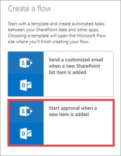
3. Войдите в SharePoint и Outlook, если вы еще не сделали это, а затем нажмите кнопку **Continue** (Продолжить).
   
    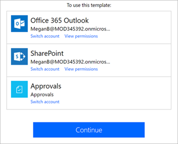
   
    Отобразится готовый к использованию шаблон для этой последовательности. Поля в последовательности представляют шаги. Каждый шаг принимает входные данные, — как полученные от предыдущих шагов, так и указанные вами. Все предыдущие шаги передают выходные данные последующим шагам.
   
    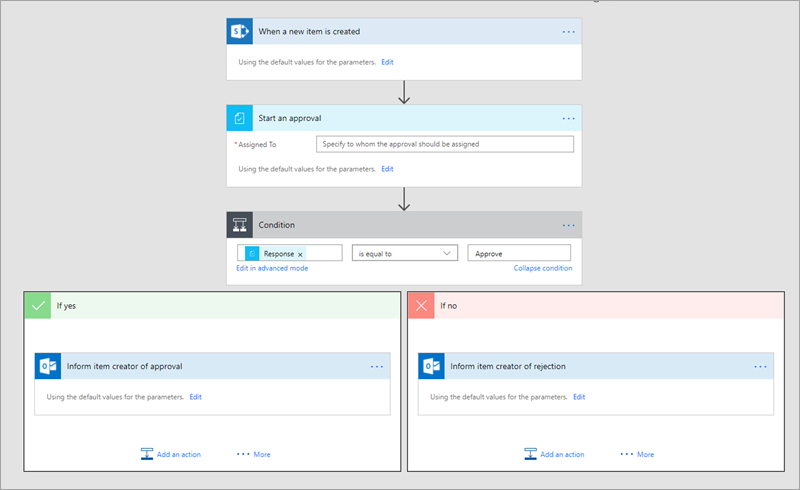
4. В поле **Назначено** введите имя, которое является допустимым в клиенте.
   
    
   
    Следующее поле в последовательности отправляет ответ на решение пользователя, утверждающему проекты. С этого момента последовательность выполняется по двум сценариям в рамках двух *ветвей*: **ДА** или **НЕТ**.
   
    

## Шаг 2. Создание действий для условия утверждения "ДА"
По умолчанию эта ветвь отправляет запрашивающей стороне сообщение с утверждением. Мы также обновим список **Запросы проекта** и добавим элемент в список **Сведения о проекте**, так как проект был утвержден.

1. В ветви **ДА** щелкните **Сообщить автору элемента об утверждении**, а затем **Изменить**, чтобы просмотреть стандартные параметры для сообщения электронной почты, отправленного запрашивающей стороне.
   
    
2. По умолчанию сообщение отправляется пользователю, создавшему элемент списка, с такой же строкой темы и текстом, как на изображении. При необходимости эти данные можно изменить.
   
    
3. Нажмите кнопку **Add an Action** (Добавить действие).
   
    
4. В разделе **Choose an action** (Выбор действия) выполните поиск по слову "SharePoint" и выберите **SharePoint – Update item** (SharePoint — изменить элемент).
   
    
5. Введите URL-адрес сайта SharePoint и имя списка.
   
    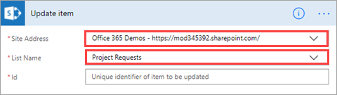
6. Выберите поле **Идентификатор** и в диалоговом окне *динамического содержимого* щелкните **Идентификатор**.
   
    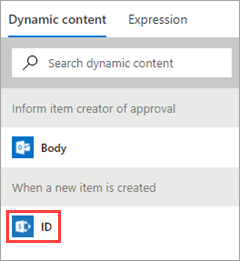
   
    Динамическое содержимое доступно в пределах последовательности в зависимости от предыдущего шага. В нашем примере доступны данные списка SharePoint — их можно использовать в создаваемых действиях.
7. Выберите поле **Title** (Заголовок), выполните поиск по слову "Title" в диалоговом окне динамического содержимого и щелкните **Title** (Заголовок).
   
    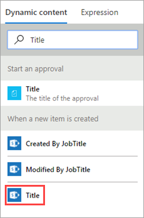
8. В поле **Approved** (Утверждено) введите "Yes" (Да). Теперь эта часть последовательности должна выглядеть приблизительно так:
   
    
9. Нажмите кнопку **Add an Action** (Добавить действие) еще раз. На этот раз мы добавим элемент в список **Project Details** (Сведения о проекте) для утвержденного проекта.
   
    
10. В разделе **Choose an action** (Выбор действия) выполните поиск по слову "SharePoint" и выберите **SharePoint – Create item** (SharePoint — создать элемент).
    
    
11. Введите URL-адрес сайта SharePoint и имя списка.
    
    
12. Выберите поле **Title** (Заголовок), выполните поиск по слову "Title" в диалоговом окне динамического содержимого и щелкните **Title** (Заголовок).
    
    
13. Выберите поле **RequestId** и в диалоговом окне динамического содержимого щелкните или коснитесь **ID**.
    
    
14. В поле **PMAssigned** введите Unassigned. Теперь эта часть последовательности должна выглядеть приблизительно так:
    
    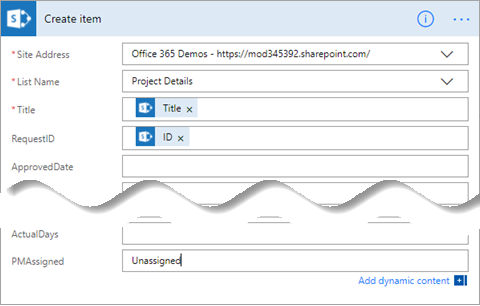

## Шаг 3: Просмотр действия для условия утверждения "НЕТ"
По умолчанию эта ветвь отправляет запрашивающей стороне сообщение с отказом. Мы также обновим список **Запросы проекта**. Мы не будем добавлять элементы в список **Запросы проекта**, так как для проекта дальнейшие действия не предусмотрены.

1. В ветви **НЕТ** щелкните **Сообщить автору элемента об отклонении**, а затем **Изменить**, чтобы просмотреть стандартные параметры для сообщения электронной почты, отправленного запрашивающей стороне.
   
    
2. По умолчанию сообщение отправляется пользователю, создавшему элемент списка, с такой же строкой темы и текстом, как на изображении. При необходимости эти данные можно изменить.
   
    
3. Нажмите кнопку **Add an Action** (Добавить действие).
   
    
4. В разделе **Choose an action** (Выбор действия) выполните поиск по слову "SharePoint" и выберите **SharePoint – Update item** (SharePoint — изменить элемент).
   
    
5. Введите URL-адрес сайта SharePoint и имя списка.
   
    
6. Выберите поле **Идентификатор** и в диалоговом окне динамического содержимого щелкните **Идентификатор**.
   
    
7. Выберите поле **Title** (Заголовок), выполните поиск по слову "Title" в диалоговом окне динамического содержимого и щелкните **Title** (Заголовок).
   
    
8. В поле **Approved** (Утверждено) введите "No" (Нет). Теперь эта часть последовательности должна выглядеть приблизительно так:
   
    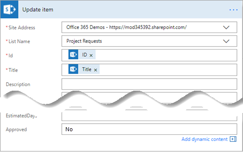
9. В правой верхней части экрана щелкните **Создать последовательность**.
   
    Последовательность создана. Если свернуть поля, она будет выглядеть приблизительно так:
   
    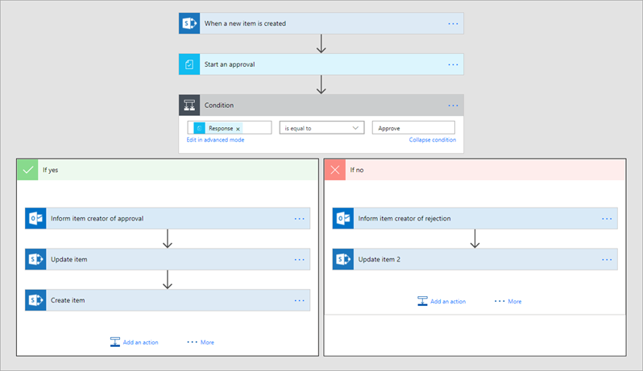

10. В правой верхней части экрана щелкните **Готово**.
   
    

## Шаг 4. Выполнение последовательности утверждения
1. В списке **Project Requests** (Запросы проекта) выберите **Quick Edit** (Быстрое редактирование) и добавьте элемент, как на снимке экрана ниже:
   
   * **Title** = "Новый монитор для Лилии"

   * **Description** = "Лилии нужен монитор диагональю 24"

   * **ProjectType** = "Новое оборудование"

   * **RequestDate** = "03.02.2017"

   * **Requestor** = "Лилия Медведева"

   * **EstimatedDays** = "1"

   * **Approved** = "Утверждено"

     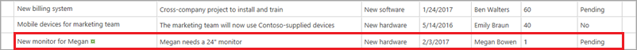
2. По окончании нажмите кнопку **Done** (Готово) в верхней части страницы.
   
    
3. Ниже показана папка "Входящие" учетной записи электронной почты утверждающего. В ней должно быть сообщение с таким содержимым:
   
    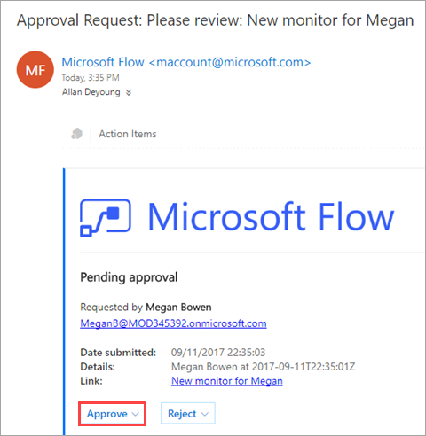
4. После нажатия кнопки **Approve** (Утвердить) или **Reject** (Отклонить) последовательность запускает следующий процесс. При этом пользователь, запрашивающий проект, получает отзыв непосредственно на электронную почту, как показано ниже.
   
    
5. Последовательность отправляет сообщение для Лилии с ответом от Артема, как показано ниже. Это сообщение получено *от* Лилии, так как она настроила последовательность.
   
    

## Дальнейшие действия
Следующий шаг в этой серии руководств — [создание приложения для управления проектами](sharepoint-scenario-build-app.md).

