# Создание приложения для управления проектами
> [!NOTE]
> Эта статья входит в серию руководств по использованию PowerApps, Microsoft Flow и Power BI совместно с SharePoint Online. Обязательно просмотрите [вводные сведения](sharepoint-scenario-intro.md), чтобы получить общее представление о процессе и скачать связанные файлы.

В этом примере мы выполним сборку приложения с нуля. Это приложение позволяет пользователям назначать руководителей проектов и обновлять сведения о проектах. Хотя вы увидите некоторые элементы управления и формулы, используемые в первом приложении, сейчас вы самостоятельно создадите другие компоненты приложения. Так как это более сложная задача, выполняя ее, вы многому научитесь.

> [!TIP]
> [Пакет загрузки](https://aka.ms/o4ia0f) для нашего примера содержит полную версию этого приложения: project-details-app.msapp.

## Краткий обзор PowerApps Studio
При выполнении последней задачи вы использовали PowerApps Studio для Web. Теперь же, прежде чем переходить к следующей задаче, давайте еще раз проверим, как вы усвоили весь материал. Вы можете и дальше использовать PowerApps Studio для Web или же перейти в [PowerApps Studio для Windows](https://aka.ms/powerappswin).

Интерфейс PowerApps Studio с тремя панелями и лентой напоминает интерфейс для создания слайдов в PowerPoint. Эти элементы управления позволяют легко создавать приложения.

1. На панели навигации слева отображаются эскизы экранов, а также иерархическое представление экранов и элементов управления приложения.
2. Центральная панель содержит рабочий экран приложения.
3. Панель справа включает такие настраиваемые параметры, как макет и источники данных.
4. В раскрывающемся списке со свойствами можно выбрать свойства, применимые к формуле.
5. Строка формул помогает добавлять формулы (как в Excel), которые определяют поведение приложения.
6. Лента позволяет добавлять элементы управления и настраивать элементы проектирования.

## Шаг 1. Создание экранов
Теперь давайте перейдем от слов к делу.

### Создание и сохранение приложения
1. В PowerApps Studio щелкните **New** (Создать), а затем в разделе **Blank app** (Пустое приложение) — **Phone Layout** (Макет для телефона).
   
    
2. Щелкните **File** (Файл). Откроется вкладка **App settings** (Параметры приложения). Введите имя "Приложение для управления проектом".
   
    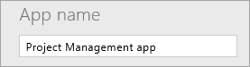
3. Щелкните **Save as** (Сохранить как), убедитесь, что приложение будет сохранено в облако, а затем щелкните **Save** (Сохранить) в правом нижнем углу.
   
    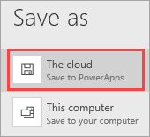

4. Выберите стрелку  для возврата в приложение.

### Добавление четырех экранов в приложение
На этом этапе мы создадим четыре пустых экрана для приложения. Мы будем использовать разные макеты экранов; у каждого из них свое назначение. Мы добавим эти экраны позже.

| **Экран** | **Назначение** |
| --- | --- |
| **SelectTask** (Выбор задачи) |Открытие экрана; переход на другие экраны. |
| **AssignManager** (Назначение руководителя) |Назначение руководителя утвержденному проекту. |
| **ViewProjects** (Просмотр проектов) |Просмотр списка проектов со сводными данными. |
| **UpdateDetails** (Обновление сведений) |Просмотр и обновление сведений о проекте. |

1. На вкладке **Home** (Главная) щелкните **NewScreen** (Создать экран), а затем — **Scrollable screen** (Окно с прокруткой).
   
    
2. Назовите экран **SelectTask** (Выбор задачи).
   
    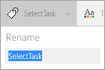
3. Создайте и переименуйте дополнительные экраны:
   
   1. Выберите **NewScreen** (Создать экран), а затем — **Scrollable screen** (Окно с прокруткой). Назовите экран **AssignManager** (Назначение руководителя).
   2. Щелкните **NewScreen** (Создать экран), а затем — **List screen** (Окно списка). Назовите экран **ViewProjects** (Просмотр проектов).
   3. Щелкните **NewScreen** (Создать экран), а затем — **Form screen** (Окно формы). Назовите экран **UpdateDetails** (Обновление сведений).
4. Нажмите кнопку с многоточием (**...** ) рядом с **Screen1** (Экран 1), а затем нажмите кнопку **Delete** (Удалить).
   
    

Приложение должно выглядеть приблизительно так:

## Шаг 2. Подключение к списку SharePoint
На этом этапе мы подключимся в SharePoint к списку **Product Details** (Сведения о продукте). Мы используем только один список в этом приложении, но вы можете легко подключиться и к другим, чтобы расширить свое приложение.

1. На панели навигации слева щелкните экран **SelectTask** (Выбор задачи).
2. В области справа нажмите кнопку **Add data source** (Добавить источник данных).
   
    
3. Щелкните **Новое подключение**.
   
    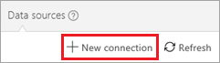
4. Щелкните **SharePoint**.
   
    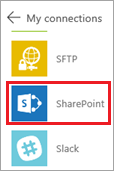
5. Щелкните **Connect directly (cloud services)** (Подключиться напрямую через облачные службы), а затем нажмите кнопку **Create** (Создать).
   
    
6. Введите URL-адрес SharePoint, а затем нажмите кнопку **Go** (Перейти).
   
    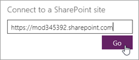
7. Выберите список **Project Details** (Сведения о проекте), а затем нажмите кнопку **Connect** (Подключить).
   
    
   
    На вкладке **Data sources** (Источники данных) в области справа отобразится созданное подключение.
   
    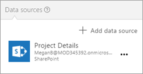

## Шаг 3. Создание экрана "SelectTask" (Выбор задачи)
На этом этапе мы определим способ перехода к другим экранам в приложении, используя элементы управления, формулы и параметры форматирования, доступные в PowerApps.

### Изменение заголовка и вставка вводного текста
1. На панели навигации слева щелкните экран **SelectTask** (Выбор задачи).
2. В центральной области выберите параметр по умолчанию **[Title]** (Заголовок), а затем в строке формул присвойте свойству **Text** значение "Управление проектами Contoso".
   
    
3. На вкладке **Insert** (Вставка) щелкните **Label** (Метка), а затем перетащите метку под верхний баннер.
   
    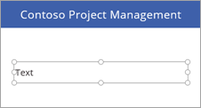
4. В строке формул определите следующие свойства для метки:
   
   * свойство **Color** = **DarkGray**;

   * свойство **Size** = **18**;

   * свойство **Text** = **"Щелкните, чтобы продолжить..."**.
     
     

### Добавление двух кнопок навигации
1. На вкладке **Insert** (Вставка) щелкните **Button** (Кнопка), а затем перетащите кнопку под метку.
   
    
2. В строке формул определите следующие свойства для кнопки:
   
   * свойство **OnSelect** = **Navigate(AssignManager, Fade)** — запустив приложение и нажав на эту кнопку, вы перейдете на второй экран в приложении (так переход будет незаметным);

   * свойство **Text** = **"Назначить руководителя"**.

3. Измените размер кнопки, чтобы вместить текст.
   
    
4. Вставьте еще одну кнопку со следующими свойствами:
   
   * свойство **OnSelect** = **Navigate(ViewProjects, Fade)**;

   * свойство **Text** = **"Обновить сведения"**.
     
     
     
     > [!NOTE]
> Кнопка называется **Обновить сведения**, но сначала мы перейдем на экран **Просмотр проектов**, чтобы выбрать проект для обновления.

### Запуск приложения
Наше приложение пока малофункционально, но вы уже можете запустить его.

1. Щелкните экран **SelectTask** (Выбор задачи). Приложение всегда запускается в PowerApps Studio с выбранным экраном в режиме предварительного просмотра.

2. Выберите стрелку  в правом верхнем углу, чтобы запустить приложение.

3. Нажмите на одну из кнопок, чтобы перейти на другой экран.

4. Выберите стрелку  в правом верхнем углу, чтобы закрыть приложение.

## Шаг 4. Создание экрана "AssignManager" (Назначение руководителя)
На этом этапе с помощью коллекции отобразим все проекты, которые утверждены и которым еще не назначен руководитель. Мы добавим другие элементы управления, чтобы вы могли назначать руководителя.

> [!NOTE]
>  Мы подумали, что будет здорово, если вы создадите такой экран, хотя позже мы также добавим в приложение страницу, которая позволяет изменять все поля проекта (включая поле "Руководитель").

1. Сохраните текущие изменения.

2. На панели навигации слева щелкните экран **AssignManager** (Назначение руководителя).

### Изменение заголовка и вставка вводного текста

1. Измените **[Title]** (Заголовок) на **AssignManager** (Назначение руководителя).

2. Добавьте метку со следующими свойствами:
   
   * свойство **Color** = **DarkGray**;

   * свойство **Size** = **18**;

   * свойство **Text** — **"Выберите проект, а затем назначьте руководителя"**.
     
     

### Добавление стрелки "Назад" для возврата на экран "SelectTask" (Выбор задачи)

1. В верхней части экрана щелкните синюю полосу.

2. На вкладке **Insert** (Вставка) щелкните **Icons** (Значки), а затем — **Left** (Влево).
   
    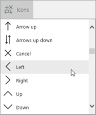

3. Переместите стрелку в левую часть синей полосы и определите следующие свойства:
   
   * свойство **Color** = **White**;

   * свойство **Height** = **40**;

   * свойство **OnSelect** = **Navigate(SelectTask, Fade)**;

   * свойство **Width** = **40**.
     
     

### Добавление и изменение коллекции

1. На вкладке **Insert** (Вставка) щелкните **Gallery** (Коллекция), а затем — **Vertical** (Вертикально).
   
    

2. Выберите **Title, subtitle, and body** (Заголовок, подзаголовок и текст) в меню **Layout** (Макет) в области справа. 
   
    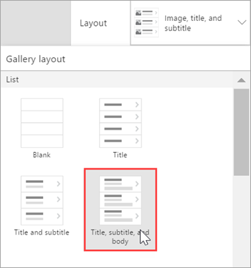
   
    Мы настроили макет коллекции, и теперь осталось заменить пример текста по умолчанию. Вот как это сделать.
   
    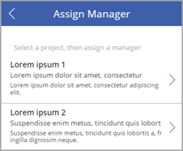

3. Определите следующие свойства для коллекции:
   
   * свойство **BorderThickness** = **1**;

   * свойство **BorderStyle** = **Dotted**;

   * свойство **Items** = **Filter('Project Details', PMAssigned="Unassigned")**. В коллекции отображаются только те проекты, которым не назначен руководитель.
     
     

4. В области справа заполните поля значениями из списка ниже:
   
   * **ApprovedDate;**

   * **Status;**

   * **Title;**
     
     

5. Измените размер меток в галерее соответствующим образом. Затем удалите стрелку из первого элемента коллекции (нам не нужно никуда переходить из этой коллекции).
   
    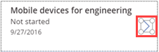
   
    Теперь экран должен выглядеть приблизительно так:
   
    

### Изменение цвета элемента при его выборе

1. Выберите коллекцию, а затем присвойте свойству **TemplateFill** значение **If (ThisItem.IsSelected=true, Orange, White)**.

2. Выберите элемент в коллекции. Теперь экран должен выглядеть приблизительно так:
   
    

### Добавление метки, поля ввода текста и кнопки "ОК" для отправки руководителю сведений о назначении

1. Щелкните за пределами коллекции, с которой вы работали.

2. На вкладке **Insert** (Вставка) щелкните **Label** (Метка). Перетащите метку под коллекцию влево. Определите следующие свойства для метки:
   
   * свойство **Size** = **20**;

   * свойство **Text** = **"Руководитель:"**.
   
   

3. На вкладке **Insert** (Вставка) щелкните **Text** (Текст), а затем — **Text input** (Ввод текста). Перетащите поле ввода текста под коллекцию в центр. Определите следующие свойства для раскрывающегося списка:
   
   * свойство **Default** = **""**;

   * свойство **Height** = **60**;

   * свойство **Size** = **20**;

   * свойство **Width** = **250**.
   
   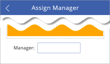

4. На вкладке **Insert** (Вставка) щелкните **Button** (Кнопка). Перетащите кнопку под коллекцию вправо. Определите следующие свойства для кнопки:
   
   * свойство **Height** = **60**;

   * свойство **OnSelect** = **Patch('Project Details', LookUp('Project Details', ID = Gallery1.Selected.ID), {PMAssigned: TextInput1.Text})**. См. [подробные сведения о формулах](#formula-deep-dive).

   * Эта формула обновляет список **Project Details** (Сведения о проекте), определяя значение для поля "PMAssigned".

   * свойство **Size** = **20**;

   * свойство **Text** — **"ОК"**;

   * свойство **Width** — **80**.
   
   

Теперь готовый экран должен выглядеть приблизительно так:

## Шаг 5. Создание экрана "ViewProjects" (Просмотр проектов)
На этом этапе мы изменим свойства коллекции на экране **ViewProjects** (Просмотр проектов). Эта галерея содержит элементы из списка **Project Details** (Сведения о проекте). Выберите элемент на экране, а затем измените сведения на экране **UpdateDetails** (Обновление сведений).

1. На панели навигации слева щелкните экран **ViewProjects** (Просмотр проектов).

2. Измените **[Title]** (Заголовок)на **ViewProjects** (Просмотр проектов).

3. На панели навигации слева щелкните **BrowserGallery1** в разделе **ViewProjects** (Просмотр проектов).

4. Выберите **Title, subtitle, and body** (Заголовок, подзаголовок и текст) в меню **Layout** (Макет) в области справа. 
   
    
   
    Мы настроили макет коллекции, и теперь осталось заменить пример текста по умолчанию.
   
    

5. Нажмите на кнопку , чтобы обновить сведения, и присвойте свойству **OnSelect** значение **Refresh('Project Details')**.

6. Нажмите на кнопку , чтобы создать элемент, и присвойте свойству **OnSelect** значение **NewForm(EditForm1); Navigate(UpdateDetails, ScreenTransition.None)**.

### Добавление стрелки "Назад" для возврата на экран "SelectTask" (Выбор задачи)

1. На панели навигации слева щелкните экран **AssignManager** (Назначение руководителя).

2. Выберите добавленную стрелку назад и скопируйте ее.

3. Вставить стрелку на экран **ViewProjects** (Просмотр проектов), разместив ее слева от кнопки "Обновить". 
   
    
   
    Для кнопки также доступны все свойства, включая свойство **OnSelect** со значением **Navigate(SelectTask, Fade)**.

### Изменение источника данных для коллекции BrowseGallery1

1. Выберите коллекцию **BrowseGallery1** и присвойте свойству **Items** коллекции значение **SortByColumns(Filter('Project Details', StartsWith(Title, TextSearchBox1.Text)), "Title", If(SortDescending1, Descending, Ascending))**.
   
    Так вы определяете для списка **Project Details** (Сведения о проекте) источник данных коллекции и назначаете поле **Title** для поиска и сортировки.

2. Выберите в первом элементе коллекции стрелку  и присвойте свойству **OnSelect** значение **Navigate(UpdateDetails, None)**.
   
    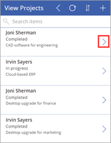

3. В области справа заполните поля значениями из списка ниже:
   
   * **Status;**

   * **PMAssigned;**

   * **Title;**
     
     
     
     Теперь готовый экран должен выглядеть приблизительно так:
     
     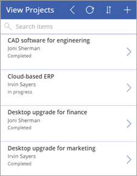

## Шаг 6. Создание экрана "UpdateDetails" (Обновление сведений)
На этом этапе мы подключим форму редактирования на экране **UpdateDetails** (Обновление сведений) к источнику данных, а затем изменим свойства и поля. На этом экране можно изменить сведения о проекте, выбранном на экране **ViewProjects** (Просмотр проектов).

1. На панели навигации слева щелкните экран **UpdateDetails** (Обновление сведений).

2. Измените **[Title]** (Заголовок) на **"UpdateDetails"** (Обновление сведений).

3. На панели навигации слева щелкните **EditForm1** в разделе **UpdateDetails** (Обновление сведений).

4. Определите следующие свойства для формы:
   
   * свойство **DataSource** = **'Project Details'**;

   * свойство **Item** = **BrowseGallery1.Selected**.

5. Выбрав форму, установите флажок рядом со следующими полями в указанном порядке:
   
   * **Title.**

   * **PMAssigned;**

   * **Status;**

   * **ProjectedStartDate**

   * **ProjectedEndDate**

   * **ProjectedDays**

   * **ActualDays**
     
     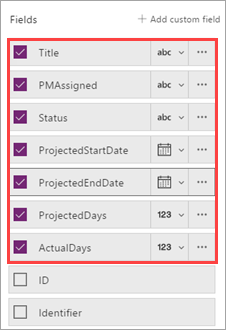
6. Выберите кнопку отмены  и присвойте свойству **OnSelect** значение **ResetForm(EditForm1); Back()**.

7. Выберите кнопку , чтобы сохранить изменения, и присвойте свойству **OnSelect** значение **SubmitForm(EditForm1)**. Так как мы используем такой элемент управления, как форма редактирования, можно использовать **Submit()**, вместо **Patch()** как это делалось ранее.

Готовый экран должен выглядеть приблизительно так (если поля пустые, убедитесь, что на экране **ViewProjects** (Просмотр проектов) выбран нужный элемент):

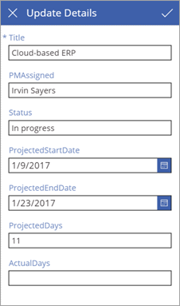

## Шаг 7. Запуск приложения
Теперь, когда приложение создано, запустим его, чтобы узнать, как оно работает. Ссылку на приложение мы добавим на сайте SharePoint. Хотя приложение можно запускать в браузере, вы можете предоставить к нему общий доступ для других людей, которые также смогут запускать его. См. дополнительные сведения о [предоставлении общего доступа к приложениям](https://powerapps.microsoft.com/guided-learning/learning-manage-share-apps).

### Добавление ссылки на приложение
1. В средстве запуска приложений Office 365 щелкните **PowerApps**.
   
    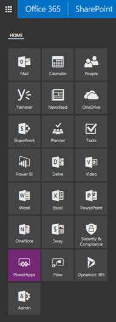

2. В PowerApps нажмите на кнопку с многоточием (**...** ) рядом с **приложением для управления проектами**, а затем — на кнопку **Open** (Открыть).
   
    

3. Скопируйте URL-адрес приложения в браузере.
   
    

4. В SharePoint щелкните **Изменить ссылки**.
   
    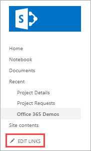

5. Нажмите на кнопку **Сохранить**.
   
    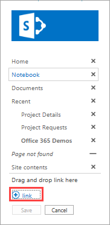

6. Введите "Приложение для управления проектом" и вставьте URL-адрес приложения.
   
    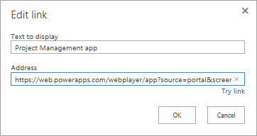

7. Щелкните **OК**, а затем — **Сохранить**.
   
    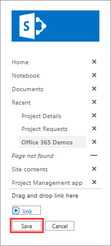

### Назначение руководителя проекта
Теперь, когда мы связали приложение с сайтом SharePoint, перейдем к настройке роли пользователя, утверждающего проекты. Мы выполним поиск проектов, которым не назначен руководитель, чтобы назначить его одному или нескольким таким проектам. Затем мы настроим роль руководителя проекта и добавим некоторые сведения о проекте, назначенному для нас.

1. Сначала откроем список **Project Details** (Сведения о проекте) в SharePoint. Два проекта имеют значение **Unassigned** (Не назначено) в столбце **PMAssigned**. Все это отображается в приложении.
   
    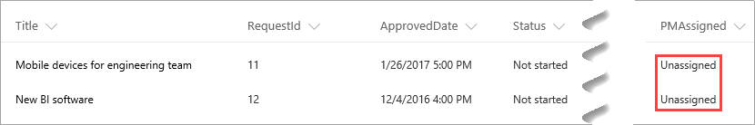

2. Щелкните ссылку, созданную для приложения.

3. На первом экране щелкните **Assign Manager** (Назначить руководителя).
   
    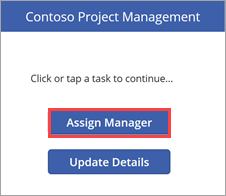

4. На экране **Assign Manager** (Назначение руководителя) появятся два неназначенных проекта из списка. Выберите проект **New BI software** (Новое оборудование BI).
   
    

5. В поле для ввода текста **Manager** (Руководитель) введите "Иван Сергеев", а затем щелкните **ОК**.
   
    Так как изменение применяется к списку, а коллекция обновляется, отобразятся только неназначенные проекты.
   
    

6. Вернитесь к списку SharePoint и обновите страницу. Вы увидите обновленную запись проекта с именем руководителя проекта.
   
    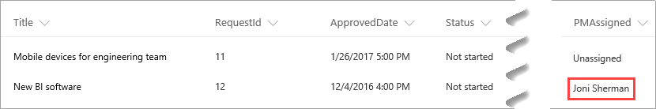

### Обновление сведений о проекте

1. Щелкните , чтобы перейти на первый экран, и нажмите кнопку **Update Details** (Обновить сведения).
   
   

2. На экране **ViewProjects** (Просмотр проектов) введите в поле поиска "New".
   
   

3. Щелкните  рядом с элементом **New BI software** (Новое программное обеспечение BI).
   
   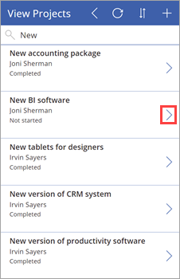

4. На экране **Update Details** (Обновление сведений) определите следующие значения:
   
   * поле **ProjectedStartDate** = "06.03.2017";

   * поле **ProjectedEndDate** = "24.03.2017";

   * поле **ProjectedDays** = "15".
   
   

5. Щелкните  для применения изменений к списку SharePoint.

6. Закройте приложение и вернитесь к списку. Мы обновили для записи проекта дату и день.
   
    

## Подробные сведения о формулах
Это второй раздел с дополнительными сведениями о формулах PowerApps. В первом разделе мы рассмотрели одну из формул, создаваемых в PowerApps для настройки коллекции обзора в приложении с тремя экранами. В этом разделе мы рассмотрим формулу, которая используется для настройки экрана **AssignManager** (Назначение руководителя) нашего второго приложения. Формула выглядит так:

**Patch ( 'Project Details', LookUp ( 'Сведения о проекте', ID = Gallery1.Selected.ID ), {PMAssigned: TextInput1.Text} )**

Для чего же используется эта формула? Когда вы выбираете элемент в коллекции и нажимаете кнопку **ОК**, формула обновляет список **Project Details** (Сведения о проекте), присваивая столбцу **PMAssigned** значение, указанное в поле ввода текста. Для этого в формуле используются следующие функции:

* [Функция **Patch**](functions/function-patch.md) изменяет одну или несколько записей источника данных.

* [Функция **LookUp**](functions/function-filter-lookup.md) находит первую запись в таблице, соответствующую условиям формулы.

Если объединить функции в формуле, произойдет следующее:

1. Нажав кнопку **ОК**, вы вызовете функцию **Patch** для обновления списка **Project Details** (Сведения о проекте).

2. В пределах функции **Patch** функция **LookUp** определяет, какая строка списка **Project Details** (Сведения о проекте) будет обновлена. Это происходит в ходе сравнения идентификатора выбранного элемента коллекции и идентификатора в списке. Например, идентификатор 12 означает, что запись для **New BI software** (Новое программное обеспечение BI) должна быть обновлена.

3. Получив соответствующий идентификатор, функция **Patch** обновляет для поля **PMAssigned** значение **TextInput1.Text**.

## Дальнейшие действия
Следующий шаг в этой серии руководств — [создание отчета Power BI для анализа проектов](sharepoint-scenario-build-report.md).

