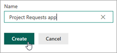
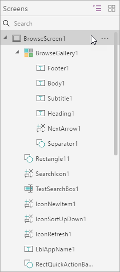
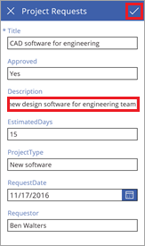

# Создание приложения для обработки запросов проекта
> [!NOTE]
> Эта статья входит в серию руководств по использованию PowerApps, Microsoft Flow и Power BI совместно с SharePoint Online. Обязательно просмотрите [вводные сведения](sharepoint-scenario-intro.md), чтобы получить общее представление о процессе и скачать связанные файлы.

Теперь, когда списки SharePoint подключены, можно создать и настроить первое приложение. PowerApps интегрируется с SharePoint, что позволяет легко создавать базовые *приложения с тремя экранами* непосредственно из списка. С помощью этого приложения вы сможете не только просматривать сводные и подробные сведения о каждом элементе списка, а также обновлять и создавать элементы. Если вы создаете приложение непосредственно из списка, оно отображается как *представление* этого списка. Такое приложение можно запустить в браузере или на мобильном телефоне.

> [!TIP]
> [Пакет загрузки](https://aka.ms/o4ia0f) для нашего примера содержит полную версию этого приложения: project-requests-app.msapp.

## Шаг 1. Создание приложения из списка SharePoint

1. В созданном списке **Project Requests** (Запросы проекта) щелкните **PowerApps** и нажмите кнопку **Create an app** (Создать приложение).
   
    

2. Введите имя приложения, например "Приложение для запросов проектов", и нажмите кнопку **Create** (Создать). Созданное приложение откроется в PowerApps Studio для Web.
   
    

## Шаг 2. Просмотр приложения в PowerApps Studio

1. В PowerApps Studio на панели навигации слева по умолчанию отображается иерархическое представление экранов и элементов управления приложения.
   
    

2. Щелкните значок эскиза, чтобы переключить представление.
   
    

3. Щелкните любой экран, чтобы открыть его на центральной панели. Отобразится три экрана:
   
    (a). **Экран обзора** — просмотр, сортировка и фильтрация данных, извлеченных из списка.
    
    (b). **Экран сведений** — просмотр дополнительных сведений об элементе.
    
    (c). **Экран изменения или создания** — изменение существующего элемента или создание нового.
      
      

## Шаг 3. Настройка экрана обзора приложения

1. Выберите экран обзора.
   
    Этот *макет* экрана содержит *коллекцию* для отображения элементов списка и *элементов управления*, таких как панель поиска и кнопка сортировки.

2. Выберите коллекцию **BrowseGallery1**, щелкнув любую запись, кроме первой.
   
    

3. В области справа в разделе **Свойства** выберите **Запросы проектов**. 

4. Обновите поля значениями из списка ниже:
   
   * **RequestDate;**

   * **Requestor.**

   * **Title;**

     

5. Выбрав **BrowseGallery1**, щелкните свойство **Items**.
   
    

6. Вставьте формулу **SortByColumns(Filter('Project Requests', StartsWith(Title, TextSearchBox1.Text)), "Title", If(SortDescending1, Descending, Ascending))**.
   
    
   
    Это позволит сортировать и искать по полю **Title**, вместо поля по умолчанию, выбранного PowerApps. См. [подробные сведения о формулах](#formula-deep-dive).

6. Откройте меню **File** (Файл) и выберите **Save** (Сохранить). Щелкните , чтобы вернуться к приложению.

## Шаг 4. Просмотр экрана сведений и редактирования в приложении
1. Выберите экран сведений.
   
    Здесь используется другой макет экрана, состоящий из *формы просмотра* для отображения сведений об элементе, выбранном в коллекции. Также в нем содержатся элементы управления, с помощью которых можно отредактировать и удалить элементы списка или вернуться к экрану обзора.
   
    

4. Выберите экран редактирования.
   
    На этом экране расположена *форма редактирования*, в которой можно изменить выбранный элемент или создать новый (если вы перешли к этой форме непосредственно с экрана обзора). На нем также расположены элементы управления, с помощью которых можно сохранить или отменить изменения.

    

## Шаг 5. Запуск приложения из списка

1. В списке **Project Requests** (Запросы проекта) выберите **All Items** (Все элементы) и **Приложение для запросов проектов**.
   
    
2. Нажмите кнопку **Open** (Открыть), чтобы открыть приложение в новой вкладке браузера.
   
    

3. В приложении щелкните  рядом с первым элементом в коллекции обзора.
   
    

4. Выберите стрелку  для изменения элемента.

5. Обновите данные в поле **Description**. Для этого замените последнее слово group словом team и щелкните .
   
   

6. Закройте вкладку браузера.

7. Вернитесь к списку **Project Requests** (Запросы проекта), выберите **Приложение для запросов проектов** и **All Items** (Все элементы).
   
   
8. Просмотрите изменения, внесенные в приложении.
   
    

Это приложение очень простое. Мы использовали только несколько основных настроек, но из примера видно, что можно быстро создать и более интересное решение. Мы переходим к следующей задаче. Но вы можете протестировать приложение еще раз, чтобы увидеть, как взаимодействуют элементы управления и формулы, определяющие поведение приложения.

## Подробные сведения о формулах
Это дополнительный раздел, в котором подробно описано, как работают формулы. На этапе 3 этой задачи мы изменили формулу для свойства **Items** в коллекции **BrowseGallery1**. В частности, мы заменили поле для сортировки и поиска, выбранное PowerApps, полем **Title**. Вот измененная формула:

**SortByColumns ( Filter ( 'Project Requests', StartsWith ( Title, TextSearchBox1.Text ) ), "Title", If ( SortDescending1, Descending, Ascending ) )**

Для чего же используется эта формула? Она позволяет определить источник данных, отображаемый в коллекции, отфильтровать данные по тексту, введенному в поле поиска, и отсортировать результаты с помощью кнопки сортировки в приложении. Для этого в формуле используются *функции*. Функции принимают параметры (т. е. входные данные), выполняют операцию (например, фильтрацию) и возвращают значение (т. е. выходное значение):

* [Функция **SortByColumns**](functions/function-sort.md) сортирует данные в таблице по одному или нескольким столбцам.
* [Функция **Filter**](functions/function-filter-lookup.md) находит записи в таблице, соответствующие условиям заданной формулы.
* [Функция **StartsWith**](functions/function-startswith.md) проверяет, начинается ли одна текстовая строка с другой.
* [Функция **If**](functions/function-if.md) возвращает одно значение, если условие истинно, и другое, если то же условие ложно.

Если объединить функции в формуле, произойдет следующее:

1. Когда вы вводите текст в поле поиска, функция **StartsWith** сравнивает этот текст с началом каждой строки в столбце **Title** списка.
   
    **StartsWith ( Title, TextSearchBox1.Text )**
   
    Например если ввести в поле поиска текст "de", отобразится четыре результата, включая элементы, начинающиеся с "Desktop" и "Device". Такие результаты, как "Mobile devices", не будут отображаться, так как они не *начинаются с* "de".

2. Функция **Filter** *возвращает* строки из таблицы **Project Requests**. Если в поле поиска нет текста для сравнения, функция **Filter** возвращает все строки.
   
    **Filter ( 'Project Requests', StartsWith ( Title, TextSearchBox1.Text )**

3. Функция **If** проверяет, какое значение установлено для переменной **SortDescending1**: True или False. Оно назначается с помощью кнопки сортировки в приложении. Затем функция возвращает значение **Descending** или **Ascending**.
   
    **If ( SortDescending1, Descending, Ascending )**

4. Теперь данные в коллекции можно отсортировать с помощью функции **SortByColumns**. В этом случае данные сортируются по полю **Title**. Но можно также сортировать и по другим полям (не только по тому, по которому выполняется поиск).

Если вы дошли до этих строк, мы надеемся, что теперь вы понимаете, как работает эта формула, а также знаете, как можно объединять функции и другие элементы, чтобы добиться нужного поведения приложения. Дополнительные сведения см. в [справочнике по формулам для PowerApps](formula-reference.md).

## Дальнейшие действия
Следующий этап в этой серии руководств — [создание потока для управления утверждениями проектов](sharepoint-scenario-approval-flow.md).

