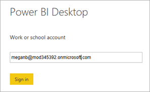
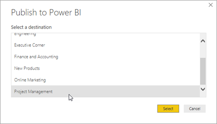
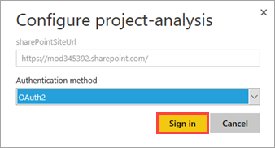

# Публикация отчета о проекте и создание панели мониторинга в Power BI
> [!NOTE]
> Эта статья входит в серию руководств по использованию PowerApps, Microsoft Flow и Power BI совместно с SharePoint Online. Обязательно просмотрите [вводные сведения](sharepoint-scenario-intro.md), чтобы получить общее представление о процессе и скачать связанные файлы.

В этом руководстве мы опубликуем набор данных и отчет в службе Power BI, а также создадим панель мониторинга на основе отчета. В большинстве случаев отчет включает множество визуализаций, из которых только часть используется на панели мониторинга. В этом примере мы добавим на панель мониторинга четыре визуализации.

## Шаг 1. Публикация набора данных и отчета
1. В Power BI Desktop на вкладке **Главная** щелкните **Опубликовать**.
   
    
2. Введите имя учетной записи службы Power BI, если вы еще не сделали это, и нажмите кнопку **Войти**.
   
    
3. Введите пароль и нажмите кнопку **Войти**.
   
    
4. Выберите целевую рабочую область для отчета и нажмите кнопку **Выбрать**. Мы рекомендуем публиковать отчет в рабочей области группы, чтобы упростить доступ к нему в SharePoint. В этом примере мы опубликуем отчет в рабочей области группы **Управление проектами**. Дополнительные сведения см. в разделе [Совместная работа в рабочей области приложения Power BI](https://docs.microsoft.com/power-bi/service-collaborate-power-bi-workspace).
   
    
5. Опубликовав отчет, перейдите по ссылке **Открыть project-analysis.pbx в Power BI**.
   
    
6. Служба Power BI загрузит отчет в браузер. Если панель навигации слева не развернута, откройте меню в левом верхнем углу **(а)**.
   
    
   
    Как видите, после публикации отчета в Power BI Desktop загружается набор **(г)** и отчет **(в)**. Панели мониторинга создаются в службе, а не приложении Power BI Desktop. В этой рабочей области еще нет панелей мониторинга **(б)**. Скоро мы создадим ее.

## Шаг 2. Настройка учетных данных для обновления
1. В правом верхнем углу службы щелкните  и выберите **Параметры**.
2. Перейдите на вкладку **Наборы данных** и выберите **project-analysis**.
   
    
3. Разверните пункт **Учетные данные источников данных**, а затем нажмите кнопку **Изменить учетные данные**.
   
    
4. Выберите способ проверки подлинности **OAuth2** и нажмите кнопку **Войти**.
   
    
5. Выберите учетную запись с разрешениями для списков SharePoint или войдите в нее.
   
    
   
    По завершении процесса в службе появится следующее сообщение:
   
    

## Шаг 3. Создание панели мониторинга

1. Чтобы вернуться к отчету, в разделе **Отчеты** выберите **project-analysis**.

1. В левом верхнем углу нажмите диаграмму, а затем — .
   
    
2. Введите имя панели мониторинга, на которой нужно закрепить диаграмму, и нажмите кнопку **Закрепить**.
   
    
3. В правом верхнем углу нажмите диаграмму, а затем — .
   
    
4. Выберите существующую панель мониторинга и нажмите кнопку **Закрепить**.
   
    

5. Закрепите остающиеся визуальные элементы (всего два).

6. На панели навигации щелкните имя панели мониторинга.
   
    

7. Просмотрите панель мониторинга. Если щелкнуть плитку, вы вернетесь к отчету.
   
    

Основная работа в Power BI выполнена. Если это ваши первые отчет и панель мониторинга, — поздравляем! Если вы уже делали это, надеемся, что вы быстро выполнили эти шаги. Теперь мы добавим оповещения, чтобы быть в курсе важных событий, связанных с панелью мониторинга.

## Дальнейшие действия
Следующий шаг в этой серии руководств — [настройка оповещений о данных для отчетов о проектах в Power BI](sharepoint-scenario-alerts-flow.md).

