# Пошаговое руководство по реализации готового сценария интеграции SharePoint Online
> [!NOTE]
> Эта статья входит в серию руководств по использованию PowerApps, Microsoft Flow и Power BI совместно с SharePoint Online. Обязательно просмотрите [вводные сведения](sharepoint-scenario-intro.md), чтобы получить общее представление о процессе и скачать связанные файлы.

В рамках этой серии руководств мы рассмотрели очень много тем — от создания приложений на основе холста и потоков до создания и внедрения отчетов в SharePoint. Мы надеемся, что вы многому научились и узнали об интеграции этих технологий. И теперь вы можете интегрировать приложения на основе холста, потоки и отчеты в SharePoint, исходя из своих потребностей. В завершение серии мы рассмотрим сценарий, на примере которого вы увидите, как взаимодействуют все компоненты.

## Шаг 1. Добавление проекта в список Project Requests (Запросы проекта)
1. В списке **Project Requests** (Запросы проекта) выберите **All Items** (Все элементы) и **Приложение для запросов проектов**.
   
    
2. Нажмите кнопку **Open** (Открыть), чтобы открыть приложение в новой вкладке браузера.
   
    
3. В приложении щелкните  для создания элемента.
4. Заполните форму следующими значениями:
   
   * **Title** = "Мобильные устройства для группы разработчиков"

   * **Approved** = "Утверждено"

   * **Description** = "Группа разработчиков будет использовать устройства, предоставленные компанией Contoso"

   * **EstimatedDays** = "30"

   * **ProjectType** = "Новое оборудование"

   * **RequestDate** = "01.03.2017"

   * **Requestor** = "Мария Петрова"
     
     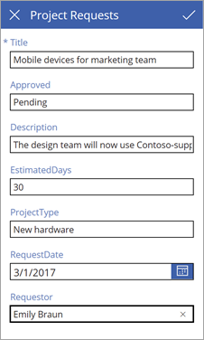
5. Выберите стрелку и закройте вкладку браузера.
6. Вернитесь к списку **Project Requests** (Запросы проекта), выберите **Приложение для запросов проектов** и **All Items** (Все элементы).
   
    
7. Просмотрите новую запись в списке.
   
    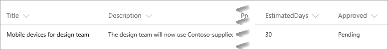

## Шаг 2. Утверждение проекта
1. Когда вы добавляете элемент на шаге 1, выполняющаяся последовательность отправляет письмо для утверждения. Ниже показана папка "Входящие" учетной записи электронной почты утверждающего.
   
    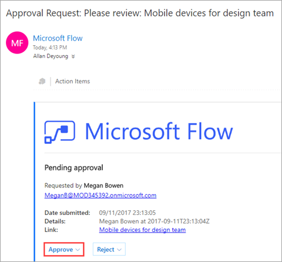
2. Нажмите кнопку **Approve** (Утвердить). Последовательность запускает следующий процесс, и пользователь, запрашивающий проект, получает отзыв непосредственно на электронную почту.
   
    
3. Письмо с утверждением можно просмотреть в папке "Входящие" учетной записи электронной почты пользователя, запрашивающего проекты.
   
    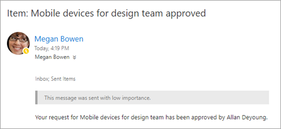
4. Просмотрите обновленную запись в списке.
   
    

## Шаг 3. Назначение руководителя проекта
1. Сначала откроем список **Project Details** (Сведения о проекте) в SharePoint. Новый проект имеет значение **Unassigned** (Не назначено) в столбце **PMAssigned**.
   
    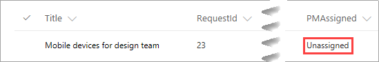
2. В области навигации слева на сайте SharePoint выберите **Project Management app** (Приложение для управления проектами).
3. На первом экране щелкните **Assign Manager** (Назначить руководителя).
   
    
4. На экране **Assign Manager** (Назначение руководителя) появятся два неназначенных проекта из списка. Выберите проект **Мобильные устройства для группы разработчиков**.
   
    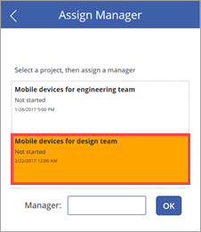
5. В поле для ввода текста **Manager** (Руководитель) введите "Иван Сергеев", а затем щелкните **ОК**.
   
    Так как изменение применяется к списку, а коллекция обновляется, отобразятся только неназначенные проекты.
   
    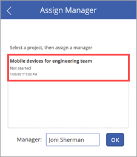
6. Закройте приложение и вернитесь к списку SharePoint. Вы увидите обновленную запись проекта с именем руководителя проекта.
   
    

## Шаг 4. Добавление предполагаемого времени выполнения проекта
1. Щелкните , чтобы перейти на первый экран, и нажмите кнопку **Update Details** (Обновить сведения).
   
    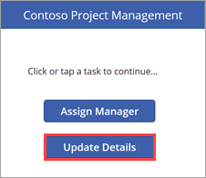
2. На экране **View Projects** (Просмотр проектов) введите в поле поиска "Мобильные".
   
    
3. Щелкните  рядом с результатом **Мобильные устройства для группы разработчиков**.
   
    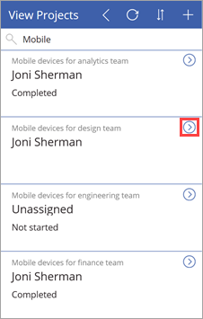
4. На экране **Update Details** (Обновление сведений) определите следующие значения:
   
   * поле **Status** = "Не начато";

   * поле **ProjectedStartDate** = "06.03.2017";

   * поле **ProjectedEndDate** = "24.03.2017";

   * поле **ProjectedDays** = "15".
     
     
5. Выберите стрелку  для применения изменений к списку SharePoint.
6. Закройте приложение и вернитесь к списку. Мы обновили для записи проекта дату и день.
   
   

## Шаг 5. Просмотр данных отчета для существующих проектов
1. В SharePoint Online щелкните **Содержимое сайта** и **Страницы сайта**.
2. Откройте страницу **Анализ проекта**, созданную ранее.
   
    
3. Просмотрите визуализацию с расхождениями.
   
    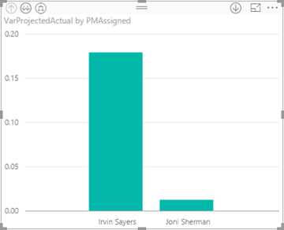
   
    При создании визуализации мы уже отметили значительное расхождение между проектами, которые выполняли Сергей Иванов и Иван Сергеев.
4. Просмотрите визуализацию, и вы увидите, что самое высокое расхождение характерно для двух проектов, на выполнение которых потребовалось больше времени, чем предполагалось.
   
    
5. Просмотрите таблицу, на которой показано время между утверждением проектов и предполагаемой датой их начала.
   
    
   
    Снова-таки, при создании визуализации мы отметили, что проекты, назначенные Сергею Иванову, начинаются позже. Два из них начинаются значительно позже остальных.

## Шаг 6. Реагирование на задержки выполнения проектов в состоянии ожидания
1. В службе Power BI выберите набор данных **project-analysis** и щелкните **Обновить**. При обновлении активируется оповещение, настроенное для проектов в ожидании.
   
    
2. По окончании обновления в правом верхнем углу **центра уведомлений** отобразится значок нового уведомления.
   
    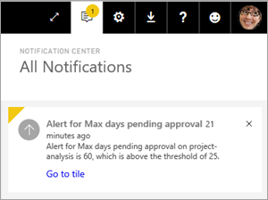
   
    Так как он может появится не сразу, проверьте через некоторое время, не отобразился ли он.
3. Откройте центр уведомлений, чтобы просмотреть сведения активированного оповещения.
   
    
4. Ниже показана папка "Входящие" пользователя, создавшего оповещение (в нашем примере это Лилия Медведева).
   
    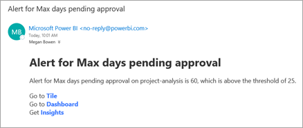
5. Ниже показана папка "Входящие" пользователя, включенного в последовательность оповещений о данных (в нашем примере это Артем Кузнецов).
   
    
6. Теперь, когда у вас есть сведения о проектах в состоянии ожидания, при необходимости вы можете утвердить любой из них.

На этом мы завершаем текущее пошаговое руководство и всю серию связанных руководств. Мы рекомендуем вам продолжить изучение материалов на следующих сайтах:

* [PowerApps](http://www.powerapps.com/)
* [Microsoft Flow](http://flow.microsoft.com)
* [Power BI](http://www.powerbi.com)
* [Сообщество бизнес-пользователей](https://powerusers.microsoft.com/)
* [SharePoint](http://sharepoint.microsoft.com)
* [Техническое сообщество Майкрософт](https://techcommunity.microsoft.com/)

Оставьте в комментариях свой отзыв об этой серии руководств. Также вы можете указать, как можно дополнить или расширить материалы, чтобы это упростило работу с описанными здесь технологиями.

