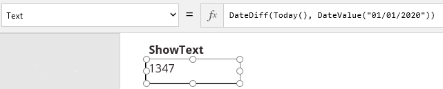
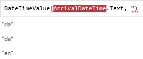
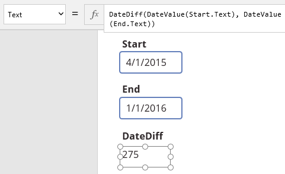
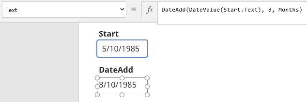

# Отображение текста, дат и времени в PowerApps
PowerApps позволяет вам добавить дату и время в приложение на основе холста, а затем отформатировать их с нужной степенью детализации или с учетом региональных параметров. Вычислите промежуток времени между двумя датами или вычислите дату, которая следует через определенное время до или после указанной даты. Преобразуйте даты в отдельные значения дней, месяцев и лет (и наоборот) и преобразуйте время в отдельные значения часов, минут и секунд (и наоборот).

Например, можно добавить данные от пользователей о биржевых торгах или встречах с клиентами, данные из внешнего источника или данные из другого приложения, созданного в PowerApps. Если данные содержат время с точностью до миллисекунд, округлите его до ближайшей минуты, чтобы облегчить восприятие. Рассчитайте, сколько дней осталось до основной вехи. Если вы хотите планировать встречи с клиентами на каждые пять дней, то можете автоматически рассчитать эти даты. Если дата "10 мая 1985 года" хранится в отдельных полях дня, месяца и года, их можно объединить в отдельное значение. И наоборот, если приложение управляет ими отдельно, можно разбить каждую дату на отдельные значения.

## Технические условия

* [Зарегистрируйтесь](../signup-for-powerapps.md) в PowerApps, а затем [войдите в систему](https://web.powerapps.com?utm_source=padocs&utm_medium=linkinadoc&utm_campaign=referralsfromdoc), указав учетные данные, использованные при регистрации.
* Создайте приложение в PowerApps или откройте уже существующее.
* Узнайте, как [настроить элемент управления](add-configure-controls.md) в PowerApps.

## Отображение текста в элементе управления "Метка"
Чтобы отобразить текст в элементе управления **[Метка](controls/control-text-box.md)**, следует присвоить значение его свойству **[Text](controls/properties-core.md)**. Для этого можно ввести текст непосредственно в элементе управления или ввести выражение в строке формул.

* Если ввести текст непосредственно в элементе управления, он отобразится, как есть.
* Если ввести выражение в строке формул, то элемент управления отобразит результат выражения.

Ниже приведено несколько примеров.

1. Добавьте элемент управления **[Метка](controls/control-text-box.md)** **ShowText** и задайте для его свойства **[Text](controls/properties-core.md)** следующую формулу:
    **Now()**
   
    Если на компьютере настроен языковый стандарт "Английский (США)", то текущие дата и время отображаются в следующем формате:  . *мм/дд/гггг чч:мм AM/PM*
   
    Если на компьютере настроен языковый стандарт "Французский", то текущие дата и время отображаются в следующем формате:  . *дд/мм/гггг чч:мм AM/PM*
2. Задайте в качестве значения свойства **[Text](controls/properties-core.md)** для **ShowText** следующую формулу.
    **DateDiff(Today(), DateValue("01/01/2020"))**
   
    
   
    В элементе управления отображается количество дней между текущей датой и 1 января 2020 года, вычисляемое с помощью следующих функций.
   
   * Функция **DateDiff**, которая вычисляет количество дней, кварталов или лет между двумя датами.
   * Функция **Today**, которая вычисляет текущий день как значение.
   * Функция **DateValue**, которая преобразовывает строковый литерал, указанный в двойных кавычках, в значение, которое можно использовать в вычислениях.
3. Добавьте элемент управления **[Текстовое поле](controls/control-text-input.md)** с именем **BirthDate** и переместите его в элемент управления **ShowText**.

4. В **BirthDate** введите месяц и день рождения (например, **05/18**).

5. Задайте в качестве значения свойства **[Text](controls/properties-core.md)** для **ShowText** следующую формулу.
    **DateDiff(Today(), DateValue(BirthDate.Text))**
   
    
   
    **ShowText** показывает число дней между текущей датой и датой, указанной в **BirthDate**. Если ваш день рождения в этом году уже прошел, то **ShowText** отображает отрицательное значение.

## Форматирование дат и времени с помощью DateTimeValue
Можно преобразовать даты и время из текстовых строк в значения, которые можно различными способами отформатировать и использовать в вычислениях. Указать формат можно с помощью встроенных и пользовательских параметров.

> [!NOTE]
> Функции **[DateTimeValue](functions/function-datevalue-timevalue.md)** и **[DateValue](functions/function-datevalue-timevalue.md)** преобразовывают даты в любых из указанных форматов в значения.  
> 
> * ММ/ДД/ГГГГ  
> * ДД/ММ/ГГГГ  
> * ДД Мес ГГГГ  
> * Месяц ДД, ГГГГ  
> 
> 

1. Добавьте элемент управления **[Текстовое поле](controls/control-text-input.md)** с именем **ArrivalDateTime** и введите дату и время в указанном ниже формате.
    **5/10/85 6:15 AM**
2. Добавьте элемент управления **[Метка](controls/control-text-box.md)** **ShowDate** и задайте для его свойства **[Text](controls/properties-core.md)** следующую формулу:
    **DateTimeValue(ArrivalDateTime.Text)**
   
    
   
    **ShowDate** показывает введенные вами сведения, но преобразованные из текста в значение и по-другому отформатированные. Например, год показан в виде четырех цифр, а не двух.
3. Измените значение свойства **[Text](controls/properties-core.md)** для **ShowDate**, введя следующую формулу.
    **DateTimeValue(ArrivalDateTime.Text, "fr")**
   
    
   
    **ShowDate** отображает день перед месяцем, как ожидал бы французский пользователь.
   
   > [!TIP]
   > Чтобы отобразить список других языковых стандартов в Intellisense, удалите закрывающую кавычку и **fr** из формулы, но оставьте открывающую кавычку.
   > 
   > 
   > 
   > 
4. Чтобы использовать один из нескольких встроенных форматов, задайте для свойства **[Text](controls/properties-core.md)** элемента управления **ShowDate** следующую формулу.
    **Text(DateTimeValue(ArrivalDateTime.Text), DateTimeFormat.LongDateTime)**
   
    
   
    **ShowDate** показывает день недели, дату и время.
   
   > [!TIP]
   > Параметр **DateTimeFormat** поддерживает несколько встроенных форматов. Чтобы отобразить этот список, удалите **LongDateTime** из формулы.
   > 
   > 
5. Чтобы использовать настраиваемый формат, измените значение свойства **[Text](controls/properties-core.md)** для **ShowDate**, введя следующую формулу.
    **Text(DateTimeValue(ArrivalDateTime.Text), "mm/dd/yyyy hh:mm:ss.fff AM/PM")**
   
    
   
    **ShowDate** показывает значение даты и времени в формате, который вы указали, включая миллисекунды.
   
   > [!TIP]
   > Чтобы округлять значение времени до ближайшей десятой или сотой доли секунды, укажите в формуле **hh:mm:ss.f** или **hh:mm:ss.ff**.
   > 
   > 

## Форматирование даты с помощью DateValue

1. Добавьте элемент управления **[Текстовое поле](controls/control-text-input.md)** с именем **ArrivalDate** и введите в нем дату (например, **5/10/85**).

2. Добавьте элемент управления **[Метка](controls/control-text-box.md)** **FormatDate** и задайте для его свойства **[Text](controls/properties-core.md)** следующую формулу:
    **DateValue(ArrivalDate.Text)**
   
    **FormatDate** показывает введенную дату, за исключением того, что год отображается в виде четырех цифр.
3. Задайте в качестве значения свойства **[Text](controls/properties-core.md)** для **FormatDate** следующую формулу.
    **DateValue(ArrivalDate.Text, "fr")**
   
    **FormatDate** отображает день перед месяцем, как ожидал бы французский пользователь.
4. Чтобы использовать один из нескольких встроенных форматов, задайте для свойства **[Text](controls/properties-core.md)** элемента управления **FormatDate** следующую формулу.
    **Text(DateValue(ArrivalDate.Text), DateTimeFormat.LongDate)**
   
    **FormatDate** показывает день недели, месяц, день и год.
5. Чтобы использовать настраиваемый формат, задайте для значения свойства **[Text](controls/properties-core.md)** для **FormatDate** следующую формулу.
    **Text(DateValue(ArrivalDate.Text), "yy/mm/dd")**
   
    **FormatDate** показывает дату в указанном вами формате.

## Форматирование времени с помощью DateTimeValue

1. Добавьте элемент управления **[Текстовое поле](controls/control-text-input.md)** с именем **ArrivalTime** и введите в нем **6:15 AM**.

2. Добавьте элемент управления**[Метка](controls/control-text-box.md)** с именем **ShowTime**.

3. Чтобы использовать один из нескольких встроенных форматов, задайте для свойства **[Text](controls/properties-core.md)** элемента управления **ShowTime** следующую формулу.
    **Text(DateTimeValue(ArrivalTime.Text), DateTimeFormat.LongTime)**
   
    **ShowTime** показывает время, которое вы указали, включая секунды.
4. Чтобы использовать настраиваемый формат, задайте для значения свойства **[Text](controls/properties-core.md)** для **ShowTime** следующую формулу.
    **Text(DateTimeValue(ArrivalTime.Text), "hh:mm:ss.fff AM/PM")**
   
    **ShowTime** показывает время, которое вы указали, включая секунды и миллисекунды.
   
   > [!TIP]
   > Чтобы округлять значение времени до ближайшей десятой или сотой доли секунды, введите в формулу **hh:mm:ss.f** или **hh:mm:ss.ff**.
   > 
   > 

## Отображение времени между датами

1. Добавьте два элемента управления **[Текстовое поле](controls/control-text-input.md)**, **Start** и **End**.

2. Введите **4/1/2015** в **Start** и **1/1/2016** — в **End**.

3. Добавьте элемент управления **[Метка](controls/control-text-box.md)** **DateDiff** и задайте для его свойства **[Text](controls/properties-core.md)** следующую формулу:
    **DateDiff(DateValue(Start.Text), DateValue(End.Text))**
   
    
   
    **DateDiff** показывает **275**. Это число дней между 1 апреля 2015 года и 1 января 2016 года.
4. Задайте в качестве значения свойства **[Text](controls/properties-core.md)** для **DateDiff** следующую формулу.   **DateDiff(DateValue(Start.Text), DateValue(End.Text), Months)**
   
    **DateDiff** показывает **9**. Это число месяцев между 1 апреля 2015 года и 1 января 2016 года. Замените **Months** на **Quarters** или **Years**, чтобы отобразить значение в кварталах или годах.

## Определение даты до или после другой даты

1. Добавьте элемент управления **[Текстовое поле](controls/control-text-input.md)** с именем **Start** и введите в нем **5/10/1985**.

2. Добавьте элемент управления **[Метка](controls/control-text-box.md)** **DateAdd** и задайте для его свойства **[Text](controls/properties-core.md)** следующую формулу:
    **DateAdd(DateValue(Start.Text), 3)**
   
    
   
    **DateAdd** показывает **5/13/1985**. Это дата на три дня позже даты в **Start**.
3. Задайте в качестве значения свойства **[Text](controls/properties-core.md)** для **DateAdd** следующую формулу.
    **DateAdd(DateValue(Start.Text), -3)**
   
    
   
    **DateAdd** показывает **5/7/1985**. Это дата на три дня раньше даты в **Start**.
4. Измените значение свойства **[Text](controls/properties-core.md)** для **DateAdd**, введя следующую формулу.
    **DateAdd(DateValue(Start.Text), 3, Months)**
   
    
   
    Метка показывает **8/10/1985**. Это дата на три месяца позже даты в **Start**. Замените **Months** на **Quarters** или **Years**, чтобы определить дату через указанное число кварталов или лет до или после даты в **Start**.

## Вычисление дат на основе года, месяца и дня

1. Добавьте три элемента управления **[Раскрывающийся список](controls/control-drop-down.md)**, **Year**, **Month** и **Day**.

2. Задайте для свойства **[Items](controls/properties-core.md)** элемента управления **Year** следующую формулу.
    **Table({Year:"2014"}, {Year:"2015"}, {Year:"2016"})**

3. Задайте для свойства **[Items](controls/properties-core.md)** элемента управления **Month** следующую формулу.
    **Table({Month:"1"}, {Month:"2"}, {Month:"3"}, {Month:"4"}, {Month:"5"}, {Month:"6"}, {Month:"7"}, {Month:"8"}, {Month:"9"}, {Month:"10"}, {Month:"11"}, {Month:"12"})**

4. Задайте для свойства **[Items](controls/properties-core.md)** элемента управления **Day** следующую формулу.
    **Table({Day:"1"}, {Day:"2"}, {Day:"3"}, {Day:"4"}, {Day:"5"}, {Day:"6"}, {Day:"7"}, {Day:"8"}, {Day:"9"}, {Day:"10"}, {Day:"11"}, {Day:"12"}, {Day:"13"}, {Day:"14"}, {Day:"15"}, {Day:"16"}, {Day:"17"}, {Day:"18"}, {Day:"19"}, {Day:"20"}, {Day:"21"}, {Day:"22"}, {Day:"23"}, {Day:"24"}, {Day:"25"}, {Day:"26"}, {Day:"27"}, {Day:"28"}, {Day:"29"}, {Day:"30"}, {Day:"31"})**

5. Добавьте элемент управления **[Метка](controls/control-text-box.md)** и задайте в качестве значения свойства **[Text](controls/properties-core.md)** следующую формулу:
    **Text(Date(Value(Year.Selected.Value), Value(Month.Selected.Value), Value(Day.Selected.Value)), DateTimeFormat.LongDate)**
   
    По умолчанию отображается **Среда, 1 января, 2014**. Выберите другие значения в элементах управления **[Раскрывающийся список](controls/control-drop-down.md)**, чтобы изменить дату в элементе управления **[Метка](controls/control-text-box.md)**.

Может потребоваться преобразовать данные, которые не ожидаются. Если добавить элементы управления **[Текстовое поле](controls/control-text-input.md)** вместо **[Раскрывающийся список](controls/control-drop-down.md)**, то пользователь может ввести неправильную дату, например 45 мая. Функция **[Date](functions/function-date-time.md)** обрабатывает нетипичные данные следующими способами.

* Если значение года находится в диапазоне от 0 до 1899 (включительно), то функция прибавляет это значение к числу 1900 и вычисляет год.
* Если значение года находится в диапазоне от 1900 до 9999 (включительно), то функция использует его в качестве года.
* Если значение года меньше 0 или превышает 10000, то функция возвращает значение ошибки.
* Если значение месяца превышает 12, то функция добавляет соответствующее количество месяцев к первому месяцу указанного года.
* Если значение месяца меньше 1, то функция вычитает соответствующее количество месяцев, плюс 1 месяц, от первого месяца указанного года.
* Если значение дня превышает количество дней в указанном месяце, то функция добавляет это значение к первому дню месяца и возвращает соответствующую дату из следующего месяца.
* Если значение дня меньше 1, то функция вычитает это значение, плюс 1 день, от первого дня указанного месяца.

## Вычисление времени на основе часов, минут и секунд

1. Добавьте два элемента управления **Раскрывающийся список**, **Hour** и **Minute**.

2. Задайте для свойства **[Items](controls/properties-core.md)** элемента управления **Hour** следующую формулу.
    **Table({Hour:"9"}, {Hour:"10"}, {Hour:"11"}, {Hour:"12"}, {Hour:"13"}, {Hour:"14"}, {Hour:"15"}, {Hour:"16"}, {Hour:"17"})**

3. Задайте для свойства **[Items](controls/properties-core.md)** элемента управления **Minute** следующую формулу.
    **Table({Minute:"0"}, {Minute:"15"}, {Minute:"30"}, {Minute:"45"})**

4. Добавьте элемент управления **[Метка](controls/control-text-box.md)** и задайте в качестве значения свойства **[Text](controls/properties-core.md)** следующую формулу:  
    **Text(Time(Value(Hour.Selected.Value), Value(Minute.Selected.Value), 0), DateTimeFormat.ShortTime)**

5. Выберите **15** в списке **Hour** и **45** — в списке **Minute**.
   
    В элементе управления **[Метка](controls/control-text-box.md)** отображается **15:45**.
   
    Можно добавить записи в списки **Hour** и **Minute**, чтобы пользователи могли выбирать больший диапазон часов и более точное значение минут. Можно также добавить третий элемент управления **[Раскрывающийся список](controls/control-drop-down.md)**, чтобы пользователи могли указать секунды. Если вы добавили третий список, в свойстве **[Text](controls/properties-core.md)** элемента управления **[Метка](controls/control-text-box.md)** укажите следующее выражение. **Text(Time(Value(Hour.Selected.Value), Value(Minute.Selected.Value), Value(Second.Selected.Value)), DateTimeFormat.LongTime)**

