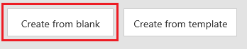
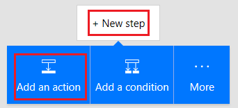
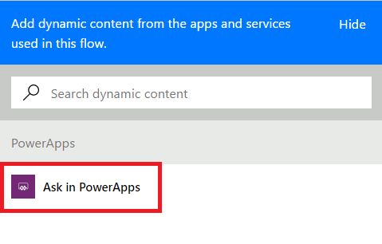
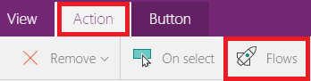

# Запуск потока в приложении на основе холста

Microsoft Flow позволяет создать логику, выполняющую какой-то набор задач, когда в приложении на основе холста происходит определенное событие. Например, настройте кнопку таким образом, чтобы при ее нажатии в списке SharePoint создавался элемент, отправлялось электронное сообщение или запрос на собрание, файл добавлялся в облако или чтобы выполнялись все из перечисленных действий. Вы можете настроить любой элемент управления в приложение для запуска последовательности, которая будет выполняться, даже если закрыть PowerApps.

## Технические условия

* [Регистрация](../signup-for-powerapps.md) в PowerApps.
* Узнайте, как [настроить элемент управления](add-configure-controls.md).

## Создание последовательности

1. Войдите на сайт [powerapps.com](http://web.powerapps.com?utm_source=padocs&utm_medium=linkinadoc&utm_campaign=referralsfromdoc), а затем на панели навигации слева выберите **Потоки**.

2. На странице **Мои потоки** выберите **Создать с нуля**.

    

    **PowerApps** добавляется как триггер по умолчанию.

    

3. Выберите **New step** (Новый шаг), а затем — **Добавить действие**.

    

4. В поле с текстом **Поиск по всем службам и действиям** укажите действие для последовательности, как показано в следующем примере.

   1. В поле введите **SharePoint**, а затем из списка **Действия** выберите **SharePoint — Create item** (SharePoint — создать элемент).

       

   2. При появлении запроса введите учетные данные для подключения к SharePoint.

   3. В поле **Адрес сайта** введите или вставьте URL-адрес сайта SharePoint Online, содержащего список.

       > [!NOTE]
      > Укажите URL-адрес для сайта без списка.

   4. В поле **Имя списка** выберите список, который нужно использовать.

   5. Щелкните (коснитесь) поле **Заголовок**, а затем выберите **Добавить динамическое содержимое**.

       

   6. В списке параметров выберите **Спросить в PowerApps**.

       

5. (Необязательно.) Укажите одно или несколько дополнительных действий, например отправку письма об утверждении на указанный адрес или создание связанной записи в другом источнике данных.

6. В верхней части экрана введите или вставьте имя своей последовательности и выберите **Создать поток**.

    

## Добавление последовательности в приложение
1. В PowerApps в меню **Файл** выберите **Создать**.

2. На плитке **Пустое приложение** выберите **Макет для телефона**.

3. Добавьте элемент управления **[Текстовое поле](controls/control-text-input.md)** и назовите его **RecordTitle**.

4. Добавьте элемент управления **[Кнопка](controls/control-button.md)** и переместите его под элемент управления **RecordTitle**.

5. Выберите элемент управления **[Кнопка](controls/control-button.md)**, а затем на вкладке **Действие** щелкните **Потоки**.

    

6. В появившейся области выберите последовательность, созданную при выполнении предыдущей процедуры.

    > [!NOTE]
   > Если последовательность, которую вы создали, недоступна, убедитесь, что в PowerApps выбрана именно то окружение, в котором эта последовательность была создана.

    

7. В строке формул введите или вставьте **RecordTitle.Text)** в конце формулы, добавленной автоматически.

    

## Тестирование последовательности
1. Откройте режим предварительного просмотра, нажав клавишу F5 (или выбрав стрелку в правом верхнем углу).

    

2. Введите или вставьте текст в элементе управления **RecordTitle**, а затем щелкните (коснитесь) элемент управления **[Кнопка](controls/control-button.md)**.

    После этого в заданном списке с текстом, указанным в качестве заголовка, будет создан элемент SharePoint. Если список был открыт при выполнении последовательности, может потребоваться обновить окно браузера для отображения изменений.
