# Общие сведения о формах данных в Microsoft PowerApps
Добавьте три типа элементов управления, чтобы пользователь мог просматривать записи, отображать подробные сведения об этой записи и изменять или создавать запись:

| Действие | Элемент управления | Описание |
| --- | --- | --- |
| **Просмотр записи** |Элемент управления **[Коллекция](controls/control-gallery.md)** |Фильтрация, сортировка, поиск и просмотр записей в источнике данных, а также выбор определенной записи. Отображаются только несколько полей из каждой записи, чтобы отобразить несколько записей одновременно даже на небольшом экране. |
| **Отобразить сведения о записи** |Элемент управления **[Форма отображения](controls/control-form-detail.md)** |Отображение нескольких или всех полей для отдельной записи. |
| **Изменить или создать запись** |Элемент управления **[Форма редактирования](controls/control-form-detail.md)** |Обновление одного или нескольких полей в одной записи (или создание записи, начиная со значений по умолчанию) и сохранение этих изменений в источнике данных. |

Поместите каждый элемент управления на другой экран, чтобы их проще было различать:

Как описано в этом разделе, чтобы создать пользовательский интерфейс, эти элементы управления сочетаются с формулами.

## Технические условия

* [Зарегистрируйтесь](../signup-for-powerapps.md) в PowerApps, а затем [войдите в систему](https://web.powerapps.com), указав учетные данные, использованные при регистрации.
* Узнайте, как [настроить элемент управления](add-configure-controls.md) в PowerApps.

## Обзор созданного приложения
PowerApps может автоматически создавать приложения на основе указанного источника данных. Каждое приложение содержит три экрана с описанными ранее элементами управления и формулами, которые связывают их. Эти "готовые" приложения можно запустить, настроить для определенных задач или посмотреть, как они работают, чтобы изучить полезные идеи для собственных приложений. В следующих разделах изучите экраны, элементы управления и формулы, определяющие создаваемое приложение.  

### Экран обзора
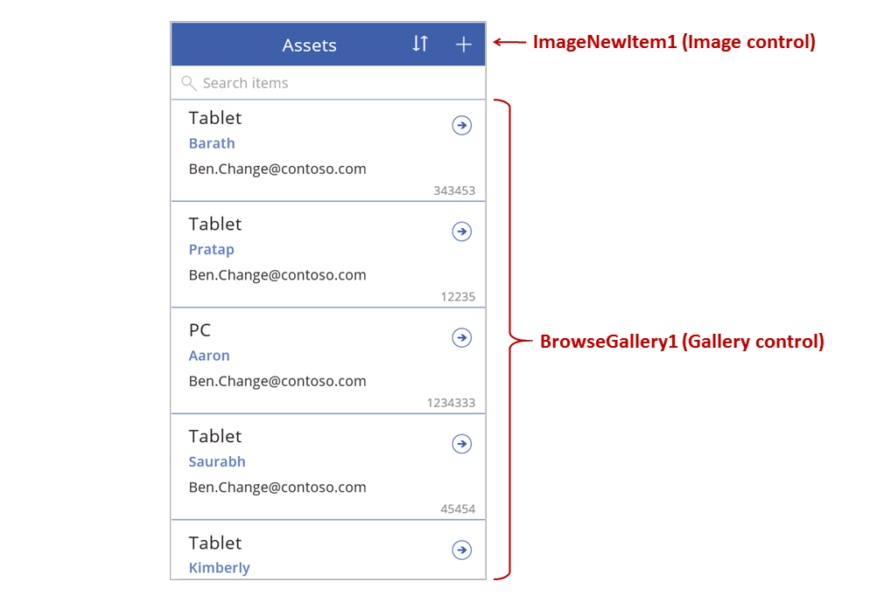

На этом экране используются такие основные формулы:

| Элемент управления | Поддерживаемое поведение | Формула |
| --- | --- | --- |
| **BrowseGallery1** |Отображение записей из источника данных **Assets**. |Для свойства коллекции **[Items](controls/properties-core.md)** задана формула на основе источника данных **Assets**. |
| **ImageNewItem1** |Отображается экран **Edit and Create**, в каждом поле которого установлено значение по умолчанию, чтобы пользователь без труда мог создать запись. |Для свойства **[OnSelect](controls/properties-core.md)** на рисунке задана эта формула:  **NewForm( EditForm1 ); Navigate( EditScreen1, None )** |
| **NextArrow1** (в коллекции) |Отображение экрана **Details** для просмотра нескольких или всех полей текущей выбранной записи. |Для свойства стрелки **[OnSelect](controls/properties-core.md)** задана эта формула: **Navigate( DetailScreen1, None )** |

Здесь основной элемент управления **BrowseGallery1** охватывает большую часть области экрана. Пользователь может просматривать коллекцию, чтобы найти конкретную запись для отображения дополнительных полей или обновления.

Задайте свойство **[Items](controls/properties-core.md)** коллекции, чтобы отобразить записи из источника данных в ней. Например, задайте для свойства значение **Assets**, чтобы отображались записи из источника данных с этим именем.

> [!NOTE]
> В созданном приложении для свойства **[Items](controls/properties-core.md)** задана значительно более сложная формула по умолчанию, чтобы пользователь мог сортировать записи и искать их. Вы узнаете, как создать такую формулу далее в этом разделе; сейчас достаточно более простой версии.

Вместо поиска записи для ее просмотра или изменения, пользователь может создать запись, выбрав символ "+" над коллекцией. Создайте этот эффект, добавив элемент управления **[Изображение](controls/control-image.md)**, отображающий символ "+", и задайте для его свойства **[OnSelect](controls/properties-core.md)** эту формулу:
 **NewForm( EditForm1 ); Navigate( EditScreen1, None )**

Эта формула открывает экран **Edit and Create**, на котором содержится элемент управления **[Форма редактирования](controls/control-form-detail.md)** с именем **EditForm1**. Формула также переключает эту форму в режим **New**, в котором форма отображает значения по умолчанию из источника данных, чтобы пользователь без труда мог создать запись с нуля.

Чтобы просмотреть любой элемент управления, который отображается в **BrowseGallery1**, выберите этот элемент управления в первом разделе этой коллекции, который выступает в качестве шаблона для всех других разделов. Например, выберите средний элемент управления **[Метка](controls/control-text-box.md)** у левого края:

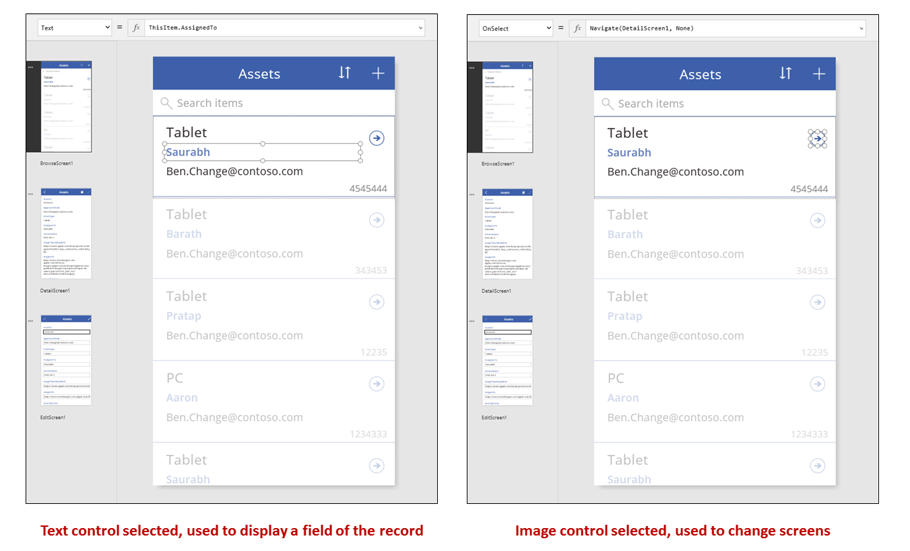

В этом примере для свойства **[Text](controls/properties-core.md)** элемента управления задано значение **ThisItem.AssignedTo**, которое является полем в источнике данных **Assets**. Для свойства **[Text](controls/properties-core.md)** других трех элементов управления **[Метка](controls/control-text-box.md)** в коллекции заданы аналогичные формулы, и все элементы управления отображают разные поля в источнике данных.  

Выберите элемент управления **[Форма](controls/control-shapes-icons.md)** (стрелка) и подтвердите, что для его свойства **[OnSelect](controls/properties-core.md)** задана эта формула:
 **Navigate( DetailScreen1, None )**

Если пользователь найдет запись в **BrowseGallery1**, он может выбрать стрелку для этой записи, чтобы отобразить дополнительные сведения о ней на экране **DetailScreen1**. Выбрав стрелку, пользователь изменяет значение свойства **Selected** в **BrowseGallery1**. В этом приложении данное свойство определяет, какая запись отображается не только в **DetailScreen1**, но также, если пользователь решил обновить запись, на экране **Edit and Create**.

### Экран сведений

На этом экране используются такие основные формулы:

| Элемент управления | Поддерживаемое поведение | Формула |
| --- | --- | --- |
| **DetailForm1** |Отображение записи в источнике данных **Assets** |Задайте для свойства **[DataSource](controls/control-form-detail.md)** значение **Assets**. |
| **DetailForm1** |Определяет запись для отображения. В созданном приложении отображает запись, которую пользователь выбрал в коллекции. |Задайте для свойства **[Item](controls/control-form-detail.md)** этого элемента управления такое значение: **BrowseGallery1.Selected** |
| Элементы управления **[Карта](controls/control-card.md)** |Отображение отдельного поля в записи в элементе управления **[Форма редактирования](controls/control-form-detail.md)**. |Задайте для свойства **[DataField](controls/control-card.md)** в качестве значения имя поля, заключив его в двойные кавычки (например, **"Имя"**). |
| **ImageBackArrow1** |Если пользователь выбирает этот элемент управления, открывается экран **BrowseScreen1**. |Задайте для свойства **[OnSelect](controls/properties-core.md)** эту формулу: **Back()** |
| **ImageDelete1** |Если пользователь выбирает этот элемент управления, происходит удаление записи. |Задайте для свойства **[OnSelect](controls/properties-core.md)** эту формулу: **Remove( Assets, BrowseGallery1.Selected )** |
| **ImageEdit1** |Если пользователь выбирает этот элемент управления, открывается экран **Edit and Create** для текущей записи. |Задайте для свойства **[OnSelect](controls/properties-core.md)** эту формулу: **Navigate( EditScreen1, None )** |

В верхней части экрана, за пределами формы **DetailForm1** располагаются три изображения и действуют как кнопки, управляя процессами между тремя экранами этого приложения.

Форма **DetailForm1** выделяется на этом экране и в ней показана запись, выбранная пользователем в коллекции (поскольку для свойства формы **[Item](controls/control-form-detail.md)** задано значение **BrowseGallery1.Selected**). Свойство формы **[DataSource](controls/control-form-detail.md)** также содержит метаданные об источнике данных, например понятное отображаемое имя для каждого поля.

Форма **DetailForm1** содержит несколько элементов управления **[Карта](controls/control-card.md)**. Чтобы получить дополнительные сведения, можно выбрать сам элемент управления **[Карта](controls/control-card.md)** или элемент управления, содержащий его.

Свойство **[DataField](controls/control-card.md)** элемента управления **[Карта](controls/control-card.md)** определяет, какое поле будет отображаться в карте. В данном случае для этого свойства задано значение **AssetID**. Карта содержит элемент управления **[Метка](controls/control-text-box.md)**, для свойства **[Text](controls/properties-core.md)** которого задано значение **Parent.Default**. Этот элемент управления отображает значение **Default** для карты, которое задается с помощью свойства **[DataField](controls/control-card.md)**.

В созданном приложении элементы управления **[Карта](controls/control-card.md)** заблокированы по умолчанию. Если карта заблокирована, изменить некоторые свойства не удастся, например свойство **[DataField](controls/control-card.md)**, а строка формул для этих свойств будет недоступна. Это ограничение гарантирует, что изменения не нарушат основные функциональные возможности созданного приложения. Тем не менее, некоторые свойства карты и ее элементов управления можно изменить в области справа.

В области справа можно выбрать отображаемые поля и в каком элементе управления будет отображаться каждое поле.

### Экран изменения или создания
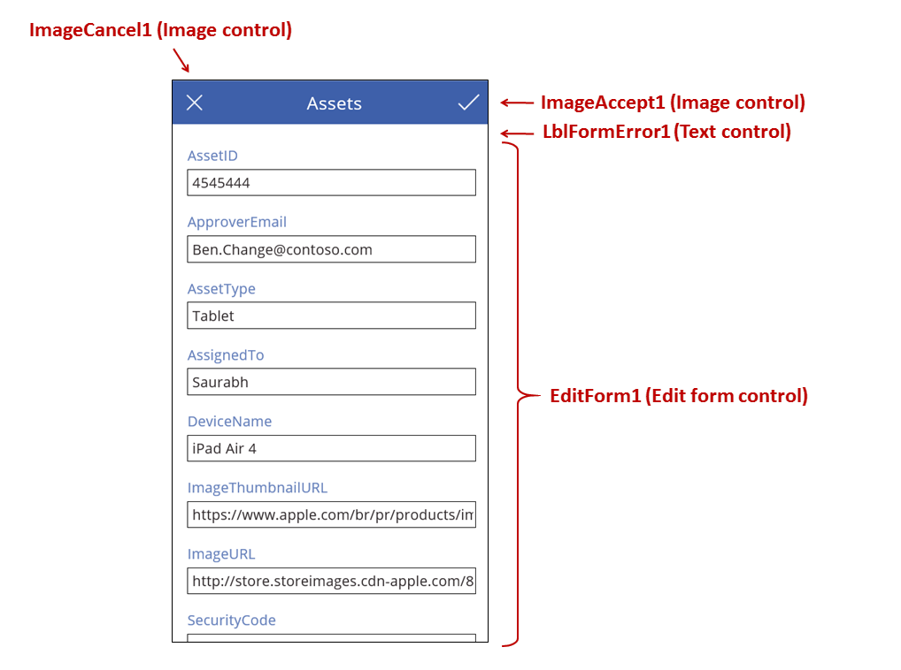

На этом экране используются такие основные формулы:

| Элемент управления | Поддерживаемое поведение | Формула |
| --- | --- | --- |
| **EditForm1** |Отображение записи в источнике данных **Assets**. |Задайте для свойства **[DataSource](controls/control-form-detail.md)** значение **Assets**. |
| **EditForm1** |Определяет запись для отображения. В созданном приложении отображает запись, которую пользователь выбрал в **BrowseScreen1**. |Задайте для свойства **[Item](controls/control-form-detail.md)** такое значение: **BrowseGallery1.Selected** |
| Элементы управления **[Карта](controls/control-card.md)** |В элементе управления **[Форма редактирования](controls/control-form-detail.md)** предоставляются элементы управления, чтобы пользователь мог изменить одно или несколько полей в записи. |Задайте для свойства **[DataField](controls/control-card.md)** в качестве значения имя поля, заключив его в двойные кавычки (например, **"Имя"**). |
| **ImageCancel1** |Если пользователь выбирает этот элемент управления, отменяет все текущие изменения и открывает экран **Details**. |Задайте для свойства **[OnSelect](controls/properties-core.md)** эту формулу: **ResetForm( EditForm1 ); Back()** |
| **ImageAccept1** |Если пользователь выбирает этот элемент управления, отправляет изменения в источник данных. |Задайте для свойства **[OnSelect](controls/properties-core.md)** эту формулу: **SubmitForm( EditForm1 )** |
| **EditForm1** |Если изменения принимаются, возвращает на предыдущий экран. |Задайте для свойства **[OnSuccess](controls/control-form-detail.md)** эту формулу: **Back()** |
| **EditForm1** |Если изменения не приняты, остается на текущем экране, чтобы пользователь мог исправить ошибки и повторить попытку отправить. |Оставляет свойство **[OnFailure](controls/control-form-detail.md)** пустым. |
| **LblFormError1** |Если изменения не приняты, отобразится сообщение об ошибке. |Задайте для свойства **[Text](controls/properties-core.md)** такое значение: **EditForm1.Error** |

Как и на экране **Details**, элемент управления формы, которая называется **EditForm1**, преобладает на экране **Edit and Create**. Помимо этого, для свойства **[Item](controls/control-form-detail.md)** формы **EditForm1** задано значение **BrowseGallery1.Selected**, поэтому в форме отображается запись, которую пользователь выбрал в **BrowseScreen1**. Хотя на экране **Details** каждое поле показано как "только для чтения", пользователь может обновить значение одного или нескольких полей с помощью элементов управления в **EditForm1**. Он также использует свойство **[DataSource](controls/control-form-detail.md)** для доступа к метаданным об этом источнике данных, таким как понятное отображаемое имя для каждого поля и расположение для сохранения изменений.

Если пользователь выбирает значок "X", чтобы отменить обновление, функция **[ResetForm](functions/function-form.md)** отменяет все несохраненные изменения, а функция **[Back](functions/function-navigate.md)** открывает экран **Details**. На экранах **Details** и **Edit and Create** отображается одна и та же запись, пока пользователь не выберет другую запись в **BrowseScreen1**. Поля в этой записи сохраняют значения, которые были недавно сохранены, а не все изменения, внесенные и затем забытые пользователем.

Если пользователь меняет одно или несколько значений в форме, а затем выбирает значок "флажок", функция **[SubmitForm](functions/function-form.md)** отправляет пользовательские изменения в источник данных.

* Если изменения успешно сохранены, выполняется формула **[OnSuccess](controls/control-form-detail.md)** формы, а функция **Back()** открывает экран сведений, чтобы отобразить запись.
* Если изменения не сохранились успешно, выполняется формула **[OnFailure](controls/control-form-detail.md)** формы, но она ничего не меняет, поскольку она *пуста*. Экран **Edit and Create** остается открытым, поэтому пользователь может отменить изменения или исправить ошибку. **LblFormError1** отображает понятное пользователю сообщение об ошибке, для которого задано свойство **Error** формы.

Как и в случае элемента управления **[Форма отображения](controls/control-form-detail.md)**, элемент управления **[Форма редактирования](controls/control-form-detail.md)** содержит элементы управления **[Карта](controls/control-card.md)**, содержащие другие элементы управления, отображающие разные поля в записи.

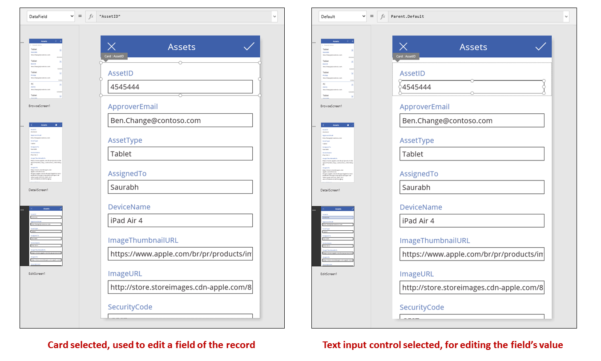

На предыдущем рисунке для выбранной карты отображается поле **AssetID** и элемент управления **[Текстовое поле](controls/control-text-input.md)**, чтобы пользователь мог изменить значение этого поля. (В то же время, на экране сведений отображается то же поле в элементе управления **[Метка](controls/control-text-box.md)**, но в режиме только для чтения.) Элемент управления **[Текстовое поле](controls/control-text-input.md)** содержит свойство **[Default](controls/properties-core.md)**, для которого задано значение **Parent.Default**. Если пользователь создал запись вместо того, чтобы отредактировать ее, этот элемент управления будет отображать начальное значение, чтобы пользователь мог изменить его для новой записи.

В области справа можно показать или скрыть каждую карту, изменить их порядок или настроить их для отображения полей в элементах управления различных типов.

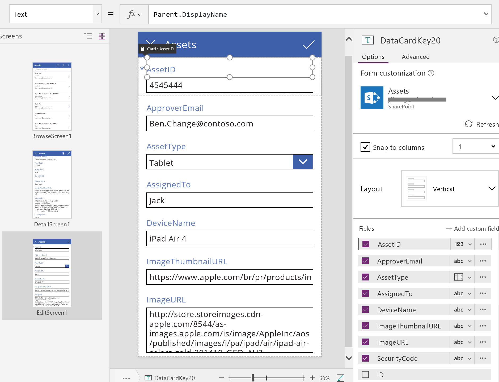

## Создание приложения с нуля
Понимая, как PowerApps создает приложения, можно создавать приложения самостоятельно, используя стандартные блоки и формулы, описанные ранее в этом разделе.

## Выявление тестовых данных
Чтобы получить максимальную пользу от этого раздела, начните с источника данных, с которым можно экспериментировать. Он должен содержать тестовые данные, которые можно читать и обновлять без риска.

> [!NOTE]
> При использовании в качестве источника данных списка SharePoint или таблицы Excel, которая содержит имена столбцов с пробелами, PowerApps заменит эти пробелы кодом **"\_x0020\_"**. Например, столбец **Имя столбца** из SharePoint или Excel будет отображаться как **Имя_x0020_столбца** в PowerApps при отображении в структуре данных или использовании в формуле.

Чтобы в точности следовать остальной части этого раздела, создайте список SharePoint с именем Ice Cream, содержащий эти данные:

* Создайте пустое приложение для телефонов и [подключите его к источнику данных](add-data-connection.md).
  
    > [!NOTE]
  > Приложения для планшетов очень похожи, но возможно для них потребуется другой [макет экрана](#screen-design), чтобы максимально эффективно использовать дополнительное место на экране.
  
    Примеры в оставшейся части раздела основаны на источнике данных с именем **Ice Cream**.

## Просмотр записей
Чтобы быстро получить сведения о записи, нужно найти ее в коллекции на экране обзора.

1. Добавьте коллекцию **По вертикали** и измените макет на **Заголовок**.
   
    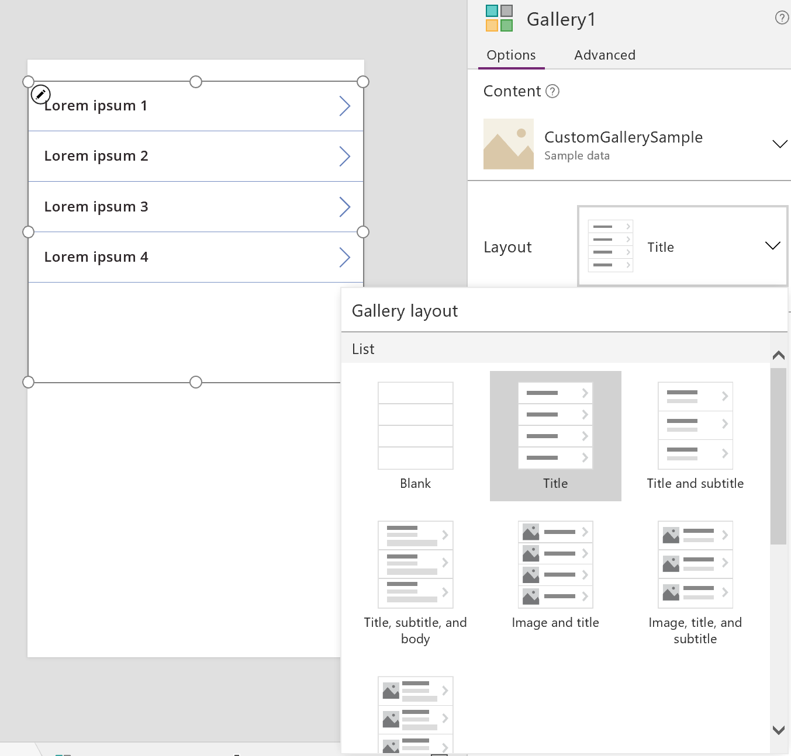
2. Присвойте свойству **[Items](controls/properties-core.md)** коллекции значение **Ice Cream**.
3. Для свойства **[Text](controls/properties-core.md)** первой метки в коллекции задайте значение **ThisItem.Title** (если в нем указано иное).
   
    Теперь эта метка отображает значение поля **Title** для каждой записи.
   
    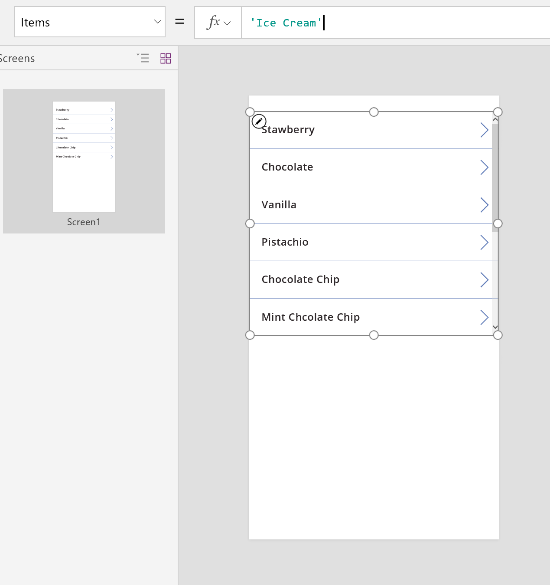
4. Измените размер коллекции, чтобы заполнить экран, и задайте для свойства **[TemplateSize](controls/control-gallery.md)** значение **60**.
   
    Примером может служить этот экран, на котором показаны все записи в источнике данных:
   
    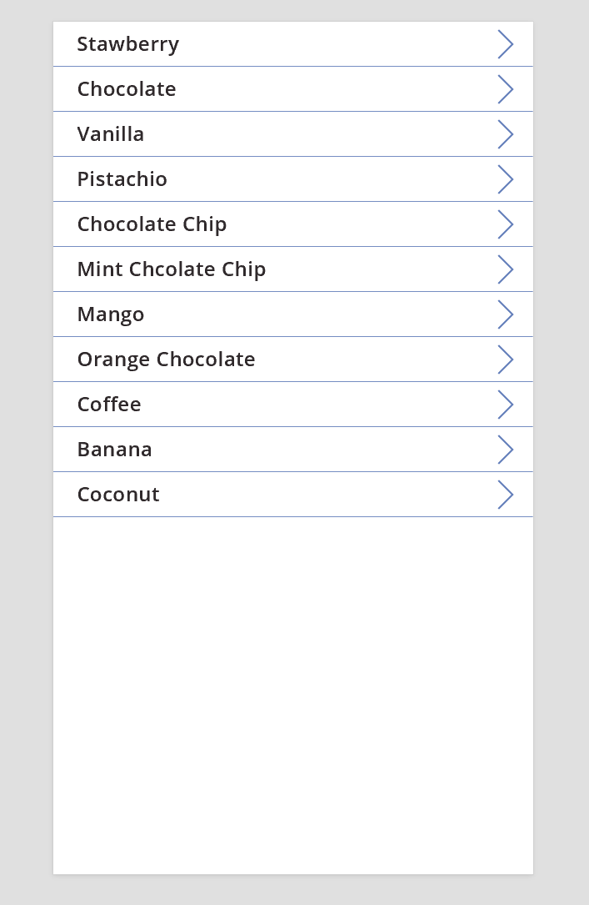

## Просмотр сведений
Если в коллекции нужная информация не отображается, щелкните стрелку для записи, чтобы открыть экран сведений. Элемент управления **[Форма отображения](controls/control-form-detail.md)** на этом экране отображает многие, если не все, поля для выбранной записи.

Элемент управления **[Форма отображения](controls/control-form-detail.md)** содержит два свойства для отображения записи:

* Свойство **[DataSource](controls/control-form-detail.md)**.  Имя источника данных, который содержит записи. Это свойство заполняет правую область полями и определяет отображаемое имя и тип данных (строка, число, дата, и т. д.) для каждого поля.  
* Свойство **[Item](controls/control-form-detail.md)**.  Запись для отображения.  Это свойство часто связано со свойством **Selected** элемента управления **[Коллекция](controls/control-gallery.md)**, чтобы пользователь мог выбрать запись в элементе управления **[Коллекция](controls/control-gallery.md)** и изучить эту запись.

Если задано свойство **[DataSource](controls/control-form-detail.md)**, можно добавлять и удалять поля в правой области и изменять способ их отображения.

На этом экране пользователи не могут случайно или преднамеренно изменять любые значения записи. Элемент управления **[Форма отображения](controls/control-form-detail.md)** является элементом управления только для чтения, поэтому он не будет изменять запись.

Добавление элемента управления **[Форма отображения](controls/control-form-detail.md)**:

1. Добавление экрана с последующим добавлением на него элемента управления **[Форма отображения](controls/control-form-detail.md)**
2. Задайте для свойства **[DataSource](controls/control-form-detail.md)** элемента управления формы значение **'Ice Cream'**.

В области справа можно выбрать поля для отображения на экране и выбрать тип отображаемой карты для каждого поля. После внесения изменений на правой области для свойства **[DataField](controls/control-card.md)** каждого элемента управления **[Карта](controls/control-card.md)** задано значение поля, с которым будет взаимодействовать пользователь. Экран должен выглядеть следующим образом:

После этого нужно подключить элемент управления **[Форма отображения](controls/control-form-detail.md)** к элементу управления **[Коллекция](controls/control-gallery.md)**, чтобы можно было просмотреть сведения для определенной записи.  После завершения настройки свойства **[Item](controls/control-form-detail.md)** в форме отобразится первая запись из коллекции.

* Задайте для свойства **[Item](controls/control-form-detail.md)** элемента управления **[Форма отображения](controls/control-form-detail.md)** значение **Gallery1.Selected**.
   
    В форме отобразятся сведения о выбранном элементе.
   
    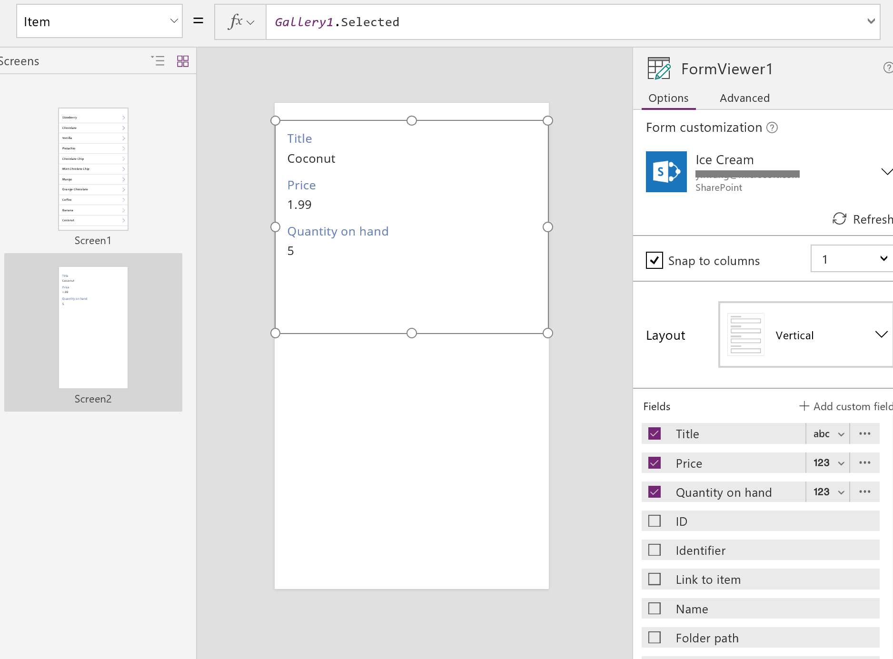

Великолепно!  Во время навигации пользователь открывает экран сведений из экрана коллекции и открывает экран коллекции из экрана сведений.

* Добавьте на экран элемент управления **[Кнопка](controls/control-button.md)**, укажите для свойства **[Text](controls/properties-core.md)** значение **[Back](functions/function-navigate.md)**, а для свойства **[OnSelect](controls/properties-core.md)** задайте значение **Back()**.
   
    Эта формула возвращает пользователя обратно к коллекции после завершения просмотра сведений.

    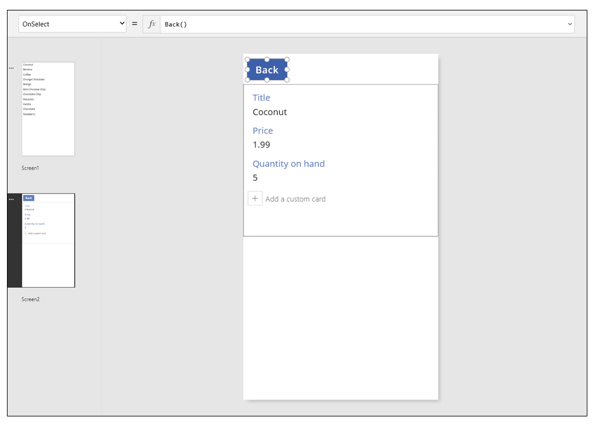

Теперь для элемента управления **[Коллекция](controls/control-gallery.md)** нужно добавить элементы навигации на экране сведений.

1. Перейдите на первый экран, на котором находится элемент управления **[Коллекция](controls/control-gallery.md)**, и выберите стрелку в первом элементе коллекции.

2. Задайте для свойства фигуры **[OnSelect](controls/properties-core.md)** кнопки эту формулу:
    **Navigate( Screen2, None )**
   
    

3. Нажмите клавишу F5 и выберите стрелку в коллекции, чтобы отобразить сведения для этого элемента.

4. Выберите кнопку **[Back](functions/function-navigate.md)**, чтобы вернуться в коллекцию продуктов, и нажмите клавишу Esc.

## Редактирование сведений
Наконец, последние основные действия были направлены на изменение содержимого записи, которую пользователи заполняют в элементе управления **[Форма редактирования](controls/control-form-detail.md)**.

Элемент управления **[Форма редактирования](controls/control-form-detail.md)** содержит два свойства для отображения и изменения записи:

* Свойство **[DataSource](controls/control-form-detail.md)**.  Имя источника данных, который содержит записи.  Так же, как и в случае с элементом управления **[Форма отображения](controls/control-form-detail.md)**, это свойство заполняет правую область полями и определяет отображаемое имя и тип данных (строка, число, дата и т. д.) для каждого поля. Это свойство также определяет, допустимо ли значение каждого поля перед его отправкой в базовый источник данных.
* Свойство **[Item](controls/control-form-detail.md)**.  Изменяемая запись, которая часто связана со свойством **Selected** элемента управления **[Коллекция](controls/control-gallery.md)**. Таким образом можно выбрать запись в элементе управления **[Коллекция](controls/control-gallery.md)**, отобразить ее на экране сведений, а затем отредактировать ее на экране **Edit and Create**.

Добавление элемента управления **[Форма редактирования](controls/control-form-detail.md)**

1. Добавьте экран, добавьте элемент управления **[Форма редактирования](controls/control-form-detail.md)**, а затем задайте для свойства **[DataSource](controls/control-form-detail.md)** формы значение **'Ice Cream'**.
2. Задайте для свойства **[Item](controls/control-form-detail.md)** значение **Gallery1.Selected**.

Теперь можно выбрать поля для отображения на экране. Можно также выбрать тип отображаемой карты для каждого поля. После внесения изменений на правой области для свойства **[DataField](controls/control-card.md)** каждого элемента управления **[Карта](controls/control-card.md)** задано значение поля, с которым будет взаимодействовать пользователь.  Экран должен выглядеть следующим образом:

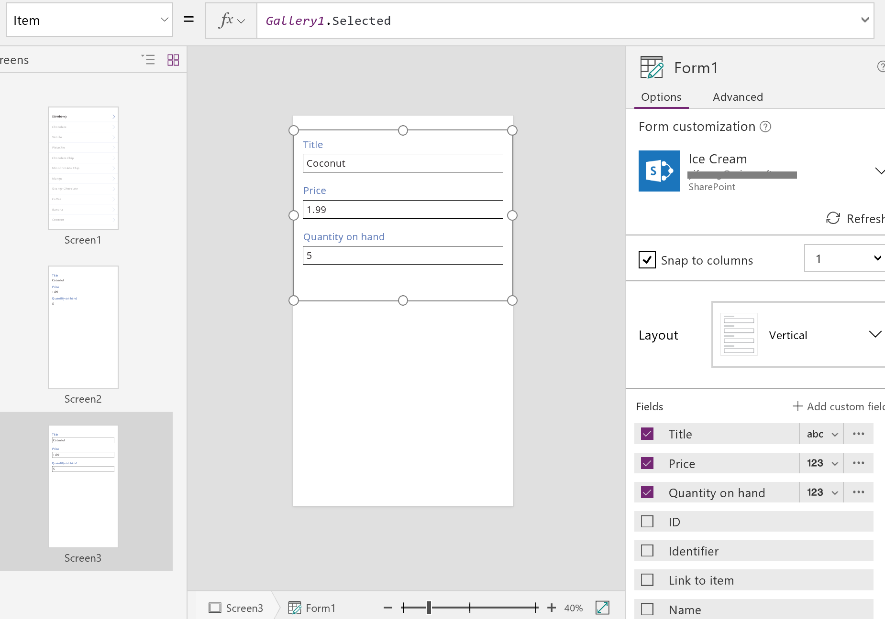

Эти два свойства ничем не отличаются от свойств элемента управления **[Форма отображения](controls/control-form-detail.md)**.  И с их помощью можно отобразить сведения о записи.  

Элемент управления **[Форма редактирования](controls/control-form-detail.md)** идет еще дальше, предлагая функцию **[SubmitForm](functions/function-form.md)** для обратной записи изменения в источнике данных. Он используется с элементом управления кнопки или изображения для сохранения пользовательских изменений.

* Добавьте элемент управления **[Кнопка](controls/control-button.md)**, задайте значение **Save** для ее свойства **[Text](controls/properties-core.md)** и задайте следующую формулу в качестве значения свойства **[OnSelect](controls/properties-core.md)**. 
  **SubmitForm( Form1 )**

Чтобы добавить навигацию на этом экране:

1. Добавьте еще один элемент управления **[Кнопка](controls/control-button.md)**, задайте значение **Cancel** для ее свойства **[Text](controls/properties-core.md)** и задайте следующую формулу в качестве значения свойства **[OnSelect](controls/properties-core.md)**:  **ResetForm( Form1 ); Back()**
   
    Эта формула удаляет все несохраненные изменения и открывает предыдущий экран.
   
    
2. Задайте для свойства **[OnSuccess](controls/control-form-detail.md)** формы значение **Back()**.
   
    Если обновления успешно сохранены, автоматически откроется предыдущий экран (в данном случае экран сведений).
   
    
3. На экране **Display** добавьте кнопку, укажите для свойства **[Text](controls/properties-core.md)** значение **Edit**, а для свойства **[OnSelect](controls/properties-core.md)** задайте следующую формулу:  **Navigate( Screen3, None )**
   
    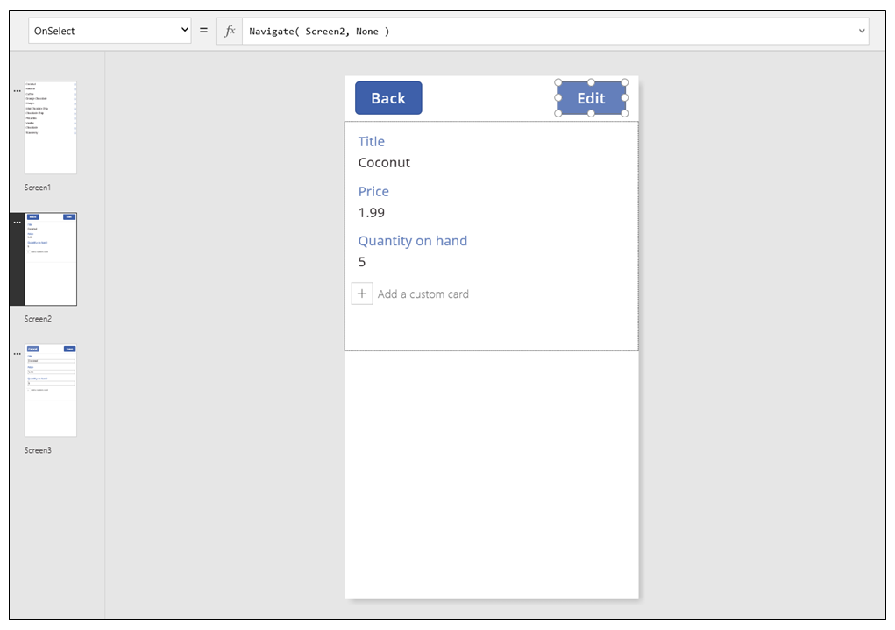

Вы создали основное приложение с тремя экранами для ввода и просмотра данных.  Чтобы испытать его, откройте экран коллекции, а затем нажмите клавишу F5 (или нажмите стрелку вперед на кнопке "Предварительный просмотр" рядом с верхним левым углом экрана). Розовая точка указывает, когда пользователь щелкает на экране или касается его на каждом этапе.

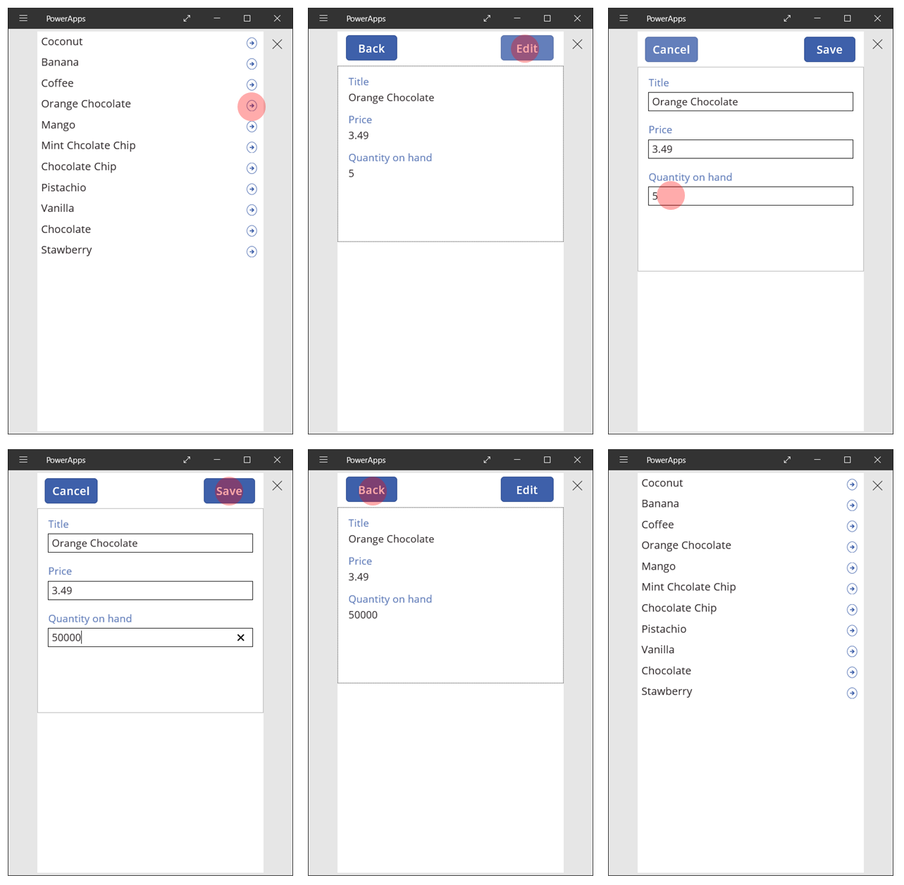

## Создание записи
Пользователь взаимодействует с той же формой **Edit**, чтобы обновлять и создавать записи. Когда пользователь хочет создать запись, функция **[NewForm](functions/function-form.md)** переключает форму в режим **New**.

Если форма находится в режиме **New**, задайте для каждого поля значение по умолчанию из источника данных. Запись, которая передается в свойство формы **[Item](controls/control-form-detail.md)**, игнорируется.  

Когда пользователь готов сохранить новую запись, выполняется функция **[SubmitForm](functions/function-form.md)**. После успешной отправки формы, она переключается обратно в режим **EditMode**.  

На первом экране добавьте кнопку **New**:

1. На экране с коллекцией добавьте элемент управления **[Кнопка](controls/control-button.md)**.
2. Для свойства **[Text](controls/properties-core.md)** задайте значение **New**, а для свойства **[OnSelect](controls/properties-core.md)** задайте следующую формулу: 
   **NewForm( Form1 ); Navigate( Screen3, None )**
   
    Эта формула переключает элемент управления **[Форма редактирования](controls/control-form-detail.md)** на экране **Screen3** в режим **New** и открывает этот экран, чтобы пользователь мог заполнить его.

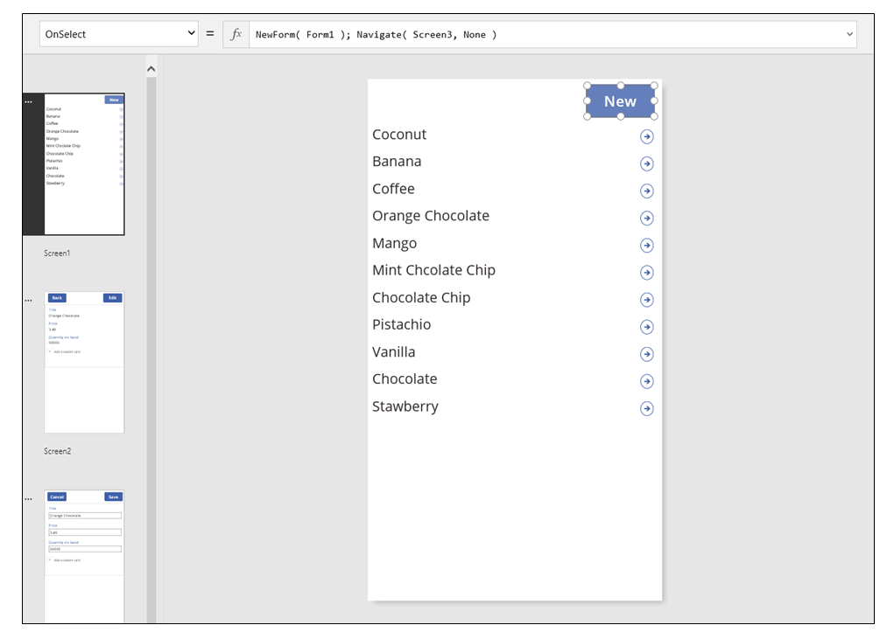

Если экран Edit and Create открыт, форма пуста и готова для добавления элемента пользователем. Когда пользователь выбирает кнопку **Save**, функция **[SubmitForm](functions/function-form.md)** гарантирует, что вместо обновления запись создается. Если пользователь выбирает кнопку **Cancel**, функция **[ResetForm](functions/function-form.md)** переключает форму обратно в режим **Edit**, а функция **[Back](functions/function-navigate.md)** открывает экран для просмотра коллекции.

## Удаление записи
1. На экране **Display** добавьте кнопку, а затем задайте для свойства **[Text](controls/properties-core.md)** отображение надписи **Delete**.
2. Задайте для свойства кнопки **[OnSelect](controls/properties-core.md)** эту формулу:
    **Remove( 'Ice Cream', Gallery1.Selected ); Back()**
   
    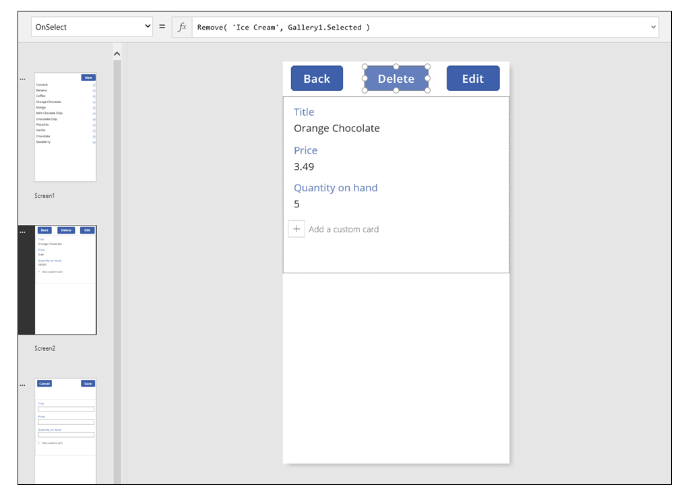

## Обработка ошибок
В этом приложении ошибка происходит, если значение поля является недопустимым, обязательное поле пусто, нет подключения к сети или в случае возникновения любой из множества других проблем.  

Если функция **[SubmitForm](functions/function-form.md)** по какой-либо причине не сработает, свойство **Error** элемента управления **[Форма редактирования](controls/control-form-detail.md)** содержит сообщение об ошибке, которое должно отображаться для пользователя. С этой информацией пользователю нужно будет устранить проблему и повторно отправить изменения или отменить обновление.

1. На экране изменения и создания добавьте элемент управления **[Метка](controls/control-text-box.md)**, а затем перенесите его ниже кнопки **Save**. Любую ошибку будет легко увидеть после выбора пользователем этого элемента управления, чтобы сохранить изменения.

2. Задайте для свойства **[Text](controls/properties-core.md)** элемента управления **[Метка](controls/control-text-box.md)** отображение **Form1.Error**.

    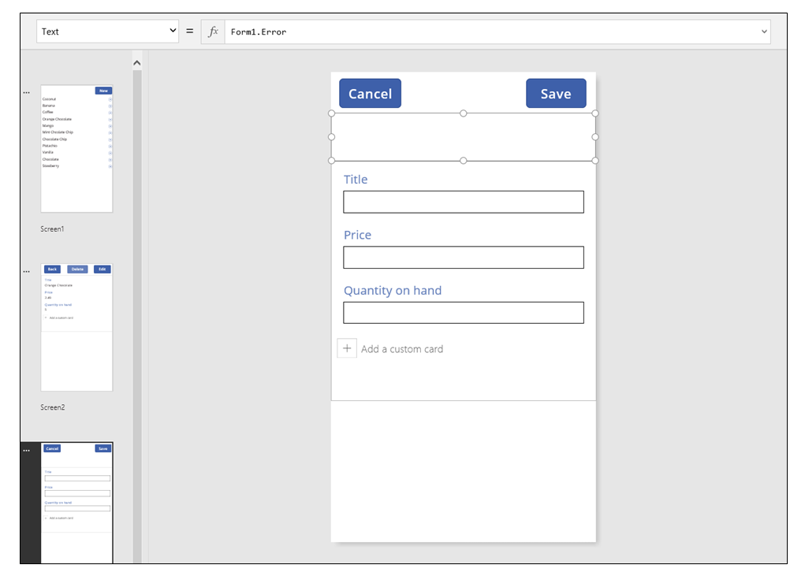

В приложении, которое создает PowerApps из данных, для свойства **[AutoHeight](controls/control-text-box.md)** на этом элементе управления задано значение *true*, чтобы пространство не использовалось, если ошибки не обнаружены. Свойства **[Height](controls/properties-size-location.md)** и **[Y](controls/properties-size-location.md)** элемента управления **[Форма редактирования](controls/control-form-detail.md)** также динамически корректируются с учетом увеличения элемента управления при появлении ошибки. Чтобы получить дополнительные сведения, создайте приложение на основе существующих данных и проверьте эти свойства. Элемент управления текстового поля для ошибок очень короткий, если ошибки не произошло, иногда, чтобы выбрать этот элемент управления, необходимо открыть представление **Advanced** (на вкладке **View**).

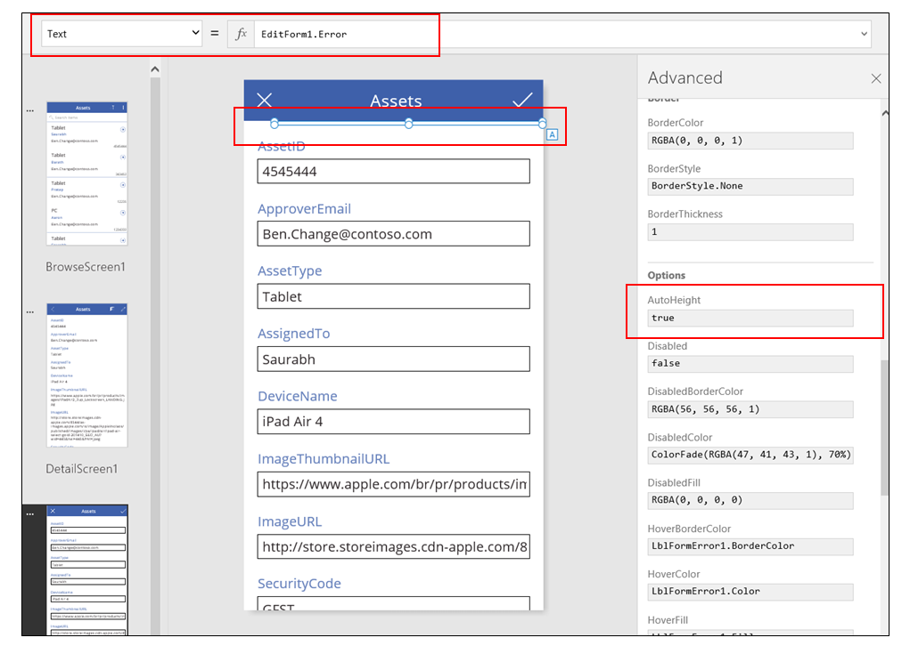

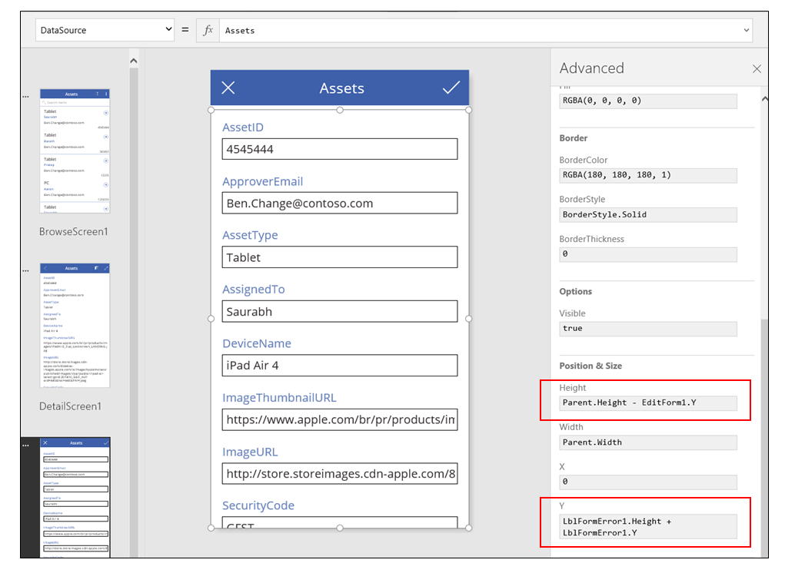

## Обновление данных
Источник данных обновляется каждый раз, когда пользователь открывает приложение, но пользователю может потребоваться обновить записи в коллекции без закрытия приложения. Добавьте кнопку **Refresh**, чтобы пользователь мог выбрать его и вручную обновить данные:

1. На экране с элементом управления **[Коллекция](controls/control-gallery.md)** добавьте элемент управления **[Кнопка](controls/control-button.md)** и для его свойства **[Text](controls/properties-core.md)** задайте значение **Refresh**.

2. Назначьте свойству **[OnSelect](controls/properties-core.md)** этого элемента управления следующую формулу:  **Refresh( 'Ice Cream' )**

    

## Поиск и сортировка в коллекции
В приложении, которое создается PowerApps из данных, не рассматривались два элемента управления в верхней части экрана обзора. С помощью этих элементов управления пользователь может найти одну или несколько записей, отсортировать список записей в восходящем или нисходящем порядке, или сделать и то и другое.

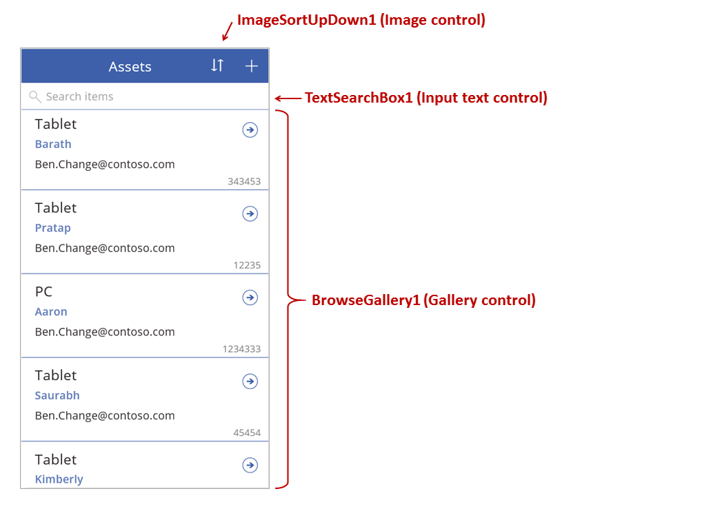

Когда пользователь выбирает кнопку сортировки, порядок сортировки в коллекции меняется на обратный. Чтобы создать такое поведение, мы используем *переменную контекста*, чтобы отслеживать направление, в котором отсортирована коллекция. Когда пользователь выбирает кнопку, эта переменная обновляется и направление меняется. Для свойства **[OnSelect](controls/properties-core.md)** кнопки сортировки задана эта формула: **UpdateContext( {SortDescending1: !SortDescending1} )**

Функция **[UpdateContext](functions/function-updatecontext.md)** создает переменную контекста **SortDescending1**, если она еще не существует. Эта функция будет считывать значение переменной и менять его на логически обратное помощью символа **!** . Если значение равно *true*, оно становится равным *false*. Если значение равно *false*, оно становится равным *true*.

Эта переменная контекста используется в формуле для свойства **[Items](controls/properties-core.md)** элемента управления **[Коллекция](controls/control-gallery.md)** наряду с текстом в элементе управления **TextSearchBox1**:

    Gallery1.Items = Sort( If( IsBlank(TextSearchBox1.Text),
                               Assets,
                               Filter( Assets,
                                       TextSearchBox1.Text in Text(ApproverEmail) ) ),
                            ApproverEmail,
                            If(SortDescending1, Descending, Ascending) )

Резюмируем это.

* Снаружи у нас есть функция **[Sort](functions/function-sort.md)**, которая принимает три аргумента: таблица, поле, по которому выполняется сортировка, и направление сортировки.  
  
  * Направление сортировки берется из переменной контекста, которая переключается, когда пользователь выбирает элемент управления **ImageSortUpDown1**. Значение *true*/*false* передается в константы **Descending** и **Ascending**.
  * Поле сортировки по умолчанию – **ApproverEmail**. Если изменить поля, отображаемые в коллекции, необходимо также изменить этот аргумент.
* Внутри у нас есть функция **[Filter](functions/function-filter-lookup.md)**, которая принимает таблицу в качестве аргумента, и выражение для вычисления по каждой записи.
  
  * Таблица – это необработанный источник данных **Assets**, который является начальной точкой перед началом фильтрации и сортировки.
  * Выражение ищет экземпляр строки в значении **TextSearchBox1** поля **ApproverEmail**.  Опять же, если изменить поля, отображаемые в коллекции, также необходимо обновить этот аргумент.
  * Если значение **TextSearchBox1** пустое, пользователь может просмотреть все записи, а функция **[Filter](functions/function-filter-lookup.md)** будет неактивна.

Это только один из примеров – можно создавать собственные формулы для свойства **[Items](controls/properties-core.md)**, в зависимости от задач своего приложения, создав одновременно **[Filter](functions/function-filter-lookup.md)**, **[Sort](functions/function-sort.md)** и другие функции и операторы.    

## Проектирование экрана
На данный момент мы не рассматривали другие способы распределения элементов управления на экранах. Это потому, что у вас есть множество возможностей, и наилучший вариант зависит от задач конкретного приложения.

Так как размеры экрана телефона ограничены, возможно, потребуются отдельные экраны для поиска, отображения и создания. В этом разделе функции **[Navigate](functions/function-navigate.md)** и **[Back](functions/function-navigate.md)** открывают каждый экран.  

На планшете можно искать, просматривать и изменять или создавать на двух или даже на одном экране. В последнем случае функции **[Navigate](functions/function-navigate.md)** и **[Back](functions/function-navigate.md)** не нужны.

Если пользователь работает в том же окне, необходимо убедиться, что он не может изменить выделение в элементе управления **[Коллекция](controls/control-gallery.md)** и не рискует потерять изменения в элементе управления **[Форма редактирования](controls/control-form-detail.md)**.  Чтобы пользователь не выбрал другую запись, пока изменения в текущей еще не сохранены, задайте для свойства **[Disabled](controls/properties-core.md)** коллекции эту формулу: 
**EditForm.Unsaved**

