# Начало работы с формулами
Настраивайте приложения с помощью формул, которые не только вычисляют значения и выполняют другие задачи (как в Excel), но и реагируют на ввод данных пользователем (согласно требованиям приложения).

* В Excel вы создаете формулы, например для заполнения ячеек, а также создания таблиц и диаграмм.
* В PowerApps вы создаете похожие формулы при настройке элементов управления, а не ячеек. Кроме того, можно создать формулы, применяемые к приложениям, а не к электронным таблицам.

Например, вы создаете формулу, чтобы определить, как приложение реагирует на нажатие кнопки, перетаскивание ползунка или другие действия. Эти формулы могут показать другой экран, обновить внешний источник данных приложения или создать таблицу, содержащую подмножество данных в имеющейся таблице.

Формулы можно использовать в самых разнообразных сценариях. Например, можно использовать GPS устройства, элемент управления картой и формулу, использующую значения **Location.Latitude** и **Location.Longitude**, для отображения текущего расположения. При перемещении карта автоматически отслеживает расположение.

Здесь содержатся только общие сведения о работе с формулами. Дополнительные сведения и полный список функций, операторов и других структурных элементов см. в [справочнике формул](formula-reference.md).

## Технические условия

* [Зарегистрируйтесь](../signup-for-powerapps.md) в PowerApps, а затем [войдите в систему](https://web.powerapps.com), указав учетные данные, использованные при регистрации.
* Узнайте, как [настроить элемент управления](add-configure-controls.md) в PowerApps.

## Отображение простого значения
В ячейке Excel можно ввести конкретные данные, такие как число **42** или фразу **Здравствуй, мир!**. Данные в этой ячейке будут отображаться именно так, как их ввели. В PowerApps можно точно так же указать неизменяемые данные, задав для свойства **[Text](controls/properties-core.md)** метки значение, представляющее собой точную последовательность требуемых символов, заключенных в двойные кавычки.

1. Выберите **Создать** в меню **Файл** (у левого края экрана).
2. В разделе **Create an app** (Создание приложения) на плитке **Пустое приложение** выберите **Макет телефона**.
   
    Строка формул расположена в верхней части экрана.
   
    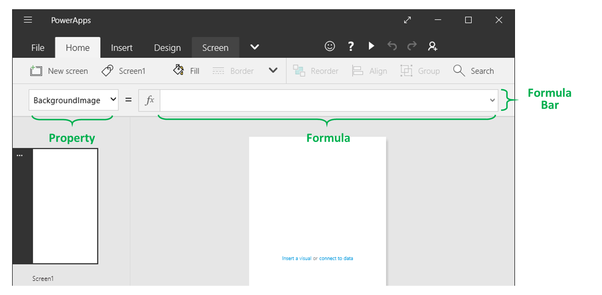
   
    Эта строка состоит из двух частей:
   
   * *Список свойств*. Каждый экран и элемент управления имеет [набор свойств](reference-properties.md).  Используйте этот список для выбора конкретного свойства.  
   * *Формула*. Формула для расчета этого свойства, состоящая из [значений, операторов и функций](formula-reference.md).
     
     В строке формул отображаются свойства, которые можно изменить для выбранного элемента управления или экрана, если элемент управления не выбран.  Имя выбранного элемента управления отображается на вкладке **Содержимое**:
     
     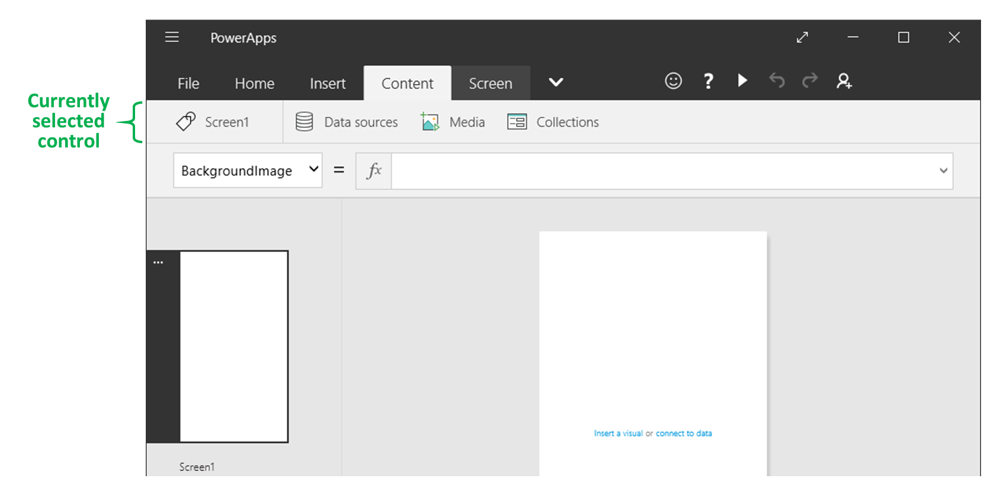
     
     Имя выбранного элемента управления можно изменить на панели **Содержимое**, щелкнув его.
3. Добавьте элемент управления **[Метка](controls/control-text-box.md)** на экран.
   
    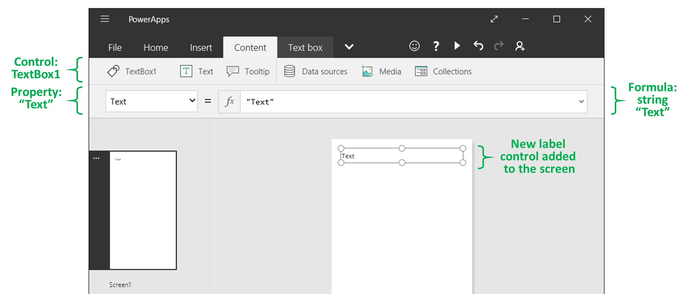
   
    При добавлении метки в списке свойств автоматически отображается свойство **[Text](controls/properties-core.md)**, управляющее отображением в элементе управления. По умолчанию значение этого свойства — **Text**.  
4. Задайте для свойства **[Text](controls/properties-core.md)** значение **Hello World**, введя эту строку, заключенную в двойные кавычки, в строке формул:
   
    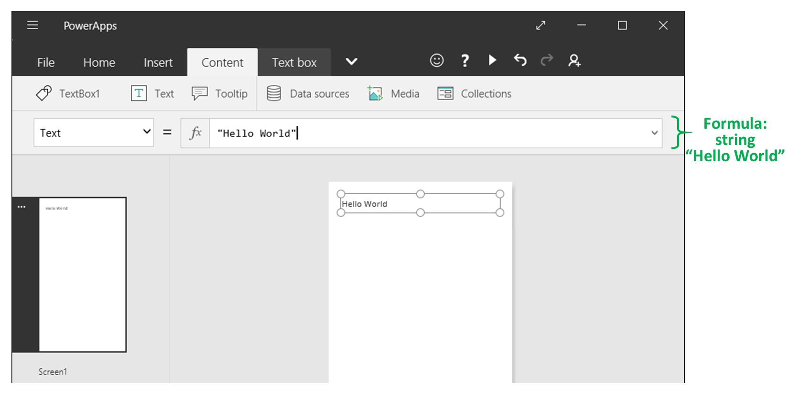
   
    Это значение отображается в метке по мере ввода.  При вводе на экране могут отображаться значки с желтым восклицательным знаком. Эти значки указывают на ошибки. Они исчезнут, когда вы введете допустимое значение. Например, строка, не заключенная в кавычки, недопустима.
   
    В Excel можно отображать числа, например **42**, введя их в ячейку или введя формулу, результатом вычисления которой является это число, например **=SUM(30,12)**. В PowerApps можно получить такой же результат, задав для свойства **Text** элемента управления (например, метки) число **42** или формулу **Sum(30,12)**. Это число будет постоянно отображаться в ячейке и метке независимо от изменений на листе или в приложении.
   
    > [!NOTE]
> В отличие от Excel, в PowerApps не нужно ставить перед формулой знак равенства или плюс. По умолчанию строка формул интерпретирует все, что вводится, как формулу. Кроме того, не нужно заключать формулу в двойные кавычки ("), как это делалось ранее для указания строки текста.
5. В свойстве **[Text](controls/properties-core.md)** метки замените **"Hello World"** на **Sum(1,2,3)**.
   
    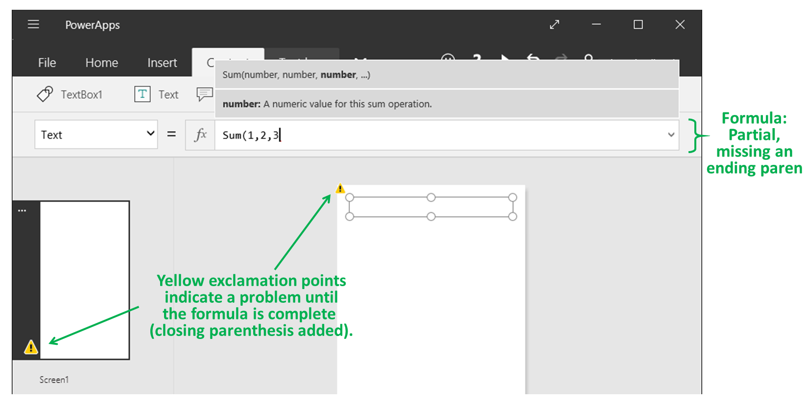
   
    При вводе в строке формулы отображается описание и ожидаемые аргументы для этой функции.  Как и в случае с закрывающими двойными кавычками во фразе **"Hello World"**, на экране отображается желтый восклицательный знак для указания ошибки. Он исчезнет, если ввести последнюю скобку в этой формуле:
   
    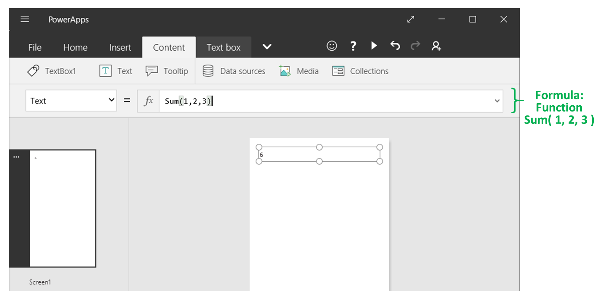

## Изменение значения на основе входных данных
В Excel формула **=SUM(A1:A2)** позволяет узнать сумму значений ячеек A1 и A2. При изменении одного или обоих значений ячейка, содержащая формулу, автоматически отображает обновленный результат.

Чтобы достичь аналогичного результата в PowerApps, нужно добавить элементы управления и задать их свойства. В этом примере показана метка из предыдущей процедуры и два элемента управления **[Текстовое поле](controls/control-text-input.md)**  — **TextInput1** и **TextInput2**.

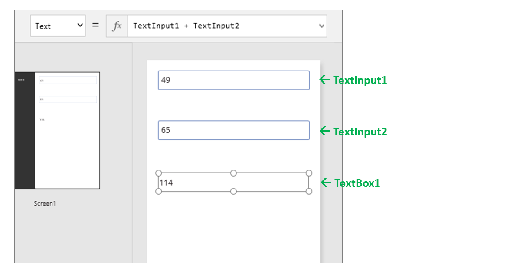

Независимо от того, какие числа вводятся в элементах управления для ввода текста, метка всегда показывает сумму этих чисел, так как для свойства **[Text](controls/properties-core.md)** этой метки указана следующая формула:
 **TextInput1 + TextInput2**

В Excel можно использовать условное форматирование для выделения, например, отрицательных значений красным цветом. В PowerApps используется формула с функцией **[If](functions/function-if.md)**, которая ведет себя так же, как и в Excel.

1. Задайте в качестве значения свойства **[Color](controls/properties-color-border.md)** метки такую формулу: **If( Value(TextBox1.Text) < 0, Red, Black )**
   
    > [!NOTE]
> Задайте свойство элемента управления в формуле, указав имя элемента управления и имя свойства через точку. Например, укажите свойство **[Text](controls/properties-core.md)** элемента управления **TextBox1**, введя **TextBox1.Text**.
   
    
2. В **TextInput1** и **TextInput2** укажите два числа, при сложении которых получается отрицательное число.
   
    
   
    Значение в метке выделяется красным цветом.

## Изменение цвета на основе данных, вводимых пользователем
Приложения можно настроить с помощью формул таким образом, чтобы пользователи могли изменять внешний вид и поведение приложения. Например, можно создать фильтр для отображения данных, содержащих строку текста, указываемую пользователем. Кроме того, можно разрешить пользователям сортировать набор данных по определенному столбцу в нем. В этой процедуре вы разрешаете пользователям изменять цвет экрана, перемещая один или несколько ползунков.

1. Удалите элементы управления из предыдущих процедур или создайте пустое приложение, как это делалось ранее, и добавьте в него три ползунка:
   
    
2. Упорядочите ползунки, чтобы они не перекрывали друг друга, добавьте три метки и настройте их таким образом, чтобы они отображали надписи **Red**, **Green** и **Blue**:
   
    
3. Задайте для свойства **Max** каждого ползунка значение 255, которое является максимальным значением компонента цвета функции **[RGBA](functions/function-colors.md)**.
   
    Свойство **Max** можно указать, выбрав его на вкладке **Содержимое** или в списке свойств:
   
    
4. Выберите экран, щелкнув на области без элемента управления, и задайте в качестве значения свойства **[Fill](controls/properties-color-border.md)** эту формулу: **RGBA( Slider1.Value, Slider2.Value, Slider3.Value, 1 )**
   
    Как описано выше, доступ к свойствам элемента управления можно получить с помощью оператора **.** .  **Slider1.Value** указывает на свойство ползунка **[Value](controls/properties-core.md)**, которое отражает расположение ползунка между значениями **Min** и **Max**. При вводе этой формулы каждый элемент управления, содержащий ее, выделяется цветом на экране и в строке формул:
   
    
   
    При вводе закрывающей скобки цвет фона экрана изменится на темно-серый с учетом значения по умолчанию каждого ползунка (**50**). На данный момент после завершения ввода формулы она вычисляется, и полученное значение используется в качестве значения цвета заливки фона. Вы можете взаимодействовать с приложением при работе в рабочей области по умолчанию. При этом не нужно открывать предварительный просмотр:
   
    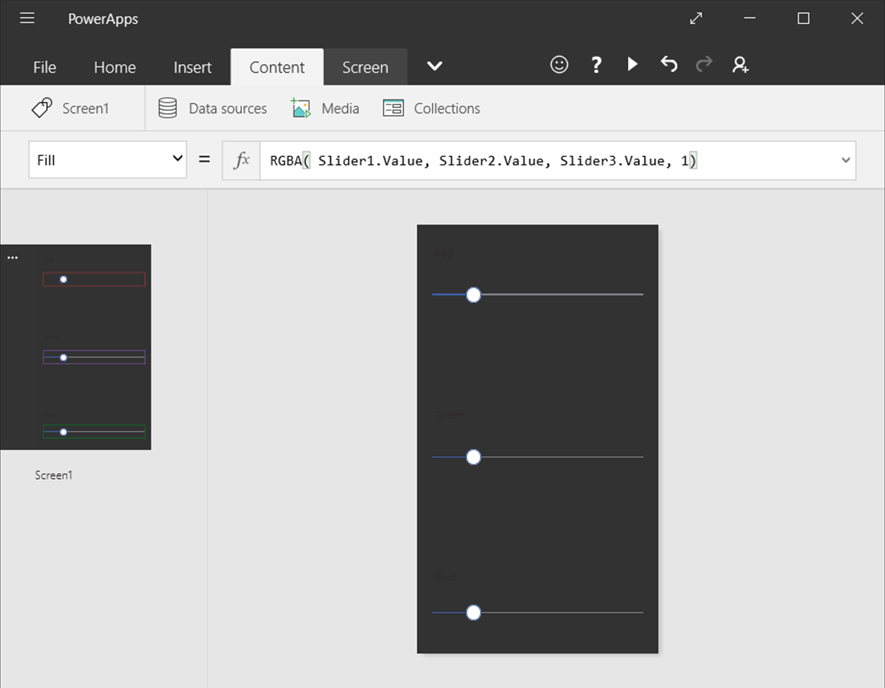
5. Настройте ползунки и узнайте, как изменения влияют на цвет фона.
   
    По мере перемещения каждого ползунка выполняется перерасчет формулы, содержащей функцию **[RGBA](functions/function-colors.md)**. Эти изменения сразу отражаются на экране.
   
    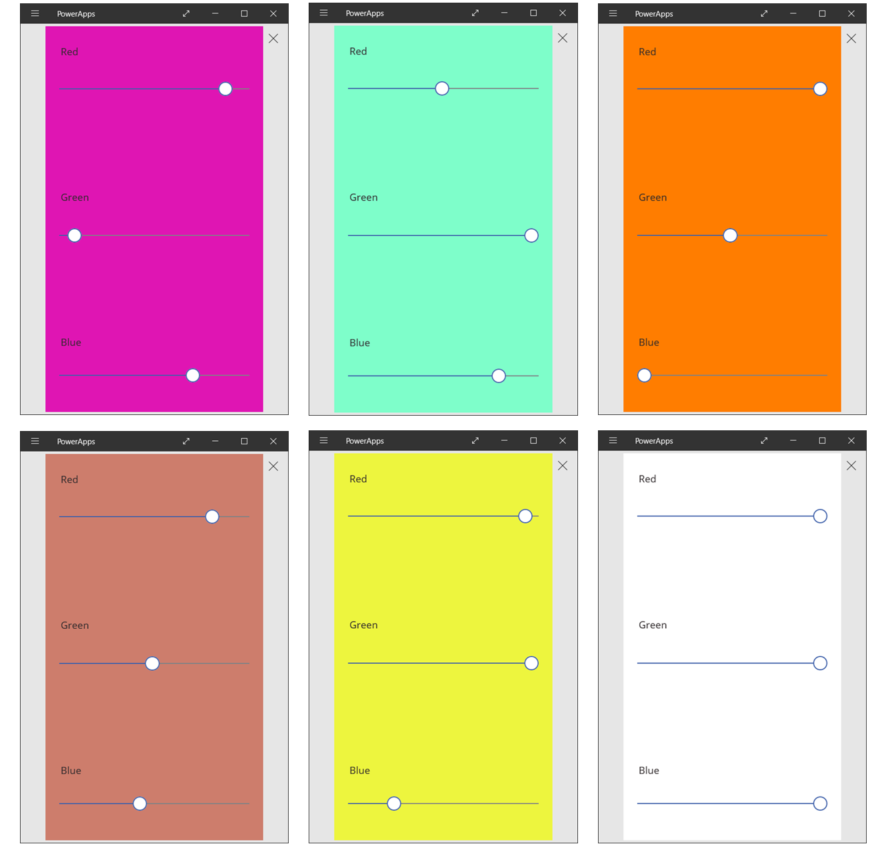

## Управление поведением приложения
С помощью формул можно не только выполнять вычисления и изменять внешний вид, но и выполнять действия. Например, можно задать в качестве значения свойства кнопки **[OnSelect](controls/properties-core.md)** формулу с функцией **[Navigate](functions/function-navigate.md)**. При нажатии этой кнопки появится экран, указанный в формуле.

Некоторые функции, например **[Navigate](functions/function-navigate.md)** и **[Collect](functions/function-clear-collect-clearcollect.md)**, можно использовать только в формулах, связанных с поведением.  Если функцию можно использовать только в этом контексте, вызывается справочник формул.  

В формуле поведения можно выполнить несколько действий, если разделить функции точкой с запятой (;). Например, может потребоваться обновить переменную контекста, передать данные в источник данных и, наконец, перейти на другой экран.

## Просмотр списка свойств по категориям
В списке свойства показаны в алфавитном порядке. Однако можно также просмотреть все свойства элемента управления, упорядоченные по категориям, выбрав параметр **Дополнительно** на вкладке **Представление**:

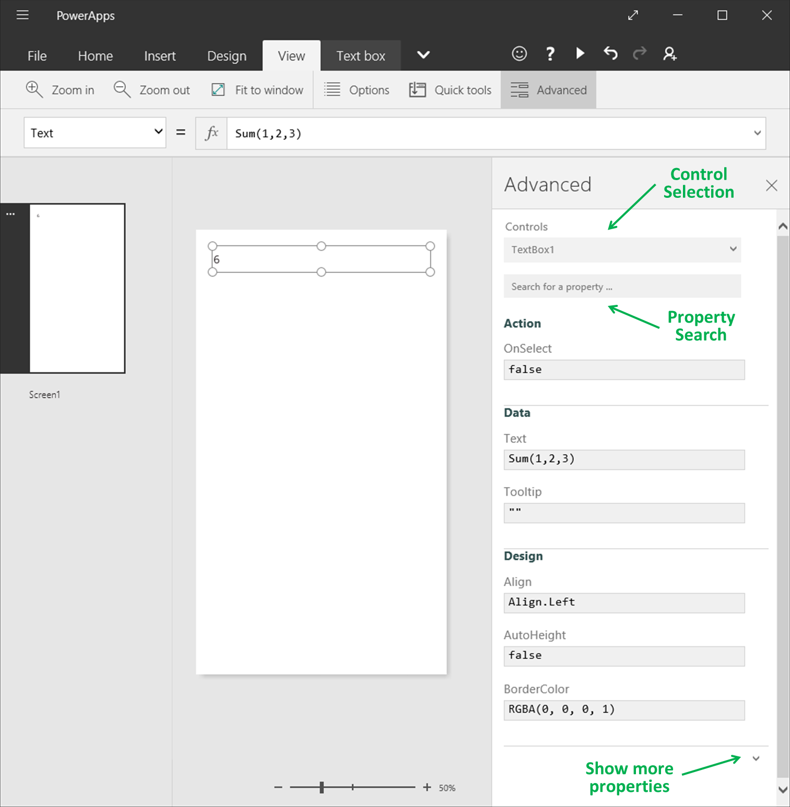

Формулы можно изменять напрямую в этом представлении.  С помощью списка выбора элементов управления в верхней части панели можно быстро найти нужный элемент управления.  Благодаря полю поиска свойств можно быстро найти свойства этого элемента управления.

Изначально в этом представлении отображаются самые важные свойства.  Чтобы отобразить все свойства, щелкните стрелку вниз в нижней части панели.  Каждый элемент управления имеет множество свойств, определяющих все аспекты его поведения и внешнего вида. Вы можете просмотреть этот список или найти нужное свойство, введя его в поле в верхней части панели.

## Синтаксис формулы
Когда вы вводите формулу в строку формулы, разные элементы синтаксиса отображаются разными цветами, чтобы вам было удобнее читать длинные формулы. Ниже приведен список кодов цветов в PowerApps.

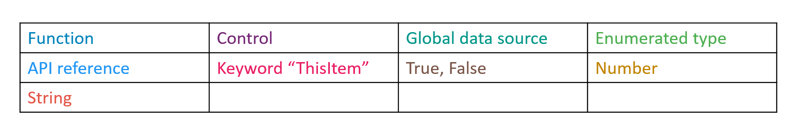

