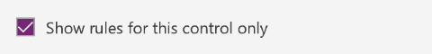

# Создание правила в PowerApps
Создавайте правила, чтобы приложение автоматически изменялось на основе заданных критериев. Например, отображать элементы списка красным, желтым или зеленым цветом в зависимости от их состояния или показывать кнопку утверждения только для определенных пользователей (например, менеджеров).

Вы можете добавлять правила для различных элементов управления. В этой статье вы добавите правило для изменения цвета текста в элементе управления **Метка**, если значение элемента управления **Ползунок** больше 70.

## Добавление правила
1. Выберите элемент управления (или добавьте элемент управления и оставьте его выбранным).

    Для выполнения инструкций этой статьи [добавьте метку и ползунок](add-configure-controls.md). Для свойства метки **Текст** задайте значение **Slider1.Value** и выберите ползунок.

1. На панели справа щелкните **Правила** и нажмите кнопку **Новое правило**.

    

    Если выбрать элемент управления с уже определенным одним или несколькими правилами, вы можете изменить любое правило, щелкнув его.  

## Добавление условия
Условие — это выражение, которое возвращает значение true или false, например, если значение больше или меньше 70. Вы можете написать свое правило или использовать шаблон, а также настроить выражение, следуя рекомендациям в пользовательском интерфейсе (Intellisense).

1. Нажмите кнопку **Добавить условие**, а затем выберите шаблон или пункт **Настраиваемое условие**.

    В этом случае выберите значение **Больше**.

    

1. Обновите выражение, определив, когда применяется правило.

    В этом примере измените 0 на 70, чтобы получить это выражение:   **Slider1.Value > 70**

## Добавление действия
Действия позволяют определить, что должно произойти после применения правила. PowerApps может создавать действия автоматически, основываясь на изменениях в элементах управления.

1. Нажмите кнопку **Определить действия**.

    

1. В диалоговом окне подтверждения щелкните **Let's go** (Начать), чтобы в PowerApps следующее изменение или изменения сохранились как одно или несколько действий.

1. Настройте один или несколько элементов управления, если условие имеет значение true.

    В нашем случае измените цвет метки.

    

1. (Необязательно.) Просмотрите изменения, нажав кнопку **Показать действия**.

    

1. После добавления действий нажмите кнопку **Готово**.

1. Проверьте условия и действия для правила.

    

## Переименование правила

1. Наведите указатель мыши на **Rule1** нажмите кнопку "Изменить".

    

1. Введите новое имя правила.

    

1. Выберите **Готово** чтобы закрыть редактор.

## Тестирование правила
1. Перейдите в режим предварительного просмотра приложения, нажав клавишу F5 (или нажав кнопку воспроизведения в правом верхнем углу).

    

1. Установите для заданного условия значение true и убедитесь, что действия выполняются правильно.

    Задайте для ползунка значение больше 70 и убедитесь, что цвет текста метки изменился.

## Просмотр всех правил
По умолчанию на вкладке **Правила** отображаются только правила для выбранных элементов управления и всех дочерних элементов управления, используемых в условии или действии правила. Чтобы отобразить все правила в приложении, снимите флажок **Показывать правила только для этого элемента управления**.

## Известные ограничения
На момент написания этой статьи:

* вы не можете указать свойство **ThisItem** для формы или коллекции как часть условия.
