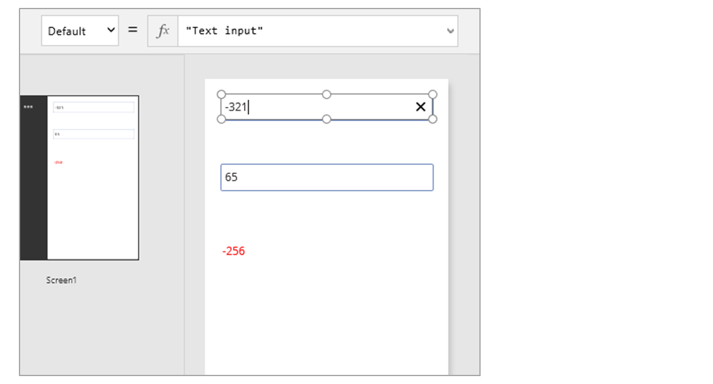
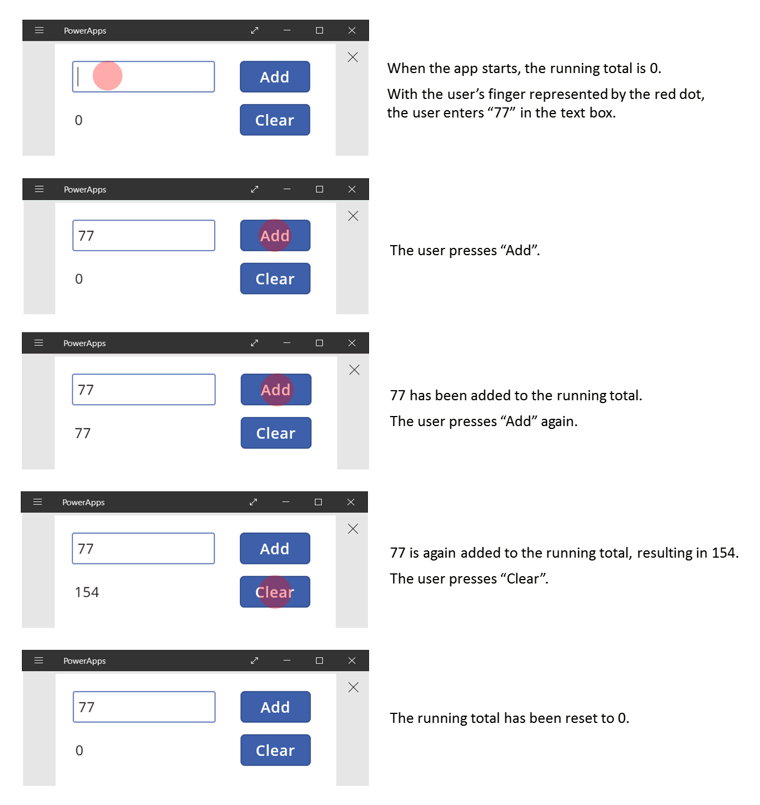
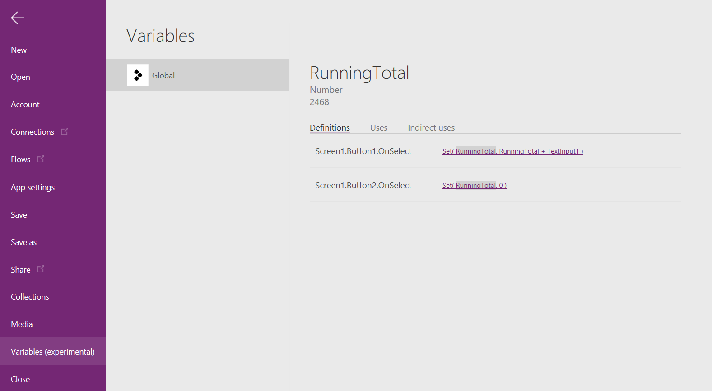
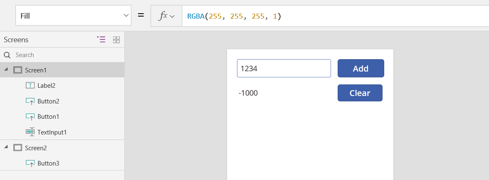
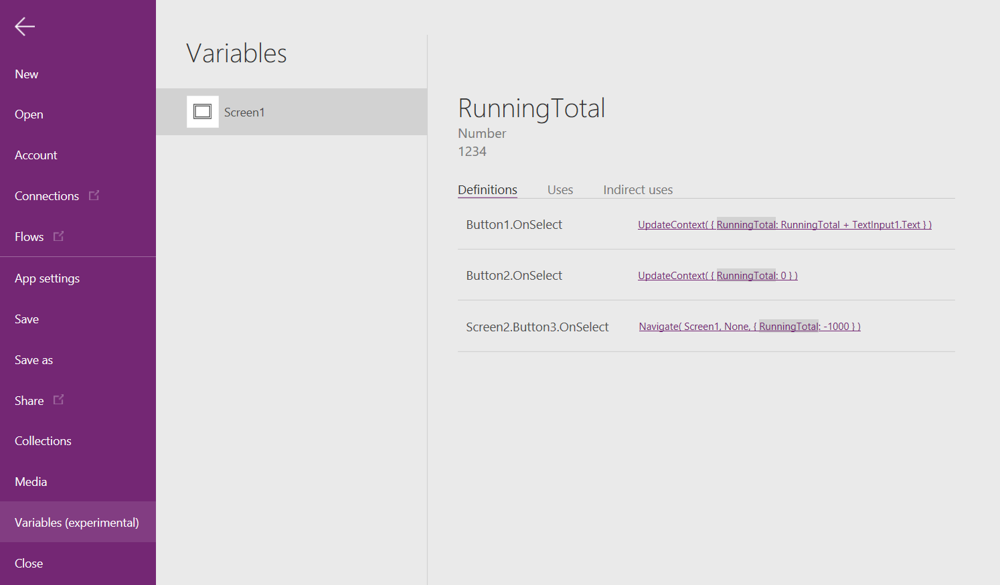
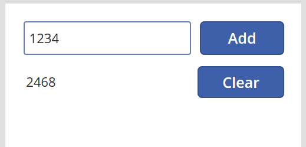
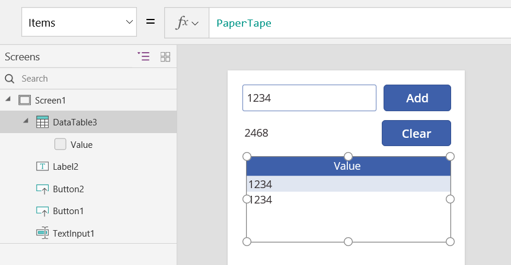

# Общие сведения о переменных в приложениях на основе холста в PowerApps

Если вы использовали другое средство программирования, например Visual Basic или JavaScript, у вас может возникнуть вопрос: **Где переменные?** PowerApps немного отличается и требует иного подхода. Вместо того, чтобы при создании приложения на основе холста мыслить в категориях переменных, спросите себя: **Как это делается в Excel?**

Возможно, в других средствах вы явно выполняли вычисления и хранили результаты в переменной. Однако в PowerApps и Excel формулы пересчитываются автоматически при изменении входных данных, поэтому обычно не требуется создавать и обновлять переменные. Применяя такой подход по мере возможности, можно легко создавать и обслуживать приложения, полностью понимая принцип их работы.

В некоторых случаях в PowerApps необходимо использовать переменные, которые расширяют модель Excel, добавляя в нее [формулы поведения](working-with-formulas-in-depth.md). Эти формулы, например, выполняются, когда пользователь нажимает кнопку. В формуле поведения зачастую удобно задать переменную, которую можно использовать в других формулах.

Как правило, использовать переменные нежелательно. Однако иногда только с их помощью можно обеспечить желаемые возможности.

## Реализация подхода Excel в PowerApps

### Excel
Давайте посмотрим, как работает Excel. Ячейка может содержать значение, например число, строку или формулу, в которой используются значения других ячеек. После того как пользователь вводит другое значение в ячейку, Excel автоматически пересчитывает все формулы, которые зависят от нового значения. При этом для обеспечения такого поведения не нужно ничего программировать.

В Excel нет переменных. Значение ячейки, содержащей формулу, изменяется в зависимости от входных данных, но при этом нет возможности запомнить результат формулы и сохранить его в ячейке или в любом другом месте. При изменении значения ячейки может измениться вся таблица, а все ранее вычисляемые значения будут утрачены.  Пользователь Excel может копировать и вставлять ячейки, но это нужно делать вручную. С помощью формул выполнить такую операцию невозможно.

### PowerApps
Поведение приложений, создаваемых в PowerApps, во многом напоминает поведение Excel. Вместо обновления ячеек можно добавить элементы управления в любом месте на экране и присвоить им имена, чтобы их можно было использовать в формулах.

Например, можно воспроизвести поведение Excel в приложении, добавив элемент управления **[Метка](controls/control-text-box.md)** с именем **TextBox1** и два элемента управления **[Текстовое поле](controls/control-text-input.md)** с именами **TextInput1** и **TextInput2**. Если затем задать для свойства **[Text](controls/properties-core.md)** элемента управления **TextBox1** значение **TextInput1 + TextInput2**, в результате всегда будет автоматически отображаться сумма любых чисел, указанных в элементах управления **TextInput1** и **TextInput2**.

Обратите внимание, что при выборе элемента управления **TextBox1** в строке формулы в верхней части экрана отображается его формула **[Text](controls/properties-core.md)**.  В данном случае она выглядит таким образом: **TextInput1 + TextInput2**.  Эта формула создает между этими элементами управления такую же зависимость, как между ячейками в книге Excel.  Изменим значение **TextInput1**.

Формула для **TextBox1** автоматически пересчитывается, и на экране отображается новое значение.

Чтобы в PowerApps определить не только основное значение элемента управления, но и его свойства, например форматирование, можно воспользоваться формулами. В следующем примере формула для свойства **[Color](controls/properties-color-border.md)** метки обеспечит автоматическое отображение отрицательных значений красным цветом. Функция **[If](functions/function-if.md)** очень похожа на ту, которая используется в Excel.
 **If( Value(TextBox1.Text) < 0, Red, Black )**

Теперь, если результат наших вычислений в **TextBox1.Text** окажется отрицательным, число будет отображаться красным цветом.

Формулы можно использовать в самых разнообразных сценариях.

* Используя GPS-модуль устройства, элемент управления картой может отобразить ваше текущее расположение с помощью формулы, использующей значения **Location.Latitude** и **Location.Longitude**.  При перемещении карта будет автоматически отслеживать расположение.
* Другие пользователи могут обновлять [источники данных](working-with-data-sources.md).  Например, другие участники группы могут обновлять элементы в списке SharePoint.  При обновлении источника данных все зависимые формулы автоматически пересчитываются, в результате чего отображаются обновленные данные. Дополнив этот пример, можно задать коллекцию свойства **[Items](controls/properties-core.md)** в формуле **Filter( SharePointList )**, что обеспечит автоматическое отображение заново отфильтрованного набора [записей](working-with-tables.md#records).

### Преимущества
Использование формул для создания приложений дает множество преимуществ.

* Если вы умеете работать с Excel, вы умеете работать с PowerApps. Модель и язык формул у них одинаковы.
* Если вы использовали другие средства программирования, представьте себе, сколько бы вам пришлось написать кода, чтобы обеспечить вычисления, приведенные в этих примерах.  В Visual Basic необходимо написать обработчик событий для события изменения в каждом текстовом поле.  Код, необходимый для выполнения вычисления в каждом из них, избыточен и может не синхронизироваться, или же вам придется написать общие подпрограммы.  В PowerApps все это можно сделать с помощью единственной формулы в одну строку.
* Чтобы понять, откуда берется текст **TextBox1**, просто посмотрите на формулу в свойстве **[Text](controls/properties-core.md)**.  Повлиять на текст данного элемента управления другими способами невозможно.  В традиционных средствах программирования любые подпрограммы и обработчики событий могут изменить значение метки из любого места в программе.  Из-за этого иногда сложно отследить, где и когда была изменена переменная.
* Изменив положение ползунка, пользователь может передумать и вернуть его в исходное положение.  В результате как бы ничего не происходит: приложение отображает такие же значения элемента управления, как и раньше.  Все это происходит без каких-либо последствий, так что можно смело экспериментировать и пробовать разные варианты, что в Excel попросту невозможно.  

Как правило, если желаемого эффекта можно добиться с помощью формулы, лучше использовать именно ее. Обработчик формул PowerApps сделает все автоматически.  

## Ситуации, в которых имеет смысл использовать переменные
Давайте изменим наш простой сумматор так, чтобы он функционировал по принципу старинного арифмометра, используя нарастающий итог. При нажатии кнопки **Добавить** число добавляется к нарастающему итогу. При нажатии кнопки **Очистить** нарастающий итог обнуляется.

Наш арифмометр использует то, чего нет в Excel: кнопки. В этом приложении для вычисления нарастающих итогов нельзя использовать только формулы, поскольку их значение зависит от ряда действий, которые выполняет пользователь. Вместо этого нарастающий итог записывается и обновляется вручную. Большинство средств программирования сохраняет эти сведения в *переменной*.    

Иногда, чтобы приложения вели себя необходимым образом, требуется использовать переменные.  Однако такой подход применим с некоторыми оговорками.

* Нарастающий итог необходимо обновлять вручную. При автоматическом пересчете эта операция не выполняется.
* Нарастающий итог больше нельзя рассчитать на основе значений других элементов управления. Он зависит от того, сколько раз пользователь нажимает кнопку **Добавить** и какое значение при этом содержится в элементе управления текстовым вводом на момент ее нажатия. Ввел ли пользователь 77 и нажал **Добавить** дважды или же указал 24 и 130 в качестве слагаемых? После того как итог станет равным 154, определить разницу невозможно.
* Итог может изменяться по разным причинам. В этом примере к его изменению может приводить нажатие кнопок **Добавить** и **Очистить**. Как определить, какая кнопка вызывает проблему, если приложение не работает должным образом?

## Создание глобальной переменной
Чтобы создать арифмометр, нам понадобится переменная для хранения нарастающего итога. Простейшие переменные в PowerApps — это *глобальные переменные*.  

Принцип их действия заключается в следующем:

* Значение глобальной переменной задается с помощью функции **[Set](functions/function-set.md)**.  **Set( MyVar, 1 )** задает для глобальной переменной **MyVar** значение **1**.
* Используйте эту глобальную переменную, ссылаясь на ее имя в функции **Set**.  В этом случае **MyVar** возвращает значение **1**.
* В глобальных переменных может храниться любое значение, в том числе строки, числа, записи и [таблицы](working-with-tables.md).

Перестроим наш арифмометр, воспользовавшись глобальными переменными.

1. Добавьте элемент управления текстовым вводом с именем **TextInput1** и две кнопки с именами **Button1** и **Button2**.

2. Задайте для свойства **[Text](controls/properties-core.md)** элемента управления **Button1** значение **"Add"**, а для свойства **Text** элемента управления **Button2** — значение **"Clear"**.

3. Чтобы нарастающий итог обновлялся, когда пользователь нажимает кнопку **Добавить**, задайте следующую формулу в качестве значения свойства **[OnSelect](controls/properties-core.md)**:
   
    **Set( RunningTotal, RunningTotal + Text1 )**
   
    Когда пользователь впервые нажимает кнопку **Добавить**, вызывается функция **[Set](functions/function-set.md)** и создается переменная **RunningTotal** со значением по умолчанию *blank*.  При суммировании оно будет интерпретировать как ноль.
   
    
4. Чтобы нарастающий итог становился равным **0**, когда пользователь нажимает кнопку **Очистить**, задайте в качестве значения его свойства **[OnSelect](controls/properties-core.md)** следующую формулу:
   
    **Set( RunningTotal, 0 )**
   
    
5. Добавьте элемент управления **[Метка](controls/control-text-box.md)** и задайте для его свойства **[Text](controls/properties-core.md)** значение **RunningTotal**.
   
    Эта формула пересчитывается автоматически, а для пользователя отображается значение **RunningTotal**, которое изменяется в зависимости от нажимаемых им кнопок.
   
    
6. Перейдите в режим предварительного просмотра приложения, и вы увидите, что наш арифмометр работает, как описано выше.  Введите число в текстовое поле и нажмите кнопку **Добавить** несколько раз.  Выполнив эти действия, вернитесь к разработке, нажав клавишу ESC.  
   
    
7. Чтобы просмотреть значение нашей глобальной переменной, щелкните меню **Файл** и на панели слева выберите **Переменные**.
   
    
8. Выберите переменную, чтобы просмотреть все случаи ее определения и использования.
   
    

## Типы переменных
Существует три типа переменных в PowerApps:

| Тип переменных | Область действия | Описание | Функции |
| --- | --- | --- | --- |
| Глобальные переменные |Приложение |Самые простые в использовании.  В них могут храниться любые значения, в том числе числа, текстовые строки, логические значения, записи, таблицы и т. п., на которые можно ссылаться из любого места в приложении. |[**Set**](functions/function-set.md) |
| Переменные контекста |Экран |Отлично подходят для передачи значений на экран, похожи на параметры для процедур на других языках.  На них можно ссылаться только с одного экрана. |[**UpdateContext**](functions/function-navigate.md) |
| Коллекции |Приложение |Содержит таблицу, на которую можно ссылаться из любого места в приложении.  Позволяет изменять содержимое таблицы вместо того, чтобы задать все содержимое сразу. Можно сохранить на локальном устройстве для дальнейшего использования. |[**Collect**](functions/function-savedata-loaddata.md) и т. д. |

Все переменные создаются неявно, когда используются в функциях **Set**, **UpdateContext**, **Navigate** или **Collect**.  В нашем средстве явное объявление переменных, как в других средствах программирования, не выполняется.  Кроме того, типы переменных являются неявно производными от значений, которые они содержат.

Все переменные хранятся в памяти во время выполнения приложения.  Когда приложение закрывается, хранящиеся в переменных значения утрачиваются.  Содержимое переменной можно сохранить в источнике данных с помощью функции **Patch** или **Collect**, а коллекции можно сохранить на локальном устройстве с помощью функции **SaveData**.  При первой загрузке приложения у всех переменных будет значение *blank*.

Чтобы узнать значение переменной, используйте ее имя.  Например, определив **Set( MyColor, Red )** один раз, вы можете использовать **MyVar** для каждого значения цвета, и оно будет заменено на **Red**.  Имя глобальной переменной или коллекции может совпадать с именем переменной контекста.  В таком случае переменная контекста будет приоритетной.  Вы по-прежнему можете ссылаться на глобальную переменную или коллекцию с помощью [оператора устранения неоднозначности](functions/operators.md#disambiguation-operator) **@[MyColor]**.

## Создание переменной контекста
Давайте попробуем создать наш арифмометр, используя переменную контекста вместо глобальной переменной.    

Принцип их действия заключается в следующем:

* Переменные контекста создаются и задаются с помощью функции **[UpdateContext](functions/function-updatecontext.md)**.  Если при первом обновлении переменная контекста не существует, она создается со значением по умолчанию *blank*.
* Для создания и обновления переменных контекста используются записи. В других средствах программирования для присвоения значений обычно используется оператор «=», например «x = 1».  Для переменных контекста вместо этого используется **{ x: 1 }**. При использовании переменной контекста используйте непосредственно ее имя.  
* Переменную контекста можно также задать с помощью функции **[Navigate](functions/function-navigate.md)** при отображении соответствующего экрана. Если представить, что экран — это своего рода процедура или подпрограмма, то это будет напоминать передачу параметров в других средствах программирования.
* За исключением функции **[Navigate](functions/function-navigate.md)**, переменные контекста ограничены контекстом одного экрана (того, на котором им было присвоено их имя).  Их нельзя использовать или задать вне данного контекста.
* В переменных контекста может храниться любое значение, в том числе строки, числа, записи и [таблицы](working-with-tables.md).

Перестроим наш арифмометр, воспользовавшись переменными контекста.

1. Добавьте элемент управления текстовым вводом с именем **TextInput1** и две кнопки с именами **Button1** и **Button2**.

2. Задайте для свойства **[Text](controls/properties-core.md)** элемента управления **Button1** значение **"Add"**, а для свойства **Text** элемента управления **Button2** — значение **"Clear"**.

3. Чтобы нарастающий итог обновлялся, когда пользователь нажимает кнопку **Добавить**, задайте следующую формулу в качестве значения свойства **[OnSelect](controls/properties-core.md)**:
   
    **UpdateContext( { RunningTotal: RunningTotal + Text1 } )**
   
    Когда пользователь первый раз нажимает кнопку **Добавить** и вызывается **[UpdateContext](functions/function-updatecontext.md)**, создается **RunningTotal** со значением по умолчанию *blank*.  При суммировании оно будет интерпретировать как ноль.
   
    
4. Чтобы нарастающий итог становился равным **0**, когда пользователь нажимает кнопку **Очистить**, задайте в качестве значения его свойства **[OnSelect](controls/properties-core.md)** следующую формулу:
   
    **UpdateContext( { RunningTotal: 0 } )**
   
    Опять же, в формуле **UpdateContext( { RunningTotal: 0 } )** используется **[UpdateContext](functions/function-updatecontext.md)**.
   
    
5. Добавьте элемент управления **[Метка](controls/control-text-box.md)** и задайте для его свойства **[Text](controls/properties-core.md)** значение **RunningTotal**.
   
    Эта формула пересчитывается автоматически, а для пользователя отображается значение **RunningTotal**, которое изменяется в зависимости от нажимаемых им кнопок.
   
    
6. Перейдите в режим предварительного просмотра приложения, и вы увидите, что наш арифмометр работает, как описано выше.  Введите число в текстовое поле и нажмите кнопку **Добавить** несколько раз.  Выполнив эти действия, вернитесь к разработке, нажав клавишу ESC.  
   
    
7. Вы можете задать значение переменной контекста, перейдя на экран.  Этот вариант используется для передачи контекста или параметров с одного экрана на другой.  Чтобы увидеть, как это работает, вставьте новый экран и кнопку, задав для свойства **OnSelect** следующее:
   
    **Navigate( Screen1, None, { RunningTotal: -1000 } )**
   
    
   
    Если щелкнуть эту кнопку в разделе **Screen2** (это можно сделать во время разработки, щелкнув края кнопки), отобразится экран **Screen1**, а переменной контекста **RunningTotal** будет задано значение -1000.
   
    
8. Чтобы просмотреть значение нашей переменной контекста, щелкните меню **Файл** и на панели слева выберите **Переменные**.
   
    
9. Выберите переменную контекста, чтобы просмотреть все случаи ее определения и использования.
   
    

## Создание коллекции
Наконец, давайте попробуем создать наш арифмометр с помощью коллекции.  Так как коллекция хранит таблицу, которую можно легко изменить, в этом арифмометре каждое вводимое значение будет сохранятся на "бумажной ленте".

Принцип действия коллекций описан ниже.

* Создайте и настройте коллекции с помощью функции **[ClearCollect](functions/function-clear-collect-clearcollect.md)**.  Вместо этого можно использовать функцию **[Collect](functions/function-clear-collect-clearcollect.md)**, но фактически для этого потребуется создать другую переменную, а не заменить имеющуюся.  
* Коллекция — это типа источника данных, который можно представить как таблицу. Чтобы получить доступ к отдельному значению в коллекции, воспользуйтесь функцией **[First](functions/function-first-last.md)** и извлеките одно поле из результирующей записи. Если вы использовали одно значение с **[ClearCollect](functions/function-clear-collect-clearcollect.md)**, это будет поле **Value**, как в этом примере: **First(** *VariableName* **).Value**

Создадим арифмометр, воспользовавшись коллекцией.

1. Добавьте элемент управления **[Текстовое поле](controls/control-text-input.md)** с именем **TextInput1** и две кнопки с именами **Button1** и **Button2**.

2. Задайте для свойства **[Text](controls/properties-core.md)** элемента управления **Button1** значение **"Add"**, а для свойства **Text** элемента управления **Button2** — значение **"Clear"**.

3. Чтобы нарастающий итог обновлялся, когда пользователь нажимает кнопку **Добавить**, задайте следующую формулу в качестве значения свойства **[OnSelect](controls/properties-core.md)**:
   
    **Collect( PaperTape, TextInput1.Text )**
   
    Эта формула добавляет новое значение в конец коллекции.  Так как мы добавляем одно значение, функция **Collect** автоматически поместит его в таблицу с одним столбцом с именем **Value**, который мы будем использовать позже.
   
    
4. Чтобы очищать нашу "бумажную ленту", когда пользователь нажимает кнопку **Очистить**, задайте в качестве значения свойства **[OnSelect](controls/properties-core.md)** следующую формулу:
   
    **Clear( PaperTape )**
   
    
5. Для отображения нарастающего итога добавьте метку и задайте для нее в качестве значения свойства **[Text](controls/properties-core.md)** следующую формулу:
   
    **Sum( PaperTape, Value )**
   
    
6. Чтобы запустить арифмометр, нажмите F5, чтобы перейти в режим предварительного просмотра, введите число в текстовом поле и нажмите кнопки.
   
    
7. Нажмите клавишу ESC, чтобы вернуться в рабочую область по умолчанию.
8. Чтобы отобразить "бумажную ленту", вставьте элемент управления **Таблица данных** и задайте его свойству **[Items](controls/properties-core.md)** следующую формулу:
   
    **PaperTape**
   
    Также необходимо выбрать столбцы, которые будут отображаться в области справа. В нашем случае это столбец **Value**.
   
    
9. Чтобы просмотреть значения в коллекции, выберите в меню **Файл** пункт **Коллекции**.
   
    
10. Чтобы сохранить и извлечь коллекцию, добавьте две дополнительные кнопки и задайте для них значения **Загрузить** и **Сохранить**.  Для кнопки **Загрузить** задайте свойству **OnSelect** эту формулу:
    
     **Clear( PaperTape ); LoadData( PaperTape, "StoredPaperTape", true )**
    
     Сначала нам нужно очистить коллекцию, так как **LoadData** добавит хранящиеся значения в конец коллекции.
    
     
11. Для кнопки **Сохранить** задайте свойству **OnSelect** эту формулу:
    
     **SaveData( PaperTape, "StoredPaperTape" )**
    
     
12. Перейдите в режим предварительного просмотра снова, нажав клавишу F5, введите числа в элементе управления для ввода текста и нажмите кнопки.  Нажмите кнопку **Сохранить**.  Закройте и перезапустите приложение, а затем нажмите кнопку **Загрузить**, чтобы повторно загрузить коллекцию.  
    
    > [!NOTE]
    > Функции **SaveData** и **LoadData** не работают в PowerApps Studio, но работают в PowerApps Mobile.

