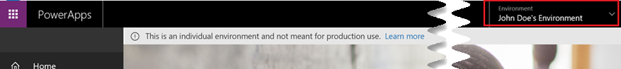

# План сообщества PowerApps: бесплатная среда разработки для индивидуального использования
Если требуется развить навыки и получить дополнительные сведения о PowerApps, Microsoft Flow и Common Data Service, план сообщества PowerApps — это правильный план для вас. План сообщества PowerApps предоставляет бесплатную среду разработки для индивидуального использования с указанными ниже возможностями.

* Научитесь создавать бизнес-приложения и бизнес-процессы с полной функциональностью PowerApps и Microsoft Flow.
* Подключайтесь к любым источникам данных, используя более 100 наших [готовых соединителей](./canvas-apps/connections-list.md) или создавая свои собственные [настраиваемые соединители](./canvas-apps/register-custom-api.md).
* Изучайте, как можно использовать [Common Data Service](https://docs.microsoft.com/common-data-service/entity-reference/introduction) для создания мощных бизнес-приложений с общей моделью данных и [SDK](https://aka.ms/eek20s).
* Экспортируйте создаваемые решения в вашу индивидуальную среду и [размещайте их список в AppSource](./canvas-apps/dev-appsource-test-drive.md), чтобы ваши клиенты могли их тестировать.

## Кто может подписаться на план сообщества PowerApps?
Любой пользователь с [рабочей или школьной учетной записью](signup-for-powerapps.md#faq) может подписаться на план сообщества PowerApps. Но мы особенно рекомендуется этот план в случае, когда:

* Вы хотите развить навыки и получить дополнительные сведения о PowerApps, Microsoft Flow и Common Data Service.
* Вы заинтересованы в создании бизнес-приложений и бизнес-процессов для распространения в AppSource.

## Где можно подписаться на план сообщества PowerApps?
Зарегистрируйтесь на [веб-сайте плана сообщества PowerApps](https://powerapps.microsoft.com/communityplan). Если вы являетесь существующим пользователем PowerApps с Office 365 или Dynamics 365, можно также [создать среду для индивидуального использования](https://web.powerapps.com/community/signup).

После регистрации на план сообщества, вы будете перенаправлены на [сайт PowerApps](https://web.powerapps.com?utm_source=padocs&utm_medium=linkinadoc&utm_campaign=referralsfromdoc) и перейдете в свою индивидуальную среду. Среда названа вашим именем, например "Среда Джона Доу". Если уже имеется среда с этим именем, индивидуальная среда будет называться "Среда Джона Доу (1)".  Следующее изображение показывает, как выглядит среда.

### Получение плана сообщества с Visual Studio Dev Essentials
Если вы пользователь Visual Studio Dev Essentials, PowerApps включен в ваши преимущества. Посетите [Мои преимущества](https://my.visualstudio.com/benefits) и щелкните или нажмите плитку PowerApps, чтобы зарегистрироваться на план сообщества PowerApps.

## Какие функции включаются в план сообщества PowerApps?
С индивидуальной средой вы получаете следующие функции:

| **Функциональные возможности** | **Среда для индивидуального использования** |
| --- | --- |
| **Основные возможности** | |
| Создание и запуск приложений |Да. Можно создавать неограниченные приложения |
| Совместное использование приложений\* |Нет |
| Использование Common Data Service |Да** |
| Создавайте модели данных с помощью Common Data Service |Да** |
| Администрирование корпоративного уровня для среды и политик пользователей |Да |
| **Подключение** | |
| Подключение к Office 365, Dynamics 365 и другим соединителям |Да |
| Подключение к облачным службам, таким как Azure SQL, Dropbox, Twitter и многим другим |Да |
| Использование премиум-соединителей, таких как Salesforce, DB2 и многие другие |Да |
| Доступ к локальным данным с использованием локального шлюза |Да |
| Создание настраиваемых соединителей для подключения к собственным системам |Да. Можно создавать неограниченные настраиваемые соединители |
| **Common Data Service** | |
| Создание и запуск приложений в Common Data Service |Да** |
| Создание моделей данных в Common Data Service |Да** |
| Создание базы данных в Common Data Service. |Да** |
| **Управление** | |
| Добавление сотрудников как создателей и администраторов среды |Нет |
| Добавление сотрудников к ролям базы данных |Нет |
| Поддержка политик данных, установленных администратором Office 365 |Да |
| Установка политик данных для индивидуальной среды |Да |

*Вы не можете предоставлять общий доступ к приложениям, потокам, соединениям, и т. д. другим пользователям вашего клиента. Также невозможно добавить никакого другого пользователя как администратора или создателя среды или к ролям базы данных из центра администрирования.

\*\*Создание базы данных с помощью Common Data Service недоступно в настоящее время в индивидуальной среде, и будет доступно вскоре. Если была создана ранее база данных, можно продолжить использовать ее без проблем. 

## Какие ограничения на производительность для среды индивидуальной?

| **Мощность** |  |
| --- | --- |
| Запусков потоков в месяц |750 |
| Размер базы данных |200 МБ |
| Файловое хранилище |2 ГБ |

Невозможно применить надстройки к количествам, которые мы включаем. Если достигнуты ограничения производительности, рекомендуется приобретение плана 2 PowerApps. Дополнительные сведения об этом см. на [странице ценообразования PowerApps](https://powerapps.microsoft.com/pricing/).

> [!NOTE]
> Производительность индивидуальной среды, использованная или не использованная, не входит в общие квоты вашей компании.

## Публикация в AppSource
Есть приложение, которым нужно поделиться с клиентами? Теперь мы поддерживаем решение PowerApps Test Drive на сайте [AppSource.com](https://appsource.microsoft.com) как способ поделиться приложениями и бизнес-процессами с клиентами, и создавать интересы для вашего предприятия. Чтобы получить дополнительные сведения, см. раздел [Разрешение клиентам тестировать приложения в AppSource](./canvas-apps/dev-appsource-test-drive.md).

## Вопросы и ответы
**В.** Что мне следует сделать, если достигнуто ограничение производительности среды?

**О.** Предоставлена ограниченная производительность, поскольку эта среда предназначена для индивидуального использования, а не для использования в рабочей группе или на производстве. Предоставляется следующая емкость:

| **Мощность** |  |
| --- | --- |
| Запусков потоков в месяц |750 |
| Размер базы данных |200 МБ |
| Файловое хранилище |2 ГБ |

Если достигнуто одно или несколько ограничений производительности, рекомендуется купить план, поддерживающий производственное использование. Дополнительные сведения о наших планах и их ограничениях см. на [странице ценообразования PowerApps](https://powerapps.microsoft.com/pricing/).

**В.** Можно ли перенести приложения, потоки и другие ресурсы, созданные в индивидуальной среде, в другую среду?

**О.** Да, необходимо будет экспортировать ресурсы из этой среды в другие среды. Дополнительные сведения см. в разделе [Перенос приложений из сред и клиентов](../administrator/environment-and-tenant-migration.md).

**В.** Моя подписка на план сообщества PowerApps когда-нибудь закончится?

**О.** Можно использовать подписку на план сообщества PowerApps постоянно и бесплатно. Если вы используете индивидуальную среду активно, то не потеряете доступ к любым из ресурсов или функций в этой среде. Можно, однако, заметить задержку при получении доступа к базе данных Common Data Service в первый раз после долгого периода неактивности.  Эта задержка не повлияет на данные или сущности, которые хранятся в Common Data Service.

**В.** Можно ли получить или создавать множество отдельных сред?

**О.** Нет, можно иметь только одну индивидуальную среду, которая создается для вас в PowerApps, когда вы выполняете регистрацию на план сообщества.

**В.** В чем разница между пробной версией PowerApps, план 2, и планом сообщества PowerApps, и на что мне следует оформить подписку?

**О.** Пробная версия PowerApps, план 2, и план сообщества PowerApps оба бесплатны, но созданы для различных целей:

**Пробная версия PowerApps, план 2** предоставляет вам план 2 PowerApps Plan на 30 дней. Она предназначена для опробования PowerApps, Common Data Service и Microsoft Flow. После истечения срока действия пробной версии возможно приобретение плана. Если вы уже используете PowerApps с Office 365 или Dynamics 365, это подходящий план, чтобы попробовать лучшие функции PowerApps, которые доступны с планом 2 PowerApps.

**План сообщества PowerApps** предоставляет доступ к лучшим возможностям PowerApps, Common Data Service и Microsoft Flow для индивидуального использования. Этот план предназначен в первую очередь для учебных целей или создание бизнес-решений для распространения для [AppSource Test Drive](./canvas-apps/dev-appsource-test-drive.md). Это план доступен постоянно, но только для изучения и развития навыков работы в PowerApps, Common Data Services и Microsoft Flow.

**В.** Могу я зарегистрироваться с моей персональной учетной записью?

**О.** Нет, можно только регистрироваться с [рабочей или школьной учетной записью](signup-for-powerapps.md#faq). На данный момент мы не поддерживаем регистрацию с персональной учетной записью.

**О:** Можно ли удалить индивидуальную среду?

**О.** Нельзя удалить эту среду самостоятельно. Администратор вашего клиента имеет разрешения на удаление этой среды.
