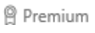

# Регистрация для получения бесплатной пробной лицензии PowerApps
Для создания приложений в PowerApps требуется один из типов лицензий, которые предоставляют функциональность разного уровня. У вас уже есть лицензия PowerApps, если ваша организация приобрела для вас одну из нескольких версий Office 365 или Dynamics 365 либо лицензию на план 1 или план 2 PowerApps.

> [!NOTE]
> Дополнительные сведения об администрировании см. в статьях [Приобретение PowerApps для организации](../administrator/signup-for-powerapps-admin.md) и [PowerApps в вашей организации. Вопросы и ответы](../administrator/signup-question-and-answer.md).

Вы можете узнать, [какие лицензии включают в себя PowerApps](https://powerapps.microsoft.com/pricing/) и какие возможности они предоставляют. Если вы по-прежнему не уверены, есть ли у вас лицензия, откройте [сайт PowerApps](http://powerapps.microsoft.com) и нажмите **Вход**.

Если у вас нет лицензии или вам нужна более широкая функциональность, чем предлагаемая текущей лицензией, вы можете зарегистрироваться для получения бесплатной пробной лицензии на план 2 PowerApps. Эта лицензия дает все возможности PowerApps, но действует только 30 дней.

## Обновление имеющейся лицензии 
Вы можете приступить к использованию 30-дневной бесплатной пробной лицензии на план 2 PowerApps, войдя в PowerApps с помощью существующей лицензии и попытавшись выполнить одну из следующих задач:

* [создание экземпляра Common Data Service и управление им](../administrator/signup-for-powerapps-admin.md);
* [Моделирование данных](./common-data-service/data-platform-intro.md) с помощью Common Data Service.
* [создание сред и управление ими](../administrator/environments-administration.md) из центра администрирования PowerApps;
* [Управление локальным шлюзом данных](./canvas-apps/gateway-management.md) в PowerApps.  

Если попытаться выполнить любую из этих задач, не имея лицензии на план 2 PowerApps, вам будет предложено начать 30-дневный период бесплатного пробного использования. Просто выберите **Начать пробный период**, а затем примите условия использования в открывшемся диалоговом окне.

## Получение лицензии с нуля
Если у вас нет лицензии на PowerApps, вы можете зарегистрироваться, чтобы получить бесплатный 30-дневный пробный план 2 PowerApps на [сайте PowerApps](http://powerapps.microsoft.com).

* При использовании браузера на телефоне коснитесь значка меню в правом верхнем углу, а затем нажмите кнопку **Зарегистрируйтесь бесплатно**.
* Если вы используете браузер на устройстве другого типа, нажмите кнопку **Зарегистрируйтесь бесплатно** в правом верхнем углу.

    

В центре экрана выберите **Цены**, а затем **Начать бесплатный пробный период**.

В появившемся диалоговом окне введите свой рабочий или учебный адрес электронной почты, а затем нажмите кнопку **Отправить**.

> [!IMPORTANT]
> Не поддерживаются адреса пользовательских почтовых служб, поставщиков услуг связи, а также адреса государственных и военных учреждений, в частности:  
> 
> * outlook.com, hotmail.com, gmail.com и т. д;  
> * с доменами .gov и .mil.
>
> При попытке регистрации с помощью личного адреса почты появится сообщение с указанием использовать рабочий или учебный адрес.

Если PowerApps опознает вашу организацию, вы можете выполнить вход с ее учетными данными (и пропустить дальнейшие инструкции).

В противном случае вам будет предложено проверить электронную почту. 

В сообщении электронной почты перейдите по ссылке для подтверждения адреса и (при необходимости) предоставьте дополнительные сведения.

Когда появится это диалоговое окно, нажмите **Начать** и приступайте к работе с [PowerApps](http://web.powerapps.com).

> [!NOTE]
> Если вам требуется больше времени для оценки PowerApps, отправьте запрос о продлении пробного периода еще на 30 дней.

## Часто задаваемые вопросы

### Какие расширенные возможности включены в пробную лицензию?

* **Доступ к службе Common Data Service** — надежной платформе бизнес-данных, встроенной в службу PowerApps. Служба [Common Data Service](./common-data-service/data-platform-intro.md) содержит сотни стандартных бизнес-сущностей, поэтому все ваши приложения могут использовать одинаковые определения таких сущностей, как клиент, продукт, идея и т. д.
* **Доступ к подключениям уровня "Премиум"**, в том числе к Salesforce, DB2, Zendesk и Common Data Service. Используя многие планы Office 365 и Dynamics 365, вы можете подключаться к таким источникам данных, как Office 365, Dynamics 365, Dropbox и Twitter. С помощью пробной лицензии можно также подключаться к данным посредством следующих соединителей категории "Премиум" и многих других:

    

    В [полном списке](./canvas-apps/connections-list.md) соединители уровня "Премиум" отмечены значком:

    
* **Доступ к центру администрирования PowerApps**, который позволяет управлять средами, базами данных, пользовательскими разрешениями и политиками данных. [Дополнительные сведения](../administrator/introduction-to-the-admin-center.md)
* **Создавайте приложения на основе модели**. В этом режиме вы добавляете компоненты в приложение, а PowerApps создает его макет и другие элементы интерфейса. 

Дополнительные сведения о функциональности и ресурсах, доступных по пробной лицензии, см. на [странице с ценами](https://powerapps.microsoft.com/pricing/).

### Какой адрес электронной почты можно использовать?
Для получения пробной лицензии можно использовать рабочий или учебный адрес. При использовании адреса другого типа могут возникать симптомы, описанные в таблице ниже.

| Симптом или сообщение об ошибке | Причины и возможное решение |
| --- | --- |
| **Личный адрес электронной почты (например, nancy@gmail.com)**     Во время регистрации отобразилось следующее сообщение:     `You entered a personal email address: Please enter your work email address so we can securely store your company's data.`     или     `That looks like a personal email address. Enter your work address so we can connect you with others in your company. And don’t worry. We won’t share your address with anyone.` |PowerApps не поддерживает адреса пользовательских почтовых служб и поставщиков услуг связи.     Чтобы завершить регистрацию, попробуйте снова, используя рабочий или учебный адрес электронной почты. |
| **адреса с доменами .gov или .mil**     Во время регистрации отобразилось следующее сообщение:     `PowerApps unavailable: PowerApps is not available for users with .gov or .mil email addresses at this time. Use another work email address or check back later.`     или     `We can't finish signing you up. It looks like Microsoft PowerApps isn't currently available for your work or school.` |Сейчас PowerApps не поддерживает адреса с доменами .gov или .mil. |
| **Адрес электронной почты не является идентификатором Office 365**      Во время регистрации отобразилось следующее сообщение:     `We can't find you at contoso.com.  Do you use a different ID at work or school? Try signing in with that, and if it doesn't work, contact your IT department.` |Для входа в Office 365 и другие службы Майкрософт ваша организация использует идентификаторы, отличные от адресов электронной почты. Например, может использоваться адрес электронной почты Nancy.Smith@contoso.com, а идентификатор — nancys@contoso.com.     Чтобы завершить регистрацию, используйте идентификатор, назначенный вам организацией, для входа в Office 365 или другие службы Майкрософт.  Если вы не знаете этот идентификатор, обратитесь к ИТ-администратору. |

### Что происходит по истечении срока действия пробной версии?
Через 30 дней вам будет предложено запросить продление пробного периода или приобрести план. Подробные сведения о всех планах см. на [странице с ценами](https://powerapps.microsoft.com/pricing/).

* При наличии доступа к PowerApps через Office 365, Dynamics 365 или PowerApps (план 1) вы по-прежнему можете использовать PowerApps, но можете потерять доступ к службе Common Data Service, соединителям уровня "Премиум", центру администрирования PowerApps и другим функциям плана 2. Например, при попытке создать подключение уровня "Премиум" может появиться этот экран:

    

* При доступе к PowerApps только с помощью пробной лицензии (для использования которой вы зарегистрировались на [сайте PowerApps](http://powerapps.microsoft.com/) или [странице с ценами](http://powerapps.microsoft.com/pricing)) вы можете запросить продление пробного периода на 30 дней, чтобы сохранить доступ к PowerApps.

### Когда истекает срок действия пробной лицензии?
Чтобы узнать, когда истекает срок действия пробной лицензии, щелкните значок шестеренки в правом верхнем углу [сайта PowerApps](http://web.powerapps.com) и выберите пункт **Планы**.

### Что происходит с данными по истечении срока действия пробной лицензии?
Если у вас по-прежнему есть доступ к PowerApps, вы сможете и дальше пользоваться ими. Не только все данные в службе Common Data Service останутся неизменными. Все приложения или последовательности, в которых в качестве источника данных используется Common Data Service, также будут выполняться как и раньше. Однако вы не сможете использовать такие приложения или последовательности: при попытке изменить схему или сущности в службе Common Data Service вам будет предложено запросить продление пробного периода на 30 дней или приобрести план.

### Каковы следующие действия?
Доступ к службе PowerApps и ее функциям можно сохранить, выполнив одно из указанных ниже действий.

* Продлите пробную лицензию на 30 дней при появлении запроса.
* Просмотрите доступные планы на [странице с ценами](https://powerapps.microsoft.com/pricing/) на PowerApps и [приобретите один из них](../administrator/signup-for-powerapps-admin.md).

## У вас имеются и другие вопросы?
Обратитесь в [сообщество](https://community.powerapps.com) PowerApps.