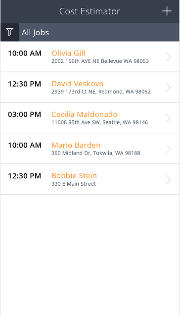
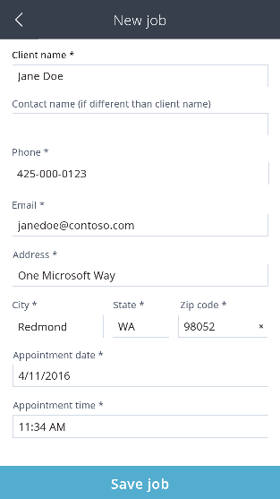
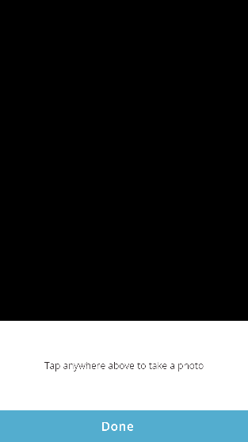
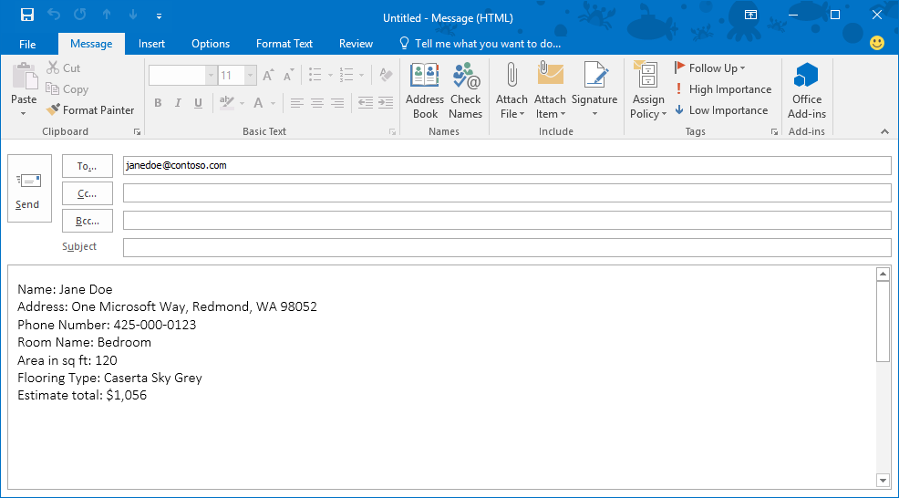

# Использование примера приложения
Зайдите на сайт [powerapps.com](http://web.powerapps.com) и выберите пример приложения, чтобы ознакомиться с возможностями разработки и узнать общие принципы, которые можно применить при создании собственных приложений. Во всех примерах приложений используются вымышленные данные для демонстрации реальной ситуации.

Например, с помощью приложения **Cost Estimator** (Оценщик затрат) можно создать встречу для оценки стоимости укладки пола в помещении с заданными размерами. Приложение позволяет собрать такие сведения, как адрес и площадь объекта, и рассчитать стоимость с учетом скидки и ставки налога. Также можно отфильтровать список встреч. Таким образом, на экране можно отобразить либо полный список встреч, либо только те встречи, для которых оценка уже выполнена, либо только те встречи, для которых оценка еще не выполнена.

## Открытие приложения
1. Войдите в свою учетную запись на странице [powerapps.com](https://web.powerapps.com) и выберите **Cost Estimator** (Оценщик затрат) в списке примеров приложений.

    
2. Щелкните или коснитесь **Открыть для телефона**, чтобы отобразить приложение так, как оно будет выглядеть в телефоне. Затем щелкните или коснитесь **Разрешить**, чтобы дать согласие использование камеры своего устройства.

    Приложение содержит демонстрационные данные для создания встреч и оценки стоимости затрат на укладку выбранного покрытия для пола в помещении с заданными размерами.

    

## Создание и просмотр встречи
1. Выберите значок **+**, чтобы добавить встречу для оценки затрат.

    
2. Укажите необходимые сведения, а затем нажмите кнопку **Save job** (Сохранить задание).

    

    Новая встреча появится в списке встреч.

    
3. Выберите любую встречу, например только что созданную вами, чтобы просмотреть сведения о ней, включая карту местности. Удалить встречу можно с помощью значка корзины в правом верхнем углу.

    

## Создание оценки
1. На экране для отображения сведений о встрече нажмите кнопку **Begin Estimate** (Начать оценку).

    
2. Укажите необходимую информацию о помещении в таких полях, как, например, **Name** (Название), **Length** (Длина) и **Width** (Ширина), а затем выберите пункт **Select flooring style** (Выбрать покрытие).

    

    Появится список категорий покрытия для пола.

    
3. Выберите **Carpet** (Ковер), а затем — образец **Caserta Sky Grey**.

    
4. Если приложение используется на устройстве с камерой, нажмите кнопку **Add photos** (Добавить фото).

    
5. Сделайте один или несколько снимков и нажмите кнопку **Done** (Готово).

    

## Завершение оценки и отправка результатов
1. Нажмите кнопку **Review Estimate** (Просмотр оценки).

    
2. (Необязательно.) Укажите размер скидки в поле **Price adjustment** (Корректировка цены) и ставку налога в поле **Tax** (Налог).
3. Добавьте подпись и нажмите кнопку **Submit estimate** (Отправить результат оценки).

    

    Если это предусмотрено в настройках браузера, откроется используемый по умолчанию почтовый клиент, где уже создано новое сообщение с информацией об оценке.

    

    На следующем снимке экрана в PowerApps показано, что результат оценки отправлен.

    
4. Нажмите кнопку **Done** (Готово), чтобы вернуться к списку встреч.

    Встреча, для которой вы только что завершили оценку, будет выделена зеленым цветом. Это значит, что задание закрыто.

    
5. (Необязательно.) Выберите значок фильтра в правом верхнем углу, чтобы отфильтровать список по состоянию выполнения задания (открыто или закрыто) или отобразить весь список встреч.
