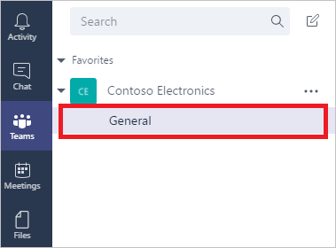

# Добавление и открытие приложения в Microsoft Teams
Можно добавить приложение в канал Microsoft Teams, чтобы любой пользователь, которому был предоставлен общий доступ к этому приложению, мог открыть его в данном канале. Можно добавить любое приложение, которое вы создали или для которого у вас есть разрешения **Может использовать** или **Может изменять**. Кроме того, можно добавить и открыть приложение из браузера или классического приложения для Microsoft Teams.

## Добавление приложения
1. [Предоставьте общий доступ к приложению](share-app.md) другим участникам команды.
2. В Microsoft Teams выберите команду и канал для нее.
   
    
3. Щелкните (коснитесь) **+**, чтобы добавить вкладку.
   
    
4. В диалоговом окне **Добавление вкладки** щелкните (коснитесь) **PowerApps**.
   
    
5. Щелкните (коснитесь) приложение, которое нужно добавить.
   
    > [!NOTE]
> Приложение можно найти по имени, автору или окружению.
   
    
6. Нажмите кнопку **Сохранить**.
   
    
   
    Теперь приложение можно использовать в канале.
   
    

## Запуск приложения
1. В Microsoft Teams выберите команду и канал, который содержит приложение.
   
    
2. Щелкните (коснитесь) вкладку, которая соответствует имени приложения.
   
    
   
    Приложение откроется в канале.
   
    

## Известные проблемы
В классическом приложении для Microsoft Teams:

* Приложения должны загружать содержимое, такое как изображения и PDF-файлы, через защищенное подключение (HTTPS).
* Поддерживаются не все датчики, в том числе **Ускорение**, **Компас** и **Расположение**.
* Поддерживаются только эти звуковые форматы: AAC, H264, OGG Vorbis и WAV.

