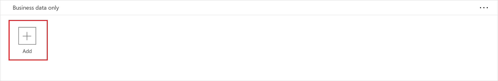
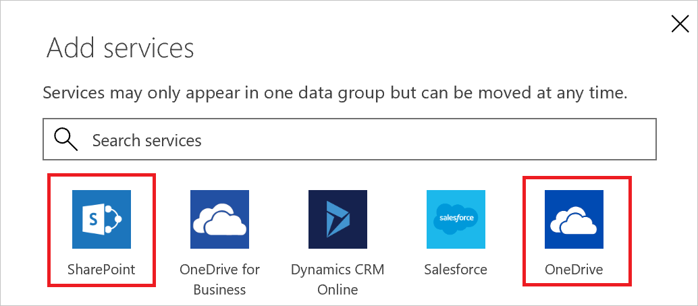
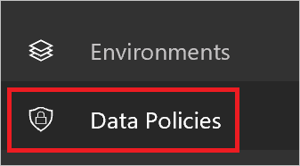

# Политики защиты от потери данных.
## Что такое политика защиты от потери данных?
Информация критически важна для успешной работы организации. Эта информация должна быть легко доступна для принятия решений, но она также должна быть защищена, чтобы к ней не могли получить доступ посторонние лица. Чтобы защитить данные, Microsoft PowerApps (PowerApps) предоставляет возможность создавать и применять политики, которые определяют правила доступа к определенным бизнес-данным для потребительских служб и соединителей. Эти политики, которые задают правила совместного использования данных, известны как политики защиты от потери данных.  

## Зачем нужна политика защиты от потери данных?
Политика защиты от потери данных позволяет четко определить, какие потребительские службы могут использовать бизнес-данные. Представим, что организация использует PowerApps и не хочет, чтобы хранящиеся в SharePoint данные автоматически публиковались в веб-канале Twitter. Для этого нужно создать политику защиты от потери данных, которая запретит использовать данные SharePoint в качестве источника информации для твитов.

## Преимущества политики защиты от потери данных
* Данные управляются единообразно в пределах всей организации.  
* Защита от случайной публикации важных бизнес-данных в таких службах, как социальные сети.   

## Управление политиками защиты от потери данных
**Предварительные требования**  
Чтобы создавать, изменять или удалять политики защиты от потери данных, необходимы следующие элементы.

* Разрешения администратора среды или администратора клиента. Дополнительные сведения о разрешениях можно получить в [статье о средах](environments-administration.md).

## Создание политики защиты от потери данных
**Предварительные требования**  
Чтобы создать политику защиты от потери данных, вам потребуются разрешения по крайней мере в одной среде.  

Выполните следующие действия, чтобы создать политику защиты от потери данных, которая предотвратит публикацию на сайте Twitter данных из базы данных SharePoint.  

1. На вкладке политик данных выберите ссылку **Новая политика**:  
       
2. Введите имя политики защиты от потери данных, например *Безопасный доступ к данным для Contoso*, в поле **Имя политики данных** в верхней части открывшейся страницы:   
     
3. Выберите нужную [среду](environments-administration.md) на вкладке **Относится к**.  
     
4. Выберите вкладку **Группы данных**:  
     
5. Выберите ссылку **+ Добавить**, расположенную внутри группы **Business data only** (Только бизнес-данные):    
     
6. Выберите службы **SharePoint** и **Salesforce** на странице **Добавление служб**:  
     
7. Нажмите кнопку **Добавить службы**, чтобы добавить выбранные службы в список служб, которые могут предоставлять бизнес-данные:    
     
8. Выберите **Сохранить политику**:  
     
9. Через несколько мгновений новая политика защиты от потери данных появится в списке политик:  
     
10. **Необязательно.** Отправьте своим сотрудникам сообщение электронной почты или другим способом сообщите им о том, что доступна новая политика защиты от потери данных.

Вы создали политику защиты от потери данных, которая позволяет приложениям обмениваться данными между SharePoint и Salesforce, но при этом блокирует передачу данных любым другим службам.  

## Поиск политики защиты от потери данных
### Администраторы
Администраторы могут использовать функцию поиска в центре администрирования, чтобы найти конкретную политику защиты от потери данных.  

**Примечание.** Администраторам следует публиковать все политики защиты от потери данных, чтобы пользователи в организации знали о них еще до создания приложений PowerApps.

### Разработчики
Если вы хотите узнать больше о политиках защиты от потери данных в вашей организации, но у вас нет прав администратора, обратитесь к локальному администратору. Также вы можете воспользоваться [этим руководством для разработчиков](environments-overview.md).  

**Примечание.** Только администраторы могут изменять или удалять политики защиты от потери данных.  

## Редактирование политики защиты от потери данных
1. Запустите Центр администрирования, перейдя по адресу https://admin.powerapps.com.   
2. В Центре администрирования выберите ссылку **Политики данных** слева.  
     
3. Просмотрите список существующих политик защиты от потери данных и выберите ссылку редактирования, размещенную рядом с нужной политикой.  
     
4. Внесите требуемые изменения. Например, вы можете изменить среду или службы в группах данных.  
5. Нажмите кнопку **Сохранить политику**, чтобы сохранить изменения.  
     

Обновление политики завершено. Чтобы убедиться, что в политику внесены изменения, найдите ее в списке политик защиты от потери данных и просмотрите ее свойства.   

## Удаление политики защиты от потери данных
1. Запустите Центр администрирования, перейдя по адресу https://admin.powerapps.com.    
2. В Центре администрирования выберите ссылку **Политики данных** слева.  
     
3. Просмотрите список существующих политик защиты от потери данных и выберите ссылку удаления, размещенную рядом с политикой, которую следует удалить.  
     
4. Подтвердите удаление политики, нажав кнопку **Удаление**:  
     

Удаление политики завершено. Убедитесь, что политика больше не отображается в списке политик защиты от потери данных, выбрав слева ссылку **Политики данных** и просмотрев список политик.   

## Разрешения для политики защиты от потери данных
Только администраторы клиента и среды могут создавать и изменять политики защиты от потери данных. Дополнительные сведения о разрешениях можно получить в [статье о средах](environments-administration.md).  

## Дальнейшие действия
* [Использование сред в PowerApps](environments-administration.md)  
* [Введение в PowerApps](getting-started.md)  
* [Центр администрирования](introduction-to-the-admin-center.md)  

