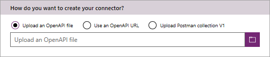
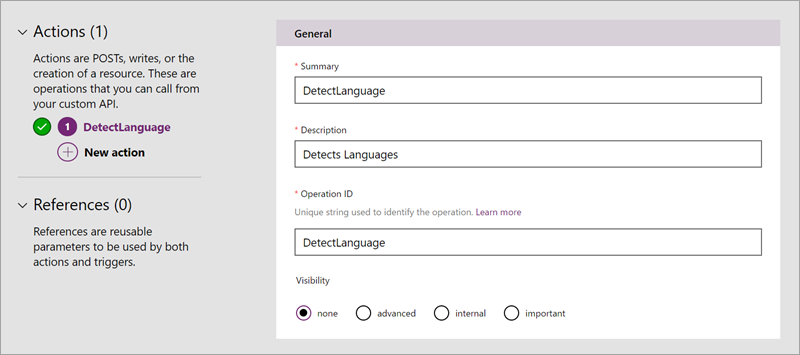
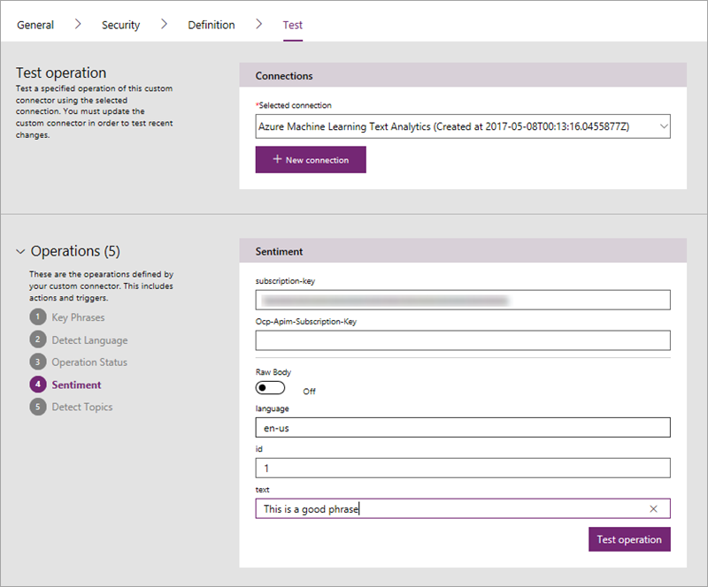
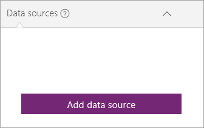
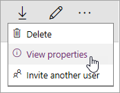

# <a name="register-and-use-custom-connectors-in-powerapps"></a>Регистрация и использование настраиваемых соединителей в PowerApps
PowerApps позволяет создавать полнофункциональные приложения без написания традиционного кода приложения. Однако в некоторых случаях вам может понадобиться расширить возможности PowerApps, и для этого лучше всего использовать веб-службы. Ваше приложение может подключаться к службе, выполнять операции и обмениваться данными. Если есть веб-служба, к которой вы хотите подключиться с помощью PowerApps, вам необходимо зарегистрировать ее как настраиваемый соединитель. Это позволяет PowerApps лучше понимать характеристики вашего веб-API, включая требуемую проверку подлинности, поддерживаемые операции, а также параметры и выходные данные для каждой операции.

В этой статье мы рассмотрим необходимые шаги при регистрации и использовании настраиваемого соединителя. В качестве примера используем [API анализа текста](https://www.microsoft.com/cognitive-services/en-us/text-analytics-api) Azure Cognitive Services. Этот API определяет язык, тональность и ключевые фразы в тексте, который вы передаете. На рисунке ниже показано взаимодействие между службой, созданным в ней настраиваемым соединителем, а также приложением, которое вызывает API.


## <a name="prerequisites"></a>Технические условия
* [Учетная запись PowerApps](https://powerapps.microsoft.com).
* Файл OpenAPI в формате JSON, URL-адрес определения OpenAPI или коллекцию Postman Collection для API. Если у вас ничего из этого нет, воспользуйтесь приведенными ниже рекомендациями.
* Изображение для использования в качестве значка настраиваемого соединителя (необязательно).

## <a name="steps-in-the-custom-connector-process"></a>Этапы создания настраиваемого соединителя
Процесс создания настраиваемого соединителя состоит из нескольких этапов, которые мы кратко опишем в разделах ниже. Чтобы приступить к работе с этим руководством, у вас должен быть RESTful API с настроенным типом авторизованного доступа, поэтому мы сосредоточимся на шагах 3–6, представленных в разделах ниже. С примерами шагов 1–2 вы можете ознакомиться в статье [Создание настраиваемого веб-API для PowerApps](customapi-web-api-tutorial.md).

1. **Создайте RESTful API**, используя предпочитаемые язык и платформу. Если вы используете технологии Майкрософт, мы советуем использовать следующее:
   
   * Функции Azure
   * Веб-приложения Azure
   * Приложения API Azure
2. **Защитите API** с помощью одного из следующих механизмов проверки подлинности (вы можете разрешить доступ к API-интерфейсам без проверки подлинности, но это не рекомендуется):
   
   * Azure Active Directory. Дополнительные сведения см. в статье [Использование Azure Active Directory с настраиваемым соединителем в PowerApps](customapi-azure-resource-manager-tutorial.md).
   * OAuth 2.0 для определенных служб, например Dropbox, Facebook и SalesForce;
   * универсальный протокол OAuth 2.0;
   * ключ API;
   * обычная проверка подлинности;
3. **Опишите API** с помощью одного из следующих стандартных отраслевых способов (чтобы PowerApps могла к нему подключаться):
   
   * Файл OpenAPI (файл Swagger) — вы также можете создать файл OpenAPI на шаге 4 как часть процесса регистрации.
   * коллекция Postman Collection.
4. **Зарегистрируйте настраиваемый соединитель**, используя мастер в PowerApps, где вы указываете описание API, сведения о безопасности и другую информацию.

5. **Используйте настраиваемый соединитель** в приложении. Создайте в приложении подключение к API и вызовите любую из операций, предоставляемых API, — также, как вы вызываете встроенные функции в PowerApps.

6. **Предоставьте общий доступ к настраиваемому соединителю** — также, как к другим подключениям к данным в PowerApps. Этот шаг является необязательным, но зачастую целесообразно предоставлять совместный доступ к настраиваемым соединителям для нескольких разработчиков приложений.

## <a name="describe-your-api"></a>Описание API
Предположим, у вас есть API с некоторым типом авторизованного доступа. Вам необходимо описать его для возможности подключения к нему PowerApps. Для этого создайте файл OpenAPI или коллекцию Postman Collection. Вы можете сделать это из *любой* конечной точки REST API, включая:

* Общедоступные интерфейсы API. Например, [Spotify](https://developer.spotify.com/), [Uber](https://developer.uber.com/), [Slack](https://api.slack.com/), [Rackspace](http://docs.rackspace.com/) и другие.
* API, который создается и развертывается в любой облачной службе, в том числе Azure, Amazon Web Services (AWS), Heroku, Google Cloud и т. д.
* Настраиваемый бизнес-API, развернутый в вашей сети, к которому можно получить доступ через общедоступную сеть Интернет.

Файлы OpenAPI и коллекции Postman Collection имеют различный формат, но являются независимыми от языка документами, пригодными для машинного чтения, которые описывают операции и параметры API.

* Вы можете создать эти документы с помощью широкого ряда инструментов в зависимости от языка и платформы, на базе которых создан API. Ознакомьтесь с примером файла OpenAPI в [документации API анализа текста](https://westus.dev.cognitive.microsoft.com/docs/services/TextAnalytics.V2.0/export?DocumentFormat=Swagger&ApiName=Azure).
* Если у вас нет файла OpenAPI для API и вы не хотите его создавать, вы по-прежнему можете быстро и легко создать настраиваемый соединитель с помощью коллекции Postman Collection. Дополнительные сведения см. в статье об [описании настраиваемого соединителя с помощью Postman](postman-collection.md).
* В конечном счете PowerApps использует OpenAPI в фоновом режиме. Таким образом коллекция Postman Collection анализируется и преобразуется в файл определения OpenAPI.

> [!NOTE]
> Размер файла не должен превышать 1 МБ.

### <a name="getting-started-with-openapi-and-postman"></a>Приступая к работе с OpenAPI и Postman
* Если вы еще не сталкивались с OpenAPI, [ознакомьтесь с обзором OpenAPI](http://swagger.io/getting-started/) на сайте swagger.io.
* Если вы еще не сталкивались с Postman, установите [приложение Postman](https://www.getpostman.com/apps) с помощью сайта выше.
* Если API создан с помощью приложений API Azure или Функций Azure, ознакомьтесь со статьей [Экспорт размещенного в Azure API в PowerApps и Microsoft Flow](https://docs.microsoft.com/azure/app-service/app-service-export-api-to-powerapps-and-flow), чтобы получить дополнительные сведения.

## <a name="register-your-custom-connector"></a>Регистрация настраиваемого соединителя
Чтобы зарегистрировать настраиваемый соединитель в PowerApps, вам необходимо использовать файл OpenAPI или коллекцию Postman Collection.

1. На сайте [powerapps.com](https://web.powerapps.com) в меню слева выберите **Подключения**. Выберите многоточие **...**, а затем — **Manage custom connectors** (Управление настраиваемыми соединителями) в верхнем правом углу.
   
     > [!TIP]
> Если вам не удается найти область управления настраиваемыми соединителями в браузере мобильного устройства, откройте меню в верхнем левом углу.
   
      
2. Выберите **Create custom connector** (Создание настраиваемого соединителя).
   
    
3. На вкладке **Общие** выберите способ создания настраиваемого соединителя.
   
   * Передайте файл OpenAPI.

   * Используйте URL-адрес OpenAPI.

   * Передайте Postman Collection версии 1.
     
     
     
     Отправьте значок настраиваемого соединителя. Обычно поля описания, размещения и базового URL-адреса автоматически заполняются на основе сведений, содержащихся в файле OpenAPI. Если эти поля не заполняются автоматически, добавьте в них нужные сведения. Нажмите кнопку **Продолжить**.
4. На вкладке **безопасности** введите любое свойство проверки подлинности.
   
    
   
   * Тип проверки подлинности заполняется автоматически на основе содержимого, определенного в объекте OpenAPI `securityDefinitions`. Ниже приведен пример OAuth2.0.
     
       ```
       "securityDefinitions": {
           "AAD": {
           "type": "oauth2",
           "flow": "accessCode",
           "authorizationUrl": "https://login.windows.net/common/oauth2/authorize",
           "scopes": {}
           }
       },
       ```
   * Если в файле OpenAPI не используется объект `securityDefintions`, дополнительные значения не требуются.
   * Если вы используете Postman Collection, тип проверки подлинности заполняется автоматически только при использовании поддерживаемых типов проверки подлинности, например OAuth 2.0 или базовой.
   * Чтобы ознакомиться с примером настройки проверки подлинности Azure Active Directory (AAD), см. сведения в [этом разделе](customapi-web-api-tutorial.md#set-up-azure-active-directory-authentication).
5. На вкладке **Определения** все операции, определенные в файле OpenAPI или коллекции Postman Collection, а также значения запроса и ответа заполняются автоматически. Если определены все требуемые операции, вы можете перейти к шагу 6 процесса регистрации, не внося изменения на этом экране.
   
    
   
    Если вы хотите изменить существующие действия настраиваемого соединителя или добавить новые, ознакомьтесь с инструкциями ниже.
   
   1. Если вы хотите добавить новое действие, которого еще нет в файле OpenAPI или коллекции Postman Collection, выберите в левой области **Создать действие** и заполните раздел **Общие**, указав имя, описание и видимость операции.
   2. В разделе **запросов** выберите **Импорт из примера** в верхней области справа. В форму справа вставьте пример запроса. Примеры запросов обычно доступны в документации API, где вы можете получить сведения для заполнения полей **команды**, **URL-адреса запроса**, **заголовков** и **текста**. Ознакомьтесь с примером в [документации API анализа текста](https://westus.dev.cognitive.microsoft.com/docs/services/TextAnalytics.V2.0/operations/56f30ceeeda5650db055a3c6).
      
       

   3. Нажмите кнопку **Импорт**, чтобы завершить определение запроса. Определите ответ таким же образом.
6. После определения всех операций выберите **Создать**, чтобы создать настраиваемый соединитель.
7. После создания настраиваемого соединителя перейдите на вкладку **проверки**, чтобы проверить операции, определенные в API. Выберите соединитель и укажите входные параметры для проверки операции.
   
    
   
    В случае успешного выполнения вызова вы получите допустимый ответ.
   
    

## <a name="use-your-custom-connector"></a>Использование настраиваемого соединителя
Теперь, когда вы зарегистрировали API, добавьте настраиваемый соединитель в приложение, как любой другой источник данных. Давайте рассмотрим краткий пример. Дополнительные сведения о подключениях к данным см. в статье [Добавление подключения к данным в PowerApps](add-data-connection.md).

1. В PowerApps Studio в области справа щелкните или коснитесь **Добавить источник данных**.
   
    
2. Щелкните созданный настраиваемый соединитель.
   
    
3. Выполните все шаги, необходимые для входа в службу, к которой вы подключаетесь. Если API использует проверку подлинности OAuth, должен появиться экран входа. При использовании проверки подлинности с помощью ключа API может потребоваться ввести значение ключа.
4. Вызовите API в приложении. В нашем примере мы создали приложение, которое отправляет текст в службу Cognitive Services, а затем возвращает балл тональности от 0 до 1, отображаемый в процентах.
   
   * При наличии этого соединителя если вы введете значение "Az" в строку формул, вы увидите API и доступные операции.
     
       
   * Полный вызов выглядит, как показано ниже. Мы передали текст из элемента управления `TextInput` и получили обратно переменную score:
     
       ```
       'AzureMachineLearning-TextAnalytics'.Sentiment({documents:Table({language:"en",id:"1",text:TextInput.Text})}).documents.score)
       ```
   * В приложении необходимо выполнить дополнительные действия для обработки возвращенных данных, но они несложные.

Готовое приложение выглядит, как показано на рисунке ниже. Это простое приложение, но многофункциональное благодаря возможности вызывать Cognitive Services с помощью настраиваемого соединителя.


### <a name="quota-and-throttling"></a>Квоты и регулирование
* Подробные сведения о квотах на создание настраиваемого соединителя см. на странице [цен на PowerApps](https://powerapps.microsoft.com/pricing/). Настраиваемые соединители, которые являются общими, не учитываются для этой квоты.
* Для каждого созданного подключения к настраиваемому соединителю можно выполнить до 500 запросов в минуту.

## <a name="share-your-custom-connector"></a>Совместное использование настраиваемого соединителя
Теперь, когда у вас есть настраиваемый соединитель, вы можете использовать его совместно с другими пользователями в своей организации. Имейте в виду, что при совместном использовании API многие могут часто подключаться к нему, а при удалении настраиваемого соединителя также удаляются все эти подключения. Если вы хотите предоставить соединитель пользователям за пределами организации, ознакомьтесь с [обзором соединителя API в PowerApps](api-connector-overview.md).

1. На сайте [powerapps.com](https://web.powerapps.com) в меню слева выберите **Подключения**. Выберите многоточие **...**, а затем — **Manage custom connectors** (Управление настраиваемыми соединителями) в верхнем правом углу.
   
    
2. Нажмите кнопку многоточия **...** для соединителя, а затем выберите **View properties** (Просмотр свойств).  
   
    
3. Выберите API, щелкните **Share** (Общий доступ), а затем укажите пользователей или группы, которым нужно предоставить доступ к этому API.  
   
    
4. Щелкните **Сохранить**.

## <a name="next-steps"></a>Дальнейшие действия
[Узнайте об описании настраиваемого соединителя с помощью Postman](postman-collection.md)

[Использование веб-API ASP.NET](customapi-web-api-tutorial.md).

[Регистрация API диспетчера ресурсов Azure Resource Manager](customapi-azure-resource-manager-tutorial.md).

