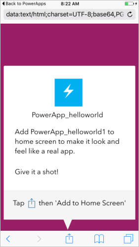

# Использование PowerApps на телефоне или планшете
Приложения, созданные с помощью PowerApps, могут работать на устройствах под управлением Windows, iOS, Android, Windows Phone, а также в веб-браузерах. Приложения, работающие на мобильных устройствах, могут использовать такие возможности этих устройств, как определение расположения или съемка на камеру. PowerApps Mobile можно загрузить из магазинов Windows Store, App Store или Google Play.

## Что нужно для начала работы
* Один из следующих вариантов:
  * приложение, которое вы создали с помощью [шаблона](get-started-test-drive.md), [данных](get-started-create-from-data.md) или [пустого холста](get-started-create-from-blank.md);
  * стороннее приложение, автор которого предоставил вам право на использование;
* Служба PowerApps, установленная на устройстве iPhone, iPad, Windows или Android. Ниже приведены поддерживаемые конкретные версии:  
  * iOS версии 9.3 и более поздние версии;
  * Android версии 5 и более поздние версии;
  * Windows 10 Mobile (предварительная версия).

Если вы еще не работали с PowerApps, см. статью [Знакомство с PowerApps](getting-started.md).

## Вход в PowerApps
При первом входе в PowerApps вам будет предложено пройти проверку подлинности с использованием учетных данных Azure Active Directory:  

## Windows 10 Mobile (предварительная версия)
В Windows Store доступна предварительная версия PowerApps для Windows 10 Mobile. Ссылку на приложение в Windows Store вы найдете в нижней части страницы [powerapps.com](https://powerapps.microsoft.com/).

Системные требования

* **Операционная система**: юбилейное обновление Redstone 1 (10.0.14267.1002) или более поздняя версия.
* **Память**: минимум 2 ГБ ОЗУ.

## Фильтры приложений и параметры сортировки
Можно быстро найти приложение в одной из приведенных ниже категорий.

* **Все**: все приложения, к которым у вас есть доступ, включая созданные вами и предоставленные вам в совместный доступ.
* **Мои приложения**: приложения, которые вы запускали хотя бы раз.
* **Примеры**: предоставленные корпорацией Майкрософт реальные приложения с вымышленными данными, которые помогут вам изучить возможности разработки.
* **Избранное**: приложения, которые вы сами отметили с помощью меню "...", доступного для каждого приложения. Когда вы снимаете флажок, приложение удаляется из этого списка.
  
    

Выбрав нужный список, вы можете дополнительно отсортировать его по дате последнего запуска или изменения приложений. Настройки сортировки сохраняются, если вы закроете и снова откроете PowerApps.  

## Запуск приложения
Чтобы открыть приложение на планшете или телефоне, коснитесь значка приложения или push-уведомления, которое информирует о том, что приложение предоставлено вам для совместного использования.

При первом использовании PowerApps вы увидите демонстрацию жеста для выхода из PowerApps.

## Предоставление согласия
Если приложению требуется подключение к источнику данных или согласие для использования каких-либо возможностей устройства, вам необходимо подтвердить подключение или согласие, прежде чем использовать приложение.  

Обычно такой запрос появляется только при первом использовании.

## Выход из приложения
* На телефоне с Android — проведите пальцем вправо (или нажмите кнопку перехода назад и подтвердите намерение выйти из приложения).
* На iPhone — проведите пальцем вправо.
* На мобильном устройстве Windows 10 — нажмите кнопку "Назад".

## Совместное использование приложения
Сведения о том, как предоставить общий доступ к приложению с помощью [powerapps.com](https://web.powerapps.com), вы найдете в статье [Sharing an app](share-app.md) (Общий доступ к приложению).

## Закрепление приложения на начальном экране
Если вы скачали приложение и использовали его хотя бы один раз, его можно закрепить на начальном экране устройства для последующего быстрого запуска. Нажмите кнопку с многоточием (...) для нужного приложения, введите **ПИН-код** и следуйте инструкциям на экране.

