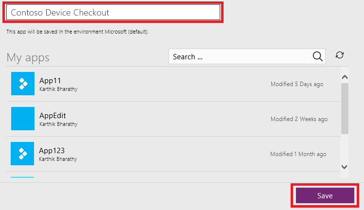
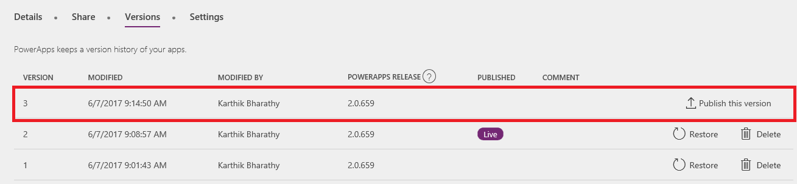

# Сохранение и публикация приложения в PowerApps
Когда вы сохраняете изменения в приложении, они автоматически публикуются только для вас и пользователей, у которых есть разрешения на изменение этого приложения. После внесения изменений их следует опубликовать явным образом, чтобы сделать доступными для всех пользователей, которым предоставлен общий доступ к приложению.

Сведения о том, как предоставить общий доступ к приложению, вы найдете в статье [Общий доступ к приложению](share-app.md).

## Сохранение изменений в приложении
В PowerApps Studio щелкните (коснитесь) **Сохранить** в меню **Файл** (у левого края окна), а затем выполните одно из следующих действий.

* Если приложение еще не сохранялось, укажите его имя, а затем щелкните (коснитесь) **Сохранить**.
  
    
* Если приложение уже сохранялось, щелкните (коснитесь) **Сохранить**.  
  
    

PowerApps также может периодически сохранять приложение каждые 2 минуты. Если вы сохранили приложение ранее, PowerApps будет периодически сохранять версию приложения и пользователю не потребуется нажимать кнопку "Сохранить". Разработчики могут включать или отключать параметр **Автосохранение** на вкладке **Учетная запись** в меню **Файл**. 

## Публикация приложения
1. В PowerApps Studio щелкните (коснитесь) **Сохранить** в меню **Файл** (у левого края окна), а затем щелкните (коснитесь) **Опубликовать эту версию**.
   
    
2. В диалоговом окне **Опубликовать** щелкните (коснитесь) **Опубликовать эту версию**, чтобы опубликовать приложение для всех пользователей, которым предоставлен общий доступ к приложению.
   
   

## Определение активной версии
На сайте [powerapps.com](https://web.powerapps.com) щелкните (коснитесь) **Приложения** в меню **Файл** (у левого края окна), щелкните (коснитесь) значок сведений для приложения, а затем щелкните (коснитесь) вкладку **Версии**.

Версия **Динамический** публикуется для всех пользователей, которым предоставлен общий доступ к приложению. Самая последняя версия любого приложения доступна только тем пользователям, у которых есть разрешения на его изменение.

Чтобы опубликовать наиболее позднюю версию, щелкните (коснитесь) **Опубликовать эту версию**, после чего нажмите (коснитесь) кнопку **Опубликовать эту версию** в диалоговом окне **Публикация**.

## Дальнейшие действия
* [Переименуйте приложение](set-name-tile.md) на сайте powerapps.com.
* [Восстановите приложение](restore-an-app.md) при наличии нескольких его версий.

