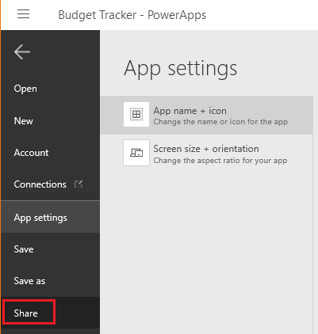
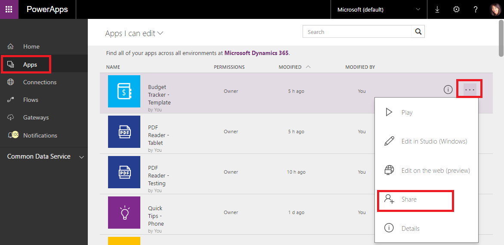
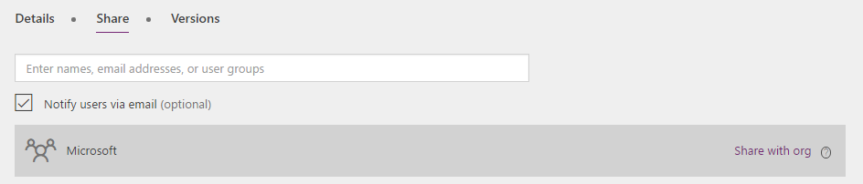
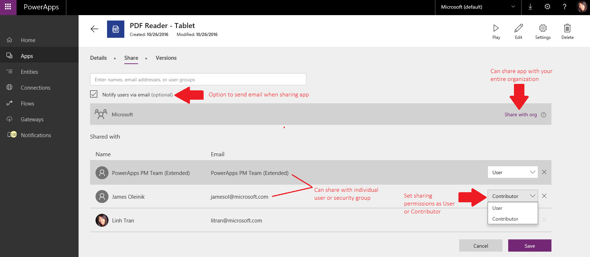
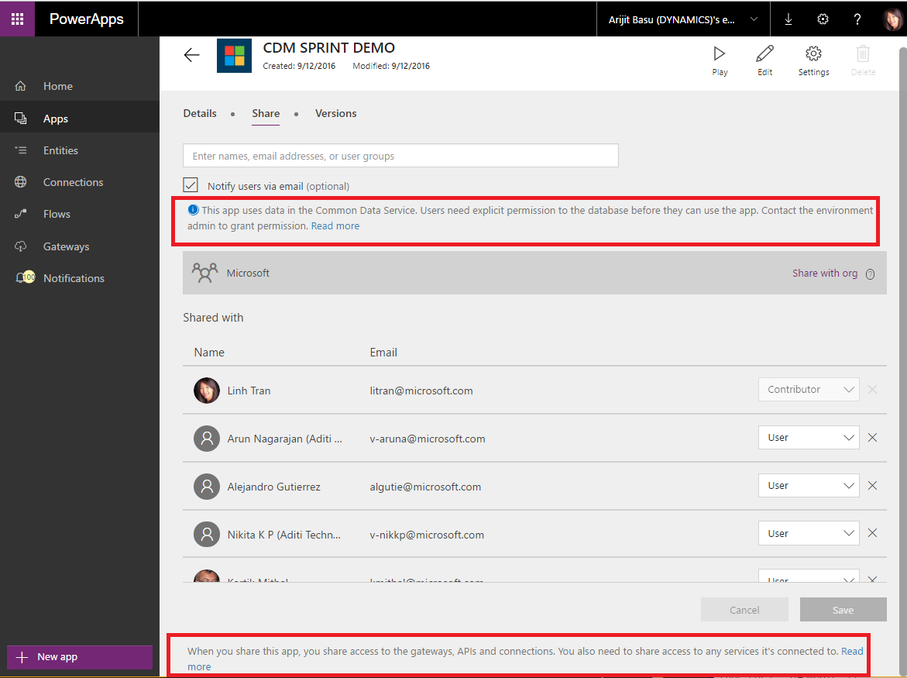

# Предоставление общего доступа к приложению в PowerApps
Вы можете создавать приложения, которые помогают решать бизнес-задачи. Но помимо этого вы также можете использовать PowerApps для предоставления совместного доступа к этим приложениям. В этой статье вы узнаете, как предоставить общий доступ к приложениям определенным пользователям, группам безопасности или всей организации.

## Открытие экрана общего доступа к приложению
Чтобы предоставить общий доступ к приложению, необходимо перейти на сайт powerapps.com. Совместный доступ к приложениям в PowerApps Studio или PowerApps Mobile больше не поддерживается.

**В PowerApps Studio**

* Вариант 1. В меню **Файл** щелкните **Общий доступ**.
  
    
* Вариант 2. В меню **Файл** выберите **Открыть**, а затем щелкните значок общего доступа для приложения.
  
    

**На сайте [powerapps.com](http://web.powerapps.com)**

* На панели навигации слева щелкните **Приложения**, нажмите кнопку с многоточием (...), а затем выберите **Общий доступ**.
  
   

## Общий доступ к приложению
Здесь можно предоставить общий доступ к приложению, сделав следующее:

1. Укажите имена одного или нескольких пользователей или групп безопасности в Azure Active Directory либо предоставьте общий доступ к приложению всей организации. Обратите внимание, что при предоставлении общего доступа всей организации можно использовать только разрешение **Пользователь**.
   
    
2. Укажите уровень разрешений:
   
   * **Пользователь.** Пользователи или группы могут запускать приложение, но не предоставлять к нему общий доступ.
   * **Участник.** Пользователи или группы могут запускать приложение, настраивать его и предоставлять общий доступ к настроенной версии другим пользователям.
     
       
3. Нажмите кнопку **Save** (Сохранить).

Чтобы изменить разрешения пользователя или группы, повторите первый шаг процедуры и выберите другой вариант в списке разрешений для данного пользователя или группы. Чтобы удалить все разрешения пользователя или группы, щелкните значок **x** для данного пользователя или группы или коснитесь его.

### Отправка уведомления по электронной почте
При предоставлении общего доступа к приложению вы можете выбрать, уведомлять ли об этом пользователей или группу безопасности по электронной почте. Если выбрать этот вариант, пользователь, пользователи или группы безопасности будут получать уведомление по электронной почте. Сообщение содержит ссылку, с помощью которой можно перейти к приложению. При необходимости пользователям предлагается зарегистрироваться и установить PowerApps.

Обратите внимание, что отправляемые шаблоны сообщений электронной почты зависят от разрешения, которое вы назначаете для доступа к приложению. Если предоставить общий доступ к приложению с разрешением **Пользователь**, в сообщении электронной почты будет содержаться ссылка для запуска приложения. Если предоставить общий доступ к приложению с разрешением **Участник**, в сообщении будет содержаться ссылка для изменения или запуска приложения в PowerApps Studio.

### Как пользователи увидят приложение, к которому предоставлен общий доступ
То, как пользователи или группы безопасности узнают, что им предоставлен общий доступ к приложению, и смогут к нему перейти, зависит от назначенного им разрешения.

##### Предоставление общего доступа к приложению с разрешением *Пользователь*
Пользователи, которым предоставлен общий доступ к приложению, получат уведомление по электронной почте, если этот флажок установлен на экране общего доступа к приложению. В сообщении электронной почты содержится ссылка, позволяющая запустить приложение в [Dynamics 365](http://home.dynamics.com). Скоро будет добавлена поддержка универсальных ссылок, то есть, если у вас установлена PowerApps Studio или PowerApps Mobile, приложение будет открываться в этих программах.

Пользователи также могут обнаружить приложение в AppSource [Dynamics 365](http://home.dynamics.com) (например, если сообщение электронной почты не отправлено). Чтобы узнать, как пользователи получают доступ к приложениям с помощью AppSource, см. сведения [здесь](app-source.md).

##### Предоставление общего доступа к приложению с разрешением *Участник*
Пользователи, которым предоставлен общий доступ к приложению, получат уведомление по электронной почте, если этот флажок установлен на экране общего доступа к приложению. В сообщении электронной почты будет содержаться ссылка, позволяющая открыть приложение непосредственно для редактирования с помощью PowerApps Studio в Интернете. Есть также ссылка для запуска приложения в [Dynamics 365](http://home.dynamics.com). Скоро будет добавлена поддержка универсальных ссылок, то есть, если у вас установлена PowerApps Studio или PowerApps Mobile, приложение будет открываться в этих программах.

Пользователи также могут обнаружить приложение на сайте [powerapps.com](http://web.powerapps.com) (например, если сообщение электронной почты не отправлено). Это домашняя страница создателей приложений, где они могут просматривать все созданные приложения или приложения, к которым им предоставлен общий доступ с разрешением **Участник**. В то же время [Dynamics 365](http://home.dynamics.com) — это служба, где пользователи могут быстро запускать приложения из PowerApps и других бизнес-приложений.

## Другие моменты, о которых следует знать
* Чтобы предоставить общий доступ к приложению, его необходимо сохранить в облаке, а не в локальной среде.
* Прежде чем предоставить общий доступ к приложению, обдумайте, каким пользователям и группам безопасности вы собираетесь предоставить доступ к этому приложению и какую роль необходимо им назначить — пользователя или участника. Если предоставить общий доступ к приложению группе, указанные разрешения будут у всех участников группы и у каждого, кто к ней присоединится. Каждый, кто выходит из группы, теряет эти разрешения, если он не состоит в другой группе с таким доступом или если ему явно не предоставлены соответствующие разрешения.
* У каждого участника группы есть те же разрешения на приложение, которые назначались группе в целом. Однако можно предоставить больше разрешений одному или нескольким участникам группы, чтобы расширить для них права доступа. Например, можно предоставить общий доступ к приложению группе безопасности A с разрешением пользователя. Каждый участник группы безопасности A может запускать приложение. Теперь общий доступ к приложению предоставляется пользователю Б, который входит в состав группы безопасности A, с разрешением участника. Теперь пользователь Б может изменить приложение, в то время как все остальные пользователи в группе безопасности A могут только его использовать. Если предоставить меньше разрешений одному или нескольким участникам группы, у них по-прежнему будут все разрешения, предоставленные группе в целом.
* Вы можете предоставить общий доступ к приложению всей организации, но такое решение следует тщательно обдумать: возможно, не всем пользователям нужен этот доступ.
* Учтите, что все изменения, внесенные в общее приложение, будут доступны пользователям, с которыми вы это приложение совместно используете, сразу же после сохранения изменений. То есть, улучшать приложение — отличная идея, но помните, что внесение важных изменений или удаление его компонентов могут повлиять на работу других пользователей.
* Прежде чем предоставить общий доступ к приложению, укажите для него понятное имя и описание, чтобы пользователи могли сразу понять, что это за приложение, и легко выбрать его из списка. В PowerApps Studio в меню **Файл** щелкните **Параметры приложения**, а затем введите описание.
  
  

### Предоставление общего доступа к приложению и ресурсы, используемые приложением
Большинство приложений используют по меньшей мере один из следующих типов ресурсов:

* подключение к источнику данных;
* локальный шлюз данных;
* настраиваемый соединитель;
* книга Excel или другая служба;
* последовательность.

Пользователи и участники должны иметь право подключаться к данным и шлюзам, используемым приложением. Некоторые разрешения предоставляются в приложении неявно, тогда как другие должны быть предоставлены явно. Дополнительные сведения см. в статье о [предоставлении доступа к ресурсам приложения](share-app-resources.md).

При предоставлении доступа к приложению, использующему Common Data Service, обратите внимание на панель информации, указывающую на необходимость отдельно предоставить общий доступ к службе Common Data Service. Если у вас нет на это разрешения, обратитесь к администратору вашей среды. Дополнительные сведения о безопасности службы Common Data Service [см. здесь](database-security.md).

### Что не поддерживается
* Вы можете предоставить общий доступ группе безопасности, но не группе распределения.
* Общий доступ к приложениям можно предоставлять пользователям в вашей организации, но не пользователям другого клиента.
* Вы можете совместно использовать приложение с другими пользователями на сайте [powerapps.com](http://web.powerapps.com), а не в PowerApps Studio. (Чтобы открыть сайт [powerapps.com](http://web.powerapps.com), щелкните значок общего доступа в PowerApps Studio.)
* Вы можете повторно предоставить общий доступ к приложению при наличии разрешения участника (а не пользователя) для этого приложения.

