# <a name="create-a-power-bi-report-to-analyze-projects"></a>Создание отчета Power BI для анализа проектов
> [!NOTE]
> Эта статья входит в серию руководств по использованию PowerApps, Microsoft Flow и Power BI совместно с SharePoint Online. Обязательно просмотрите [вводные сведения](sharepoint-scenario-intro.md), чтобы получить общее представление о процессе и скачать связанные файлы.

В этой задаче мы создадим отчет Power BI на основе двух списков SharePoint. Мы загрузим данные списков в Power BI Desktop, немного их очистим, выполним основное моделирование и создадим набор визуальных элементов, которые содержат сведения о данных.

> [!TIP]
> [Пакет загрузки](https://aka.ms/o4ia0f) для нашего примера содержит полную версию этого отчета: project-analysis.pbix.

## <a name="quick-review-of-power-bi-desktop"></a>Краткий обзор Power BI Desktop
Прежде чем перейти к созданию отчетов, ознакомимся с Power BI Desktop. Это мощный инструмент с множеством функций, поэтому мы рассмотрим только те области, которые будут использоваться в этой задаче. В Power BI Desktop есть три основных рабочих области или *представления*: **Отчет**, **Данные** и **Связи**. Power BI Desktop также включает **редактор запросов**, который открывается в отдельном окне.

На следующем рисунке показано три значка представлений на левой панели Power BI Desktop: сверху вниз расположены **Отчет**, **Данные** и **Связи**. Желтая полоска слева обозначает текущее представление. В нашем примере отображается представление **Отчет**. Чтобы изменить представление, щелкните любой значок.


Представление **Отчет** содержит пять основных областей.

1. Лента, на которой отображаются стандартные задачи, связанна с отчетами и визуализациями.
2. Представление **Отчет** или холст. Здесь создаются и организовываются визуализации.
3. Область вкладки **Страницы** в нижней части. Здесь можно выбрать или добавить страницу отчета.
4. Панель **Визуализации**. Здесь можно изменять визуализации, настраивать цвета или оси, применять фильтры, перетаскивать поля и выполнять другие задачи.
5. Панель **Поля**. Здесь можно перетаскивать элементы и фильтры в представление **Отчет** или область **Фильтры** на панели **Визуализации**.


Представление **Данные** содержит три основные области.

1. Лента, на которой выбрана вкладка **Моделирование** (см. рис. ниже). На этой вкладке можно создавать вычисляемые таблицы и столбцы, а также вносить другие изменения в модель данных.
2. Центральная панель, на которой представлены данные для выбранной таблицы.
3. Область **Поля**, где можно изменять способ отображения полей в отчетах.

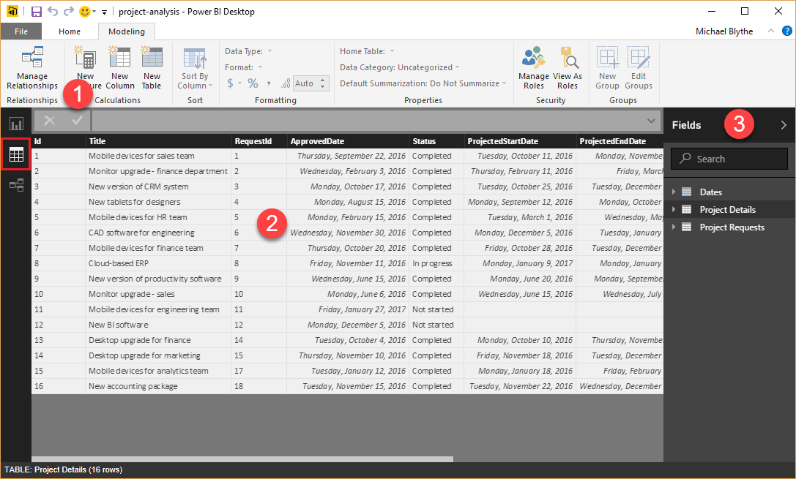

В этой задаче не будет использоваться представление **Связи**, но вы можете ознакомиться с ним позже, после загрузки данных списков в Power BI Desktop.

В **редакторе запросов** можно создавать запросы и преобразовывать данные, а затем загружать обработанную модель данных в Power BI Desktop. **Редактор запросов** содержит четыре основные области.

1. Лента, на которой доступно множество параметров для формирования и преобразования загруженных данных.
2. Левая панель с отображаемыми запросами, которые можно выбирать, просматривать и формировать.
3. Центральная панель с отображаемыми данными выбранного запроса, которые можно формировать.
4. Окно **Параметры запроса**, в котором отображаются свойства запроса и примененные шаги по преобразованию данных.

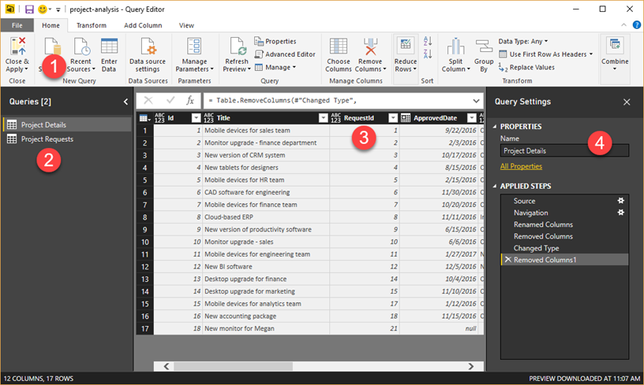

## <a name="step-1-get-data-into-power-bi-desktop"></a>Шаг 1. Загрузка данных в Power BI Desktop
На этом этапе мы сначала подключимся к двум спискам. Затем мы очистим данные, удалив столбцы, которые не нужны для анализа данных. Также мы изменим типы данных в некоторых из оставшихся столбцов, чтобы вычисления работали правильно. См. дополнительные сведения о [получении и очистке данных в Power BI Desktop](https://powerbi.microsoft.com/guided-learning/powerbi-learning-1-1-overview-of-power-bi-desktop) в рамках этой серии статей.

### <a name="connect-to-sharepoint-lists"></a>Подключение к спискам SharePoint
1. В Power BI Desktop на вкладке **Главная** щелкните **Получить данные**, затем — **Больше…**
   
    
2. В диалоговом окне **Получение данных** щелкните **Список SharePoint Online**, затем — **Подключить**.
   
    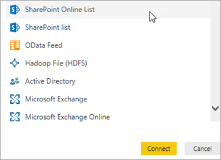
3. Введите URL-адрес сайта SharePoint и нажмите кнопку **ОК**.
   
    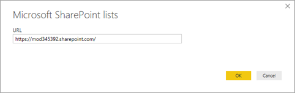
4. Если появится следующее диалоговое окно, войдите в систему, используя соответствующие учетные данные, а затем нажмите кнопку **Подключить**.
   
    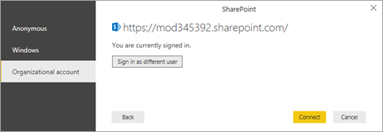
5. Выберите списки **Project Details** (Сведения о проекте) и **Project Requests** (Запросы проекта), затем нажмите кнопку **Изменить**.
   
    
   
    Теперь списки отображаются в виде таблиц в редакторе запросов.
   
    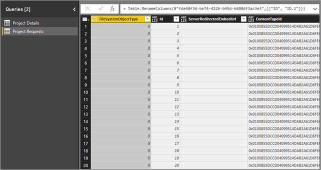

### <a name="remove-unnecessary-columns-from-the-tables"></a>Удаление ненужных столбцов из таблиц
1. На панели навигации слева выберите список **Project Details** (Сведения о проекте).
2. На центральной панели выберите столбец **FileSystemObjectType**, а затем щелкните **Удалить столбцы**.
   
    
3. Удалите два столбца после столбца **Id**: **ServerRedirectedEmbedURL** и **ContentTypeId**. 
> [!TIP]
> Выберите оба столбца с нажатой клавишей SHIFT, а затем нажмите **Удалить столбцы**.
4. Удалите все столбцы справа от столбца **PMAssigned** (всего 22 столбца). Таблица должна выглядеть приблизительно так:
   
    
5. Повторите процесс, который вы только что выполнили, но теперь для **запросов проекта**. Удалите **FileSystemObjectType**, **ServerRedirectedEmbedURL**,  **ContentTypeId** и все столбцы справа от столбца **Approved** (всего 22 столбца). Таблица должна выглядеть приблизительно так:
   
    

### <a name="change-the-data-type-on-project-details-columns"></a>Изменение типа данных в столбцах таблицы Project Details
1. Выберите столбец **ProjectedDays** и щелкните **Тип данных: любой**. Затем выберите параметр **Целое число**.
   
    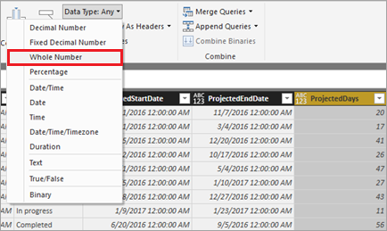
2. Повторите предыдущий шаг для столбца **ActualDays**.
3. Выберите столбец **ApprovedDate** и щелкните **Тип данных: любой**. Затем выберите параметр **Дата**.
   
    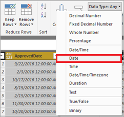

4. Повторите предыдущий шаг для столбцов **ProjectedStartDate** и **ProjectedEndDate**.

### <a name="change-the-data-type-on-project-requests-columns"></a>Изменение типа данных в столбцах таблицы Project Requests

1. Выберите столбец **EstimatedDays** и щелкните **Тип данных: любой**. Затем выберите параметр **Целое число**.

2. Выберите столбец **RequestDate** и щелкните **Тип данных: любой**. Затем выберите параметр **Дата**.

### <a name="apply-and-save-changes"></a>Применение и сохранение изменений

1. На вкладке **Главная** нажмите кнопку **Закрыть и применить**, чтобы закрыть редактор запросов и вернуться в главное окно PowerBI Desktop.
   
    

2. Выберите **Файл**, затем— **Сохранить** и сохраните файл под именем project-analysis.pbix.

## <a name="step-2-improve-the-data-model"></a>Шаг 2. Улучшение модели данных
Теперь, когда мы загрузили в PowerBI Desktop данные из списков SharePoint, перейдем к моделированию данных. Моделирование данных может занять много времени, но мы вкратце рассмотрим некоторые действия, которые помогут вам эффективно использовать данные списка в Power BI Desktop.

* Изменение способа связи между двумя таблицами.
* Добавление таблицы дат для выполнения вычислений на основе рабочих дней.
* Добавление вычисляемых столбцов для вычисления интервалов между этапами проекта.
* Добавление мер для вычисления расхождения между предполагаемыми и фактическими днями проекта.

Выполнив эти шаги, мы сможем создавать представления, в которых будут использоваться усовершенствования нашей модели. См. дополнительные сведения о [моделировании данных в Power BI Desktop](https://powerbi.microsoft.com/guided-learning/powerbi-learning-2-1-intro-modeling-data) в рамках этой серии статей.

### <a name="change-table-relationships"></a>Изменение связи между таблицами
Когда в приложение Power BI Desktop загружаются списки, оно создает связи между ними на основе столбца **Id** в обеих таблицах. На самом деле должны быть связаны столбец **Id** в таблице **Project Requests** и столбец **RequestId** в таблице **Project Details**. Исправим это.

1. Щелкните значок **Представление "Данные"**.
   
    

2. На вкладке **Моделирование** щелкните **Управление связями**. Эту вкладку представления **Данные** мы будем использовать на всех этапах моделирования данных.
   
    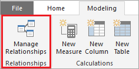

3. Выберите существующую связь, нажмите кнопку **Удалить**, затем еще раз нажмите **Удалить** для подтверждения.
   
    

4. Нажмите кнопку **Создать**, чтобы создать другую связь.

5. В диалоговом окне **Создание связи** сделайте следующее.
   
   1. Для первой таблицы выберите **Project Requests** и столбец **Id**.
   
   2. Для второй таблицы выберите **Project Details** и столбец **RequestId**.
   
   3. Экран должен выглядеть приблизительно так: Когда все будет готово, нажмите **ОК**, затем выберите **Закрыть**.
      
       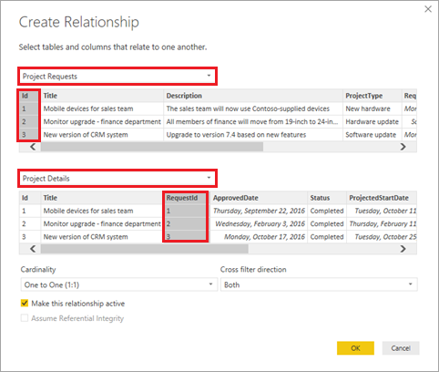

### <a name="add-a-date-table-to-make-date-based-calculations-easier"></a>Добавление таблицы дат для упрощения вычислений на основе даты
1. Нажмите кнопку **Создать таблицу**.
   
    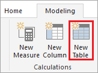
2. Введите следующую формулу в строке формул: **Dates = CALENDARAUTO()**.
   
    
   
    Эта формула создает таблицу с именем **Dates** (Даты) и одним столбцом дат. Таблица содержит все даты из других таблиц и обновляется автоматически при добавлении новых дат (т. е. при обновлении данных).
   
    Эта формула и другие формулы в этой статье используют выражения анализа данных (DAX), язык формул для Power BI и других технологий. Дополнительные сведения см. в статье [Основные сведения о DAX в Power BI Desktop](https://docs.microsoft.com/power-bi/desktop-quickstart-learn-dax-basics).
3. Нажмите клавишу ВВОД, чтобы создать таблицу **Dates**.
   
    

### <a name="add-a-calculated-column-to-the-dates-table"></a>Добавление вычисляемого столбца в таблицу "Dates"
1. Оставаясь в таблице "Dates", нажмите кнопку **Создать столбец**.
   
    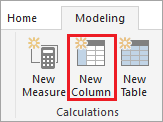
2. Введите следующую формулу в строке формул: **IsWeekDay = SWITCH(WEEKDAY(Dates[Date]), 1,0,7,0,1)**.
   
    Эта формула определяет, является ли дата в столбце **Date** рабочим днем. Если дата является рабочим днем, столбец **IsWeekDay** возвращает значение 1. В противном случае он возвращает значение 0.
3. Нажмите клавишу ВВОД, чтобы добавить столбец **IsWeekDay** в таблицу **Dates**.
   
    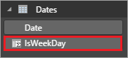

### <a name="add-a-calculated-column-to-the-project-details-table"></a>Добавление вычисляемого столбца в таблицу Project Details.
1. На панели справа выберите таблицу **Project Details**, а затем нажмите кнопку **Создать столбец**.
   
    
2. Введите эту формулу в строке формул:
   
    ```
    ApprovedStartDiff = CALCULATE(SUM(Dates[IsWeekday]),
   
       DATESBETWEEN(Dates[Date],
   
          'Project Details'[ApprovedDate],
   
          'Project Details'[ProjectedStartDate]
   
      )
   
    )
    ```
   
    Эта формула вычисляет разницу в днях между датой утверждения проекта и датой его запланированного начала. Формула использует столбец **IsWeekday** из таблицы **Dates**, поэтому она считает только рабочие дни.
3. Нажмите клавишу ВВОД, чтобы добавить столбец **ApprovedStartDiff** в таблицу **Project Details**.
   
    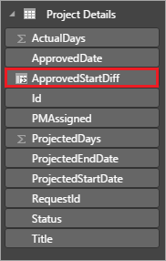

### <a name="add-a-calculated-column-to-the-project-requests-table"></a>Добавление вычисляемого столбца в таблицу Project Requests
1. На панели справа выберите таблицу **Project Requests**, а затем нажмите кнопку **Создать столбец**.
   
    
2. Введите эту формулу в строке формул:
   
    ```
    RequestDateAge = CALCULATE(SUM(Dates[IsWeekday]),
   
       DATESBETWEEN(Dates[Date],
   
          'Project Requests'[RequestDate],
   
          NOW()
   
       )
   
    )
    ```
   
    Эта формула вычисляет разницу в днях между датой запроса на проект и сегодняшней датой (NOW()). Эта формула также подсчитывает только рабочие дни недели. Этот столбец используется для поиска проекта, который дольше всего находится в состоянии ожидания.
3. Нажмите клавишу ВВОД, чтобы добавить столбец **RequestDateAge** в таблицу **Project Requests**.
   
    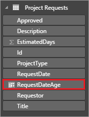

### <a name="add-a-measure-to-the-project-details-table"></a>Добавление меры в таблицу сведений о проекте
1. На панели справа выберите таблицу **Project Details**, а затем нажмите кнопку **Создать меру**.
   
    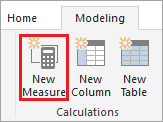
2. Введите эту формулу в строке формул:
   
    ```
    VarProjectedActual = DIVIDE(
   
        SUM('Project Details'[ActualDays]) - SUM('Project Details'[ProjectedDays]),
   
        SUM('Project Details'[ProjectedDays])
   
    )
    ```
   
    Эта формула вычисляет разницу между фактическим и прогнозируемым числом дней для проекта. Мы добавляем ее как меру, а не вычисляемый столбец, поэтому она возвращает правильные результаты, независимо от того, как данные фильтруются или объединяются в отчете.
3. Нажмите клавишу ВВОД, чтобы добавить меру **VarProjectedActual** в таблицу **Project Details**.
   
    

### <a name="add-a-measure-to-the-project-requests-table"></a>Добавление меры в таблицу запросов на проект
1. На панели справа выберите таблицу **Project Requests**, а затем нажмите кнопку **Создать меру**.
   
    
2. Введите эту формулу в строке формул:
   
    ```
    MaxDaysPending = MAXX(
   
        FILTER('Project Requests', 'Project Requests'[Approved]="Pending"),
   
        'Project Requests'[RequestDateAge]
   
    )
    ```
   
    Эта формула находит проект, который дольше всего находится в состоянии ожидания, на основе вычисляемого столбца, определенного ранее.
3. Нажмите клавишу ВВОД, чтобы добавить столбец **MaxDaysPending** в таблицу **Project Requests**.
   
    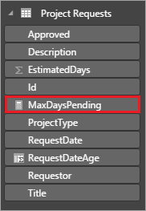

## <a name="step-3-create-report-visualizations"></a>Шаг 3. Создание визуализаций отчета
Теперь мы переходим к этапу, который у большинства пользователей ассоциируется с анализом данных: создание визуализаций, позволяющих находить шаблоны в наших данных. На этом этапе мы создадим четыре представления.

* Гистограмма, показывающая предполагаемое и фактическое число дней проектов.
* Гистограмма, показывающая расхождение для каждого проекта.
* Карточка, показывающая проект, который дольше всего находится в состоянии ожидания.
* Таблица, показывающая время между датой утверждения проекта и предполагаемой датой начала.

Создав эти представления отчета в Power BI Desktop, мы опубликуем данные и отчеты в службе Power BI. Так мы сможем создавать панели мониторинга и предоставлять к ним общий доступ. См. дополнительные сведения о [моделировании данных в Power BI Desktop (визуализациях)](https://powerbi.microsoft.com/guided-learning/powerbi-learning-3-1-intro-visualizations) в рамках этой серии статей.

### <a name="create-a-bar-chart-to-show-projected-versus-actual"></a>Создание линейчатой диаграммы для отображения прогнозируемых и фактических сведений
1. Выберите значок представления **Отчет**. Мы будем использовать это представление для выполнения всех остальных задач в Power BI Desktop, рассматриваемых в этом примере.
   
    
2. На панели **Визуализации** справа щелкните значок **Кластеризованная гистограмма**.
   
    
3. Перетащите столбцы **PMAssigned** и **Title** из таблицы **Project Details** на панели **Поля** в таблицу **Axis** (Оси) на панели **Визуализации**.
   
    
4. Перетащите столбцы **ActualDays** и **ProjectedDays** из таблицы **Project Details** на панели **Поля** в таблицу **Value** (Значение) на панели **Визуализации**.
   
    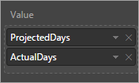
5. Визуализация должна выглядеть приблизительно так:
   
    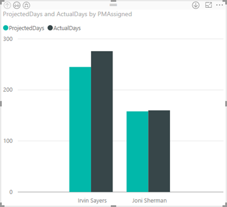
6. Перетащите столбец **Status** из таблицы **Project Details** на панели **Поля** в область **Фильтры** на панели **Визуализации**. Затем установите флажок **Завершено**.
   
   
   
   Теперь диаграмма фильтруется для отображения только завершенных проектов, так как мы сравниваем прогнозируемые дни с фактическими днями.
7. Щелкните стрелки в верхнем левом углу для перемещения вверх и вниз по иерархии руководителей проектов и проектов. На следующем рисунке показана детализация проектов.
   
   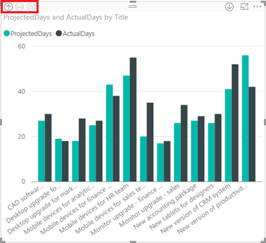

### <a name="create-a-bar-chart-to-show-variance-from-projected"></a>Создание линейчатой диаграммы для отображения расхождения с прогнозируемыми сведениями
1. Щелкните на холсте за пределами визуализации, которую вы только что создали.
2. На панели **Визуализации** справа щелкните значок **Кластеризованная гистограмма**.
   
    
3. Перетащите столбцы **PMAssigned** и **Title** из таблицы **Project Details** на панели **Поля** в таблицу **Axis** (Оси) на панели **Визуализации**.
   
    
4. Перетащите столбцы **VarProjectedActual** из таблицы **Project Details** на панели **Поля** в таблицу **Value** на панели **Визуализации**.
   
    
5. Перетащите столбец **Status** из таблицы **Project Details** на панели **Поля** в область **Фильтры** на панели **Визуализации**. Затем установите флажок **Завершено**.
   
    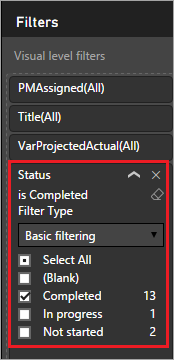
   
    Визуализация должна выглядеть приблизительно так:
   
    
   
    На этой диаграмме вы можете видеть расхождения между проектами, которые выполняли Сергей Иванов и Иван Сергеев. Выполните детализацию, чтобы просмотреть расхождение по проектам и узнать, было ли предполагаемое число дней меньше или больше их фактического числа.
   
    
6. Прежде создавать дополнительные визуализации, переместите и измените размер уже созданных визуализаций, чтобы новые визуализации поместились рядом.
   
    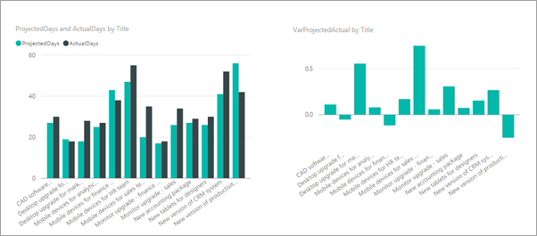

### <a name="create-a-card-that-shows-the-longest-pending-project"></a>Создание карточки, на которой отображается проект, находящийся в состоянии ожидания дольше всего
1. Щелкните на холсте за пределами визуализации, которую вы только что создали.
2. На панели **Визуализации** справа щелкните значок **Карточка**.
   
    
3. Перетащите столбец **MaxDaysPending** из таблицы **Project Requests** на панели **Поля** в таблицу **Fields** (Поля) в области **Визуализации**.
   
    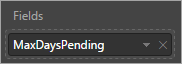
4. Выберите значок **Формат** (малярный валик), затем установите для параметра **Граница** значение **Вкл**.
   
    
5. Установите для параметра **Заголовок** значение **Вкл.**, затем добавьте имя "Max days pending approval" (Максимальное число дней в ожидании утверждения).
   
    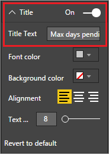
   
    Визуализация должна выглядеть приблизительно так:
   
    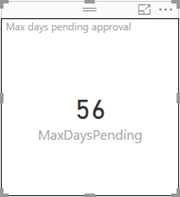
   
    После публикации отчета мы будем использовать этот элемент, чтобы активировать оповещение, когда максимальное значение для проекта достигает определенного порога.

### <a name="create-a-table-that-shows-the-time-between-project-approval-and-projected-start-date"></a>Создание таблицы, показывающей время между датой утверждения проекта и предполагаемой датой начала
1. Щелкните на холсте за пределами визуализации, которую вы только что создали.
2. На панели **Визуализации** справа щелкните значок **Таблица**.
   
    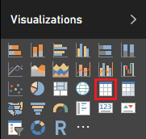
3. Перетащите столбцы **PMAssigned**, **Title** и **ApprovedStartDiff** из таблицы **Project Details** на панели **Поля** в таблицу **Values** (Значения) на панели **Визуализации**.
   
    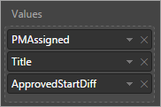
4. Перетащите столбец **ProjectedStartDate** из таблицы **Project Details** на панели **Поля** в область **Фильтры** панели **Визуализации**. Затем выберите все даты, кроме **(Пусто)**.
   
    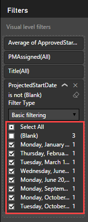
5. Измените размер столбцов таблицы так, чтобы все данные были хороши видны, и настройте сортировку по убыванию по столбцу **ApprovedStartDiff**. Визуализация должна выглядеть приблизительно так:
   
    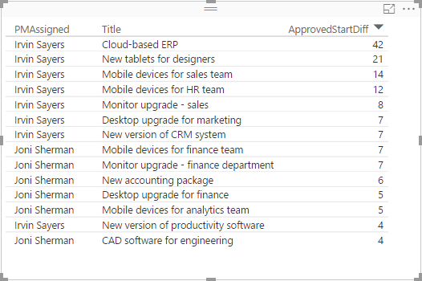
6. В области **Значения** нажмите стрелку вниз возле столбца **ApprovedStartDiff** и выберите вариант **Среднее**. Теперь вы увидите средний период между датами утверждения проекта и прогнозируемого начала работ.
   
    
7. Снова нажмите стрелку вниз возле столбца **ApprovedStartDiff**, выберите **Условное форматирование**, а затем выберите **Цветовые шкалы для фона**.
   
   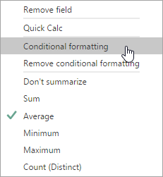
8. Задайте цвета для полей **Минимум** и **Максимум**, как показано ниже, затем нажмите **ОК**.
   
   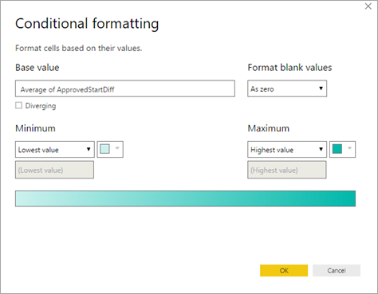
   
   Визуализация должна выглядеть приблизительно так:
   
   
   
   Как видите, проекты Сергея Иванова начинаются намного позже после утверждения. Кроме назначенного руководителя, есть также другие факторы, но с этим фактором также стоит ознакомиться.

Мы подошли к концу раздела отчета. Теперь вы получите полный отчет на основе данных, импортированных из SharePoint, а затем очищенных и смоделированных в Power BI Desktop. Если все сделано правильно, отчет должен выглядеть приблизительно так:


## <a name="next-steps"></a>Дальнейшие действия
Следующий шаг в этой серии руководств — [публикация отчета проекта Power BI и создание панели мониторинга](sharepoint-scenario-publish-report.md).

